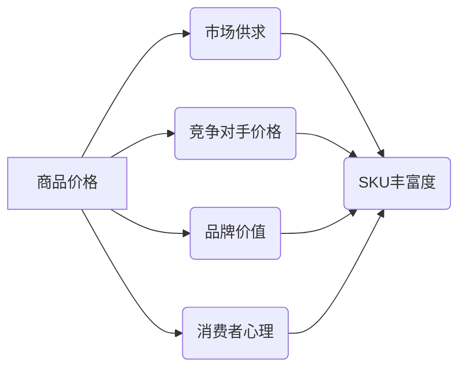

> 商品价格、SKU丰富度、算法模型、机器学习、数据分析、电商平台、市场策略

## 1. 背景介绍

在当今以电商为核心的商业模式下，商品价格与SKU丰富度是影响平台竞争力和用户体验的关键因素。商品价格直接关系到用户购买意愿和平台盈利能力，而SKU丰富度则决定了平台商品的种类和满足用户需求的程度。

电商平台通常面临着以下挑战：

* **如何制定合理的商品价格？** 既要保证平台盈利，又要满足用户对价格的期望。
* **如何平衡SKU丰富度与库存管理？** 过多的SKU会导致库存压力和管理成本增加，而过少的SKU则可能无法满足用户的多样化需求。

为了解决这些问题，电商平台需要借助数据分析和算法模型，对商品价格和SKU丰富度进行科学的制定和管理。

## 2. 核心概念与联系

**2.1 商品价格**

商品价格是指消费者为获得特定商品而支付的货币价值。它是一个复杂的系统，受多种因素影响，包括生产成本、市场供求、竞争对手价格、品牌价值、消费者心理等。

**2.2 SKU丰富度**

SKU（Stock Keeping Unit）是指库存管理中每个独立商品的唯一标识码。SKU丰富度是指平台上商品种类和数量的多少。

**2.3 核心概念联系**

商品价格和SKU丰富度之间存在着密切的联系。

* **价格影响SKU丰富度:** 高价格的商品通常SKU数量较少，因为高价格意味着更高的生产成本和库存压力。而低价格的商品则可能拥有更多的SKU，以满足不同用户的需求和价格敏感度。
* **SKU丰富度影响价格:** SKU丰富度越高，平台可以提供更丰富的选择，从而提高用户粘性。同时，SKU丰富度也可能导致平台的运营成本增加，从而影响商品价格。

**2.4  核心概念架构**



## 3. 核心算法原理 & 具体操作步骤

**3.1 算法原理概述**

为了制定合理的商品价格和管理SKU丰富度，电商平台通常采用以下算法模型：

* **价格预测模型:** 利用历史销售数据、市场趋势、竞争对手价格等信息，预测商品未来的价格走势。
* **SKU推荐模型:** 根据用户购买历史、浏览记录、兴趣偏好等信息，推荐用户可能感兴趣的商品SKU。
* **库存优化模型:** 预测商品需求量，优化库存水平，避免库存积压或缺货。

这些算法模型通常基于机器学习技术，例如回归分析、分类算法、聚类算法等。

**3.2 算法步骤详解**

**3.2.1 价格预测模型**

1. **数据收集:** 收集历史销售数据、市场价格数据、竞争对手价格数据、商品属性数据等。
2. **数据预处理:** 对数据进行清洗、转换、特征工程等处理，使其适合模型训练。
3. **模型选择:** 选择合适的回归算法模型，例如线性回归、逻辑回归、支持向量机等。
4. **模型训练:** 利用训练数据训练模型，并评估模型性能。
5. **模型部署:** 将训练好的模型部署到线上环境，用于预测商品价格。

**3.2.2 SKU推荐模型**

1. **用户画像:** 根据用户购买历史、浏览记录、兴趣偏好等信息，构建用户画像。
2. **商品特征提取:** 提取商品的属性特征，例如类别、品牌、价格、评价等。
3. **推荐算法:** 选择合适的推荐算法，例如协同过滤、内容过滤、基于知识的推荐等。
4. **推荐结果生成:** 根据用户画像和商品特征，生成个性化的商品推荐结果。

**3.2.3 库存优化模型**

1. **需求预测:** 利用历史销售数据、市场趋势等信息，预测商品未来的需求量。
2. **库存策略制定:** 根据需求预测、安全库存水平、订货成本等因素，制定库存策略。
3. **库存管理:** 实时监控库存水平，及时调整订货量，避免库存积压或缺货。

**3.3 算法优缺点**

**3.3.1 价格预测模型**

* **优点:** 可以预测商品价格走势，帮助平台制定合理的定价策略。
* **缺点:** 模型精度受数据质量和模型复杂度影响，预测结果存在一定的误差。

**3.3.2 SKU推荐模型**

* **优点:** 可以根据用户需求推荐个性化的商品，提高用户体验和转化率。
* **缺点:** 需要大量的用户数据进行训练，模型效果受用户数据质量影响。

**3.3.3 库存优化模型**

* **优点:** 可以优化库存水平，降低库存成本，提高运营效率。
* **缺点:** 需要准确预测商品需求量，模型效果受预测精度影响。

**3.4 算法应用领域**

* **电商平台:** 商品定价、SKU推荐、库存管理
* **零售行业:** 商品定价、促销策略、库存优化
* **制造业:** 产品定价、需求预测、库存管理

## 4. 数学模型和公式 & 详细讲解 & 举例说明

**4.1 数学模型构建**

**4.1.1 价格预测模型**

假设商品价格 $p$ 受以下因素影响:

* 历史销售量 $s$
* 市场价格 $m$
* 竞争对手价格 $c$
* 商品属性 $a$

可以构建一个线性回归模型:

$$p = \beta_0 + \beta_1 s + \beta_2 m + \beta_3 c + \beta_4 a + \epsilon$$

其中:

* $\beta_0, \beta_1, \beta_2, \beta_3, \beta_4$ 是模型参数
* $\epsilon$ 是随机误差项

**4.1.2 SKU推荐模型**

可以使用协同过滤算法构建推荐模型。假设用户 $u$ 对商品 $i$ 的评分为 $r_{ui}$，可以计算用户 $u$ 和商品 $i$ 的相似度:

$$sim(u, i) = \frac{\sum_{j \in N(u) \cap N(i)} (r_{uj} - \bar{r}_u)(r_{ij} - \bar{r}_i)}{\sqrt{\sum_{j \in N(u)} (r_{uj} - \bar{r}_u)^2} \sqrt{\sum_{j \in N(i)} (r_{ij} - \bar{r}_i)^2}}$$

其中:

* $N(u)$ 和 $N(i)$ 分别是用户 $u$ 和商品 $i$ 的邻居集合
* $\bar{r}_u$ 和 $\bar{r}_i$ 分别是用户 $u$ 和商品 $i$ 的平均评分

**4.2 公式推导过程**

**4.2.1 价格预测模型**

线性回归模型的系数 $\beta$ 可以通过最小二乘法求解:

$$\beta = (X^T X)^{-1} X^T y$$

其中:

* $X$ 是特征矩阵
* $y$ 是目标变量向量

**4.2.2 SKU推荐模型**

协同过滤算法的相似度计算公式基于余弦相似度，它衡量了两个向量的夹角大小。

**4.3 案例分析与讲解**

**4.3.1 价格预测模型**

假设电商平台要预测一款手机的价格，可以收集历史销售数据、市场价格数据、竞争对手价格数据等信息，构建一个线性回归模型进行预测。

**4.3.2 SKU推荐模型**

假设电商平台要推荐用户可能感兴趣的书籍，可以根据用户的购买历史、浏览记录等信息，构建一个协同过滤模型进行推荐。

## 5. 项目实践：代码实例和详细解释说明

**5.1 开发环境搭建**

* 操作系统: Ubuntu 20.04
* Python 版本: 3.8
* 必要的库: pandas, numpy, scikit-learn, matplotlib

**5.2 源代码详细实现**

```python
# 价格预测模型
import pandas as pd
from sklearn.linear_model import LinearRegression

# 加载数据
data = pd.read_csv('price_data.csv')

# 特征工程
X = data[['历史销售量', '市场价格', '竞争对手价格']]
y = data['商品价格']

# 训练模型
model = LinearRegression()
model.fit(X, y)

# 预测价格
new_data = pd.DataFrame({'历史销售量': [100], '市场价格': [1000], '竞争对手价格': [900]})
predicted_price = model.predict(new_data)

print(f'预测价格: {predicted_price[0]}')

# SKU推荐模型
# ...

```

**5.3 代码解读与分析**

* 价格预测模型代码示例使用线性回归模型进行预测，并展示了数据加载、特征工程、模型训练和预测价格的步骤。
* SKU推荐模型代码示例需要根据实际情况进行修改，例如选择合适的协同过滤算法和数据处理方法。

**5.4 运行结果展示**

运行代码后，可以得到预测的价格值。

## 6. 实际应用场景

**6.1 电商平台**

* **商品定价:** 根据市场价格、竞争对手价格、商品属性等信息，制定合理的商品价格。
* **SKU推荐:** 根据用户购买历史、浏览记录等信息，推荐用户可能感兴趣的商品SKU。
* **库存优化:** 预测商品需求量，优化库存水平，避免库存积压或缺货。

**6.2 零售行业**

* **商品定价:** 根据市场价格、竞争对手价格、商品属性等信息，制定合理的商品价格。
* **促销策略:** 根据商品需求量和市场趋势，制定有效的促销策略。
* **库存优化:** 预测商品需求量，优化库存水平，降低库存成本。

**6.3 制造业**

* **产品定价:** 根据生产成本、市场价格、竞争对手价格等信息，制定合理的商品价格。
* **需求预测:** 预测产品需求量，优化生产计划。
* **库存管理:** 预测产品需求量，优化库存水平，避免库存积压或缺货。

**6.4 未来应用展望**

随着人工智能技术的不断发展，商品价格与SKU丰富度管理将更加智能化和自动化。未来，我们可以期待以下应用场景:

* **个性化定价:** 根据用户的购买历史、浏览记录、兴趣偏好等信息，为用户提供个性化的商品价格。
* **动态SKU推荐:** 根据用户的实时行为，动态调整商品SKU推荐结果。
* **智能库存管理:** 利用机器学习算法，预测商品需求量，自动调整库存水平。

## 7. 工具和资源推荐

**7.1 学习资源推荐**

* **书籍:**
    * 《机器学习》 - 周志华
    * 《Python机器学习实战》 - 塞缪尔·阿布拉姆斯
* **在线课程:**
    * Coursera: 机器学习
    * edX: 数据科学与机器学习
* **博客:**
    * Towards Data Science
    * Machine Learning Mastery

**7.2 开发工具推荐**

* **Python:** 
    * pandas: 数据分析和处理
    * numpy: 数值计算
    * scikit-learn: 机器学习库
    * matplotlib: 数据可视化
* **云平台:**
    * AWS
    * Azure
    * GCP

**7.3 相关论文推荐**

* **商品价格预测:**
    * "A Deep Learning Approach to Price Prediction"
    * "Predicting Product Prices Using Machine Learning"
* **SKU推荐:**
    * "Collaborative Filtering for Recommender Systems"
    * "Content-Based Recommendation Systems"
* **库存优化:**
    * "Inventory Optimization Using Machine Learning"
    * "Demand Forecasting and Inventory Management"

## 8. 总结：未来发展趋势与挑战

**8.1 研究成果总结**

近年来，在商品价格与SKU丰富