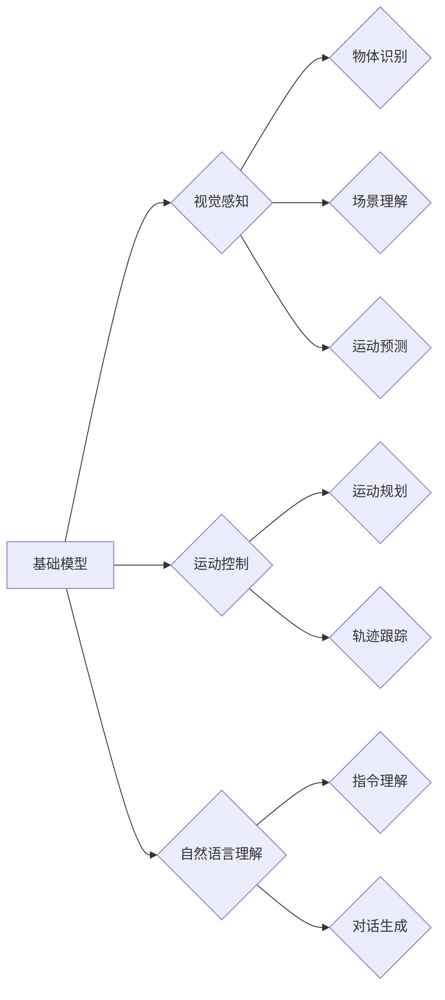

> 基础模型、机器人学、人工智能、计算机视觉、自然语言处理、运动控制

## 1. 背景介绍

机器人学作为人工智能的重要分支，一直致力于开发能够感知、理解和交互于环境的智能机器。近年来，随着深度学习技术的飞速发展，基础模型在机器人学领域展现出巨大的潜力。基础模型是指在海量数据上预训练的大规模神经网络模型，其强大的泛化能力和表示能力，为机器人学带来了新的机遇。

传统的机器人控制方法通常依赖于手工设计的规则和模型，难以应对复杂多变的环境。而基础模型可以学习环境的复杂特征和规律，从而实现更灵活、更智能的机器人控制。例如，基础模型可以用于机器人视觉感知、运动规划、自然语言理解等关键任务，显著提升机器人的自主性和适应性。

## 2. 核心概念与联系

基础模型在机器人学中的应用主要体现在以下几个方面：

* **视觉感知:** 基于基础模型的计算机视觉算法可以实现物体识别、场景理解、运动预测等功能，为机器人提供丰富的环境信息。
* **运动控制:** 基于基础模型的运动规划算法可以学习机器人运动轨迹，实现更精准、更流畅的运动控制。
* **自然语言理解:** 基于基础模型的自然语言处理算法可以使机器人理解人类语言指令，实现人机交互。

**核心概念与联系流程图:**



## 3. 核心算法原理 & 具体操作步骤

### 3.1  算法原理概述

基础模型在机器人学中的应用主要基于以下核心算法：

* **卷积神经网络 (CNN):** 用于图像处理和视觉感知，可以提取图像特征，实现物体识别、场景理解等功能。
* **循环神经网络 (RNN):** 用于序列数据处理，可以理解自然语言指令，实现机器人对话和行为控制。
* **强化学习 (RL):** 用于机器人运动控制，通过奖励机制训练机器人学习最优的运动策略。

### 3.2  算法步骤详解

**以视觉感知为例，详细说明基础模型在机器人视觉感知中的应用步骤：**

1. **数据采集:** 收集大量图像数据，并进行标注，例如标注物体类别、位置等信息。
2. **模型预训练:** 使用预训练的CNN模型，在标注数据上进行训练，学习图像特征表示。
3. **模型微调:** 将预训练模型应用于机器人视觉任务，根据任务需求进行微调，例如调整网络结构、学习率等参数。
4. **推理与输出:** 将采集到的图像输入到微调后的模型，得到物体识别结果、场景理解结果等。

### 3.3  算法优缺点

**优点:**

* **强大的泛化能力:** 基于海量数据预训练的模型，能够在新的场景和任务中表现出良好的泛化能力。
* **高效的学习能力:** 基于深度学习的算法，能够高效地学习复杂特征和规律。
* **灵活的应用场景:** 基础模型可以应用于机器人学中的多个任务，例如视觉感知、运动控制、自然语言理解等。

**缺点:**

* **数据依赖性:** 基础模型的性能依赖于训练数据的质量和数量。
* **计算资源需求:** 训练和部署大型基础模型需要大量的计算资源。
* **可解释性问题:** 深度学习模型的决策过程难以解释，这可能导致模型的可靠性问题。

### 3.4  算法应用领域

基础模型在机器人学中的应用领域非常广泛，例如：

* **工业机器人:** 用于视觉检测、缺陷识别、路径规划等任务，提高生产效率和产品质量。
* **服务机器人:** 用于人机交互、环境感知、任务执行等任务，提供更便捷、更智能的服务。
* **医疗机器人:** 用于手术辅助、康复训练、病患监测等任务，提高医疗效率和安全性。
* **探索机器人:** 用于环境勘探、灾害救援、资源探测等任务，拓展人类探索范围。

## 4. 数学模型和公式 & 详细讲解 & 举例说明

### 4.1  数学模型构建

基础模型的训练过程可以看作是一个优化问题，目标是找到一个模型参数，使得模型在训练数据上的损失函数最小。

损失函数通常定义为预测值与真实值的差值，例如均方误差 (MSE) 或交叉熵 (CE)。

**公式:**

$$
MSE = \frac{1}{N} \sum_{i=1}^{N} (y_i - \hat{y}_i)^2
$$

$$
CE = -\sum_{i=1}^{N} y_i \log(\hat{y}_i)
$$

其中：

* $y_i$ 是真实值
* $\hat{y}_i$ 是预测值
* $N$ 是样本数量

### 4.2  公式推导过程

损失函数的最小化可以通过梯度下降算法实现。梯度下降算法的基本思想是迭代更新模型参数，使得损失函数不断减小。

**公式:**

$$
\theta = \theta - \alpha \nabla L(\theta)
$$

其中：

* $\theta$ 是模型参数
* $\alpha$ 是学习率
* $\nabla L(\theta)$ 是损失函数对模型参数的梯度

### 4.3  案例分析与讲解

以物体识别为例，假设我们使用CNN模型进行物体识别，训练数据包含大量图像和对应的物体类别标签。

训练过程中，模型会学习图像特征，并将其映射到类别空间。损失函数用于衡量模型预测结果与真实标签之间的差异。通过梯度下降算法，模型参数会不断更新，使得模型预测结果越来越接近真实标签。

## 5. 项目实践：代码实例和详细解释说明

### 5.1  开发环境搭建

* 操作系统: Ubuntu 20.04
* Python 版本: 3.8
* 深度学习框架: PyTorch 1.8

### 5.2  源代码详细实现

```python
import torch
import torch.nn as nn

class CNN(nn.Module):
    def __init__(self):
        super(CNN, self).__init__()
        # 定义网络结构
        self.conv1 = nn.Conv2d(3, 16, kernel_size=3, padding=1)
        self.relu1 = nn.ReLU()
        self.pool1 = nn.MaxPool2d(kernel_size=2, stride=2)
        # ... 其他层

    def forward(self, x):
        # 定义前向传播过程
        x = self.conv1(x)
        x = self.relu1(x)
        x = self.pool1(x)
        # ... 其他层
        return x

# 实例化模型
model = CNN()

# 定义损失函数和优化器
criterion = nn.CrossEntropyLoss()
optimizer = torch.optim.Adam(model.parameters(), lr=0.001)

# 训练模型
for epoch in range(num_epochs):
    for images, labels in train_loader:
        # 前向传播
        outputs = model(images)
        # 计算损失
        loss = criterion(outputs, labels)
        # 反向传播
        optimizer.zero_grad()
        loss.backward()
        # 更新参数
        optimizer.step()

# 保存模型
torch.save(model.state_dict(), 'model.pth')
```

### 5.3  代码解读与分析

* 代码首先定义了一个CNN模型，包含卷积层、激活函数层、池化层等。
* 然后定义了损失函数和优化器，用于训练模型。
* 训练过程循环迭代，对模型进行前向传播、损失计算、反向传播和参数更新。
* 最后保存训练好的模型参数。

### 5.4  运行结果展示

训练完成后，可以将模型应用于新的图像数据进行预测，并评估模型的性能，例如准确率、召回率等。

## 6. 实际应用场景

### 6.1  工业机器人

基础模型可以帮助工业机器人实现更精准、更灵活的视觉感知和运动控制，例如：

* **缺陷检测:** 基于视觉感知的模型可以识别产品中的缺陷，提高产品质量。
* **路径规划:** 基于强化学习的模型可以学习机器人最优的运动路径，提高生产效率。
* **协作机器人:** 基于自然语言理解的模型可以使机器人理解人类指令，实现人机协作。

### 6.2  服务机器人

基础模型可以使服务机器人更智能、更人性化，例如：

* **智能客服:** 基于自然语言理解的模型可以使机器人理解用户的需求，提供更精准的客服服务。
* **家庭机器人:** 基于视觉感知和运动控制的模型可以使机器人完成家务、陪伴等任务。
* **医疗机器人:** 基于视觉感知和运动控制的模型可以使机器人辅助医生进行手术、康复训练等任务。

### 6.3  探索机器人

基础模型可以帮助探索机器人探索更复杂的环境，例如：

* **灾害救援:** 基于视觉感知和运动控制的模型可以使机器人进入灾区进行搜救。
* **资源探测:** 基于视觉感知和运动控制的模型可以使机器人探索地下资源。
* **太空探索:** 基于视觉感知和运动控制的模型可以使机器人探索太空环境。

### 6.4  未来应用展望

随着基础模型技术的不断发展，其在机器人学中的应用将更加广泛和深入，例如：

* **更智能的机器人:** 基于更强大的基础模型，机器人将能够更好地理解环境、学习新的技能、自主决策。
* **更安全的机器人:** 基于更安全的训练数据和算法，机器人将更加可靠、更加安全。
* **更广泛的应用场景:** 基于基础模型的机器人将应用于更多领域，例如教育、娱乐、农业等。

## 7. 工具和资源推荐

### 7.1  学习资源推荐

* **书籍:**
    * 深度学习
    * 机器人学原理
    * 自然语言处理
* **在线课程:**
    * Coursera: 深度学习
    * Udacity: 机器人学
    * edX: 自然语言处理

### 7.2  开发工具推荐

* **深度学习框架:** PyTorch, TensorFlow
* **机器人仿真平台:** Gazebo, ROS
* **计算机视觉库:** OpenCV

### 7.3  相关论文推荐

* **ImageNet Classification with Deep Convolutional Neural Networks**
* **Attention Is All You Need**
* **Deep Reinforcement Learning**

## 8. 总结：未来发展趋势与挑战

### 8.1  研究成果总结

基础模型在机器人学领域取得了显著的成果，例如：

* **视觉感知能力显著提升:** 基于基础模型的视觉感知算法能够识别更复杂的对象、理解更复杂的场景。
* **运动控制能力更加灵活:** 基于基础模型的运动规划算法能够学习更优的运动策略，使机器人运动更加流畅、更加精准。
* **人机交互能力更加自然:** 基于基础模型的自然语言理解算法能够使机器人更好地理解人类指令，实现更自然的交互。

### 8.2  未来发展趋势

未来，基础模型在机器人学领域将继续发展，主要趋势包括：

* **模型规模和能力的提升:** 随着计算资源的不断发展，基础模型的规模和能力将进一步提升，能够学习更复杂、更抽象的特征。
* **多模态感知和交互:** 基于基础模型的多模态感知和交互将成为未来发展趋势，例如结合视觉、听觉、触觉等多种传感器信息，使机器人能够更全面地感知环境，并与人类进行更自然的交互。
* **自主学习和适应能力:** 基于基础模型的机器人将更加自主，能够学习新的技能、适应新的环境，并不断提升自己的能力。

### 8.3  面临的挑战

基础模型在机器人学中的应用也面临一些挑战，例如