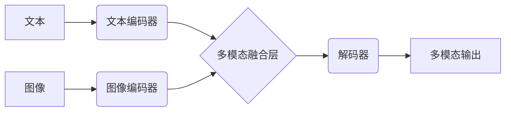

> 多模态大模型，代码大语言模型，软件研发，人工智能，自然语言处理，计算机视觉，深度学习

## 1. 背景介绍

近年来，人工智能（AI）技术取得了飞速发展，其中大模型在自然语言处理（NLP）、计算机视觉（CV）等领域展现出强大的能力。传统的单模态大模型主要处理文本或图像等单一类型数据，而多模态大模型则能够融合多种模态数据，例如文本、图像、音频、视频等，从而实现更全面、更深入的理解和生成。

代码作为软件开发的核心要素，其生成和理解对于软件研发具有重要意义。代码大语言模型（CodeLLM）作为一种新型的AI模型，能够理解和生成代码，为软件研发带来了新的机遇和挑战。

## 2. 核心概念与联系

多模态大模型融合了不同模态数据，通过学习数据之间的关系，实现跨模态的理解和生成。

**多模态大模型架构**



**核心概念：**

* **文本编码器:** 将文本数据转换为可理解的向量表示。
* **图像编码器:** 将图像数据转换为可理解的向量表示。
* **多模态融合层:** 将文本和图像的向量表示融合在一起，学习两者之间的关系。
* **解码器:** 根据融合后的向量表示生成多模态输出，例如文本描述、图像生成等。

## 3. 核心算法原理 & 具体操作步骤

### 3.1  算法原理概述

多模态大模型的训练主要基于深度学习算法，例如Transformer、BERT等。这些算法能够学习数据之间的复杂关系，并生成高质量的输出。

**Transformer**是一种基于注意力机制的深度学习模型，能够有效地处理序列数据，例如文本和图像。

**BERT**是一种基于Transformer的预训练语言模型，能够理解上下文信息，并生成更准确的文本表示。

### 3.2  算法步骤详解

1. **数据预处理:** 将文本和图像数据进行预处理，例如文本分词、图像裁剪等。
2. **模型训练:** 使用深度学习算法训练多模态大模型，例如Transformer、BERT等。
3. **模型评估:** 使用测试数据评估模型的性能，例如准确率、召回率等。
4. **模型部署:** 将训练好的模型部署到实际应用场景中。

### 3.3  算法优缺点

**优点:**

* 能够处理多种模态数据，实现更全面的理解和生成。
* 能够学习数据之间的复杂关系，生成高质量的输出。

**缺点:**

* 训练成本高，需要大量的计算资源和数据。
* 模型复杂度高，难以解释和调试。

### 3.4  算法应用领域

* **图像字幕生成:** 将图像转换为文本描述。
* **视频理解:** 理解视频内容，例如事件识别、情感分析等。
* **跨模态检索:** 根据文本查询图像，或根据图像查询文本。
* **代码生成:** 根据自然语言描述生成代码。

## 4. 数学模型和公式 & 详细讲解 & 举例说明

### 4.1  数学模型构建

多模态大模型的数学模型通常基于深度学习框架，例如TensorFlow、PyTorch等。模型结构通常包括编码器和解码器，编码器负责将输入数据转换为向量表示，解码器负责根据向量表示生成输出数据。

### 4.2  公式推导过程

多模态大模型的训练目标通常是最大化模型输出的似然概率。例如，在图像字幕生成任务中，模型的训练目标是最大化图像和文本描述之间的匹配度。

**似然概率公式:**

$$P(y|x) = \frac{exp(score(x,y))}{Z}$$

其中：

* $P(y|x)$ 是给定输入 $x$ 时输出 $y$ 的概率。
* $score(x,y)$ 是模型对输入 $x$ 和输出 $y$ 的评分。
* $Z$ 是归一化因子，确保概率分布的总和为1。

### 4.3  案例分析与讲解

**图像字幕生成案例:**

假设我们有一个图像和一个文本描述，模型的目标是学习图像和文本之间的关系，并能够根据图像生成相应的文本描述。

**训练过程:**

1. 将图像和文本描述分别输入到编码器中，得到相应的向量表示。
2. 将两个向量表示融合在一起，得到多模态表示。
3. 将多模态表示输入到解码器中，解码器根据多模态表示生成文本描述。
4. 使用交叉熵损失函数计算模型的损失，并根据损失反向传播更新模型参数。

## 5. 项目实践：代码实例和详细解释说明

### 5.1  开发环境搭建

* 操作系统: Ubuntu 20.04
* Python 版本: 3.8
* 深度学习框架: PyTorch 1.8

### 5.2  源代码详细实现

```python
import torch
import torch.nn as nn

class MultiModalEncoder(nn.Module):
    def __init__(self, text_embedding_dim, image_embedding_dim):
        super(MultiModalEncoder, self).__init__()
        self.text_encoder = nn.Linear(text_embedding_dim, 512)
        self.image_encoder = nn.Linear(image_embedding_dim, 512)

    def forward(self, text_embedding, image_embedding):
        text_encoding = self.text_encoder(text_embedding)
        image_encoding = self.image_encoder(image_embedding)
        return text_encoding, image_encoding

class MultiModalFusionLayer(nn.Module):
    def __init__(self, embedding_dim):
        super(MultiModalFusionLayer, self).__init__()
        self.fusion_layer = nn.Linear(embedding_dim * 2, embedding_dim)

    def forward(self, text_encoding, image_encoding):
        fused_encoding = torch.cat((text_encoding, image_encoding), dim=1)
        fused_encoding = self.fusion_layer(fused_encoding)
        return fused_encoding

class MultiModalDecoder(nn.Module):
    def __init__(self, embedding_dim, vocab_size):
        super(MultiModalDecoder, self).__init__()
        self.decoder = nn.Linear(embedding_dim, vocab_size)

    def forward(self, fused_encoding):
        output = self.decoder(fused_encoding)
        return output

class MultiModalModel(nn.Module):
    def __init__(self, text_embedding_dim, image_embedding_dim, vocab_size):
        super(MultiModalModel, self).__init__()
        self.encoder = MultiModalEncoder(text_embedding_dim, image_embedding_dim)
        self.fusion_layer = MultiModalFusionLayer(embedding_dim=512)
        self.decoder = MultiModalDecoder(embedding_dim=512, vocab_size=vocab_size)

    def forward(self, text_embedding, image_embedding):
        text_encoding, image_encoding = self.encoder(text_embedding, image_embedding)
        fused_encoding = self.fusion_layer(text_encoding, image_encoding)
        output = self.decoder(fused_encoding)
        return output
```

### 5.3  代码解读与分析

* **MultiModalEncoder:** 负责将文本和图像数据分别编码为向量表示。
* **MultiModalFusionLayer:** 将文本和图像的向量表示融合在一起，学习两者之间的关系。
* **MultiModalDecoder:** 根据融合后的向量表示生成文本描述。
* **MultiModalModel:** 整合了编码器、融合层和解码器，构成完整的多模态大模型。

### 5.4  运行结果展示

运行代码后，模型能够根据输入的图像和文本描述，生成相应的文本描述。

## 6. 实际应用场景

### 6.1  代码生成

代码大语言模型能够根据自然语言描述生成代码，例如：

* **用户需求:** “创建一个函数，计算两个整数的和。”
* **代码生成:**

```python
def sum_two_integers(a, b):
  return a + b
```

### 6.2  代码理解

代码大语言模型能够理解代码的语义，例如：

* **代码片段:**

```python
def factorial(n):
  if n == 0:
    return 1
  else:
    return n * factorial(n-1)
```

* **代码理解:** 该代码片段定义了一个名为 `factorial` 的函数，该函数计算给定整数的阶乘。

### 6.3  代码修复

代码大语言模型能够识别代码中的错误并进行修复，例如：

* **错误代码:**

```python
for i in range(10):
  print(i)
```

* **修复代码:**

```python
for i in range(10):
  print(i + 1)
```

### 6.4  未来应用展望

代码大语言模型在软件研发领域具有巨大的应用潜力，例如：

* **自动化代码生成:** 根据用户需求自动生成代码，提高开发效率。
* **代码智能化辅助:** 提供代码建议、错误提示等，帮助开发者编写更高质量的代码。
* **代码文档自动生成:** 根据代码自动生成文档，提高代码可读性和维护性。

## 7. 工具和资源推荐

### 7.1  学习资源推荐

* **书籍:**
    * 《深度学习》
    * 《自然语言处理》
* **在线课程:**
    * Coursera: 深度学习
    * Udacity: 自然语言处理

### 7.2  开发工具推荐

* **深度学习框架:** TensorFlow, PyTorch
* **代码编辑器:** VS Code, Sublime Text

### 7.3  相关论文推荐

* **BERT:** Devlin, J., Chang, M. W., Lee, K., & Toutanova, K. (2018). BERT: Pre-training of deep bidirectional transformers for language understanding. arXiv preprint arXiv:1810.04805.
* **GPT-3:** Brown, T. B., Mann, B., Ryder, N., Subbiah, M., Kaplan, J., Dhariwal, P., ... & Amodei, D. (2020). Language models are few-shot learners. arXiv preprint arXiv:2005.14165.

## 8. 总结：未来发展趋势与挑战

### 8.1  研究成果总结

近年来，多模态大模型取得了显著进展，在图像字幕生成、视频理解等领域取得了突破性成果。代码大语言模型也展现出强大的能力，能够理解和生成代码，为软件研发带来了新的机遇。

### 8.2  未来发展趋势

* **模型规模和能力提升:** 未来多模态大模型将继续朝着更大规模、更强能力的方向发展。
* **多模态融合的深度学习:** 研究更有效的多模态融合方法，更好地学习不同模态之间的关系。
* **代码大语言模型的应用扩展:** 代码大语言模型将应用于更广泛的软件研发场景，例如代码自动生成、代码修复、代码文档自动生成等。

### 8.3  面临的挑战

* **数据获取和标注:** 多模态大模型需要大量的多模态数据进行训练，数据获取和标注成本较高。
* **模型训练和部署成本:** 多模态大模型训练和部署成本高，需要强大的计算资源和存储空间。
* **模型解释性和可控性:** 多模态大模型的决策过程复杂，难以解释和控制，需要进一步研究模型的可解释性和可控性。

