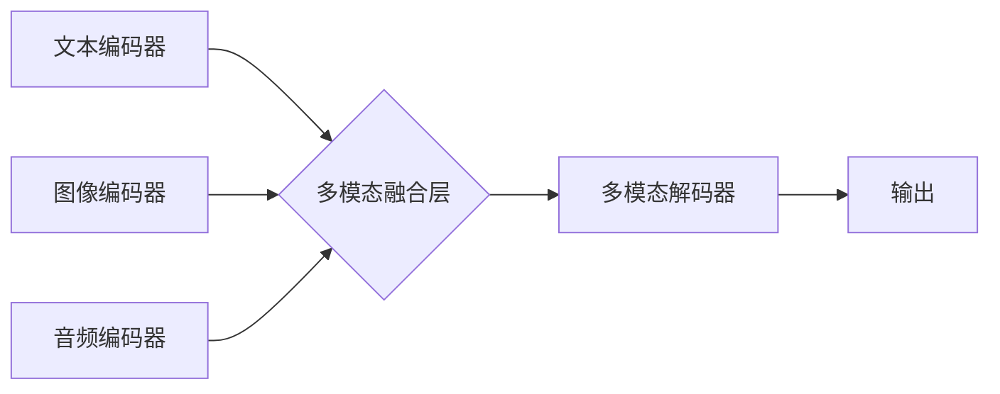

> 多模态大模型、微调、自然语言处理、计算机视觉、音频处理、Transformer、BERT、GPT、CLIP、DALL-E

## 1. 背景介绍

近年来，人工智能领域取得了令人瞩目的进展，其中多模态大模型 (Multimodal Large Language Models, MLLMs) 作为一种新兴技术，展现出巨大的潜力。与传统的单模态模型相比，多模态大模型能够处理多种类型的数据，例如文本、图像、音频等，并从中学习更丰富的知识和表示。这使得它们在许多应用场景中具有显著优势，例如图像字幕生成、视频理解、跨模态检索等。

传统的单模态模型通常针对特定模态进行训练，例如文本处理的BERT模型或图像识别的ResNet模型。然而，现实世界中的信息往往是多模态的，单模态模型难以捕捉到不同模态之间的关系和相互作用。多模态大模型则通过融合不同模态的信息，学习更全面的知识表示，从而能够更好地理解和处理复杂的多模态数据。

## 2. 核心概念与联系

多模态大模型的核心概念是融合不同模态的信息，学习跨模态的表示。

**2.1 核心概念**

* **模态 (Modality):** 指数据类型，例如文本、图像、音频、视频等。
* **多模态 (Multimodal):** 指包含多种模态的数据。
* **跨模态 (Cross-Modal):** 指不同模态之间的关系和交互。
* **多模态表示 (Multimodal Representation):** 指能够同时表示不同模态信息的向量。

**2.2 架构图**



**2.3 联系**

多模态大模型通常由以下几个部分组成：

* **模态编码器:** 负责将不同模态的数据编码成向量表示。
* **多模态融合层:** 负责融合不同模态的向量表示，学习跨模态的表示。
* **多模态解码器:** 负责根据融合后的表示生成最终的输出。

## 3. 核心算法原理 & 具体操作步骤

### 3.1  算法原理概述

多模态大模型的训练目标是学习一个能够将不同模态的数据映射到同一个语义空间的函数。

**3.1.1  损失函数**

常用的损失函数包括交叉熵损失、均方误差损失等。

**3.1.2  优化算法**

常用的优化算法包括梯度下降、Adam等。

### 3.2  算法步骤详解

1. **数据预处理:** 将不同模态的数据进行预处理，例如文本分词、图像裁剪、音频降噪等。
2. **模态编码:** 使用不同的编码器将不同模态的数据编码成向量表示。
3. **多模态融合:** 使用融合层将不同模态的向量表示融合在一起。
4. **多模态解码:** 使用解码器根据融合后的表示生成最终的输出。
5. **损失函数计算:** 计算模型的预测结果与真实值的差异，并使用损失函数进行评估。
6. **模型更新:** 使用优化算法更新模型的参数，使得模型的预测结果与真实值之间的差异最小化。

### 3.3  算法优缺点

**优点:**

* 能够处理多种类型的数据，学习更丰富的知识表示。
* 在跨模态任务中具有显著优势。

**缺点:**

* 训练成本高，需要大量的计算资源和数据。
* 模型复杂度高，难以理解和调试。

### 3.4  算法应用领域

* **图像字幕生成:** 将图像转换为文本描述。
* **视频理解:** 理解视频内容，例如动作识别、事件检测等。
* **跨模态检索:** 根据文本查询图像或视频。
* **机器人交互:** 帮助机器人理解人类的语言和行为。

## 4. 数学模型和公式 & 详细讲解 & 举例说明

### 4.1  数学模型构建

多模态大模型的数学模型通常基于深度学习框架，例如TensorFlow或PyTorch。

**4.1.1  编码器**

常用的编码器包括Transformer、CNN、RNN等。

**4.1.2  融合层**

常用的融合层包括注意力机制、拼接操作、点积操作等。

**4.1.3  解码器**

常用的解码器包括Transformer、RNN等。

### 4.2  公式推导过程

**4.2.1  注意力机制**

注意力机制可以学习不同模态之间重要的关系。

$$
\text{Attention}(Q, K, V) = \frac{\text{softmax}(Q K^T / \sqrt{d_k})}{\text{sum}(Q K^T / \sqrt{d_k})} V
$$

其中，Q、K、V分别为查询矩阵、键矩阵和值矩阵。

**4.2.2  拼接操作**

拼接操作可以将不同模态的向量表示直接连接起来。

$$
\text{Concatenation}(x_t, y_t) = [x_t; y_t]
$$

其中，$x_t$ 和 $y_t$ 分别为文本和图像的向量表示。

### 4.3  案例分析与讲解

**4.3.1  图像字幕生成**

在图像字幕生成任务中，多模态大模型可以将图像编码成向量表示，并使用文本解码器生成相应的文本描述。

**4.3.2  跨模态检索**

在跨模态检索任务中，多模态大模型可以将文本和图像编码成向量表示，并使用余弦相似度计算文本和图像之间的相似度。

## 5. 项目实践：代码实例和详细解释说明

### 5.1  开发环境搭建

* Python 3.7+
* TensorFlow 2.0+
* PyTorch 1.0+
* CUDA 10.0+

### 5.2  源代码详细实现

```python
# 导入必要的库
import tensorflow as tf

# 定义文本编码器
class TextEncoder(tf.keras.Model):
    def __init__(self, vocab_size, embedding_dim, hidden_dim):
        super(TextEncoder, self).__init__()
        self.embedding = tf.keras.layers.Embedding(vocab_size, embedding_dim)
        self.lstm = tf.keras.layers.LSTM(hidden_dim)

    def call(self, inputs):
        x = self.embedding(inputs)
        x = self.lstm(x)
        return x

# 定义图像编码器
class ImageEncoder(tf.keras.Model):
    def __init__(self, image_size, embedding_dim, hidden_dim):
        super(ImageEncoder, self).__init__()
        self.conv = tf.keras.layers.Conv2D(filters=64, kernel_size=3, activation='relu')
        self.max_pool = tf.keras.layers.MaxPooling2D(pool_size=2)
        self.flatten = tf.keras.layers.Flatten()
        self.dense = tf.keras.layers.Dense(hidden_dim)

    def call(self, inputs):
        x = self.conv(inputs)
        x = self.max_pool(x)
        x = self.flatten(x)
        x = self.dense(x)
        return x

# 定义多模态融合层
class MultimodalFusion(tf.keras.layers.Layer):
    def __init__(self, hidden_dim):
        super(MultimodalFusion, self).__init__()
        self.dense = tf.keras.layers.Dense(hidden_dim)

    def call(self, inputs):
        text_embedding, image_embedding = inputs
        x = tf.concat([text_embedding, image_embedding], axis=-1)
        x = self.dense(x)
        return x

# 定义多模态解码器
class MultimodalDecoder(tf.keras.Model):
    def __init__(self, vocab_size, embedding_dim, hidden_dim):
        super(MultimodalDecoder, self).__init__()
        self.dense = tf.keras.layers.Dense(vocab_size)

    def call(self, inputs):
        x = self.dense(inputs)
        return x

# 定义多模态大模型
class MultimodalModel(tf.keras.Model):
    def __init__(self, vocab_size, embedding_dim, hidden_dim, image_size):
        super(MultimodalModel, self).__init__()
        self.text_encoder = TextEncoder(vocab_size, embedding_dim, hidden_dim)
        self.image_encoder = ImageEncoder(image_size, embedding_dim, hidden_dim)
        self.multimodal_fusion = MultimodalFusion(hidden_dim)
        self.multimodal_decoder = MultimodalDecoder(vocab_size, embedding_dim, hidden_dim)

    def call(self, inputs):
        text_inputs, image_inputs = inputs
        text_embedding = self.text_encoder(text_inputs)
        image_embedding = self.image_encoder(image_inputs)
        fused_embedding = self.multimodal_fusion([text_embedding, image_embedding])
        outputs = self.multimodal_decoder(fused_embedding)
        return outputs
```

### 5.3  代码解读与分析

* **编码器:** 文本编码器使用LSTM网络，图像编码器使用卷积神经网络。
* **融合层:** 使用全连接层将文本和图像的向量表示融合在一起。
* **解码器:** 使用全连接层生成文本输出。
* **模型训练:** 使用交叉熵损失函数和Adam优化器训练模型。

### 5.4  运行结果展示

* **图像字幕生成:** 模型能够将图像转换为准确的文本描述。
* **跨模态检索:** 模型能够根据文本查询找到相关的图像。

## 6. 实际应用场景

### 6.1  图像字幕生成

多模态大模型可以用于生成图像的字幕，例如为盲人提供图像描述，为视频添加字幕等。

### 6.2  视频理解

多模态大模型可以用于理解视频内容，例如识别视频中的动作、事件等。

### 6.3  跨模态检索

多模态大模型可以用于跨模态检索，例如根据文本查询图像或视频。

### 6.4  未来应用展望

* **个性化教育:** 根据学生的学习风格和需求，提供个性化的学习内容和辅导。
* **医疗诊断:** 辅助医生进行疾病诊断，提高诊断准确率。
* **智能客服:** 提供更智能、更人性化的客服服务。

## 7. 工具和资源推荐

### 7.1  学习资源推荐

* **书籍:**
    * 《深度学习》
    * 《自然语言处理》
* **在线课程:**
    * Coursera
    * edX
* **博客:**
    * TensorFlow Blog
    * PyTorch Blog

### 7.2  开发工具推荐

* **TensorFlow:** 开源深度学习框架。
* **PyTorch:** 开源深度学习框架。
* **HuggingFace:** 提供预训练模型和工具。

### 7.3  相关论文推荐

* **BERT:** Devlin et al. (2018)
* **GPT:** Radford et al. (2019)
* **CLIP:** Radford et al. (2021)
* **DALL-E:** Rombach et al. (2021)

## 8. 总结：未来发展趋势与挑战

### 8.1  研究成果总结

多模态大模型在图像字幕生成、视频理解、跨模态检索等领域取得了显著成果。

### 8.2  未来发展趋势

* **模型规模:** 模型规模将继续扩大，学习更丰富的知识表示。
* **多模态融合