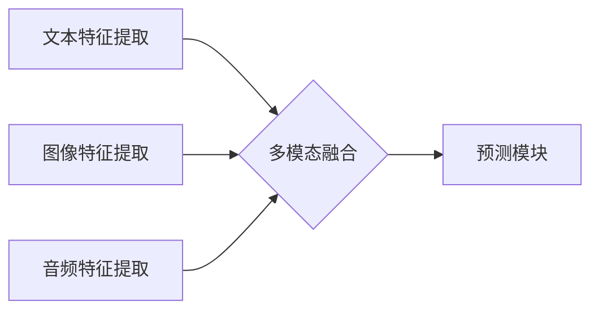

> 多模态大模型，模型压缩，Transformer，BERT，GPT，视觉语言模型，自然语言处理，计算机视觉，深度学习，高效训练

## 1. 背景介绍

近年来，深度学习技术取得了飞速发展，特别是Transformer模型的出现，为自然语言处理（NLP）领域带来了革命性的变革。BERT、GPT等基于Transformer的模型在各种NLP任务上取得了优异的性能，例如文本分类、机器翻译、问答系统等。然而，这些大规模模型通常具有参数量庞大、计算资源需求高、部署成本高等缺点，限制了其在实际应用中的推广。

与此同时，计算机视觉领域也取得了显著进展，卷积神经网络（CNN）在图像识别、目标检测、图像分割等任务上表现出色。然而，与NLP领域类似，大型视觉模型也面临着资源消耗大、部署困难等挑战。

为了解决这些问题，多模态大模型应运而生。多模态大模型旨在学习不同模态（如文本、图像、音频等）之间的关系，并能够在跨模态任务中进行高效的推理。例如，可以利用多模态大模型实现图像字幕生成、文本到图像生成、视频问答等功能。

## 2. 核心概念与联系

多模态大模型的核心概念是融合不同模态的信息，学习跨模态的表示和关系。

**2.1 多模态数据**

多模态数据是指包含多种不同类型信息的集合，例如文本、图像、音频、视频等。

**2.2 多模态特征提取**

多模态特征提取是指从不同模态数据中提取有意义的特征表示。常用的方法包括：

* **文本特征提取：** 使用词嵌入、BERT等模型提取文本的语义特征。
* **图像特征提取：** 使用CNN模型提取图像的视觉特征。
* **音频特征提取：** 使用声学模型提取音频的声学特征。

**2.3 多模态融合**

多模态融合是指将不同模态的特征进行融合，形成一个综合的表示。常用的方法包括：

* **早期融合：** 在特征提取阶段将不同模态的特征进行拼接或连接。
* **晚期融合：** 在分类或预测阶段将不同模态的特征进行融合。
* **跨模态注意力机制：** 学习不同模态之间的关系，赋予不同模态不同的权重。

**2.4 多模态模型架构**

多模态模型的架构通常包括以下部分：

* **多模态特征提取模块：** 用于提取不同模态的特征。
* **多模态融合模块：** 用于融合不同模态的特征。
* **预测模块：** 用于进行跨模态任务的预测。



## 3. 核心算法原理 & 具体操作步骤

### 3.1  算法原理概述

多模态大模型的训练目标是学习不同模态之间的关系，并能够在跨模态任务中进行高效的推理。常用的训练方法包括：

* **自监督学习：** 利用无标签数据训练模型，例如通过预测遮挡部分的文本或图像来学习文本和图像之间的关系。
* **半监督学习：** 利用少量标注数据和大量无标签数据训练模型。
* **监督学习：** 利用大量标注数据训练模型，例如图像字幕生成、文本到图像生成等任务。

### 3.2  算法步骤详解

1. **数据预处理：** 将多模态数据进行清洗、格式化、标注等操作。
2. **特征提取：** 使用预训练模型或训练自定义模型提取不同模态的特征。
3. **多模态融合：** 将不同模态的特征进行融合，形成一个综合的表示。
4. **模型训练：** 使用训练数据训练多模态模型，并使用交叉熵损失函数进行优化。
5. **模型评估：** 使用测试数据评估模型的性能，并根据评估结果进行模型调优。

### 3.3  算法优缺点

**优点：**

* 可以学习不同模态之间的关系，提高跨模态任务的性能。
* 可以利用无标签数据进行训练，降低训练成本。

**缺点：**

* 训练数据量大，计算资源需求高。
* 模型复杂度高，部署成本高。

### 3.4  算法应用领域

* **图像字幕生成**
* **文本到图像生成**
* **视频问答**
* **多模态检索**
* **情感分析**

## 4. 数学模型和公式 & 详细讲解 & 举例说明

### 4.1  数学模型构建

多模态大模型的数学模型通常基于深度学习框架，例如TensorFlow或PyTorch。模型的结构可以根据具体任务进行设计，但通常包括以下部分：

* **多模态特征提取模块：** 使用预训练模型或训练自定义模型提取不同模态的特征。
* **多模态融合模块：** 使用注意力机制、拼接操作等方法将不同模态的特征进行融合。
* **预测模块：** 使用全连接层、softmax层等方法进行预测。

### 4.2  公式推导过程

多模态融合模块的数学公式可以根据具体的融合方法进行设计。例如，使用注意力机制进行融合的公式如下：

$$
\mathbf{h}_{m} = \sum_{i=1}^{n} \alpha_{i,m} \mathbf{x}_{i}
$$

其中：

* $\mathbf{h}_{m}$ 是融合后的特征向量。
* $\mathbf{x}_{i}$ 是第 $i$ 个模态的特征向量。
* $\alpha_{i,m}$ 是第 $i$ 个模态在第 $m$ 个模态上的注意力权重。

### 4.3  案例分析与讲解

例如，在图像字幕生成任务中，可以使用多模态大模型将图像特征和文本特征进行融合，生成相应的字幕。

## 5. 项目实践：代码实例和详细解释说明

### 5.1  开发环境搭建

* Python 3.7+
* TensorFlow 2.0+
* PyTorch 1.0+
* CUDA 10.0+

### 5.2  源代码详细实现

```python
import tensorflow as tf

# 定义多模态融合模块
class MultiModalFusion(tf.keras.layers.Layer):
    def __init__(self, num_heads):
        super(MultiModalFusion, self).__init__()
        self.attention = tf.keras.layers.MultiHeadAttention(num_heads=num_heads)

    def call(self, inputs):
        text_features, image_features = inputs
        # 使用注意力机制融合文本和图像特征
        fused_features = self.attention([text_features, image_features])
        return fused_features

# 定义图像字幕生成模型
class ImageCaptioningModel(tf.keras.Model):
    def __init__(self, vocab_size, embedding_dim, num_heads):
        super(ImageCaptioningModel, self).__init__()
        self.image_encoder = tf.keras.applications.ResNet50(include_top=False, weights='imagenet')
        self.text_encoder = tf.keras.layers.Embedding(vocab_size, embedding_dim)
        self.fusion_layer = MultiModalFusion(num_heads)
        self.decoder = tf.keras.layers.LSTM(embedding_dim)
        self.output_layer = tf.keras.layers.Dense(vocab_size, activation='softmax')

    def call(self, images, captions):
        image_features = self.image_encoder(images)
        text_features = self.text_encoder(captions)
        fused_features = self.fusion_layer([text_features, image_features])
        predictions = self.output_layer(fused_features)
        return predictions

# 训练模型
model = ImageCaptioningModel(vocab_size=10000, embedding_dim=128, num_heads=8)
model.compile(optimizer='adam', loss='sparse_categorical_crossentropy', metrics=['accuracy'])
model.fit(images, captions, epochs=10)
```

### 5.3  代码解读与分析

* 代码首先定义了多模态融合模块，使用注意力机制将文本和图像特征进行融合。
* 然后定义了图像字幕生成模型，包括图像编码器、文本编码器、融合层、解码器和输出层。
* 最后使用训练数据训练模型，并使用交叉熵损失函数进行优化。

### 5.4  运行结果展示

训练完成后，模型可以用于生成图像字幕。例如，输入一张图片，模型可以输出相应的字幕。

## 6. 实际应用场景

### 6.1  图像字幕生成

多模态大模型可以用于生成图像字幕，例如为图片添加描述、生成视频字幕等。

### 6.2  文本到图像生成

多模态大模型可以用于将文本描述生成图像，例如根据文本描述生成艺术作品、产品设计等。

### 6.3  视频问答

多模态大模型可以用于视频问答，例如根据视频内容回答问题。

### 6.4  未来应用展望

多模态大模型在未来将有更广泛的应用场景，例如：

* **增强现实（AR）和虚拟现实（VR）:** 为AR/VR体验提供更丰富的交互和内容。
* **机器人交互:** 帮助机器人理解人类的语言和行为，进行更自然的人机交互。
* **医疗诊断:** 辅助医生进行疾病诊断，提高诊断准确率。

## 7. 工具和资源推荐

### 7.1  学习资源推荐

* **书籍:**
    * 《深度学习》
    * 《自然语言处理》
    * 《计算机视觉》
* **在线课程:**
    * Coursera
    * edX
    * Udacity

### 7.2  开发工具推荐

* **TensorFlow:** 开源深度学习框架
* **PyTorch:** 开源深度学习框架
* **HuggingFace:** 多模态模型库

### 7.3  相关论文推荐

* **BERT: Pre-training of Deep Bidirectional Transformers for Language Understanding**
* **GPT: Generative Pre-trained Transformer**
* **Vision Transformer (ViT)**

## 8. 总结：未来发展趋势与挑战

### 8.1  研究成果总结

多模态大模型在跨模态任务中取得了显著的进展，例如图像字幕生成、文本到图像生成、视频问答等。

### 8.2  未来发展趋势

* **模型规模和能力的提升:** 随着计算资源的不断发展，多模态大模型的规模和能力将进一步提升。
* **跨模态知识的共享和迁移:** 研究如何更好地共享和迁移不同模态之间的知识，提高模型的泛化能力。
* **多模态数据生成和增强:** 研究如何生成高质量的多模态数据，并增强现有数据的质量。

### 8.3  面临的挑战

* **数据标注成本高:** 多模态数据的标注成本较高，限制了模型的训练规模。
* **模型训练复杂度高:** 多模态大模型的训练复杂度高，需要大量的计算资源和时间。
* **模型解释性和可解释性:** 多模态大模型的内部机制复杂，难以解释和理解模型的决策过程。

### 8.4  研究展望

未来，多模态大模型的研究将继续朝着更强大、更智能、更可解释的方向发展。


## 9. 附录：常见问题与解答

**1. 多模态大模型的训练数据来源？**

多模态大模型的训练数据可以来自公开数据集、Web爬虫、用户生成内容等。

**2. 多模态大模型的部署成本高吗？**

是的，多模态大模型的部署成本较高，需要强大的计算资源和存储空间。

**3. 多模态大模型的安全性如何？**

