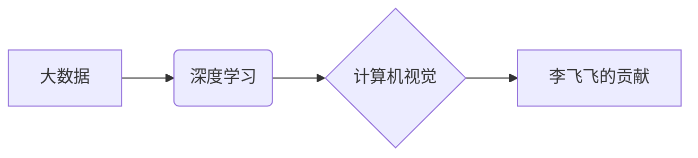

> 大数据，深度学习，计算机视觉，人工智能，李飞飞，斯坦福大学，图像识别，目标检测，机器学习

## 1. 背景介绍

在当今数据爆炸的时代，大数据已成为推动社会发展和科技进步的强大引擎。海量数据的产生和积累为人工智能（AI）的发展提供了丰富的燃料，也催生了大数据分析、机器学习和深度学习等新兴技术。其中，李飞飞教授作为斯坦福大学计算机科学系教授，人工智能实验室主任，以及斯坦福大学人工智能研究所创始成员，在深度学习和计算机视觉领域做出了杰出的贡献，其研究成果对大数据时代的人工智能发展具有深远影响。

## 2. 核心概念与联系

**2.1 大数据**

大数据是指规模庞大、结构复杂、速度快、多样化的数据集合。其特征通常被概括为“五V”：

* **Volume（体积）**: 大数据量级巨大，难以用传统数据库技术处理。
* **Velocity（速度）**: 数据产生和更新速度极快，需要实时处理和分析。
* **Variety（多样性）**: 数据类型多样，包括结构化数据、非结构化数据和半结构化数据。
* **Veracity（真实性）**: 数据质量参差不齐，需要进行清洗和验证。
* **Value（价值）**: 大数据蕴含着巨大的价值，需要挖掘和利用。

**2.2 深度学习**

深度学习是机器学习的一种高级形式，它利用多层神经网络来模拟人类大脑的学习过程。深度学习算法能够从海量数据中自动学习特征，并进行复杂的模式识别和预测。

**2.3 计算机视觉**

计算机视觉是人工智能的一个分支，它致力于使计算机能够“看”和理解图像和视频。计算机视觉技术广泛应用于图像识别、目标检测、图像分割、视频分析等领域。

**2.4 李飞飞的贡献**

李飞飞教授的研究工作主要集中在深度学习和计算机视觉领域，她提出了许多创新性的算法和方法，并取得了显著的成果。

**2.5 核心概念关系图**

## 3. 核心算法原理 & 具体操作步骤

**3.1 算法原理概述**

李飞飞教授在深度学习和计算机视觉领域的研究成果主要集中在以下几个方面：

* **卷积神经网络（CNN）**：CNN是一种专门用于处理图像数据的深度学习算法，它能够自动学习图像特征，并进行图像识别、目标检测等任务。
* **循环神经网络（RNN）**：RNN是一种专门用于处理序列数据的深度学习算法，它能够学习时间序列中的模式，并进行自然语言处理、语音识别等任务。
* **生成对抗网络（GAN）**：GAN是一种由两个神经网络组成的生成模型，它能够生成逼真的图像、文本和音频等数据。

**3.2 算法步骤详解**

以卷积神经网络为例，其训练步骤如下：

1. **数据预处理**: 将图像数据进行裁剪、缩放、归一化等处理，使其符合模型的输入要求。
2. **网络结构设计**: 设计卷积神经网络的结构，包括卷积层、池化层、全连接层等。
3. **参数初始化**: 为网络中的参数进行随机初始化。
4. **前向传播**: 将预处理后的图像数据输入到网络中，并计算输出结果。
5. **损失函数计算**: 计算模型输出结果与真实标签之间的差异，即损失函数值。
6. **反向传播**: 将损失函数值反向传播到网络中，并更新网络参数。
7. **迭代训练**: 重复步骤4-6，直到模型的损失函数值达到预设的阈值。

**3.3 算法优缺点**

**优点**:

* 能够自动学习图像特征，无需人工特征工程。
* 性能优于传统图像识别算法。
* 能够处理高分辨率图像。

**缺点**:

* 训练数据量大，需要大量的计算资源。
* 训练时间长，需要较长时间才能完成训练。
* 模型解释性差，难以理解模型的决策过程。

**3.4 算法应用领域**

CNN在图像识别、目标检测、图像分割、人脸识别、医疗影像分析等领域都有广泛的应用。

## 4. 数学模型和公式 & 详细讲解 & 举例说明

**4.1 数学模型构建**

卷积神经网络的数学模型可以概括为以下公式：

$$
y = f(W * x + b)
$$

其中：

* $y$：输出结果
* $x$：输入数据
* $W$：卷积核权重
* $b$：偏置项
* $f$：激活函数

**4.2 公式推导过程**

卷积操作是CNN的核心运算，它通过滑动卷积核在输入图像上进行卷积运算，提取图像特征。卷积核的权重可以通过训练过程学习得到。

**4.3 案例分析与讲解**

假设输入图像大小为 $32 \times 32$，卷积核大小为 $3 \times 3$，步长为 $1$。则卷积操作后输出图像大小为 $30 \times 30$。

## 5. 项目实践：代码实例和详细解释说明

**5.1 开发环境搭建**

使用Python语言和深度学习框架TensorFlow或PyTorch搭建开发环境。

**5.2 源代码详细实现**

使用TensorFlow或PyTorch框架实现一个简单的卷积神经网络模型，用于图像分类任务。

**5.3 代码解读与分析**

解释代码中各个模块的功能，包括数据加载、模型定义、训练过程、评估指标等。

**5.4 运行结果展示**

展示模型训练过程中的损失函数曲线和准确率曲线，以及模型在测试集上的准确率。

## 6. 实际应用场景

**6.1 图像识别**

CNN可以用于识别图像中的物体、场景和人物。

**6.2 目标检测**

CNN可以用于检测图像中多个目标的位置和类别。

**6.3 图像分割**

CNN可以用于将图像分割成不同的区域，例如分割图像中的前景和背景。

**6.4 视频分析**

CNN可以用于分析视频内容，例如检测视频中的动作、人物和事件。

**6.5 未来应用展望**

随着深度学习技术的不断发展，CNN在未来将有更广泛的应用场景，例如自动驾驶、医疗诊断、机器人控制等。

## 7. 工具和资源推荐

**7.1 学习资源推荐**

* 深度学习课程：Stanford CS231n, DeepLearning.AI
* 图像识别书籍：Deep Learning with Python, Computer Vision: Algorithms and Applications

**7.2 开发工具推荐**

* 深度学习框架：TensorFlow, PyTorch
* 图像处理库：OpenCV, Pillow

**7.3 相关论文推荐**

* AlexNet: ImageNet Classification with Deep Convolutional Neural Networks
* VGGNet: Very Deep Convolutional Networks for Large-Scale Image Recognition
* ResNet: Deep Residual Learning for Image Recognition

## 8. 总结：未来发展趋势与挑战

**8.1 研究成果总结**

李飞飞教授的研究成果对深度学习和计算机视觉领域的发展做出了重要贡献，推动了人工智能技术的进步。

**8.2 未来发展趋势**

未来，深度学习和计算机视觉技术将继续发展，朝着更深、更广、更强的方向发展。

* **模型规模**: 模型规模将继续扩大，训练更复杂的模型。
* **数据多样性**: 数据类型将更加多样化，包括文本、音频、视频等。
* **应用场景**: 应用场景将更加广泛，覆盖更多领域。

**8.3 面临的挑战**

深度学习和计算机视觉技术也面临着一些挑战，例如：

* **数据标注**: 数据标注成本高，难以获取高质量的标注数据。
* **模型解释性**: 模型解释性差，难以理解模型的决策过程。
* **公平性与伦理**: 模型可能存在偏见和歧视，需要关注公平性和伦理问题。

**8.4 研究展望**

未来研究方向包括：

* **无监督学习**: 探索无监督学习方法，减少对标注数据的依赖。
* **模型解释性**: 研究模型解释性方法，提高模型的可解释性。
* **公平性与伦理**: 研究公平性和伦理问题，确保模型的负责任使用。

## 9. 附录：常见问题与解答

**9.1 如何选择合适的深度学习框架？**

TensorFlow和PyTorch是两种流行的深度学习框架，选择哪个框架取决于个人喜好和项目需求。

**9.2 如何处理图像数据？**

图像数据需要进行预处理，例如裁剪、缩放、归一化等操作，使其符合模型的输入要求。

**9.3 如何评估模型性能？**

模型性能可以通过准确率、召回率、F1-score等指标进行评估。

作者：禅与计算机程序设计艺术 / Zen and the Art of Computer Programming

<end_of_turn>