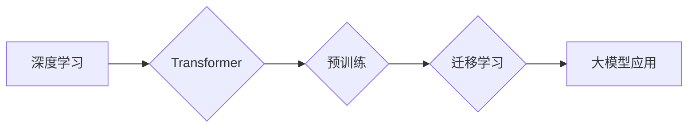

> 大模型、深度学习、Transformer、自然语言处理、计算机视觉、市场需求、技术创新

## 1. 背景介绍

近年来，人工智能（AI）技术取得了飞速发展，其中大模型作为AI领域的重要突破口，展现出强大的学习和推理能力，在自然语言处理、计算机视觉、语音识别等领域取得了显著成果。大模型的出现，标志着人工智能技术进入了一个新的时代，其强大的能力和广泛的应用前景，也引发了学术界和产业界的广泛关注。

大模型的定义通常是指参数量在数十亿甚至数千亿级别的神经网络模型。这些模型通过海量数据训练，能够学习到复杂的模式和知识，从而实现更精准、更智能的应用。与传统的小型模型相比，大模型具有以下优势：

* **更强的泛化能力:** 大模型通过学习海量数据，能够更好地概括和理解数据中的规律，从而在面对新的数据时表现出更强的泛化能力。
* **更丰富的表达能力:** 大模型拥有更多的参数，能够学习到更复杂的特征和表示，从而更好地表达和理解语言、图像等信息。
* **更强大的推理能力:** 大模型能够学习到更复杂的逻辑关系和推理规则，从而实现更复杂的推理和决策。

## 2. 核心概念与联系

大模型的训练和应用离不开以下核心概念：

* **深度学习:** 深度学习是机器学习的一种重要分支，它利用多层神经网络来模拟人类大脑的学习过程，能够从数据中自动学习特征和知识。
* **Transformer:** Transformer是一种新型的神经网络架构，它通过自注意力机制能够捕捉序列数据中的长距离依赖关系，在自然语言处理领域取得了突破性的进展。
* **预训练:** 预训练是指在大量通用数据上训练模型，使其学习到通用的语言表示或知识，然后在特定任务上进行微调。
* **迁移学习:** 迁移学习是指将预训练模型在特定任务上的微调，利用已有模型的知识和能力，提高模型在目标任务上的性能。

**Mermaid 流程图:**



## 3. 核心算法原理 & 具体操作步骤

### 3.1  算法原理概述

大模型的训练主要基于深度学习算法，其中Transformer架构是目前最流行的模型架构之一。Transformer模型的核心是自注意力机制，它能够捕捉序列数据中的长距离依赖关系，从而实现更准确的理解和生成。

### 3.2  算法步骤详解

大模型的训练过程可以概括为以下步骤：

1. **数据预处理:** 将原始数据进行清洗、格式化和编码，使其能够被模型理解。
2. **模型构建:** 根据任务需求选择合适的模型架构，例如Transformer，并设置模型参数。
3. **模型训练:** 使用训练数据训练模型，通过反向传播算法不断调整模型参数，使其能够更好地拟合数据。
4. **模型评估:** 使用验证数据评估模型的性能，并根据评估结果调整训练参数或模型结构。
5. **模型部署:** 将训练好的模型部署到实际应用场景中，用于进行预测或生成。

### 3.3  算法优缺点

**优点:**

* 强大的学习能力：能够学习到复杂的模式和知识。
* 优秀的泛化能力：能够在新的数据上表现出良好的性能。
* 丰富的应用场景：能够应用于自然语言处理、计算机视觉、语音识别等多个领域。

**缺点:**

* 训练成本高：需要大量的计算资源和训练数据。
* 模型规模大：模型参数量庞大，部署和推理需要较高的硬件要求。
* 可解释性差：模型的决策过程难以理解，缺乏透明度。

### 3.4  算法应用领域

大模型在以下领域具有广泛的应用前景：

* **自然语言处理:** 文本生成、机器翻译、问答系统、情感分析等。
* **计算机视觉:** 图像识别、物体检测、图像分割、视频分析等。
* **语音识别:** 语音转文本、语音合成、语音助手等。
* **推荐系统:** 商品推荐、内容推荐、个性化服务等。
* **药物研发:** 药物发现、药物设计、药物安全性评估等。

## 4. 数学模型和公式 & 详细讲解 & 举例说明

### 4.1  数学模型构建

Transformer模型的核心是自注意力机制，其数学模型可以表示为：

$$
Attention(Q, K, V) = \frac{exp(Q \cdot K^T / \sqrt{d_k})}{exp(Q \cdot K^T / \sqrt{d_k})} \cdot V
$$

其中：

* $Q$：查询矩阵
* $K$：键矩阵
* $V$：值矩阵
* $d_k$：键向量的维度

### 4.2  公式推导过程

自注意力机制通过计算查询向量与键向量的点积，并将其归一化，从而得到每个键向量对查询向量的注意力权重。这些权重用于加权求和值向量，最终得到注意力输出。

### 4.3  案例分析与讲解

例如，在机器翻译任务中，查询向量可以表示源语言的词语，键向量和值向量可以分别表示目标语言的词语和词语的语义表示。通过自注意力机制，模型可以学习到源语言词语与目标语言词语之间的关系，从而实现更准确的翻译。

## 5. 项目实践：代码实例和详细解释说明

### 5.1  开发环境搭建

* Python 3.7+
* PyTorch 1.7+
* CUDA 10.2+

### 5.2  源代码详细实现

```python
import torch
import torch.nn as nn

class Transformer(nn.Module):
    def __init__(self, vocab_size, embedding_dim, num_heads, num_layers):
        super(Transformer, self).__init__()
        self.embedding = nn.Embedding(vocab_size, embedding_dim)
        self.transformer_layers = nn.ModuleList([
            nn.TransformerEncoderLayer(embedding_dim, num_heads)
            for _ in range(num_layers)
        ])
        self.linear = nn.Linear(embedding_dim, vocab_size)

    def forward(self, x):
        x = self.embedding(x)
        for layer in self.transformer_layers:
            x = layer(x)
        x = self.linear(x)
        return x
```

### 5.3  代码解读与分析

* `__init__` 方法初始化模型参数，包括词嵌入层、Transformer编码器层和输出层。
* `forward` 方法定义模型的正向传播过程，将输入序列经过词嵌入层、Transformer编码器层和输出层，最终得到输出序列。

### 5.4  运行结果展示

通过训练和测试，可以评估模型的性能，例如准确率、BLEU分数等。

## 6. 实际应用场景

大模型在各个领域都有着广泛的应用场景：

### 6.1 自然语言处理

* **机器翻译:** 例如，Google Translate 使用大模型进行机器翻译，能够实现更准确、更流畅的翻译。
* **文本摘要:** 大模型能够自动生成文本摘要，例如新闻文章的摘要、会议记录的摘要等。
* **对话系统:** 大模型可以用于构建更智能的对话系统，例如聊天机器人、虚拟助手等。

### 6.2 计算机视觉

* **图像识别:** 大模型能够识别图像中的物体、场景和人物，例如自动驾驶汽车中的物体检测。
* **图像生成:** 大模型能够生成逼真的图像，例如艺术作品、产品设计等。
* **视频分析:** 大模型能够分析视频内容，例如识别视频中的动作、事件和人物。

### 6.3 其他领域

* **语音识别:** 大模型能够将语音转换为文本，例如语音助手、语音搜索等。
* **药物研发:** 大模型能够辅助药物发现、药物设计和药物安全性评估。
* **金融分析:** 大模型能够分析金融数据，例如股票预测、风险评估等。

### 6.4 未来应用展望

随着大模型技术的不断发展，其应用场景将更加广泛，例如：

* **个性化教育:** 根据学生的学习情况，提供个性化的学习内容和辅导。
* **医疗诊断:** 辅助医生进行疾病诊断，提高诊断准确率。
* **科学研究:** 加速科学研究的进程，例如蛋白质结构预测、材料设计等。

## 7. 工具和资源推荐

### 7.1 学习资源推荐

* **书籍:**
    * 《深度学习》
    * 《Transformer 详解》
* **在线课程:**
    * Coursera: 深度学习
    * Udacity: 自然语言处理
* **博客:**
    * The Gradient
    * Towards Data Science

### 7.2 开发工具推荐

* **框架:**
    * PyTorch
    * TensorFlow
* **库:**
    * Hugging Face Transformers
    * OpenAI API

### 7.3 相关论文推荐

* 《Attention Is All You Need》
* 《BERT: Pre-training of Deep Bidirectional Transformers for Language Understanding》
* 《GPT-3: Language Models are Few-Shot Learners》

## 8. 总结：未来发展趋势与挑战

### 8.1 研究成果总结

大模型技术取得了显著的进展，在自然语言处理、计算机视觉等领域取得了突破性的成果。

### 8.2 未来发展趋势

* **模型规模的进一步扩大:** 随着计算资源的不断提升，大模型的规模将继续扩大，从而提升模型的性能。
* **模型架构的创新:** 研究人员将继续探索新的模型架构，例如混合模型、联邦学习等，以提高模型的效率和鲁棒性。
* **应用场景的拓展:** 大模型将应用于更多领域，例如医疗、教育、金融等，为社会带来更多价值。

### 8.3 面临的挑战

* **训练成本高:** 大模型的训练需要大量的计算资源和训练数据，这对于资源有限的机构和个人来说是一个挑战。
* **可解释性差:** 大模型的决策过程难以理解，缺乏透明度，这对于一些需要解释性强的应用场景来说是一个限制。
* **伦理问题:** 大模型的应用可能带来一些伦理问题，例如数据隐私、算法偏见等，需要引起重视和解决。

### 8.4 研究展望

未来，大模型技术将继续发展，并与其他人工智能技术融合，例如强化学习、知识图谱等，从而实现更智能、更强大的应用。


## 9. 附录：常见问题与解答

**Q1: 大模型的训练需要多少数据？**

A1: 大模型的训练需要海量数据，通常需要数十亿甚至数千亿个数据点。

**Q2: 大模型的训练需要多少计算资源？**

A2: 大模型的训练需要大量的计算资源，通常需要数百甚至数千个GPU。

**Q3: 如何评估大模型的性能？**

A3: 大模型的性能可以通过多种指标评估，例如准确率、BLEU分数、ROUGE分数等。

**Q4: 大模型的应用有哪些？**

A4: 大模型的应用非常广泛，例如自然语言处理、计算机视觉、语音识别等。

**Q5: 大模型的未来发展趋势是什么？**

A5: 大模型的未来发展趋势包括模型规模的扩大、模型架构的创新、应用场景的拓展等。


作者：禅与计算机程序设计艺术 / Zen and the Art of Computer Programming 
<end_of_turn>