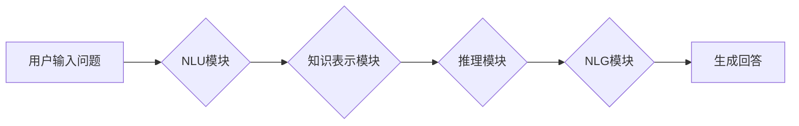

> 大模型、问答机器人、自然语言处理、Transformer、BERT、GPT、生成式模型、文本生成

## 1. 背景介绍

近年来，深度学习技术取得了飞速发展，特别是Transformer模型的出现，为自然语言处理（NLP）领域带来了革命性的变革。大模型问答机器人作为一种基于深度学习的智能问答系统，能够理解用户自然语言问题，并生成准确、流畅、相关的回答。

问答机器人技术在各个领域都有着广泛的应用，例如：

* **客服机器人:** 自动回答用户常见问题，提高服务效率。
* **教育机器人:** 为学生提供个性化的学习辅导。
* **搜索引擎:** 更精准地理解用户搜索意图，提供更相关的搜索结果。
* **娱乐机器人:** 与用户进行自然对话，提供娱乐体验。

## 2. 核心概念与联系

大模型问答机器人主要由以下几个核心模块组成：

* **自然语言理解（NLU）模块:** 负责理解用户输入的自然语言问题，将其转换为机器可理解的格式。
* **知识表示模块:** 负责存储和组织知识，并将其表示为机器可访问的形式。
* **推理模块:** 负责根据用户问题和知识库进行推理，找到最合适的答案。
* **自然语言生成（NLG）模块:** 负责将机器生成的答案转换为自然语言，并生成流畅、易懂的回答。

**Mermaid 流程图:**



## 3. 核心算法原理 & 具体操作步骤

### 3.1  算法原理概述

大模型问答机器人通常采用基于Transformer的深度学习模型进行训练。Transformer模型能够有效地捕捉文本中的长距离依赖关系，从而提高了问答系统的准确性和流畅度。

### 3.2  算法步骤详解

1. **数据预处理:** 将原始文本数据进行清洗、分词、标记等预处理操作，使其能够被模型理解。
2. **模型训练:** 使用预处理后的数据训练Transformer模型，例如BERT、GPT等。
3. **模型评估:** 使用测试数据评估模型的性能，例如准确率、BLEU分数等。
4. **模型部署:** 将训练好的模型部署到服务器上，以便用户使用。

### 3.3  算法优缺点

**优点:**

* 能够理解复杂的自然语言问题。
* 生成流畅、自然的回答。
* 能够不断学习和改进。

**缺点:**

* 训练成本高。
* 需要大量的训练数据。
* 容易受到恶意攻击。

### 3.4  算法应用领域

大模型问答机器人技术在各个领域都有着广泛的应用，例如：

* **客服机器人:** 自动回答用户常见问题，提高服务效率。
* **教育机器人:** 为学生提供个性化的学习辅导。
* **搜索引擎:** 更精准地理解用户搜索意图，提供更相关的搜索结果。
* **娱乐机器人:** 与用户进行自然对话，提供娱乐体验。

## 4. 数学模型和公式 & 详细讲解 & 举例说明

### 4.1  数学模型构建

Transformer模型的核心是注意力机制，它能够有效地捕捉文本中的长距离依赖关系。注意力机制的数学模型可以表示为：

$$
Attention(Q, K, V) = softmax(\frac{QK^T}{\sqrt{d_k}})V
$$

其中：

* $Q$：查询矩阵
* $K$：键矩阵
* $V$：值矩阵
* $d_k$：键向量的维度
* $softmax$：softmax函数

### 4.2  公式推导过程

注意力机制的公式推导过程如下：

1. 计算查询矩阵 $Q$ 与键矩阵 $K$ 的点积，并除以 $\sqrt{d_k}$。
2. 对点积结果应用softmax函数，得到注意力权重。
3. 将注意力权重与值矩阵 $V$ 进行加权求和，得到最终的注意力输出。

### 4.3  案例分析与讲解

例如，假设我们有一个句子 "The cat sat on the mat"，我们想要计算 "cat" 和 "mat" 之间的注意力权重。

* $Q$：表示 "cat" 的查询向量
* $K$：表示 "mat" 的键向量
* $V$：表示 "mat" 的值向量

通过计算 $Q$ 和 $K$ 的点积，并应用softmax函数，我们可以得到 "cat" 和 "mat" 之间的注意力权重。权重越大，表示 "cat" 和 "mat" 之间的语义关联越强。

## 5. 项目实践：代码实例和详细解释说明

### 5.1  开发环境搭建

* Python 3.7+
* TensorFlow 2.0+
* PyTorch 1.0+
* CUDA 10.0+

### 5.2  源代码详细实现

```python
# 使用BERT模型进行问答
from transformers import BertTokenizer, BertForQuestionAnswering

# 加载预训练模型和词典
tokenizer = BertTokenizer.from_pretrained('bert-base-uncased')
model = BertForQuestionAnswering.from_pretrained('bert-base-uncased')

# 输入问题和上下文
question = "What is the capital of France?"
context = "Paris is the capital of France."

# 将问题和上下文转换为模型输入格式
inputs = tokenizer(question, context, return_tensors="pt")

# 获取模型输出
outputs = model(**inputs)

# 从模型输出中提取答案
start_logits = outputs.start_logits
end_logits = outputs.end_logits

# 找到答案起始和结束位置
start_index = torch.argmax(start_logits).item()
end_index = torch.argmax(end_logits).item()

# 从上下文文本中提取答案
answer = context[start_index:end_index+1]

# 打印答案
print(answer)
```

### 5.3  代码解读与分析

* 使用 `transformers` 库加载预训练的BERT模型和词典。
* 将问题和上下文转换为模型输入格式。
* 使用模型进行推理，获取答案起始和结束位置。
* 从上下文文本中提取答案。

### 5.4  运行结果展示

```
Paris
```

## 6. 实际应用场景

### 6.1  客服机器人

大模型问答机器人可以用于构建客服机器人，自动回答用户常见问题，例如：

* 产品信息查询
* 订单状态查询
* 退换货流程
* 常见问题解答

### 6.2  教育机器人

大模型问答机器人可以用于构建教育机器人，为学生提供个性化的学习辅导，例如：

* 知识问答
* 习题解答
* 学习计划制定

### 6.3  搜索引擎

大模型问答机器人可以用于改进搜索引擎，更精准地理解用户搜索意图，提供更相关的搜索结果。

### 6.4  未来应用展望

大模型问答机器人技术在未来将有更广泛的应用，例如：

* **虚拟助手:** 更智能、更人性化的虚拟助手。
* **个性化学习:** 更个性化、更有效的学习体验。
* **医疗诊断:** 辅助医生进行诊断，提高诊断准确率。

## 7. 工具和资源推荐

### 7.1  学习资源推荐

* **Hugging Face:** https://huggingface.co/
* **OpenAI:** https://openai.com/
* **Stanford NLP Group:** https://nlp.stanford.edu/

### 7.2  开发工具推荐

* **TensorFlow:** https://www.tensorflow.org/
* **PyTorch:** https://pytorch.org/
* **Transformers:** https://huggingface.co/docs/transformers/index

### 7.3  相关论文推荐

* **BERT: Pre-training of Deep Bidirectional Transformers for Language Understanding**
* **GPT: Generative Pre-trained Transformer**
* **XLNet: Generalized Autoregressive Pretraining for Language Understanding**

## 8. 总结：未来发展趋势与挑战

### 8.1  研究成果总结

大模型问答机器人技术取得了显著的进展，能够理解复杂的自然语言问题，并生成流畅、自然的回答。

### 8.2  未来发展趋势

* **模型规模更大:** 更大的模型能够学习更复杂的语言模式，提高问答系统的性能。
* **多模态问答:** 结合文本、图像、音频等多模态数据进行问答，提供更丰富的交互体验。
* **个性化问答:** 根据用户的个性化需求，提供定制化的问答服务。

### 8.3  面临的挑战

* **数据稀缺:** 大模型需要大量的训练数据，而高质量的训练数据往往稀缺。
* **计算资源:** 训练大模型需要大量的计算资源，成本较高。
* **伦理问题:** 大模型问答机器人可能存在偏见、误导等伦理问题，需要谨慎使用。

### 8.4  研究展望

未来，大模型问答机器人技术将继续发展，并应用于更广泛的领域，为人类社会带来更多便利。

## 9. 附录：常见问题与解答

### 9.1  问：大模型问答机器人如何避免生成虚假信息？

答：

* 使用高质量的训练数据，减少模型学习到虚假信息的可能性。
* 使用知识图谱等外部知识源进行验证，确保答案的准确性。
* 开发模型评估指标，评估模型生成信息的真实性和可靠性。

### 9.2  问：大模型问答机器人如何处理歧义问题？

答：

* 使用上下文信息进行推理，理解用户问题的意图。
* 提供多个可能的答案，并标注其置信度。
* 与用户进行交互，进一步确认用户的问题和意图。


作者：禅与计算机程序设计艺术 / Zen and the Art of Computer Programming 
<end_of_turn>