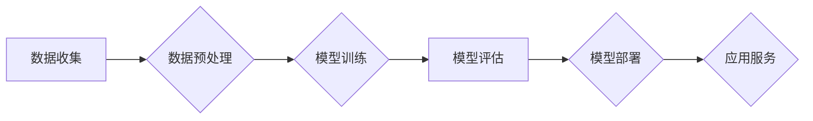

> 大模型、深度学习、Transformer、自然语言处理、计算机视觉、生成式AI、工业革命

## 1. 背景介绍

人工智能（AI）正以惊人的速度发展，其核心驱动力之一是大模型的涌现。大模型是指参数规模庞大、训练数据海量的人工智能模型，其强大的学习能力和泛化能力正在深刻地改变着我们生活的方方面面。从语音识别、机器翻译到图像生成、文本创作，大模型正在展现出无与伦比的潜力，并逐渐成为新一代人工智能技术的基石。

近年来，深度学习技术的突破，特别是Transformer架构的提出，为大模型的训练和应用提供了强有力的技术支撑。Transformer模型能够有效地捕捉长距离依赖关系，并具有并行训练的优势，这使得大模型的规模和能力得到了指数级的提升。

## 2. 核心概念与联系

大模型的核心概念包括：

* **模型规模:** 指模型参数的数量，通常以亿或十亿计。
* **训练数据:** 大模型的训练需要海量的数据，数据质量和规模直接影响模型的性能。
* **深度学习:** 大模型主要基于深度学习算法，例如Transformer、BERT等。
* **泛化能力:** 指模型在未见过的数据上也能表现出良好性能的能力。

大模型的训练和应用流程可以概括为以下步骤：



## 3. 核心算法原理 & 具体操作步骤

### 3.1  算法原理概述

Transformer模型是目前大模型训练中主流的架构，其核心思想是利用注意力机制来捕捉文本序列中的长距离依赖关系。注意力机制可以赋予不同词语不同的权重，从而更好地理解上下文信息。

### 3.2  算法步骤详解

Transformer模型的训练过程主要包括以下步骤：

1. **词嵌入:** 将每个词语映射到一个低维向量空间中，以便模型能够理解词语的语义信息。
2. **多头注意力:** 利用多个注意力头来捕捉不同类型的上下文信息，并将其融合在一起。
3. **前馈神经网络:** 对每个词语的嵌入向量进行非线性变换，进一步提取语义特征。
4. **位置编码:** 为每个词语添加位置信息，以便模型能够理解词语在句子中的顺序关系。
5. **解码器:** 利用编码器输出的上下文信息，生成目标序列。

### 3.3  算法优缺点

**优点:**

* 能够有效地捕捉长距离依赖关系。
* 并行训练效率高。
* 泛化能力强。

**缺点:**

* 训练成本高，需要大量的计算资源和数据。
* 模型规模庞大，部署成本高。

### 3.4  算法应用领域

Transformer模型在自然语言处理领域有着广泛的应用，例如：

* 机器翻译
* 文本摘要
* 问答系统
* 情感分析
* 代码生成

## 4. 数学模型和公式 & 详细讲解 & 举例说明

### 4.1  数学模型构建

Transformer模型的核心是注意力机制，其数学模型可以表示为：

$$
Attention(Q, K, V) = softmax(\frac{QK^T}{\sqrt{d_k}})V
$$

其中：

* $Q$：查询矩阵
* $K$：键矩阵
* $V$：值矩阵
* $d_k$：键向量的维度
* $softmax$：softmax函数

### 4.2  公式推导过程

注意力机制的目的是计算每个词语与其他词语之间的相关性，并根据相关性赋予每个词语不同的权重。

公式推导过程如下：

1. 计算查询矩阵 $Q$ 与键矩阵 $K$ 的点积，并进行归一化处理。
2. 应用 softmax 函数将点积结果转换为概率分布。
3. 将概率分布与值矩阵 $V$ 相乘，得到每个词语的加权和，即注意力输出。

### 4.3  案例分析与讲解

例如，在机器翻译任务中，查询矩阵 $Q$ 包含源语言的词嵌入向量，键矩阵 $K$ 包含目标语言的词嵌入向量，值矩阵 $V$ 也包含目标语言的词嵌入向量。

通过注意力机制，模型可以学习到源语言每个词语与目标语言每个词语之间的相关性，并根据相关性选择合适的目标语言词语进行翻译。

## 5. 项目实践：代码实例和详细解释说明

### 5.1  开发环境搭建

* Python 3.7+
* PyTorch 1.7+
* CUDA 10.2+

### 5.2  源代码详细实现

```python
import torch
import torch.nn as nn

class Transformer(nn.Module):
    def __init__(self, vocab_size, embedding_dim, num_heads, num_layers):
        super(Transformer, self).__init__()
        self.embedding = nn.Embedding(vocab_size, embedding_dim)
        self.transformer_layers = nn.ModuleList([
            nn.TransformerEncoderLayer(embedding_dim, num_heads)
            for _ in range(num_layers)
        ])
        self.linear = nn.Linear(embedding_dim, vocab_size)

    def forward(self, x):
        x = self.embedding(x)
        for layer in self.transformer_layers:
            x = layer(x)
        x = self.linear(x)
        return x
```

### 5.3  代码解读与分析

* `__init__` 方法初始化模型参数，包括词嵌入层、Transformer编码器层和线性输出层。
* `forward` 方法定义模型的正向传播过程，将输入序列经过词嵌入层、Transformer编码器层和线性输出层，最终得到输出序列。

### 5.4  运行结果展示

训练完成后，可以使用模型对新的文本序列进行预测，例如机器翻译、文本摘要等任务。

## 6. 实际应用场景

大模型在各个领域都有着广泛的应用，例如：

* **自然语言处理:** 机器翻译、文本摘要、问答系统、情感分析、代码生成等。
* **计算机视觉:** 图像识别、物体检测、图像生成、视频分析等。
* **语音识别:** 语音转文本、语音合成等。
* **推荐系统:** 商品推荐、内容推荐等。

### 6.4  未来应用展望

随着大模型技术的不断发展，其应用场景将更加广泛，例如：

* **个性化教育:** 根据学生的学习情况提供个性化的学习方案。
* **医疗诊断:** 辅助医生进行疾病诊断和治疗方案制定。
* **科学研究:** 加速科学研究的进程，例如药物研发、材料科学等。

## 7. 工具和资源推荐

### 7.1  学习资源推荐

* **书籍:**
    * 《深度学习》
    * 《Transformer模型详解》
* **在线课程:**
    * Coursera: 深度学习
    * Udacity: 自然语言处理

### 7.2  开发工具推荐

* **PyTorch:** 深度学习框架
* **TensorFlow:** 深度学习框架
* **HuggingFace:** 大模型库

### 7.3  相关论文推荐

* 《Attention Is All You Need》
* 《BERT: Pre-training of Deep Bidirectional Transformers for Language Understanding》
* 《GPT-3: Language Models are Few-Shot Learners》

## 8. 总结：未来发展趋势与挑战

### 8.1  研究成果总结

大模型技术取得了显著的进展，在自然语言处理、计算机视觉等领域取得了突破性成果。

### 8.2  未来发展趋势

* 模型规模的进一步扩大
* 训练效率的提升
* 多模态大模型的开发
* 联邦学习和大模型的结合

### 8.3  面临的挑战

* 训练成本高
* 数据安全和隐私问题
* 模型解释性和可控性问题

### 8.4  研究展望

未来，大模型技术将继续发展，并应用于更多领域，为人类社会带来更多福祉。

## 9. 附录：常见问题与解答

* **什么是大模型？**

大模型是指参数规模庞大、训练数据海量的人工智能模型。

* **大模型的训练需要哪些资源？**

大模型的训练需要大量的计算资源、存储资源和数据资源。

* **大模型有哪些应用场景？**

大模型在自然语言处理、计算机视觉、语音识别等领域都有着广泛的应用。

作者：禅与计算机程序设计艺术 / Zen and the Art of Computer Programming


<end_of_turn>