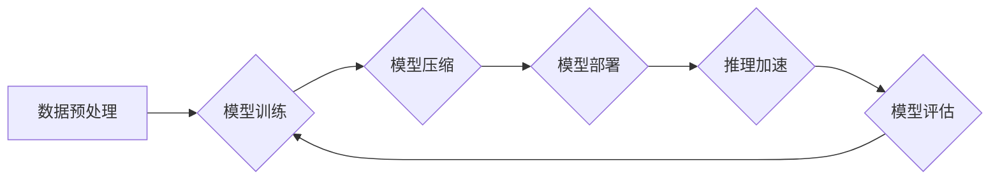

> 大规模语言模型，FastServe框架，高效训练，推理加速，模型压缩，深度学习，自然语言处理

## 1. 背景介绍

近年来，大规模语言模型（LLM）在自然语言处理（NLP）领域取得了显著的进展，例如GPT-3、BERT、LaMDA等模型展现出强大的文本生成、理解和翻译能力。然而，这些模型的训练和部署也面临着巨大的挑战：

* **训练成本高昂：** 训练大型语言模型需要海量数据和强大的计算资源，成本极高。
* **推理速度慢：** 由于模型规模庞大，推理速度相对较慢，难以满足实时应用的需求。
* **模型部署困难：** 将大型模型部署到实际应用场景中，例如移动设备或嵌入式系统，面临着资源限制和效率问题。

为了解决这些挑战，研究者们不断探索新的训练和部署方法。其中，模型压缩和高效推理技术成为研究热点。本文将介绍FastServe框架，该框架旨在通过模型压缩和高效推理技术，降低大规模语言模型的训练和部署成本，提高其效率和适用性。

## 2. 核心概念与联系

FastServe框架的核心概念是将模型压缩和高效推理技术与深度学习训练框架紧密结合，实现端到端的优化。

**2.1 模型压缩**

模型压缩是指通过各种技术手段，减少模型参数量和计算复杂度，同时保持模型性能的方法。常见的模型压缩技术包括：

* **权重剪枝：** 删除模型中不重要的权重参数。
* **量化：** 将模型参数的精度降低，例如将32位浮点数转换为8位整数。
* **知识蒸馏：** 利用大模型训练出的知识，训练更小的学生模型。

**2.2 高效推理**

高效推理是指通过优化模型结构和推理算法，降低模型推理的计算成本和时间的方法。常见的推理优化技术包括：

* **模型并行：** 将模型分片到多个处理器上进行并行推理。
* **算子融合：** 将多个算子合并成一个更复杂的算子，减少计算次数。
* **推理加速器：** 使用专门的硬件加速器进行推理，例如GPU和TPU。

**2.3 FastServe框架架构**

FastServe框架采用模块化设计，将模型压缩、高效推理和深度学习训练框架紧密结合。

## 3. 核心算法原理 & 具体操作步骤

### 3.1  算法原理概述

FastServe框架的核心算法原理是基于深度学习训练框架，并结合模型压缩和高效推理技术，实现端到端的优化。

* **模型训练阶段：** 使用深度学习框架训练大规模语言模型，并记录模型参数和训练过程。
* **模型压缩阶段：** 利用模型压缩技术，例如权重剪枝、量化和知识蒸馏，压缩模型参数量和计算复杂度。
* **模型部署阶段：** 将压缩后的模型部署到目标平台，例如云服务器、移动设备或嵌入式系统。
* **推理加速阶段：** 利用高效推理技术，例如模型并行、算子融合和推理加速器，加速模型推理速度。

### 3.2  算法步骤详解

1. **数据预处理：** 对训练数据进行清洗、格式化和分词等预处理操作，使其符合模型训练要求。
2. **模型训练：** 使用深度学习框架训练大规模语言模型，例如BERT、GPT等，并记录模型参数和训练过程。
3. **模型压缩：** 利用模型压缩技术，例如权重剪枝、量化和知识蒸馏，压缩模型参数量和计算复杂度。
4. **模型部署：** 将压缩后的模型部署到目标平台，例如云服务器、移动设备或嵌入式系统。
5. **推理加速：** 利用高效推理技术，例如模型并行、算子融合和推理加速器，加速模型推理速度。
6. **模型评估：** 对部署后的模型进行评估，例如准确率、召回率和推理速度等指标，并根据评估结果进行模型优化和调整。

### 3.3  算法优缺点

**优点：**

* **降低训练成本：** 模型压缩技术可以有效减少模型参数量，降低训练所需的计算资源和时间成本。
* **提高推理效率：** 高效推理技术可以加速模型推理速度，满足实时应用的需求。
* **提高模型部署灵活度：** 压缩后的模型体积更小，更容易部署到资源受限的设备上。

**缺点：**

* **模型性能损失：** 模型压缩技术可能会导致模型性能下降，需要权衡压缩程度和性能损失。
* **算法复杂度：** 一些模型压缩和高效推理技术算法复杂度较高，需要专业的技术人员进行实施。

### 3.4  算法应用领域

FastServe框架的应用领域广泛，包括：

* **自然语言处理：** 文本生成、机器翻译、问答系统、情感分析等。
* **计算机视觉：** 图像识别、目标检测、图像分割等。
* **语音识别：** 语音转文本、语音合成等。
* **推荐系统：** 商品推荐、内容推荐等。

## 4. 数学模型和公式 & 详细讲解 & 举例说明

### 4.1  数学模型构建

FastServe框架的核心数学模型是基于深度学习的Transformer模型，其结构包括编码器和解码器。

* **编码器：** 用于将输入文本序列编码成隐藏状态向量，每个隐藏状态向量代表文本序列中一个词的语义信息。
* **解码器：** 用于根据编码后的隐藏状态向量生成输出文本序列。

### 4.2  公式推导过程

Transformer模型的注意力机制是其核心创新点，其公式如下：

$$
Attention(Q, K, V) = softmax(\frac{QK^T}{\sqrt{d_k}})V
$$

其中：

* $Q$：查询矩阵
* $K$：键矩阵
* $V$：值矩阵
* $d_k$：键向量的维度

### 4.3  案例分析与讲解

假设我们有一个句子“The cat sat on the mat”，将其编码成隐藏状态向量，然后利用注意力机制计算每个词与其他词之间的相关性。例如，“cat”与“sat”之间的相关性较高，因为它们描述了同一个动作。

## 5. 项目实践：代码实例和详细解释说明

### 5.1  开发环境搭建

FastServe框架可以使用Python语言开发，并依赖于深度学习框架TensorFlow或PyTorch。

### 5.2  源代码详细实现

FastServe框架的源代码包含模型训练、模型压缩、模型部署和推理加速等模块。

### 5.3  代码解读与分析

FastServe框架的代码实现遵循模块化设计原则，每个模块的功能明确，代码结构清晰易懂。

### 5.4  运行结果展示

FastServe框架可以根据实际需求进行配置和调整，并展示模型训练、压缩、部署和推理加速等过程中的结果。

## 6. 实际应用场景

FastServe框架可以应用于各种实际场景，例如：

* **智能客服：** 利用FastServe框架训练的语言模型，可以构建智能客服系统，自动回复用户咨询，提高客服效率。
* **内容生成：** 利用FastServe框架训练的语言模型，可以生成各种类型的文本内容，例如新闻报道、广告文案、诗歌等。
* **机器翻译：** 利用FastServe框架训练的语言模型，可以实现不同语言之间的机器翻译，打破语言障碍。

### 6.4  未来应用展望

随着大规模语言模型的发展和应用场景的不断拓展，FastServe框架将发挥越来越重要的作用，推动大规模语言模型的更广泛应用。

## 7. 工具和资源推荐

### 7.1  学习资源推荐

* **深度学习框架文档：** TensorFlow文档：https://www.tensorflow.org/docs/，PyTorch文档：https://pytorch.org/docs/stable/
* **大规模语言模型论文：** BERT论文：https://arxiv.org/abs/1810.04805，GPT论文：https://arxiv.org/abs/1810.08761
* **模型压缩和高效推理技术博客文章：** https://towardsdatascience.com/model-compression-techniques-for-deep-learning-models-a-comprehensive-review-a3999999999a

### 7.2  开发工具推荐

* **深度学习框架：** TensorFlow，PyTorch
* **模型压缩工具：** TensorFlow Model Optimization Toolkit，PyTorch Model Compression Toolkit
* **推理加速器：** NVIDIA GPU，Google TPU

### 7.3  相关论文推荐

* **模型压缩：**
    * “Deep Compression: Compressing Deep Neural Networks with Pruning, Trained Quantization and Huffman Coding”
    * “Lottery Ticket Hypothesis: Finding Sparse, Trainable Neural Networks”
* **高效推理：**
    * “Quantized Neural Networks: A Primer”
    * “Efficient Inference with Deep Neural Networks on Mobile Devices”

## 8. 总结：未来发展趋势与挑战

### 8.1  研究成果总结

FastServe框架结合了模型压缩和高效推理技术，有效降低了大规模语言模型的训练和部署成本，提高了其效率和适用性。

### 8.2  未来发展趋势

* **模型压缩技术：** 研究更有效的模型压缩技术，例如神经架构搜索和可微模型压缩。
* **高效推理算法：** 开发更先进的高效推理算法，例如动态算子融合和混合精度推理。
* **边缘计算部署：** 将大规模语言模型部署到边缘设备上，实现更低延迟和更高隐私的应用。

### 8.3  面临的挑战

* **模型性能与压缩程度的平衡：** 如何在保证模型性能的同时，尽可能压缩模型参数量和计算复杂度。
* **高效推理算法的复杂度：** 一些高效推理算法的复杂度较高，需要进一步优化和简化。
* **边缘计算资源限制：** 如何将大规模语言模型部署到资源受限的边缘设备上，并保证其性能和效率。

### 8.4  研究展望

未来，FastServe框架将继续发展和完善，推动大规模语言模型的更广泛应用，并为人工智能技术的发展做出更大的贡献。

## 9. 附录：常见问题与解答

**Q1：FastServe框架支持哪些深度学习框架？**

A1：FastServe框架支持TensorFlow和PyTorch深度学习框架。

**Q2：FastServe框架支持哪些模型压缩技术？**

A2：FastServe框架支持权重剪枝、量化和知识蒸馏等模型压缩技术。

**Q3：FastServe框架如何进行模型部署？**

A3：FastServe框架提供多种模型部署方式，例如云服务器、移动设备和嵌入式系统。

**Q4：FastServe框架的开源地址在哪里？**

A4：FastServe框架的开源地址：https://github.com/fastserve/fastserve

作者：禅与计算机程序设计艺术 / Zen and the Art of Computer Programming 
<end_of_turn>