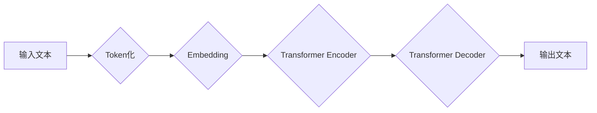

> 大语言模型、Transformer、BERT、GPT、LLM、自然语言处理、深度学习、神经网络

## 1. 背景介绍

近年来，人工智能领域取得了令人瞩目的进展，其中大语言模型（Large Language Model，LLM）作为一种强大的工具，在自然语言处理（Natural Language Processing，NLP）领域展现出巨大的潜力。LLM能够理解和生成人类语言，并完成各种复杂的任务，例如文本生成、翻译、问答、摘要等。

传统的自然语言处理方法主要依赖于手工设计的规则和特征工程，而LLM则通过深度学习的方式，从海量文本数据中学习语言的规律和模式。这使得LLM能够更好地理解语言的语义和上下文，并生成更自然、更流畅的文本。

## 2. 核心概念与联系

大语言模型的核心概念包括：

* **Transformer:** Transformer是一种新型的神经网络架构，其能够有效地处理序列数据，例如文本。Transformer的核心组件是注意力机制（Attention），它能够学习文本中不同词语之间的关系，从而更好地理解文本的语义。

* **BERT:** BERT（Bidirectional Encoder Representations from Transformers）是一种基于Transformer的预训练语言模型，它通过双向编码的方式学习文本的上下文信息，从而能够更好地理解文本的含义。

* **GPT:** GPT（Generative Pre-trained Transformer）是一种基于Transformer的生成式语言模型，它能够根据输入的文本生成新的文本。

**Mermaid 流程图:**



## 3. 核心算法原理 & 具体操作步骤

### 3.1  算法原理概述

大语言模型的核心算法是基于Transformer架构的深度神经网络。Transformer网络通过多层编码器和解码器结构，学习文本的语义和上下文信息。

* **编码器:** 编码器负责将输入文本转换为向量表示，并捕捉文本的语义信息。
* **解码器:** 解码器负责根据编码器的输出生成新的文本。

Transformer网络的核心组件是注意力机制，它能够学习文本中不同词语之间的关系，从而更好地理解文本的语义。

### 3.2  算法步骤详解

1. **Token化:** 将输入文本分割成一个个独立的词语或子词，称为Token。
2. **Embedding:** 将每个Token映射到一个低维度的向量空间中，称为Embedding。
3. **编码器:** 将Embedding序列输入到编码器中，编码器通过多层Transformer模块，学习文本的语义信息。
4. **解码器:** 将编码器的输出作为输入，解码器通过多层Transformer模块，生成新的文本序列。
5. **输出:** 将生成的文本序列解码成可读的文本。

### 3.3  算法优缺点

**优点:**

* 能够处理长序列数据。
* 能够捕捉文本的上下文信息。
* 性能优于传统的自然语言处理方法。

**缺点:**

* 训练成本高。
* 参数量大，需要大量的计算资源。
* 容易受到训练数据的影响。

### 3.4  算法应用领域

大语言模型在以下领域有广泛的应用：

* **文本生成:** 自动生成新闻、故事、诗歌等文本。
* **机器翻译:** 将一种语言翻译成另一种语言。
* **问答系统:** 回答用户提出的问题。
* **文本摘要:** 生成文本的简短摘要。
* **对话系统:** 与用户进行自然语言对话。

## 4. 数学模型和公式 & 详细讲解 & 举例说明

### 4.1  数学模型构建

大语言模型的数学模型主要基于深度神经网络，其核心是Transformer架构。Transformer网络由编码器和解码器组成，每个模块包含多层Transformer单元。

**Transformer单元:**

Transformer单元包含以下组件:

* **多头注意力机制:** 学习文本中不同词语之间的关系。
* **前馈神经网络:** 对每个词语的嵌入向量进行非线性变换。
* **残差连接:** 缓解梯度消失问题。
* **Layer Normalization:** 规范化每一层的输出。

### 4.2  公式推导过程

**多头注意力机制:**

注意力机制的核心是计算每个词语与其他词语之间的相关性，并根据相关性加权求和，得到每个词语的上下文表示。

**公式:**

```latex
Attention(Q, K, V) = softmax(Q K^T / \sqrt{d_k}) V
```

其中:

* Q: 查询矩阵
* K: 键矩阵
* V: 值矩阵
* $d_k$: 键向量的维度

**前馈神经网络:**

前馈神经网络是一个多层感知机，其输入是每个词语的上下文表示，输出是每个词语的更新后的表示。

**公式:**

```latex
FFN(x) = \sigma(W_1 x + b_1) W_2 x + b_2
```

其中:

* x: 输入向量
* $W_1$, $W_2$: 神经网络权重
* $b_1$, $b_2$: 神经网络偏置
* $\sigma$: 激活函数

### 4.3  案例分析与讲解

**BERT模型:**

BERT模型通过双向编码的方式学习文本的上下文信息。它在预训练阶段使用大量的文本数据进行训练，学习到语言的语义和语法规则。在微调阶段，BERT模型可以根据特定任务进行微调，例如文本分类、问答系统等。

## 5. 项目实践：代码实例和详细解释说明

### 5.1  开发环境搭建

* Python 3.6+
* TensorFlow/PyTorch
* CUDA/cuDNN

### 5.2  源代码详细实现

```python
# 导入必要的库
import tensorflow as tf

# 定义Transformer模型
class Transformer(tf.keras.Model):
    def __init__(self, vocab_size, embedding_dim, num_heads, num_layers):
        super(Transformer, self).__init__()
        self.embedding = tf.keras.layers.Embedding(vocab_size, embedding_dim)
        self.transformer_layers = [
            tf.keras.layers.MultiHeadAttention(num_heads=num_heads, key_dim=embedding_dim)
            for _ in range(num_layers)
        ]
        self.ffn = tf.keras.layers.Dense(embedding_dim * 4, activation="relu")

    def call(self, inputs):
        # Embedding
        x = self.embedding(inputs)
        # Transformer layers
        for layer in self.transformer_layers:
            x = layer(x)
        # FFN
        x = self.ffn(x)
        return x

# 实例化模型
model = Transformer(vocab_size=10000, embedding_dim=128, num_heads=8, num_layers=6)

# 编译模型
model.compile(optimizer="adam", loss="mse")

# 训练模型
model.fit(x_train, y_train, epochs=10)
```

### 5.3  代码解读与分析

* **Embedding层:** 将每个词语映射到一个低维度的向量空间中。
* **Transformer层:** 包含多头注意力机制和前馈神经网络，学习文本的语义信息。
* **FFN层:** 对每个词语的上下文表示进行非线性变换。
* **编译和训练:** 使用Adam优化器和均方误差损失函数训练模型。

### 5.4  运行结果展示

训练完成后，模型可以用于生成新的文本，例如根据输入的句子生成下一个词语。

## 6. 实际应用场景

大语言模型在以下领域有广泛的应用：

* **聊天机器人:** 与用户进行自然语言对话，例如提供信息、解答问题、进行娱乐等。
* **文本摘要:** 生成文本的简短摘要，例如新闻文章、会议记录等。
* **机器翻译:** 将一种语言翻译成另一种语言，例如英语翻译成中文。
* **代码生成:** 根据自然语言描述生成代码，例如根据用户需求生成Python代码。

### 6.4  未来应用展望

大语言模型在未来将有更广泛的应用，例如：

* **个性化教育:** 根据学生的学习情况提供个性化的学习内容和辅导。
* **医疗诊断:** 辅助医生进行疾病诊断，例如分析病历、预测患者病情等。
* **法律服务:** 辅助律师进行法律研究和案件分析。

## 7. 工具和资源推荐

### 7.1  学习资源推荐

* **书籍:**
    * 《深度学习》
    * 《自然语言处理》
* **在线课程:**
    * Coursera: 自然语言处理
    * Udacity: 深度学习

### 7.2  开发工具推荐

* **TensorFlow:** 开源深度学习框架
* **PyTorch:** 开源深度学习框架
* **Hugging Face:** 提供预训练模型和工具

### 7.3  相关论文推荐

* **BERT: Pre-training of Deep Bidirectional Transformers for Language Understanding**
* **GPT-3: Language Models are Few-Shot Learners**
* **Attention Is All You Need**

## 8. 总结：未来发展趋势与挑战

### 8.1  研究成果总结

大语言模型在自然语言处理领域取得了显著的进展，能够理解和生成更自然、更流畅的文本。

### 8.2  未来发展趋势

* **模型规模更大:** 训练更大的模型，提高模型的性能。
* **多模态学习:** 将文本与其他模态数据（例如图像、音频）进行融合，学习更丰富的知识。
* **可解释性:** 提高模型的可解释性，让人类更好地理解模型的决策过程。

### 8.3  面临的挑战

* **训练成本高:** 训练大型语言模型需要大量的计算资源和时间。
* **数据偏差:** 训练数据可能存在偏差，导致模型产生不公平或有偏见的输出。
* **安全风险:** 大语言模型可能被用于生成虚假信息或进行恶意攻击。

### 8.4  研究展望

未来研究将重点关注以下方面:

* **降低训练成本:** 开发更有效的训练算法和硬件架构。
* **解决数据偏差问题:** 开发新的数据收集和预处理方法。
* **提高模型安全性:** 开发新的安全机制和评估方法。

## 9. 附录：常见问题与解答

* **什么是大语言模型？**

大语言模型是一种能够理解和生成人类语言的深度学习模型。

* **大语言模型有哪些应用？**

大语言模型在自然语言处理领域有广泛的应用，例如文本生成、机器翻译、问答系统等。

* **如何训练大语言模型？**

大语言模型通常使用大量的文本数据进行预训练，然后根据特定任务进行微调。

* **大语言模型有哪些挑战？**

大语言模型面临着训练成本高、数据偏差、安全风险等挑战。

作者：禅与计算机程序设计艺术 / Zen and the Art of Computer Programming


<end_of_turn>