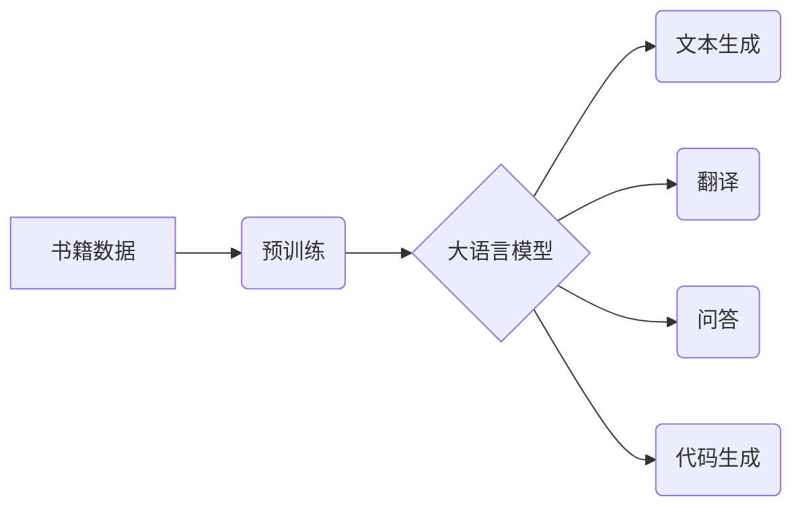

> 大语言模型、Transformer、书籍数据、文本生成、自然语言处理、深度学习

## 1. 背景介绍

大语言模型（Large Language Model，LLM）近年来在自然语言处理（NLP）领域取得了突破性进展，展现出强大的文本生成、翻译、问答和代码生成能力。这些模型通常基于Transformer架构，并通过海量文本数据进行训练，学习到语言的复杂模式和结构。

书籍作为人类文明的重要载体，蕴含着丰富的知识和文化信息。利用书籍数据训练大语言模型，可以帮助模型更好地理解和生成人类语言，并赋予其更深层的语义理解能力。

## 2. 核心概念与联系

**2.1  大语言模型 (LLM)**

大语言模型是指参数量巨大、训练数据海量的人工智能模型，能够理解和生成人类语言。它们通常基于Transformer架构，并通过大量的文本数据进行预训练，学习到语言的语法、语义和上下文关系。

**2.2  Transformer 架构**

Transformer是一种专门用于处理序列数据的深度学习架构，其核心是注意力机制（Attention）。注意力机制允许模型关注输入序列中与当前任务相关的部分，从而更好地理解上下文信息。

**2.3  书籍数据**

书籍数据是指从书籍中提取的文本信息，包括小说、散文、诗歌、学术论文等各种类型。书籍数据涵盖了广泛的主题和写作风格，可以为大语言模型提供丰富的语料库。

**2.4  关系图**



## 3. 核心算法原理 & 具体操作步骤

**3.1  算法原理概述**

大语言模型的核心算法是Transformer架构，其主要包括以下几个模块：

* **编码器 (Encoder):** 用于将输入文本序列编码成向量表示。
* **解码器 (Decoder):** 用于根据编码后的向量表示生成输出文本序列。
* **注意力机制:** 用于捕捉输入序列中不同词之间的关系。

**3.2  算法步骤详解**

1. **文本预处理:** 将书籍数据进行清洗、分词、词嵌入等预处理操作，将文本转换为模型可以理解的格式。
2. **编码器训练:** 使用编码器模块将预处理后的文本序列编码成向量表示，并通过反向传播算法进行训练，学习到文本的语义和上下文关系。
3. **解码器训练:** 使用解码器模块根据编码后的向量表示生成输出文本序列，并通过交叉熵损失函数进行训练，学习到文本生成能力。
4. **模型评估:** 使用测试数据集评估模型的性能，例如困惑度、BLEU分数等。

**3.3  算法优缺点**

**优点:**

* 能够学习到语言的复杂模式和结构。
* 具有强大的文本生成、翻译、问答和代码生成能力。
* 可以应用于各种NLP任务。

**缺点:**

* 训练成本高，需要大量的计算资源和数据。
* 容易受到训练数据偏差的影响。
* 缺乏对真实世界知识的理解。

**3.4  算法应用领域**

* 文本生成：小说、诗歌、剧本等。
* 翻译：将一种语言翻译成另一种语言。
* 问答：回答用户提出的问题。
* 代码生成：自动生成代码。
* 聊天机器人：与用户进行自然语言对话。

## 4. 数学模型和公式 & 详细讲解 & 举例说明

**4.1  数学模型构建**

大语言模型通常使用神经网络模型，其中每个神经元都接收来自其他神经元的输入，并通过激活函数进行处理。模型的输出是每个词的概率分布，表示该词在当前上下文下出现的可能性。

**4.2  公式推导过程**

Transformer架构的核心是注意力机制，其计算公式如下：

$$
Attention(Q, K, V) = softmax(\frac{QK^T}{\sqrt{d_k}})V
$$

其中：

* $Q$：查询矩阵
* $K$：键矩阵
* $V$：值矩阵
* $d_k$：键向量的维度
* $softmax$：softmax函数

**4.3  案例分析与讲解**

假设我们有一个句子“我爱学习编程”，我们要计算“学习”这个词的注意力权重。

* $Q$：查询矩阵为“学习”对应的词向量。
* $K$：键矩阵为所有词对应的词向量。
* $V$：值矩阵为所有词对应的词向量。

通过计算$QK^T$，我们可以得到每个词与“学习”之间的相似度。然后使用softmax函数将这些相似度归一化，得到每个词的注意力权重。

## 5. 项目实践：代码实例和详细解释说明

**5.1  开发环境搭建**

* Python 3.7+
* PyTorch 1.7+
* CUDA 10.2+

**5.2  源代码详细实现**

```python
import torch
import torch.nn as nn

class Transformer(nn.Module):
    def __init__(self, vocab_size, embedding_dim, num_heads, num_layers):
        super(Transformer, self).__init__()
        self.embedding = nn.Embedding(vocab_size, embedding_dim)
        self.transformer_layers = nn.ModuleList([
            nn.TransformerEncoderLayer(embedding_dim, num_heads)
            for _ in range(num_layers)
        ])
        self.linear = nn.Linear(embedding_dim, vocab_size)

    def forward(self, x):
        x = self.embedding(x)
        for layer in self.transformer_layers:
            x = layer(x)
        x = self.linear(x)
        return x
```

**5.3  代码解读与分析**

* `__init__`方法：初始化模型参数，包括词嵌入层、Transformer编码器层和线性输出层。
* `forward`方法：定义模型的正向传播过程，将输入序列编码成输出序列。

**5.4  运行结果展示**

使用预训练好的Transformer模型，可以进行文本生成、翻译、问答等任务。

## 6. 实际应用场景

**6.1  文本生成**

* 自动生成小说、诗歌、剧本等创意内容。
* 生成营销文案、产品描述等商业文本。
* 自动生成代码注释、文档等技术文本。

**6.2  翻译**

* 将文本从一种语言翻译成另一种语言。
* 支持多种语言的翻译，例如中英、英日、法德等。
* 提高翻译的准确性和流畅度。

**6.3  问答**

* 回答用户提出的问题，例如事实问题、概念问题、推理问题等。
* 提供更准确、更全面的答案。
* 帮助用户快速获取信息。

**6.4  未来应用展望**

* 更智能的聊天机器人，能够进行更自然、更深入的对话。
* 个性化的教育系统，能够根据学生的学习进度和需求提供定制化的学习内容。
* 更强大的代码生成工具，能够帮助程序员更高效地编写代码。

## 7. 工具和资源推荐

**7.1  学习资源推荐**

* **书籍:**
    * 《深度学习》
    * 《自然语言处理》
    * 《Transformer模型详解》
* **在线课程:**
    * Coursera: 深度学习
    * Udacity: 自然语言处理
    * fast.ai: 深度学习

**7.2  开发工具推荐**

* **PyTorch:** 深度学习框架
* **TensorFlow:** 深度学习框架
* **HuggingFace:** 预训练模型库

**7.3  相关论文推荐**

* 《Attention Is All You Need》
* 《BERT: Pre-training of Deep Bidirectional Transformers for Language Understanding》
* 《GPT-3: Language Models are Few-Shot Learners》

## 8. 总结：未来发展趋势与挑战

**8.1  研究成果总结**

近年来，大语言模型取得了显著进展，在文本生成、翻译、问答等任务上表现出色。

**8.2  未来发展趋势**

* 模型规模更大，参数量更多。
* 模型能力更强，能够理解和生成更复杂的文本。
* 模型应用更广泛，覆盖更多领域。

**8.3  面临的挑战**

* 训练成本高，需要大量的计算资源和数据。
* 模型容易受到训练数据偏差的影响。
* 缺乏对真实世界知识的理解。

**8.4  研究展望**

* 研究更有效的训练方法，降低训练成本。
* 研究如何缓解模型偏差问题。
* 研究如何赋予模型更强的知识理解能力。

## 9. 附录：常见问题与解答

**9.1  Q: 如何选择合适的书籍数据？**

**A:** 选择书籍数据时，应考虑以下因素：

* 数据规模：数据量越大，模型训练效果越好。
* 数据质量：数据应准确、完整、无误。
* 数据多样性：数据应涵盖不同的主题和写作风格。

**9.2  Q: 如何评估大语言模型的性能？**

**A:** 大语言模型的性能可以评估以下指标：

* 困惑度：衡量模型预测下一个词的准确性。
* BLEU分数：衡量机器翻译的准确性。
* ROUGE分数：衡量文本摘要的准确性。

**9.3  Q: 大语言模型有哪些伦理问题？**

**A:** 大语言模型存在以下伦理问题：

* 偏见和歧视：模型可能学习到训练数据中的偏见和歧视。
* 虚假信息生成：模型可能生成虚假信息，误导用户。
* 隐私泄露：模型可能泄露用户隐私信息。


作者：禅与计算机程序设计艺术 / Zen and the Art of Computer Programming 
<end_of_turn>