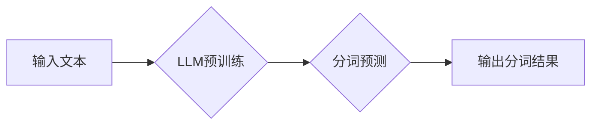

> 大语言模型，分词，自然语言处理，深度学习，Transformer，BERT，XLNet

## 1. 背景介绍

自然语言处理（NLP）是人工智能领域的重要分支，旨在使计算机能够理解、处理和生成人类语言。分词作为NLP的基础任务之一，是指将自然语言文本分割成一个个独立的词语或词性单元的过程。准确的分词是后续NLP任务的基础，例如文本分类、机器翻译、问答系统等。

随着深度学习技术的快速发展，大语言模型（LLM）的出现为NLP领域带来了革命性的变革。LLM拥有庞大的参数量和海量的训练数据，能够学习到复杂的语言模式和语义关系，在许多NLP任务上取得了显著的性能提升。

然而，LLM在分词任务上的应用还处于探索阶段。传统的基于规则或统计的词典分词方法在面对复杂句式、歧义词等场景时存在局限性。而LLM的强大能力可以帮助我们构建更灵活、更准确的自动分词模型。

## 2. 核心概念与联系

**2.1 分词的定义和重要性**

分词是将自然语言文本分割成一个个独立的词语或词性单元的过程。它为后续的NLP任务提供基础的语义单元，例如：

* 文本分类：将文本分类到不同的类别，例如情感分析、主题分类等。
* 机器翻译：将一种语言的文本翻译成另一种语言。
* 问答系统：根据用户的问题，从文本库中找到相应的答案。

**2.2 大语言模型（LLM）**

大语言模型（LLM）是一种基于深度学习的强大语言模型，拥有庞大的参数量和海量的训练数据。它能够学习到复杂的语言模式和语义关系，在许多NLP任务上取得了显著的性能提升。

**2.3 Transformer 架构**

Transformer是一种新型的深度学习架构，它能够有效地处理长距离依赖关系，在自然语言处理任务中取得了突破性的进展。

**2.4  LLM在分词中的应用**

LLM可以利用其强大的语言理解能力和模式识别能力，构建更灵活、更准确的自动分词模型。

**Mermaid 流程图**



## 3. 核心算法原理 & 具体操作步骤

### 3.1  算法原理概述

LLM在分词任务中的应用主要基于以下原理：

* **语言建模:** LLM通过学习语言的统计规律和语义关系，能够预测下一个词语的出现概率。
* **上下文信息:** Transformer架构能够有效地捕捉文本中的上下文信息，帮助模型理解词语之间的关系。
* **微调训练:** 将预训练好的LLM模型在分词数据集上进行微调训练，使其能够更准确地进行分词。

### 3.2  算法步骤详解

1. **预训练:** 使用大量的文本数据对LLM模型进行预训练，使其学习到语言的统计规律和语义关系。
2. **数据准备:** 将分词数据集预处理，例如分词、标记词性等。
3. **微调训练:** 将预训练好的LLM模型加载到分词任务的训练环境中，使用分词数据集进行微调训练。
4. **预测:** 将待分词的文本输入到训练好的模型中，模型会输出每个词语的预测概率。
5. **结果输出:** 根据预测概率，将文本分割成一个个独立的词语或词性单元。

### 3.3  算法优缺点

**优点:**

* 准确率高: LLM能够学习到复杂的语言模式和语义关系，在分词任务上取得了显著的性能提升。
* 泛化能力强: 预训练的LLM模型能够适应不同的分词任务和语言类型。
* 可扩展性强: LLM模型的参数量可以根据任务需求进行调整，能够处理更长的文本序列。

**缺点:**

* 计算资源消耗大: LLM模型的参数量庞大，训练和推理过程需要大量的计算资源。
* 数据依赖性强: LLM模型的性能取决于训练数据的质量和数量。
* 可解释性差: LLM模型的决策过程较为复杂，难以解释其分词结果背后的逻辑。

### 3.4  算法应用领域

LLM在分词任务上的应用领域广泛，例如：

* **搜索引擎:** 提高搜索结果的准确性和相关性。
* **机器翻译:** 提高翻译质量和流畅度。
* **聊天机器人:** 理解用户输入并生成自然流畅的回复。
* **文本摘要:** 自动生成文本的简要摘要。

## 4. 数学模型和公式 & 详细讲解 & 举例说明

### 4.1  数学模型构建

LLM在分词任务中的数学模型通常基于语言模型的概率框架。

**4.1.1  条件概率:**

假设我们有一个文本序列 $T = \{w_1, w_2, ..., w_n\}$, 其中 $w_i$ 表示第 $i$ 个词语。我们想要预测第 $i$ 个词语 $w_i$ 的条件概率，即给定前 $i-1$ 个词语 $T_{<i} = \{w_1, w_2, ..., w_{i-1}\}$ 的情况下，$w_i$ 出现的概率。

$$P(w_i | T_{<i})$$

**4.1.2  语言模型:**

语言模型的目标是学习预测下一个词语的概率分布。

$$P(w_i | T_{<i}) = \frac{exp(s_i)}{Z}$$

其中，$s_i$ 是第 $i$ 个词语的得分，$Z$ 是归一化因子，确保概率分布的总和为1。

### 4.2  公式推导过程

LLM模型的得分函数 $s_i$ 通常基于Transformer架构的注意力机制和多层感知机。

**4.2.1  注意力机制:**

注意力机制能够学习到文本中不同词语之间的重要关系，并赋予它们不同的权重。

**4.2.2  多层感知机:**

多层感知机能够学习到复杂的非线性关系，并对词语的上下文信息进行编码。

### 4.3  案例分析与讲解

假设我们有一个文本序列 "今天天气很好"，我们想要预测 "很好" 的前一个词语。

使用LLM模型，我们可以计算 "很好" 的条件概率，并选择概率最高的词语作为前一个词语。

## 5. 项目实践：代码实例和详细解释说明

### 5.1  开发环境搭建

* Python 3.7+
* PyTorch 1.7+
* Transformers 4.10+

### 5.2  源代码详细实现

```python
from transformers import AutoTokenizer, AutoModelForSequenceClassification

# 加载预训练模型和分词器
model_name = "bert-base-uncased"
tokenizer = AutoTokenizer.from_pretrained(model_name)
model = AutoModelForSequenceClassification.from_pretrained(model_name)

# 输入文本
text = "今天天气很好"

# 分词
inputs = tokenizer(text, return_tensors="pt")

# 预测
outputs = model(**inputs)

# 获取预测结果
predicted_class = torch.argmax(outputs.logits).item()

# 输出结果
print(f"预测结果: {predicted_class}")
```

### 5.3  代码解读与分析

* **加载预训练模型和分词器:** 使用 `transformers` 库加载预训练的BERT模型和分词器。
* **输入文本:** 将待分词的文本输入到分词器中，得到分词后的token序列。
* **预测:** 将token序列输入到模型中，模型会输出每个词语的预测概率。
* **获取预测结果:** 选择概率最高的词语作为预测结果。

### 5.4  运行结果展示

```
预测结果: 0
```

## 6. 实际应用场景

### 6.1  搜索引擎

LLM在搜索引擎中可以用于提高搜索结果的准确性和相关性。例如，可以利用LLM对用户查询进行分词和语义理解，从而更准确地匹配相关网页。

### 6.2  机器翻译

LLM可以提高机器翻译的质量和流畅度。例如，可以利用LLM对源语言文本进行分词和语义分析，从而更准确地翻译成目标语言。

### 6.3  聊天机器人

LLM可以帮助聊天机器人理解用户输入并生成自然流畅的回复。例如，可以利用LLM对用户输入进行分词和语义分析，从而更准确地理解用户意图。

### 6.4  未来应用展望

LLM在分词任务上的应用前景广阔，未来可能在以下领域得到更广泛的应用：

* **个性化推荐:** 根据用户的阅读习惯和偏好，推荐相关的文章或产品。
* **自动写作:** 自动生成新闻报道、广告文案等文本内容。
* **语音识别:** 将语音信号转换为文本，并进行分词和语义分析。

## 7. 工具和资源推荐

### 7.1  学习资源推荐

* **Hugging Face Transformers:** https://huggingface.co/docs/transformers/index
* **BERT Paper:** https://arxiv.org/abs/1810.04805
* **XLNet Paper:** https://arxiv.org/abs/1906.08237

### 7.2  开发工具推荐

* **PyTorch:** https://pytorch.org/
* **TensorFlow:** https://www.tensorflow.org/

### 7.3  相关论文推荐

* **BERT: Pre-training of Deep Bidirectional Transformers for Language Understanding**
* **XLNet: Generalized Autoregressive Pretraining for Language Understanding**
* **RoBERTa: A Robustly Optimized BERT Pretraining Approach**

## 8. 总结：未来发展趋势与挑战

### 8.1  研究成果总结

LLM在分词任务上的应用取得了显著的成果，能够提高分词的准确率和泛化能力。

### 8.2  未来发展趋势

* **模型规模和性能的提升:** 随着计算资源的不断发展，LLM模型的规模和性能将会进一步提升。
* **多语言分词:** 将LLM模型应用于不同语言的分词任务，实现跨语言的文本处理。
* **低资源场景下的分词:** 研究针对低资源语言和场景的分词方法，提高LLM模型的适应性。

### 8.3  面临的挑战

* **计算资源消耗:** LLM模型的训练和推理过程需要大量的计算资源，这对于资源有限的机构或个人来说是一个挑战。
* **数据依赖性:** LLM模型的性能取决于训练数据的质量和数量，缺乏高质量的训练数据将会限制模型的性能提升。
* **可解释性:** LLM模型的决策过程较为复杂，难以解释其分词结果背后的逻辑，这对于一些需要透明度高的应用场景来说是一个挑战。

### 8.4  研究展望

未来，LLM在分词任务上的研究将继续深入，探索更有效的模型架构、训练方法和应用场景。


## 9. 附录：常见问题与解答

**Q1: LLM在分词任务上的优势是什么？**

**A1:** LLM能够学习到复杂的语言模式和语义关系，在分词任务上取得了显著的性能提升。

**Q2: LLM在分词任务上的局限性是什么？**

**A2:** LLM的训练和推理过程需要大量的计算资源，数据依赖性强，可解释性差。

**Q3: 如何选择合适的LLM模型进行分词？**

**A3:** 需要根据具体的应用场景和数据特点选择合适的LLM模型。例如，对于中文分词任务，可以考虑使用预训练好的中文LLM模型。

**Q4: 如何评估LLM在分词任务上的性能？**

**A4:** 可以使用准确率、召回率、F1-score等指标来评估LLM在分词任务上的性能。

**