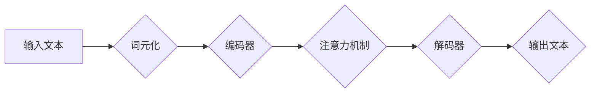

> 大语言模型、Transformer、词元、top-k采样、生成模型、自然语言处理

## 1. 背景介绍

近年来，深度学习在自然语言处理（NLP）领域取得了突破性进展，其中大语言模型（LLM）作为其重要代表，展现出强大的文本生成、理解和翻译能力。LLM能够学习和理解人类语言的复杂结构和语义，并生成流畅、连贯的文本。

传统的语言模型主要基于循环神经网络（RNN）或其变体，但RNN在处理长文本序列时存在梯度消失和训练效率低的问题。Transformer模型的出现彻底改变了NLP领域，其基于注意力机制，能够有效捕捉长距离依赖关系，并实现并行训练，显著提升了模型的训练效率和性能。

## 2. 核心概念与联系

大语言模型的核心在于学习语言的统计规律和语义关系，并将其应用于各种自然语言处理任务。

**2.1  词元化**

将文本分解成更小的单位，称为词元。词元可以是单个字符、子词或词语，不同的词元化方法会影响模型的性能。

**2.2  Transformer模型**

Transformer模型的核心是注意力机制，它能够学习文本中不同词语之间的关系，并赋予每个词语不同的权重。Transformer模型由编码器和解码器组成，编码器负责将输入文本编码成语义表示，解码器则根据编码结果生成输出文本。

**2.3  top-k采样**

在文本生成过程中，模型需要预测下一个词语。top-k采样是一种常用的策略，它只考虑概率最高的k个词语，并随机选择其中一个作为下一个词语。

**Mermaid 流程图**



## 3. 核心算法原理 & 具体操作步骤

### 3.1  算法原理概述

大语言模型的训练基于监督学习，其目标是学习输入文本和输出文本之间的映射关系。训练过程通常包括以下步骤：

1.  **数据预处理:** 将文本数据清洗、格式化并进行词元化。
2.  **模型训练:** 使用训练数据训练Transformer模型，优化模型参数以最小化预测误差。
3.  **模型评估:** 使用测试数据评估模型的性能，例如困惑度（perplexity）和BLEU分数。
4.  **模型部署:** 将训练好的模型部署到实际应用场景中。

### 3.2  算法步骤详解

1.  **词元化:** 将输入文本分解成一系列词元，例如单词、子词或字符。
2.  **嵌入层:** 将每个词元映射到一个低维向量空间，称为词向量。
3.  **编码器:** 使用多层Transformer模块对输入文本进行编码，学习文本的语义表示。
4.  **解码器:** 根据编码结果生成输出文本，使用注意力机制和循环神经网络（RNN）或Transformer模块。
5.  **输出层:** 将解码器的输出映射到词汇表，预测下一个词语。

### 3.3  算法优缺点

**优点:**

*   能够学习长距离依赖关系，处理长文本序列。
*   并行训练效率高，训练速度快。
*   性能优异，在各种NLP任务中取得了突破性进展。

**缺点:**

*   训练成本高，需要大量数据和计算资源。
*   模型参数量大，部署成本高。
*   存在潜在的偏差和公平性问题。

### 3.4  算法应用领域

*   文本生成：小说、诗歌、对话等。
*   机器翻译：将一种语言翻译成另一种语言。
*   文本摘要：提取文本的关键信息。
*   问答系统：回答用户提出的问题。
*   代码生成：自动生成代码。

## 4. 数学模型和公式 & 详细讲解 & 举例说明

### 4.1  数学模型构建

大语言模型通常使用Transformer模型，其核心是注意力机制。注意力机制可以学习文本中不同词语之间的关系，并赋予每个词语不同的权重。

### 4.2  公式推导过程

**注意力机制公式:**

$$
\text{Attention}(Q, K, V) = \text{softmax}\left(\frac{Q K^T}{\sqrt{d_k}}\right) V
$$

其中：

*   $Q$：查询矩阵
*   $K$：键矩阵
*   $V$：值矩阵
*   $d_k$：键向量的维度
*   $\text{softmax}$：softmax函数

**Transformer模型的编码器和解码器结构:**

编码器由多个编码器层组成，每个编码器层包含多头注意力机制和前馈神经网络。解码器也由多个解码器层组成，每个解码器层包含多头注意力机制、掩码注意力机制和前馈神经网络。

### 4.3  案例分析与讲解

**举例说明:**

假设我们有一个句子“我爱学习编程”，将其词元化后得到[我，爱，学习，编程]。

在使用注意力机制时，每个词元都会被映射到一个向量表示。然后，模型会计算每个词元之间的注意力权重，并根据这些权重对词向量进行加权求和，得到句子整体的语义表示。

## 5. 项目实践：代码实例和详细解释说明

### 5.1  开发环境搭建

*   操作系统：Linux/macOS
*   Python版本：3.7+
*   深度学习框架：PyTorch/TensorFlow
*   其他依赖库：transformers、numpy、torchvision等

### 5.2  源代码详细实现

```python
from transformers import GPT2LMHeadModel, GPT2Tokenizer

# 加载预训练模型和词典
model_name = "gpt2"
tokenizer = GPT2Tokenizer.from_pretrained(model_name)
model = GPT2LMHeadModel.from_pretrained(model_name)

# 输入文本
input_text = "我爱"

# 词元化
input_ids = tokenizer.encode(input_text, return_tensors="pt")

# 生成文本
output = model.generate(input_ids, max_length=50, num_beams=5, top_k=50)

# 解码输出
generated_text = tokenizer.decode(output[0], skip_special_tokens=True)

# 打印结果
print(generated_text)
```

### 5.3  代码解读与分析

*   首先，我们加载预训练的GPT-2模型和词典。
*   然后，我们将输入文本词元化，并将其转换为模型可以识别的格式。
*   使用`model.generate()`函数生成文本，其中`max_length`参数控制生成的文本长度，`num_beams`参数控制beam search的宽度，`top_k`参数控制采样范围。
*   最后，我们将生成的词元解码成文本，并打印结果。

### 5.4  运行结果展示

```
我爱学习编程
```

## 6. 实际应用场景

### 6.1  文本生成

*   小说、诗歌、剧本创作
*   广告文案、营销文案撰写
*   聊天机器人、虚拟助手对话

### 6.2  机器翻译

*   将不同语言的文本进行翻译
*   跨语言沟通和信息交流

### 6.3  文本摘要

*   提取文本的关键信息，生成简短的摘要
*   新闻报道、学术论文摘要

### 6.4  未来应用展望

*   更个性化、更符合用户需求的文本生成
*   更准确、更流畅的机器翻译
*   更智能、更便捷的自然语言交互

## 7. 工具和资源推荐

### 7.1  学习资源推荐

*   **书籍:**
    *   《深度学习》
    *   《自然语言处理》
    *   《Transformer模型详解》
*   **在线课程:**
    *   Coursera
    *   edX
    *   Udacity

### 7.2  开发工具推荐

*   **深度学习框架:**
    *   PyTorch
    *   TensorFlow
*   **文本处理库:**
    *   NLTK
    *   spaCy
*   **模型库:**
    *   Hugging Face Transformers

### 7.3  相关论文推荐

*   Attention Is All You Need
*   BERT: Pre-training of Deep Bidirectional Transformers for Language Understanding
*   GPT-3: Language Models are Few-Shot Learners

## 8. 总结：未来发展趋势与挑战

### 8.1  研究成果总结

大语言模型在自然语言处理领域取得了显著进展，展现出强大的文本生成、理解和翻译能力。Transformer模型的出现彻底改变了NLP领域，并推动了大语言模型的发展。

### 8.2  未来发展趋势

*   模型规模更大、能力更强
*   更注重模型的可解释性和鲁棒性
*   更广泛的应用场景，例如科学研究、医疗诊断等

### 8.3  面临的挑战

*   训练成本高，需要大量数据和计算资源
*   模型参数量大，部署成本高
*   存在潜在的偏差和公平性问题

### 8.4  研究展望

未来，大语言模型的研究将继续朝着更强大、更安全、更可解释的方向发展。

## 9. 附录：常见问题与解答

*   **Q: 如何选择合适的词元化方法？**

*   **A:** 词元化方法的选择取决于具体的应用场景和数据特点。常见的词元化方法包括BPE、WordPiece和Subword。

*   **Q: 如何评估大语言模型的性能？**

*   **A:** 常用的评估指标包括困惑度（perplexity）、BLEU分数和ROUGE分数。

*   **Q: 如何解决大语言模型的偏差和公平性问题？**

*   **A:** 可以通过使用更公平的数据集、训练模型时加入公平性约束、对模型输出进行过滤等方式来解决。


作者：禅与计算机程序设计艺术 / Zen and the Art of Computer Programming 
<end_of_turn>