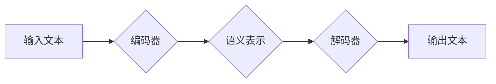

> 大语言模型、Transformer、自然语言处理、文本生成、机器学习、深度学习

## 1. 背景介绍

近年来，人工智能领域取得了令人瞩目的进展，其中大语言模型（Large Language Models，LLMs）作为一种强大的工具，在自然语言处理（Natural Language Processing，NLP）领域展现出巨大的潜力。LLMs 能够理解和生成人类语言，并完成各种复杂的任务，例如文本摘要、机器翻译、对话系统等。

传统的自然语言处理方法主要依赖于手工设计的规则和特征工程，而LLMs则通过深度学习的方式，从海量文本数据中学习语言的结构和语义，从而实现更智能、更自然的语言理解和生成。

## 2. 核心概念与联系

**2.1  Transformer 架构**

Transformer 架构是 LLMs 的核心，它是一种基于注意力机制的深度神经网络结构，能够有效地处理长序列数据。

**2.2  注意力机制**

注意力机制允许模型关注输入序列中与当前任务最相关的部分，从而提高模型的理解能力和生成质量。

**2.3  编码器-解码器结构**

LLMs 通常采用编码器-解码器结构，其中编码器负责将输入文本编码成语义表示，解码器则根据编码结果生成输出文本。

**Mermaid 流程图**



**2.4  预训练与微调**

LLMs 通常采用预训练与微调的策略。预训练阶段，模型在大量文本数据上进行训练，学习语言的通用知识；微调阶段，模型在特定任务的数据上进行训练，使其能够完成特定任务。

## 3. 核心算法原理 & 具体操作步骤

**3.1  算法原理概述**

LLMs 的核心算法是基于 Transformer 架构的深度神经网络，它通过多层编码器和解码器，以及注意力机制，学习语言的结构和语义。

**3.2  算法步骤详解**

1. **输入文本处理:** 将输入文本转换为数字表示，例如词嵌入。
2. **编码器:** 将输入文本编码成语义表示，每个词会被编码成一个向量，这些向量经过多层 Transformer 块处理，最终得到文本的语义表示。
3. **解码器:** 根据编码器的输出，生成输出文本。解码器也由多层 Transformer 块组成，并使用注意力机制来关注编码器输出中的相关信息。
4. **输出文本生成:** 将解码器的输出转换为文本形式。

**3.3  算法优缺点**

**优点:**

* 能够处理长序列数据
* 具有强大的语言理解和生成能力
* 可以通过预训练和微调实现多种任务

**缺点:**

* 训练成本高
* 容易受到训练数据偏差的影响
* 缺乏对真实世界知识的理解

**3.4  算法应用领域**

* 文本摘要
* 机器翻译
* 对话系统
* 代码生成
* 文本分类
* 问答系统

## 4. 数学模型和公式 & 详细讲解 & 举例说明

**4.1  数学模型构建**

LLMs 的数学模型主要基于 Transformer 架构，其核心是注意力机制和多头注意力机制。

**4.2  公式推导过程**

注意力机制的公式如下：

$$
Attention(Q, K, V) = softmax(\frac{QK^T}{\sqrt{d_k}})V
$$

其中：

* $Q$：查询矩阵
* $K$：键矩阵
* $V$：值矩阵
* $d_k$：键向量的维度
* $softmax$：softmax 函数

**4.3  案例分析与讲解**

假设我们有一个句子 "The cat sat on the mat"，我们想要计算每个词对 "sat" 的注意力权重。

1. 将每个词编码成向量，得到 $Q$, $K$, $V$ 矩阵。
2. 计算 $QK^T$，得到一个矩阵，每个元素表示两个词之间的相似度。
3. 对 $QK^T$ 进行归一化，得到注意力权重矩阵。
4. 将注意力权重矩阵与 $V$ 矩阵相乘，得到 "sat" 的上下文表示。

## 5. 项目实践：代码实例和详细解释说明

**5.1  开发环境搭建**

* Python 3.7+
* PyTorch 或 TensorFlow
* CUDA 和 cuDNN

**5.2  源代码详细实现**

```python
import torch
import torch.nn as nn

class Transformer(nn.Module):
    def __init__(self, vocab_size, embedding_dim, num_heads, num_layers):
        super(Transformer, self).__init__()
        self.embedding = nn.Embedding(vocab_size, embedding_dim)
        self.transformer_layers = nn.ModuleList([
            nn.TransformerEncoderLayer(embedding_dim, num_heads)
            for _ in range(num_layers)
        ])

    def forward(self, x):
        x = self.embedding(x)
        for layer in self.transformer_layers:
            x = layer(x)
        return x
```

**5.3  代码解读与分析**

* `Transformer` 类定义了一个 Transformer 模型。
* `embedding` 层将词索引转换为词向量。
* `transformer_layers` 是一个列表，包含多个 Transformer Encoder Layer。
* `forward` 方法定义了模型的正向传播过程。

**5.4  运行结果展示**

训练好的 LLMs 可以用于各种 NLP 任务，例如文本生成、机器翻译等。

## 6. 实际应用场景

**6.1  文本生成**

LLMs 可以用于生成各种类型的文本，例如小说、诗歌、新闻报道等。

**6.2  机器翻译**

LLMs 可以用于将文本从一种语言翻译成另一种语言。

**6.3  对话系统**

LLMs 可以用于构建能够与人类进行自然对话的聊天机器人。

**6.4  未来应用展望**

LLMs 有潜力应用于更广泛的领域，例如教育、医疗、法律等。

## 7. 工具和资源推荐

**7.1  学习资源推荐**

* Transformer 论文：https://arxiv.org/abs/1706.03762
* Hugging Face Transformers 库：https://huggingface.co/transformers/

**7.2  开发工具推荐**

* PyTorch：https://pytorch.org/
* TensorFlow：https://www.tensorflow.org/

**7.3  相关论文推荐**

* BERT：https://arxiv.org/abs/1810.04805
* GPT-3：https://openai.com/blog/gpt-3/

## 8. 总结：未来发展趋势与挑战

**8.1  研究成果总结**

近年来，LLMs 取得了显著进展，在各种 NLP 任务上取得了优异的性能。

**8.2  未来发展趋势**

* 更大的模型规模
* 更强大的计算能力
* 更有效的训练方法
* 更强的泛化能力

**8.3  面临的挑战**

* 训练成本高
* 数据偏差问题
* 缺乏对真实世界知识的理解
* 伦理和安全问题

**8.4  研究展望**

未来研究将集中在解决上述挑战，开发更安全、更可靠、更智能的 LLMs。

## 9. 附录：常见问题与解答

**9.1  什么是 LLMs？**

LLMs 是指能够理解和生成人类语言的大型语言模型。

**9.2  LLMs 的训练方法是什么？**

LLMs 通常采用预训练与微调的策略。预训练阶段，模型在大量文本数据上进行训练，学习语言的通用知识；微调阶段，模型在特定任务的数据上进行训练，使其能够完成特定任务。

**9.3  LLMs 的应用场景有哪些？**

LLMs 可以应用于各种 NLP 任务，例如文本生成、机器翻译、对话系统等。

作者：禅与计算机程序设计艺术 / Zen and the Art of Computer Programming


<end_of_turn>