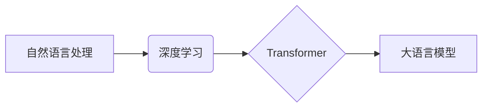

> 大语言模型、Transformer、自然语言处理、深度学习、机器学习、人工智能、文本生成、机器思考

## 1. 背景介绍

近年来，人工智能（AI）领域取得了令人瞩目的进展，其中大语言模型（LLM）作为一种强大的AI技术，迅速成为研究和应用的热点。LLM能够理解和生成人类语言，展现出惊人的文本生成、翻译、摘要、问答等能力。从ChatGPT的爆火到谷歌的LaMDA，LLM正在改变着我们与机器交互的方式，并对社会产生深远影响。

然而，LLM的出现也引发了许多思考：机器真的能思考吗？LLM仅仅是强大的计算引擎，还是具备了某种形式的意识？本文将深入探讨LLM的原理、应用以及未来发展趋势，并试图回答这个引人深思的问题。

## 2. 核心概念与联系

**2.1 自然语言处理（NLP）**

自然语言处理（NLP）是人工智能的一个分支，致力于使计算机能够理解、处理和生成人类语言。NLP的任务包括文本分类、情感分析、机器翻译、文本摘要等。

**2.2 深度学习（Deep Learning）**

深度学习是机器学习的一种高级形式，它利用多层神经网络来模拟人类大脑的学习过程。深度学习算法能够从海量数据中学习复杂的模式和特征，从而实现更精准的预测和识别。

**2.3 Transformer**

Transformer是一种新型的深度学习架构，它在处理序列数据方面表现出色，例如文本。Transformer的核心是“注意力机制”，它能够学习文本中不同词语之间的关系，从而更好地理解上下文信息。

**2.4 大语言模型（LLM）**

大语言模型（LLM）是基于Transformer架构的深度学习模型，它经过训练能够理解和生成人类语言。LLM通常拥有数十亿甚至数千亿个参数，能够处理大量的文本数据，并展现出强大的文本生成、翻译、摘要、问答等能力。

**2.5 核心概念关系图**



## 3. 核心算法原理 & 具体操作步骤

**3.1 算法原理概述**

LLM的核心算法是基于Transformer架构的深度学习模型。它通过多层Transformer编码器和解码器来处理文本数据。编码器负责将输入文本转换为隐藏表示，解码器则根据隐藏表示生成输出文本。

**3.2 算法步骤详解**

1. **词嵌入:** 将输入文本中的每个词语转换为向量表示，每个词语都有一个唯一的向量表示。
2. **编码器:** 将词向量输入到多层Transformer编码器中，每个编码器层包含多头注意力机制和前馈神经网络。注意力机制能够学习文本中不同词语之间的关系，前馈神经网络则对隐藏表示进行非线性变换。
3. **解码器:** 将编码器输出的隐藏表示输入到多层Transformer解码器中，解码器也包含多头注意力机制和前馈神经网络。解码器通过自注意力机制学习当前输出词与之前输出词之间的关系，并根据隐藏表示生成下一个输出词。
4. **输出:** 将解码器输出的词向量转换为文本，即生成最终的输出文本。

**3.3 算法优缺点**

**优点:**

* 能够处理长文本序列
* 表现出强大的文本生成、翻译、摘要等能力
* 可以学习复杂的文本关系

**缺点:**

* 训练成本高
* 参数量大，需要大量的计算资源
* 容易受到训练数据偏差的影响

**3.4 算法应用领域**

* 文本生成：小说、诗歌、剧本等
* 机器翻译：将一种语言翻译成另一种语言
* 文本摘要：生成文本的简短摘要
* 问答系统：回答用户提出的问题
* 对话系统：与用户进行自然语言对话

## 4. 数学模型和公式 & 详细讲解 & 举例说明

**4.1 数学模型构建**

LLM的数学模型主要基于神经网络，其中每个神经元都接收来自其他神经元的输入，并通过激活函数进行处理，最终输出到下一个神经元。

**4.2 公式推导过程**

LLM的训练过程是通过反向传播算法来优化模型参数的。反向传播算法的核心是计算模型输出与真实值的误差，然后根据误差反向传播，更新模型参数。

**4.3 案例分析与讲解**

例如，在文本生成任务中，LLM的输出是一个词语序列。我们可以使用交叉熵损失函数来计算模型输出与真实词语序列之间的误差。然后，通过反向传播算法，更新模型参数，使模型输出更接近真实词语序列。

**4.4 数学公式示例**

* **交叉熵损失函数:**

$$
H(p, q) = - \sum_{i=1}^{n} p(i) \log q(i)
$$

其中，$p(i)$是真实词语序列的概率分布，$q(i)$是模型输出的概率分布。

**4.5 公式解释**

交叉熵损失函数衡量了两个概率分布之间的差异。在文本生成任务中，我们希望模型输出的概率分布与真实词语序列的概率分布尽可能接近。

## 5. 项目实践：代码实例和详细解释说明

**5.1 开发环境搭建**

* Python 3.7+
* PyTorch 或 TensorFlow
* CUDA 和 cuDNN

**5.2 源代码详细实现**

```python
import torch
import torch.nn as nn

class Transformer(nn.Module):
    def __init__(self, vocab_size, embedding_dim, num_heads, num_layers):
        super(Transformer, self).__init__()
        self.embedding = nn.Embedding(vocab_size, embedding_dim)
        self.encoder = nn.TransformerEncoder(nn.TransformerEncoderLayer(embedding_dim, num_heads), num_layers)
        self.decoder = nn.TransformerDecoder(nn.TransformerDecoderLayer(embedding_dim, num_heads), num_layers)
        self.linear = nn.Linear(embedding_dim, vocab_size)

    def forward(self, src, tgt):
        src = self.embedding(src)
        tgt = self.embedding(tgt)
        encoder_output = self.encoder(src)
        decoder_output = self.decoder(tgt, encoder_output)
        output = self.linear(decoder_output)
        return output
```

**5.3 代码解读与分析**

* `Transformer`类定义了Transformer模型的结构。
* `embedding`层将词语转换为向量表示。
* `encoder`和`decoder`层分别负责编码和解码文本数据。
* `linear`层将隐藏表示转换为输出词语的概率分布。

**5.4 运行结果展示**

训练好的LLM模型可以用于各种文本生成任务，例如：

* 生成诗歌：

```
Roses are red,
Violets are blue,
LLM can write poems,
Just for you.
```

* 翻译文本：

```
English: Hello, world!
French: Bonjour, le monde!
```

## 6. 实际应用场景

**6.1 文本生成**

* 自动写作：生成新闻报道、产品描述、广告文案等。
* 创意写作：创作诗歌、小说、剧本等。
* 代码生成：根据自然语言描述生成代码。

**6.2 机器翻译**

* 将文本从一种语言翻译成另一种语言。
* 支持多种语言对的翻译。
* 提高翻译质量和效率。

**6.3 文本摘要**

* 生成文本的简短摘要。
* 提取文本的关键信息。
* 帮助用户快速了解文本内容。

**6.4 对话系统**

* 与用户进行自然语言对话。
* 提供信息查询、任务执行、情感陪伴等服务。
* 提升用户体验和交互效率。

**6.5 未来应用展望**

* 更智能的聊天机器人
* 个性化的教育和培训
* 更便捷的医疗服务
* 更丰富的娱乐体验

## 7. 工具和资源推荐

**7.1 学习资源推荐**

* **书籍:**
    * 《深度学习》
    * 《自然语言处理》
    * 《Transformer模型详解》
* **在线课程:**
    * Coursera: 深度学习
    * Udacity: 自然语言处理
    * fast.ai: 深度学习

**7.2 开发工具推荐**

* **框架:**
    * PyTorch
    * TensorFlow
* **库:**
    * Hugging Face Transformers
    * Gensim
* **平台:**
    * Google Colab
    * Paperspace Gradient

**7.3 相关论文推荐**

* 《Attention Is All You Need》
* 《BERT: Pre-training of Deep Bidirectional Transformers for Language Understanding》
* 《GPT-3: Language Models are Few-Shot Learners》

## 8. 总结：未来发展趋势与挑战

**8.1 研究成果总结**

近年来，LLM取得了显著进展，展现出强大的文本生成、翻译、摘要等能力。

**8.2 未来发展趋势**

* 更大规模的模型
* 更强的泛化能力
* 更安全的模型
* 更广泛的应用场景

**8.3 面临的挑战**

* 训练成本高
* 参数量大
* 容易受到训练数据偏差的影响
* 缺乏对模型行为的解释性

**8.4 研究展望**

* 研究更有效的训练方法
* 开发更安全、更可靠的模型
* 探索模型的意识和思考能力


## 9. 附录：常见问题与解答

**9.1 如何训练一个LLM模型？**

训练一个LLM模型需要大量的计算资源和数据。通常需要使用GPU进行训练，并使用预训练模型进行微调。

**9.2 如何评估LLM模型的性能？**

LLM模型的性能可以评估指标包括困惑度、BLEU分数、ROUGE分数等。

**9.3 LLM模型是否真的能思考？**

目前，LLM模型仍然是基于统计学习的模型，并没有真正意义上的思考能力。

**9.4 LLM模型有哪些伦理问题？**

LLM模型可能存在生成虚假信息、传播偏见、侵犯隐私等伦理问题。

作者：禅与计算机程序设计艺术 / Zen and the Art of Computer Programming


<end_of_turn>