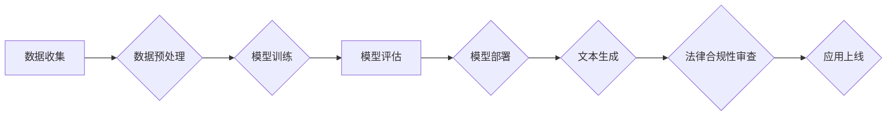

> 大语言模型，法律合规，伦理风险，数据隐私，算法透明度，监管政策，人工智能

## 1. 背景介绍

大语言模型（LLM）作为人工智能领域的一项突破性技术，展现出强大的文本生成、理解和翻译能力，在各个领域都展现出巨大的应用潜力。从聊天机器人到代码生成，从医疗诊断到法律文本分析，LLM正在改变着我们与信息交互的方式。然而，随着LLM应用的日益广泛，其潜在的法律合规风险也日益凸显。

LLM的训练数据通常来自互联网，包含大量公开信息，但也可能包含敏感个人信息、 copyrighted 内容和偏见信息。如果LLM在生成文本时未经适当处理，可能会泄露隐私、侵犯版权或产生歧视性结果，从而引发法律纠纷和社会伦理问题。

## 2. 核心概念与联系

**2.1  大语言模型 (LLM)**

大语言模型是一种基于深度学习的统计模型，能够理解和生成人类语言。它们通过训练大量的文本数据，学习语言的语法、语义和上下文关系，从而能够执行各种自然语言处理任务。

**2.2  法律合规性**

法律合规性是指行为、产品或服务符合相关法律法规的要求。在LLM应用中，法律合规性涉及多个方面，包括数据隐私、版权保护、算法透明度、责任归属等。

**2.3  伦理风险**

伦理风险是指LLM应用可能带来的社会伦理问题，例如算法偏见、信息操纵、隐私侵犯等。

**2.4  监管政策**

各国政府正在制定相关政策法规，以规范LLM的开发和应用，确保其安全、合法和可持续发展。

**Mermaid 流程图**



## 3. 核心算法原理 & 具体操作步骤

**3.1  算法原理概述**

LLM的核心算法是基于Transformer网络结构的深度学习模型。Transformer网络通过自注意力机制，能够捕捉文本序列中长距离依赖关系，从而实现更准确的语言理解和生成。

**3.2  算法步骤详解**

1. **数据收集:** 收集大量文本数据，包括书籍、文章、网站内容等。
2. **数据预处理:** 对收集到的数据进行清洗、格式化和标记，例如去除停用词、标点符号，并对文本进行分词和词嵌入。
3. **模型训练:** 使用Transformer网络结构的深度学习模型，对预处理后的数据进行训练，学习语言的语法、语义和上下文关系。
4. **模型评估:** 使用测试数据集评估模型的性能，例如准确率、困惑度等。
5. **模型部署:** 将训练好的模型部署到服务器或云平台，以便进行文本生成等任务。

**3.3  算法优缺点**

**优点:**

* 能够处理大量文本数据，学习复杂的语言模式。
* 自注意力机制能够捕捉长距离依赖关系，提高文本理解和生成能力。
* 能够应用于多种自然语言处理任务，例如文本分类、机器翻译、文本摘要等。

**缺点:**

* 训练成本高，需要大量的计算资源和时间。
* 容易受到训练数据中的偏见影响，可能产生歧视性结果。
* 缺乏对文本语义的深度理解，难以处理复杂的情感和推理问题。

**3.4  算法应用领域**

* **聊天机器人:** 与用户进行自然语言对话，提供信息和服务。
* **代码生成:** 根据自然语言描述生成代码。
* **医疗诊断:** 分析患者病历和症状，辅助医生进行诊断。
* **法律文本分析:** 分析法律文件，提取关键信息和法律条款。
* **教育辅助:** 提供个性化学习辅导和知识问答。

## 4. 数学模型和公式 & 详细讲解 & 举例说明

**4.1  数学模型构建**

LLM的数学模型通常基于概率论和统计学，旨在学习文本序列的概率分布。

**4.2  公式推导过程**

例如，在语言模型中，我们可以使用以下公式计算给定上下文序列的下一个词的概率：

$$P(w_t | w_{1:t-1}) = \frac{exp(score(w_t, w_{1:t-1}))}{\sum_{w'} exp(score(w', w_{1:t-1}))}$$

其中：

* $w_t$ 是要预测的下一个词。
* $w_{1:t-1}$ 是给定的上下文序列。
* $score(w, w_{1:t-1})$ 是上下文序列和词 $w$ 之间的得分，通常使用神经网络计算。

**4.3  案例分析与讲解**

例如，假设我们有一个上下文序列 "The cat sat on the"，我们要预测下一个词。如果模型学习到 "mat" 是一个常见的词，并且在类似的上下文序列中经常出现，那么它会给 "mat" 分配更高的概率。

## 5. 项目实践：代码实例和详细解释说明

**5.1  开发环境搭建**

可以使用 Python 语言和相关的深度学习框架，例如 TensorFlow 或 PyTorch，搭建LLM的开发环境。

**5.2  源代码详细实现**

以下是一个简单的LLM代码示例，使用 TensorFlow 框架实现：

```python
import tensorflow as tf

# 定义模型结构
model = tf.keras.Sequential([
    tf.keras.layers.Embedding(input_dim=vocab_size, output_dim=embedding_dim),
    tf.keras.layers.LSTM(units=hidden_size),
    tf.keras.layers.Dense(units=vocab_size, activation='softmax')
])

# 编译模型
model.compile(optimizer='adam', loss='sparse_categorical_crossentropy', metrics=['accuracy'])

# 训练模型
model.fit(x_train, y_train, epochs=num_epochs)

# 预测文本
text = "The cat sat on the"
predictions = model.predict(text)
```

**5.3  代码解读与分析**

* `Embedding` 层将词向量化，将每个词映射到一个低维向量空间。
* `LSTM` 层是一个循环神经网络，能够捕捉文本序列中的长距离依赖关系。
* `Dense` 层是一个全连接层，输出每个词的概率分布。

**5.4  运行结果展示**

训练完成后，模型可以用于预测下一个词，生成新的文本。

## 6. 实际应用场景

**6.1  聊天机器人**

LLM可以用于构建更智能、更自然的聊天机器人，能够理解用户的意图，并提供更准确、更相关的回复。

**6.2  代码生成**

LLM可以根据自然语言描述生成代码，提高开发效率，降低开发成本。

**6.3  医疗诊断**

LLM可以分析患者病历和症状，辅助医生进行诊断，提高诊断准确率。

**6.4  未来应用展望**

LLM的应用前景广阔，未来可能在更多领域发挥重要作用，例如教育、金融、法律等。

## 7. 工具和资源推荐

**7.1  学习资源推荐**

* **书籍:**
    * 《深度学习》
    * 《自然语言处理》
* **在线课程:**
    * Coursera
    * edX
* **开源项目:**
    * TensorFlow
    * PyTorch

**7.2  开发工具推荐**

* **编程语言:** Python
* **深度学习框架:** TensorFlow, PyTorch
* **文本处理工具:** NLTK, SpaCy

**7.3  相关论文推荐**

* 《Attention Is All You Need》
* 《BERT: Pre-training of Deep Bidirectional Transformers for Language Understanding》

## 8. 总结：未来发展趋势与挑战

**8.1  研究成果总结**

LLM在文本生成、理解和翻译等方面取得了显著进展，展现出巨大的应用潜力。

**8.2  未来发展趋势**

* 模型规模和能力将继续提升。
* 算法效率和训练成本将得到进一步降低。
* 应用场景将更加广泛，覆盖更多领域。

**8.3  面临的挑战**

* 算法偏见和歧视问题需要得到有效解决。
* 数据隐私和安全问题需要得到妥善处理。
* 算法透明度和可解释性需要得到提升。

**8.4  研究展望**

未来研究将重点关注解决LLM的伦理风险和法律合规性问题，使其能够安全、合法和可持续地应用于社会各个领域。

## 9. 附录：常见问题与解答

**9.1  LLM如何避免产生偏见？**

* 使用更加多样化的训练数据，减少数据偏见。
* 开发算法去偏见技术，例如对抗训练和公平性约束。
* 对模型输出进行审查和评估，及时发现和修正偏见问题。

**9.2  如何保护LLM训练数据中的隐私信息？**

* 使用匿名化技术对数据进行处理，去除个人识别信息。
* 加密数据存储和传输，防止数据泄露。
* 遵守相关数据隐私法规，确保数据安全和合规。

**9.3  如何确保LLM的算法透明度？**

* 使用可解释性模型，例如线性模型或规则模型。
* 开发算法解释工具，帮助用户理解模型的决策过程。
* 对模型进行公开透明的评估和测试，提高公众信任。


作者：禅与计算机程序设计艺术 / Zen and the Art of Computer Programming 
<end_of_turn>