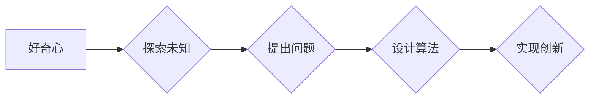

>  好奇心、创新、创造、探索、理解、人工智能、算法、数学模型、项目实践、应用场景

## 1. 背景介绍

在瞬息万变的科技时代，创新和创造是推动社会进步的引擎。而好奇心，作为人类探索和理解世界的原始动力，是所有创新创造的源泉。它驱使我们不断提问、探索未知，最终揭开世界的奥秘，并将其转化为有价值的成果。

对于人工智能领域而言，好奇心尤为重要。人工智能的本质是模拟人类的智能，而人类的智能离不开对世界的探索和理解。只有怀着好奇心，才能不断探索新的算法、模型和应用场景，推动人工智能技术的发展。

## 2. 核心概念与联系

### 2.1  好奇心与创新

好奇心是创新和创造的基石。它让我们对未知事物充满兴趣，并渴望探索其背后的奥秘。当我们对某一领域充满好奇时，就会主动学习、思考和实验，最终产生新的想法和解决方案。

### 2.2  好奇心与人工智能

人工智能的发展离不开对人类智能的模拟和理解。而人类的智能很大程度上源于好奇心。人工智能系统也需要具备类似的“好奇心”，才能不断学习、进化和突破现有局限。

### 2.3  好奇心与算法

算法是人工智能的核心驱动力。好奇心可以引导我们设计更智能、更有效的算法，并将其应用于解决实际问题。

**Mermaid 流程图**



## 3. 核心算法原理 & 具体操作步骤

### 3.1  算法原理概述

深度学习算法是一种模仿人类大脑学习机制的机器学习算法。它通过多层神经网络来学习数据中的复杂模式和关系，从而实现对数据的理解和预测。

### 3.2  算法步骤详解

1. **数据预处理:** 将原始数据进行清洗、转换和格式化，使其适合深度学习算法的训练。
2. **网络结构设计:** 根据任务需求设计深度神经网络的结构，包括神经元的数量、连接方式和激活函数等。
3. **参数初始化:** 为神经网络中的参数进行随机初始化。
4. **前向传播:** 将输入数据通过神经网络进行传递，计算输出结果。
5. **反向传播:** 计算输出结果与真实值的误差，并根据误差反向传播，更新神经网络的参数。
6. **迭代训练:** 重复前向传播和反向传播的过程，直到模型的性能达到预期的水平。

### 3.3  算法优缺点

**优点:**

* 能够学习复杂的数据模式和关系。
* 性能优于传统机器学习算法。
* 在图像识别、自然语言处理等领域取得了突破性进展。

**缺点:**

* 训练数据量大，计算资源消耗高。
* 模型解释性差，难以理解模型的决策过程。
* 对数据噪声和异常值敏感。

### 3.4  算法应用领域

深度学习算法广泛应用于以下领域:

* **图像识别:** 人脸识别、物体检测、图像分类等。
* **自然语言处理:** 机器翻译、文本摘要、情感分析等。
* **语音识别:** 语音转文本、语音助手等。
* **推荐系统:** 商品推荐、内容推荐等。
* **医疗诊断:** 疾病诊断、影像分析等。

## 4. 数学模型和公式 & 详细讲解 & 举例说明

### 4.1  数学模型构建

深度学习算法的核心是多层神经网络。每个神经元接收多个输入信号，并通过加权求和和激活函数进行处理，最终输出一个信号。

**神经元模型:**

$$
y = f(w_1x_1 + w_2x_2 + ... + w_nx_n + b)
$$

其中:

* $y$ 是神经元的输出信号。
* $x_1, x_2, ..., x_n$ 是输入信号。
* $w_1, w_2, ..., w_n$ 是权重参数。
* $b$ 是偏置参数。
* $f$ 是激活函数。

### 4.2  公式推导过程

深度学习算法的训练过程是通过反向传播算法来进行的。反向传播算法的核心是计算误差信号，并根据误差信号更新神经网络的参数。

**误差信号:**

$$
\delta_j = \frac{\partial L}{\partial a_j} \cdot f'(a_j)
$$

其中:

* $\delta_j$ 是第 $j$ 个神经元的误差信号。
* $L$ 是损失函数。
* $a_j$ 是第 $j$ 个神经元的激活值。
* $f'(a_j)$ 是激活函数的导数。

**参数更新:**

$$
w_{ij} = w_{ij} - \eta \delta_j x_i
$$

其中:

* $w_{ij}$ 是连接第 $i$ 个神经元和第 $j$ 个神经元的权重参数。
* $\eta$ 是学习率。

### 4.3  案例分析与讲解

**图像分类案例:**

假设我们有一个图像分类任务，目标是将图像分类为不同的类别，例如猫、狗、鸟等。我们可以使用深度学习算法来训练一个图像分类模型。

训练过程如下:

1. 收集大量图像数据，并将其标记为不同的类别。
2. 设计一个深度神经网络，例如卷积神经网络 (CNN)。
3. 将图像数据输入到神经网络中进行训练。
4. 使用反向传播算法更新神经网络的参数。
5. 评估模型的性能，并根据需要调整模型结构或训练参数。

经过训练，深度学习模型能够将新的图像分类为不同的类别。

## 5. 项目实践：代码实例和详细解释说明

### 5.1  开发环境搭建

* 操作系统: Ubuntu 20.04
* Python 版本: 3.8
* 深度学习框架: TensorFlow 2.0

### 5.2  源代码详细实现

```python
import tensorflow as tf

# 定义模型结构
model = tf.keras.models.Sequential([
    tf.keras.layers.Conv2D(32, (3, 3), activation='relu', input_shape=(28, 28, 1)),
    tf.keras.layers.MaxPooling2D((2, 2)),
    tf.keras.layers.Conv2D(64, (3, 3), activation='relu'),
    tf.keras.layers.MaxPooling2D((2, 2)),
    tf.keras.layers.Flatten(),
    tf.keras.layers.Dense(10, activation='softmax')
])

# 编译模型
model.compile(optimizer='adam',
              loss='sparse_categorical_crossentropy',
              metrics=['accuracy'])

# 加载 MNIST 数据集
(x_train, y_train), (x_test, y_test) = tf.keras.datasets.mnist.load_data()

# 数据预处理
x_train = x_train.astype('float32') / 255.0
x_test = x_test.astype('float32') / 255.0
x_train = x_train.reshape((x_train.shape[0], 28, 28, 1))
x_test = x_test.reshape((x_test.shape[0], 28, 28, 1))

# 训练模型
model.fit(x_train, y_train, epochs=5)

# 评估模型
loss, accuracy = model.evaluate(x_test, y_test)
print('Test loss:', loss)
print('Test accuracy:', accuracy)
```

### 5.3  代码解读与分析

这段代码实现了使用 TensorFlow 框架训练一个简单的图像分类模型。

* 首先，定义了模型结构，包括卷积层、池化层和全连接层。
* 然后，编译了模型，指定了优化器、损失函数和评价指标。
* 接着，加载了 MNIST 数据集，并对数据进行了预处理。
* 最后，训练了模型，并评估了模型的性能。

### 5.4  运行结果展示

训练完成后，模型能够将 MNIST 数据集中的手写数字分类为不同的类别。

## 6. 实际应用场景

### 6.1  图像识别

深度学习算法在图像识别领域取得了突破性进展，广泛应用于人脸识别、物体检测、图像分类等场景。例如，在智能手机中，深度学习算法可以用于解锁手机、识别用户身份、识别周围环境中的物体等。

### 6.2  自然语言处理

深度学习算法在自然语言处理领域也取得了显著成果，例如机器翻译、文本摘要、情感分析等。例如，Google Translate 使用深度学习算法进行机器翻译，可以实现多种语言之间的快速准确翻译。

### 6.3  语音识别

深度学习算法可以用于语音识别，例如将语音转为文本。例如，Siri 和 Alexa 等语音助手都使用深度学习算法进行语音识别。

### 6.4  未来应用展望

随着深度学习算法的不断发展，其应用场景将更加广泛。例如，在医疗领域，深度学习算法可以用于疾病诊断、影像分析等；在自动驾驶领域，深度学习算法可以用于感知环境、决策规划等。

## 7. 工具和资源推荐

### 7.1  学习资源推荐

* **书籍:**
    * 深度学习 (Deep Learning) - Ian Goodfellow, Yoshua Bengio, Aaron Courville
    * 构建深度学习模型 (Hands-On Machine Learning with Scikit-Learn, Keras & TensorFlow) - Aurélien Géron
* **在线课程:**
    * 深度学习 Specialization - Andrew Ng (Coursera)
    * fast.ai - Practical Deep Learning for Coders
* **博客和网站:**
    * TensorFlow Blog
    * PyTorch Blog
    * Towards Data Science

### 7.2  开发工具推荐

* **深度学习框架:** TensorFlow, PyTorch, Keras
* **编程语言:** Python
* **数据处理工具:** Pandas, NumPy

### 7.3  相关论文推荐

* **AlexNet:** ImageNet Classification with Deep Convolutional Neural Networks
* **VGGNet:** Very Deep Convolutional Networks for Large-Scale Image Recognition
* **ResNet:** Deep Residual Learning for Image Recognition

## 8. 总结：未来发展趋势与挑战

### 8.1  研究成果总结

深度学习算法取得了令人瞩目的成果，在图像识别、自然语言处理、语音识别等领域取得了突破性进展。

### 8.2  未来发展趋势

* **模型更深更广:** 研究更深层次、更广阔结构的深度学习模型，以提高模型的表达能力和泛化能力。
* **数据更丰富更有效:** 探索新的数据获取和处理方法，利用更多类型的数据来训练深度学习模型。
* **算法更智能更高效:** 研究更智能、更有效的深度学习算法，例如自监督学习、强化学习等。
* **应用更广泛更深入:** 将深度学习算法应用于更多领域，例如医疗、教育、金融等，并深入到各个环节。

### 8.3  面临的挑战

* **数据隐私和安全:** 深度学习算法需要大量数据进行训练，如何保护数据隐私和安全是一个重要的挑战。
* **模型解释性和可信度:** 深度学习模型的决策过程难以解释，如何提高模型的解释性和可信度是一个重要的研究方向。
* **计算资源消耗:** 训练深度学习模型需要大量的计算资源，如何降低计算资源消耗是一个重要的挑战。

### 8.4  研究展望

未来，深度学习领域将继续保持快速发展，并对社会产生更深远的影响。

## 9. 附录：常见问题与解答

**Q1: 深度学习算法与传统机器学习算法有什么区别