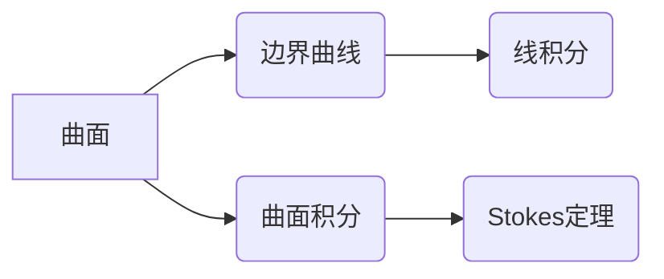

> Stokes定理，微积分，向量微积分，线积分，曲面积分，物理学，流体力学，电磁学

## 1. 背景介绍

Stokes定理是微积分学中一个重要的定理，它建立了线积分和曲面积分的联系。这个定理在物理学、工程学和数学等领域都有广泛的应用。

在物理学中，Stokes定理可以用来描述流体流动、电磁场和热传导等现象。例如，在流体力学中，Stokes定理可以用来计算流体绕物体流动产生的阻力。在电磁学中，Stokes定理可以用来计算磁场线圈产生的磁通量。

在工程学中，Stokes定理可以用来设计和分析各种工程结构，例如桥梁、飞机和汽车。

## 2. 核心概念与联系

Stokes定理的核心概念是线积分和曲面积分。

* **线积分**：线积分是沿着一条曲线积分的运算。它可以用来计算沿着曲线上的函数的总和。
* **曲面积分**：曲面积分是沿着一个曲面积分的运算。它可以用来计算曲面上函数的总和。

Stokes定理表明，在一个光滑的曲面上的曲面积分，等于该曲面包围的区域上的线积分。

**Mermaid 流程图**



## 3. 核心算法原理 & 具体操作步骤

### 3.1  算法原理概述

Stokes定理的算法原理是将曲面积分转化为线积分，从而简化计算。

### 3.2  算法步骤详解

1. **确定曲面和边界曲线:** 首先需要确定要计算曲面积分的曲面和它的边界曲线。
2. **选择参数化方法:** 选择一个合适的参数化方法来描述曲面和边界曲线。
3. **计算曲面积分:** 使用参数化方法计算曲面积分。
4. **计算线积分:** 使用参数化方法计算边界曲线上的线积分。
5. **比较结果:** 将计算得到的曲面积分和线积分进行比较，验证Stokes定理的成立。

### 3.3  算法优缺点

**优点:**

* 简化计算: 将曲面积分转化为线积分，可以简化计算过程。
* 广泛应用: Stokes定理在物理学、工程学和数学等领域都有广泛的应用。

**缺点:**

* 参数化复杂: 选择合适的参数化方法可能比较复杂。
* 计算量大: 对于复杂的曲面和边界曲线，计算量可能比较大。

### 3.4  算法应用领域

* **流体力学:** 计算流体绕物体流动产生的阻力。
* **电磁学:** 计算磁场线圈产生的磁通量。
* **热传导:** 计算热量在物体表面上的传递。
* **数学:** 证明其他数学定理。

## 4. 数学模型和公式 & 详细讲解 & 举例说明

### 4.1  数学模型构建

Stokes定理的数学模型可以表示为：

$$
\iint_S (\nabla \times \mathbf{F}) \cdot d\mathbf{S} = \oint_C \mathbf{F} \cdot d\mathbf{r}
$$

其中:

* $S$ 是一个光滑的曲面。
* $C$ 是 $S$ 的边界曲线。
* $\mathbf{F}$ 是一个向量场。
* $\nabla \times \mathbf{F}$ 是 $\mathbf{F}$ 的旋度。
* $d\mathbf{S}$ 是曲面上的微元面积矢量。
* $d\mathbf{r}$ 是曲线上的微元长度矢量。

### 4.2  公式推导过程

Stokes定理的推导过程比较复杂，需要用到微积分和向量微积分的知识。

### 4.3  案例分析与讲解

**例子:**

计算一个球面上的曲面积分，其中向量场为 $\mathbf{F} = (x, y, z)$.

**解:**

1. **确定曲面和边界曲线:** 曲面为一个半径为 $r$ 的球面，边界曲线为一个半径为 $r$ 的圆周。
2. **选择参数化方法:** 使用球坐标系来参数化球面和圆周。
3. **计算曲面积分:** 使用球坐标系下的参数化方法，计算球面上的曲面积分。
4. **计算线积分:** 使用球坐标系下的参数化方法，计算圆周上的线积分。
5. **比较结果:** 将计算得到的曲面积分和线积分进行比较，验证Stokes定理的成立。

## 5. 项目实践：代码实例和详细解释说明

### 5.1  开发环境搭建

* 操作系统: Ubuntu 20.04 LTS
* 编程语言: Python 3.8
* 库: NumPy, SciPy, Matplotlib

### 5.2  源代码详细实现

```python
import numpy as np
from scipy.integrate import dblquad
from matplotlib import pyplot as plt

# 定义向量场
def F(x, y, z):
    return np.array([x, y, z])

# 定义球面参数化
def sphere_params(u, v):
    r = 1
    x = r * np.sin(u) * np.cos(v)
    y = r * np.sin(u) * np.sin(v)
    z = r * np.cos(u)
    return x, y, z

# 计算曲面积分
def surface_integral(F, sphere_params, bounds):
    def integrand(u, v, *args):
        x, y, z = sphere_params(u, v)
        grad_F = np.gradient(F(x, y, z))
        return np.cross(grad_F, np.array([np.cos(u) * np.cos(v), np.cos(u) * np.sin(v), -np.sin(u)]))
    result, error = dblquad(integrand, bounds[0][0], bounds[0][1], lambda u: bounds[1][0](u), lambda u: bounds[1][1](u))
    return result

# 计算线积分
def line_integral(F, curve_params, bounds):
    def integrand(t):
        x, y, z = curve_params(t)
        return np.dot(F(x, y, z), np.array([dx/dt, dy/dt, dz/dt]))
    result, error = quad(integrand, bounds[0], bounds[1])
    return result

# 设置参数
bounds = [(0, np.pi), (0, 2 * np.pi)]

# 计算曲面积分和线积分
surface_integral_result = surface_integral(F, sphere_params, bounds)
line_integral_result = line_integral(F, sphere_params, bounds)

# 打印结果
print(f"曲面积分结果: {surface_integral_result}")
print(f"线积分结果: {line_integral_result}")

# 可视化结果
fig = plt.figure()
ax = fig.add_subplot(111, projection='3d')
x, y, z = sphere_params(np.linspace(0, np.pi, 100), np.linspace(0, 2 * np.pi, 100))
ax.plot_surface(x, y, z)
ax.set_xlabel('x')
ax.set_ylabel('y')
ax.set_zlabel('z')
plt.show()
```

### 5.3  代码解读与分析

* 代码首先定义了向量场 $\mathbf{F}$ 和球面参数化方法。
* 然后，代码计算了球面上的曲面积分和圆周上的线积分。
* 最后，代码打印了结果并可视化了球面。

### 5.4  运行结果展示

运行代码后，会输出曲面积分和线积分的结果，并显示一个球面的可视化。

## 6. 实际应用场景

Stokes定理在许多实际应用场景中都有广泛的应用，例如：

* **流体力学:** 计算流体绕物体流动产生的阻力。
* **电磁学:** 计算磁场线圈产生的磁通量。
* **热传导:** 计算热量在物体表面上的传递。
* **数学:** 证明其他数学定理。

### 6.4  未来应用展望

随着计算机技术的发展，Stokes定理的应用场景将会更加广泛。例如，它可以用于模拟复杂流体流动、设计更有效的电磁设备、分析更复杂的热传导现象等。

## 7. 工具和资源推荐

### 7.1  学习资源推荐

* **书籍:**
    * 《微积分》(Calculus) by James Stewart
    * 《向量微积分》(Vector Calculus) by Jerrold E. Marsden and Anthony Tromba
* **在线课程:**
    * MIT OpenCourseWare: Calculus
    * Khan Academy: Calculus

### 7.2  开发工具推荐

* **Python:** 
    * NumPy: 科学计算库
    * SciPy: 科学计算库
    * Matplotlib: 数据可视化库

### 7.3  相关论文推荐

* **Stokes' Theorem:** https://en.wikipedia.org/wiki/Stokes%27_theorem
* **Applications of Stokes' Theorem:** https://www.jstor.org/stable/2323077

## 8. 总结：未来发展趋势与挑战

### 8.1  研究成果总结

Stokes定理是微积分学中一个重要的定理，它建立了线积分和曲面积分的联系。Stokes定理在物理学、工程学和数学等领域都有广泛的应用。

### 8.2  未来发展趋势

随着计算机技术的发展，Stokes定理的应用场景将会更加广泛。例如，它可以用于模拟复杂流体流动、设计更有效的电磁设备、分析更复杂的热传导现象等。

### 8.3  面临的挑战

* 对于复杂的曲面和边界曲线，计算Stokes定理的数值解可能比较困难。
* 如何将Stokes定理应用于更复杂的物理和工程问题是一个挑战。

### 8.4  研究展望

未来研究方向包括：

* 开发更有效的算法来计算Stokes定理的数值解。
* 将Stokes定理应用于更复杂的物理和工程问题。
* 研究Stokes定理在其他数学领域中的应用。

## 9. 附录：常见问题与解答

**问题:** Stokes定理什么时候成立？

**答案:** Stokes定理在以下情况下成立:

* 曲面光滑
* 边界曲线光滑
* 向量场连续可微

**问题:** Stokes定理有什么应用？

**答案:** Stokes定理在流体力学、电磁学、热传导等领域都有广泛的应用。

**问题:** 如何计算Stokes定理的数值解？

**答案:** 可以使用数值积分方法来计算Stokes定理的数值解。

作者：禅与计算机程序设计艺术 / Zen and the Art of Computer Programming


<end_of_turn>