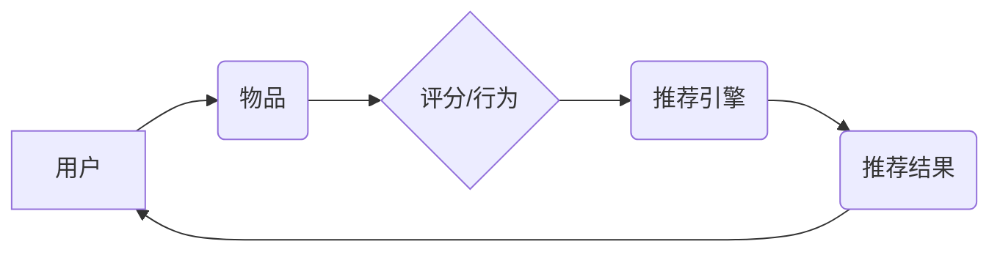

> 推荐系统,协同过滤,内容过滤,矩阵分解,深度学习,推荐算法,代码实例

## 1. 背景介绍

在信息爆炸的时代，海量数据和信息涌现，用户面临着选择困难的困境。推荐系统应运而生，旨在根据用户的历史行为、偏好和兴趣，智能地推荐相关商品、服务、内容等，帮助用户快速找到所需信息，提升用户体验。

推荐系统已广泛应用于电商平台、视频网站、音乐平台、社交媒体等领域，例如：

* **电商平台:** 推荐商品、优惠券、促销活动
* **视频网站:** 推荐视频、电视剧、电影
* **音乐平台:** 推荐歌曲、专辑、音乐人
* **社交媒体:** 推荐好友、群组、话题

推荐系统的核心目标是提高用户满意度和留存率，并为商家带来更高的转化率和收益。

## 2. 核心概念与联系

推荐系统通常分为两大类：

* **基于内容的推荐 (Content-Based Filtering):** 根据用户的历史行为和偏好，推荐与之相似的物品。例如，如果用户喜欢观看科幻电影，系统会推荐其他科幻电影。
* **基于协同过滤的推荐 (Collaborative Filtering):** 根据其他用户对相同物品的评分或行为，推荐用户可能感兴趣的物品。例如，如果用户A和用户B都喜欢电影X，那么系统会推荐用户A可能喜欢的电影Y，而用户Y也喜欢电影X。

**推荐系统架构**



## 3. 核心算法原理 & 具体操作步骤

### 3.1  算法原理概述

协同过滤算法是推荐系统中最常用的算法之一，它基于用户的行为相似性来进行推荐。

协同过滤算法主要分为两种：

* **用户-基于协同过滤 (User-Based CF):** 根据用户的评分或行为相似性，找到与当前用户兴趣相似的用户，并推荐这些用户喜欢的物品。
* **物品-基于协同过滤 (Item-Based CF):** 根据物品之间的相似性，找到与当前用户喜欢的物品相似的物品，并推荐这些物品。

### 3.2  算法步骤详解

**用户-基于协同过滤算法步骤：**

1. **构建用户-物品评分矩阵:** 将用户和物品作为矩阵的行和列，用户对物品的评分作为矩阵的元素。
2. **计算用户相似度:** 使用余弦相似度、皮尔逊相关系数等方法计算用户之间的相似度。
3. **找到与当前用户相似的用户:** 根据计算出的相似度，找到与当前用户兴趣相似的用户。
4. **推荐相似的用户喜欢的物品:** 从相似的用户喜欢的物品中，过滤掉当前用户已经喜欢的物品，并推荐剩余的物品。

**物品-基于协同过滤算法步骤:**

1. **构建用户-物品评分矩阵:** 同用户-基于协同过滤算法步骤1。
2. **计算物品相似度:** 使用余弦相似度、皮尔逊相关系数等方法计算物品之间的相似度。
3. **找到与当前用户喜欢的物品相似的物品:** 根据计算出的相似度，找到与当前用户喜欢的物品相似的物品。
4. **推荐相似的物品:** 从相似的物品中，过滤掉当前用户已经喜欢的物品，并推荐剩余的物品。

### 3.3  算法优缺点

**优点:**

* 能够推荐个性化的物品，满足用户的特定需求。
* 算法相对简单易实现。

**缺点:**

* **冷启动问题:** 当用户或物品数据不足时，算法难以进行准确的推荐。
* **数据稀疏性问题:** 用户-物品评分矩阵通常是稀疏的，这会影响算法的性能。
* **数据规模问题:** 当数据规模庞大时，计算相似度和推荐物品的效率会降低。

### 3.4  算法应用领域

协同过滤算法广泛应用于以下领域:

* **电商平台:** 商品推荐、用户画像
* **视频网站:** 视频推荐、用户分类
* **音乐平台:** 歌曲推荐、音乐人发现
* **社交媒体:** 朋友推荐、话题推荐

## 4. 数学模型和公式 & 详细讲解 & 举例说明

### 4.1  数学模型构建

协同过滤算法的核心是计算用户或物品之间的相似度。常用的相似度度量方法包括：

* **余弦相似度:** 计算两个向量的夹角，值范围为-1到1，值越接近1，相似度越高。

$$
\text{cosine similarity}(u,v) = \frac{u \cdot v}{||u|| ||v||}
$$

其中：

* $u$ 和 $v$ 是两个用户或物品的向量表示。
* $u \cdot v$ 是两个向量的点积。
* $||u||$ 和 $||v||$ 是两个向量的模长。

* **皮尔逊相关系数:** 计算两个变量之间的线性相关性，值范围为-1到1，值越接近1，相关性越高。

$$
\text{pearson correlation}(u,v) = \frac{\sum_{i=1}^{n}(u_i - \bar{u})(v_i - \bar{v})}{\sqrt{\sum_{i=1}^{n}(u_i - \bar{u})^2} \sqrt{\sum_{i=1}^{n}(v_i - \bar{v})^2}}
$$

其中：

* $u_i$ 和 $v_i$ 是用户或物品 $i$ 的评分。
* $\bar{u}$ 和 $\bar{v}$ 是用户或物品的平均评分。

### 4.2  公式推导过程

余弦相似度的推导过程：

1. 两个向量 $u$ 和 $v$ 的点积表示这两个向量在同一方向上的投影长度。
2. 两个向量的模长表示这两个向量的长度。
3. 余弦相似度等于两个向量的点积除以两个向量的模长乘积，即表示两个向量在同一方向上的投影长度与两个向量长度的比值。

### 4.3  案例分析与讲解

假设有两个用户 A 和 B，他们的评分矩阵如下：

| 电影 | 用户 A | 用户 B |
|---|---|---|
| 电影 1 | 5 | 4 |
| 电影 2 | 3 | 2 |
| 电影 3 | 4 | 5 |
| 电影 4 | 2 | 3 |

我们可以使用余弦相似度计算用户 A 和 B 的相似度：

1. 将用户 A 和 B 的评分向量表示为：

$$
u_A = [5, 3, 4, 2]
$$

$$
u_B = [4, 2, 5, 3]
$$

2. 计算用户 A 和 B 的点积：

$$
u_A \cdot u_B = (5 \times 4) + (3 \times 2) + (4 \times 5) + (2 \times 3) = 20 + 6 + 20 + 6 = 52
$$

3. 计算用户 A 和 B 的模长：

$$
||u_A|| = \sqrt{5^2 + 3^2 + 4^2 + 2^2} = \sqrt{54}
$$

$$
||u_B|| = \sqrt{4^2 + 2^2 + 5^2 + 3^2} = \sqrt{54}
$$

4. 计算用户 A 和 B 的余弦相似度：

$$
\text{cosine similarity}(u_A, u_B) = \frac{52}{\sqrt{54} \times \sqrt{54}} = \frac{52}{54} \approx 0.96
$$

因此，用户 A 和 B 的余弦相似度约为 0.96，说明他们兴趣相近。

## 5. 项目实践：代码实例和详细解释说明

### 5.1  开发环境搭建

* Python 3.x
* Pandas
* Scikit-learn
* Matplotlib

### 5.2  源代码详细实现

```python
import pandas as pd
from sklearn.metrics.pairwise import cosine_similarity

# 加载用户-物品评分数据
ratings_data = pd.read_csv('ratings.csv')

# 构建用户-物品评分矩阵
user_item_matrix = ratings_data.pivot_table(index='user_id', columns='item_id', values='rating')

# 计算用户之间的余弦相似度
user_similarity = cosine_similarity(user_item_matrix)

# 找到与用户 1 相似的用户
similar_users = user_similarity[0].argsort()[:-6:-1]  # 排序并取前 5 个相似用户

# 推荐与相似用户喜欢的物品
recommended_items = []
for user_id in similar_users:
    user_ratings = user_item_matrix.loc[user_id].dropna()
    recommended_items.extend(user_ratings.index)

# 去除用户 1 已喜欢的物品
recommended_items = [item for item in recommended_items if item not in user_item_matrix.loc[1].index]

# 打印推荐结果
print(f'推荐给用户 1 的物品: {recommended_items}')
```

### 5.3  代码解读与分析

1. **加载数据:** 使用 Pandas 读取用户-物品评分数据。
2. **构建评分矩阵:** 使用 Pandas 的 `pivot_table` 方法构建用户-物品评分矩阵。
3. **计算相似度:** 使用 Scikit-learn 的 `cosine_similarity` 方法计算用户之间的余弦相似度。
4. **找到相似用户:** 根据相似度排序，找到与当前用户相似的用户。
5. **推荐物品:** 从相似用户的评分中，过滤掉当前用户已喜欢的物品，并推荐剩余的物品。

### 5.4  运行结果展示

运行代码后，将输出推荐给用户 1 的物品列表。

## 6. 实际应用场景

### 6.1  电商平台

* **商品推荐:** 根据用户的浏览历史、购买记录、收藏列表等信息，推荐用户可能感兴趣的商品。
* **个性化营销:** 根据用户的兴趣爱好和购买行为，推送个性化的优惠券、促销活动等信息。

### 6.2  视频网站

* **视频推荐:** 根据用户的观看历史、点赞记录、评论等信息，推荐用户可能感兴趣的视频。
* **内容分类:** 根据视频内容特征，将视频分类到不同的类别，方便用户查找。

### 6.3  音乐平台

* **歌曲推荐:** 根据用户的播放历史、收藏列表、点赞等信息，推荐用户可能喜欢的歌曲。
* **音乐人发现:** 根据用户的音乐偏好，推荐与之风格相似的音乐人。

### 6.4  未来应用展望

* **多模态推荐:** 将文本、图像、音频等多种数据类型融合，构建更全面的用户画像，实现更精准的推荐。
* **个性化解释:** 为推荐结果提供个性化的解释，帮助用户理解推荐依据，提升用户信任度。
* **实时推荐:** 基于用户的实时行为，动态更新推荐结果，提供更及时、更精准的推荐。

## 7. 工具和资源推荐

### 7.1  学习资源推荐

* **书籍:**
    * Recommender Systems Handbook
    * Mining the Social Web
* **在线课程:**
    * Coursera: Recommender Systems
    * Udacity: Machine Learning Engineer Nanodegree

### 7.2  开发工具推荐

* **Python:** 广泛应用于推荐系统开发，拥有丰富的库和工具。
* **Spark:** 用于大规模数据处理，可以处理海量用户-物品评分数据。
* **TensorFlow/PyTorch:** 深度学习框架，用于构建更复杂的推荐模型。

### 7.3  相关论文推荐

* **Collaborative Filtering for Implicit