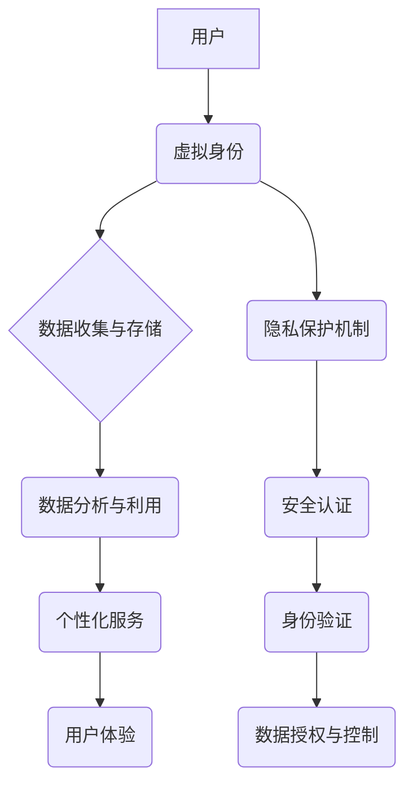

> 元宇宙、数字化人格权、身份保护、隐私保护、区块链、加密技术、人工智能

## 1. 背景介绍

元宇宙概念的兴起，标志着人类社会迈入一个全新的数字时代。在这个虚拟世界中，人们可以以数字化身份参与各种活动，构建虚拟社交关系，体验虚拟经济，甚至拥有虚拟财产。然而，元宇宙的魅力背后也隐藏着巨大的安全风险和隐私挑战。

随着元宇宙的不断发展，数字化人格权问题逐渐成为人们关注的焦点。数字化人格权是指在元宇宙中，个人虚拟身份所拥有的权利和利益，包括身份识别、数据控制、隐私保护、财产权益等。

然而，元宇宙的开放性和去中心化特性，使得个人数据更容易被泄露、滥用，而现有的法律法规和技术手段难以有效应对这些挑战。因此，如何保护用户在元宇宙中的数字化人格权，成为一个亟待解决的难题。

## 2. 核心概念与联系

**2.1 数字化人格权**

数字化人格权是指在元宇宙中，个人虚拟身份所拥有的权利和利益，包括：

* **身份识别权:**  用户有权控制自己的虚拟身份信息，并选择向他人展示哪些信息。
* **数据控制权:** 用户有权控制自己的数据，包括收集、使用、存储和共享等。
* **隐私保护权:** 用户有权保护自己的隐私，防止个人信息被未经授权的访问和使用。
* **财产权益权:** 用户在元宇宙中获得的虚拟财产，例如虚拟物品、数字资产等，享有相应的财产权益。

**2.2 元宇宙与数字化人格权的关系**

元宇宙是一个虚拟世界，用户可以通过虚拟身份参与各种活动，构建虚拟社交关系，体验虚拟经济，甚至拥有虚拟财产。

在元宇宙中，用户的虚拟身份与现实世界中的身份密切相关，用户的行为和数据都会被记录和存储。因此，保护用户的数字化人格权，对于维护元宇宙的健康发展至关重要。

**2.3 核心概念架构**



## 3. 核心算法原理 & 具体操作步骤

**3.1 算法原理概述**

为了保护用户在元宇宙中的数字化人格权，需要采用一系列的技术手段，例如：

* **加密技术:** 对用户数据进行加密，防止未经授权的访问和使用。
* **去中心化存储:** 将用户数据分散存储在多个节点上，防止单点故障和数据泄露。
* **身份认证:** 使用生物识别技术、多因素认证等手段，确保用户的身份真实可靠。
* **数据授权与控制:** 用户可以自主选择哪些数据共享给第三方应用，并随时撤销授权。

**3.2 算法步骤详解**

1. **用户注册:** 用户在元宇宙平台注册时，需要提供必要的个人信息，并进行身份验证。
2. **数据加密:** 用户的数据在存储和传输过程中，都会被加密，防止未经授权的访问。
3. **去中心化存储:** 用户的数据会被分散存储在多个节点上，防止单点故障和数据泄露。
4. **隐私保护机制:** 元宇宙平台会采用隐私保护机制，例如数据匿名化、差分隐私等，保护用户的隐私信息。
5. **身份认证:** 用户在访问元宇宙平台或进行特定操作时，需要进行身份认证，确保用户的身份真实可靠。
6. **数据授权与控制:** 用户可以自主选择哪些数据共享给第三方应用，并随时撤销授权。

**3.3 算法优缺点**

* **优点:**
    * 能够有效保护用户的数字化人格权。
    * 提高了元宇宙平台的安全性和可靠性。
    * 增强了用户的信任感和参与度。
* **缺点:**
    * 技术复杂，需要投入大量的研发成本。
    * 可能会对用户体验造成一定的影响。
    * 需要制定完善的法律法规，规范元宇宙平台的运营和数据使用。

**3.4 算法应用领域**

* **元宇宙平台:** 用于保护用户在元宇宙中的数字化人格权。
* **虚拟社交平台:** 用于保护用户在虚拟社交平台中的隐私信息。
* **虚拟经济平台:** 用于保护用户在虚拟经济平台中的财产权益。
* **医疗健康领域:** 用于保护患者的医疗数据隐私。

## 4. 数学模型和公式 & 详细讲解 & 举例说明

**4.1 数学模型构建**

为了量化数字化人格权，可以构建一个数学模型，将用户的权利和利益转化为可衡量的指标。例如，可以采用以下公式：

$$
DPR = \alpha \cdot ID + \beta \cdot DC + \gamma \cdot PP + \delta \cdot PE
$$

其中：

* DPR: 数字化人格权指数
* ID: 身份识别权
* DC: 数据控制权
* PP: 隐私保护权
* PE: 财产权益权
* α, β, γ, δ: 各权重系数

**4.2 公式推导过程**

权重系数的确定需要根据用户的实际需求和平台的运营规则进行调整。例如，对于注重隐私保护的用户，可以将 PP 的权重系数设置得更高。

**4.3 案例分析与讲解**

假设用户 A 在元宇宙平台上拥有以下权利和利益：

* 身份识别权: 5分
* 数据控制权: 4分
* 隐私保护权: 3分
* 财产权益权: 2分

根据上述公式，可以计算出用户 A 的数字化人格权指数为：

$$
DPR = 0.4 \cdot 5 + 0.3 \cdot 4 + 0.2 \cdot 3 + 0.1 \cdot 2 = 3.1
$$

## 5. 项目实践：代码实例和详细解释说明

**5.1 开发环境搭建**

* 操作系统: Ubuntu 20.04
* 编程语言: Python 3.8
* 开发工具: PyCharm

**5.2 源代码详细实现**

```python
# 数字化人格权计算器

def calculate_dpr(id_score, dc_score, pp_score, pe_score):
    """
    计算用户数字化人格权指数

    Args:
        id_score: 身份识别权得分
        dc_score: 数据控制权得分
        pp_score: 隐私保护权得分
        pe_score: 财产权益权得分

    Returns:
        数字化人格权指数
    """
    alpha = 0.4
    beta = 0.3
    gamma = 0.2
    delta = 0.1
    dpr = alpha * id_score + beta * dc_score + gamma * pp_score + delta * pe_score
    return dpr

# 示例用法
id_score = 5
dc_score = 4
pp_score = 3
pe_score = 2
dpr = calculate_dpr(id_score, dc_score, pp_score, pe_score)
print(f"用户数字化人格权指数: {dpr}")
```

**5.3 代码解读与分析**

该代码实现了一个简单的数字化人格权计算器，根据用户在不同方面的权重得分，计算出用户的数字化人格权指数。

**5.4 运行结果展示**

```
用户数字化人格权指数: 3.1
```

## 6. 实际应用场景

**6.1 元宇宙平台**

元宇宙平台可以利用数字化人格权的概念，为用户提供更安全、更私密的虚拟体验。例如，用户可以自主选择哪些数据共享给平台，哪些数据只保留给自己。

**6.2 虚拟社交平台**

虚拟社交平台可以利用数字化人格权的概念，保护用户的隐私信息，防止数据泄露和滥用。例如，用户可以设置不同的隐私级别，控制哪些信息可以被他人看到。

**6.3 虚拟经济平台**

虚拟经济平台可以利用数字化人格权的概念，保护用户的财产权益，防止虚拟资产被盗窃或诈骗。例如，用户可以设置多重身份验证，确保虚拟资产的安全。

**6.4 未来应用展望**

随着元宇宙的发展，数字化人格权的概念将得到更广泛的应用，例如：

* **数字身份认证:** 数字化人格权可以作为数字身份的认证依据，确保用户的身份真实可靠。
* **数据交易市场:** 用户可以将自己的数据出售给第三方，获得相应的收益，而数字化人格权可以确保用户的数据安全和隐私。
* **虚拟财产继承:** 用户可以将自己的虚拟财产继承给下一代，而数字化人格权可以确保虚拟财产的合法性和可继承性。

## 7. 工具和资源推荐

**7.1 学习资源推荐**

* **书籍:**
    * 《数字身份: 元宇宙时代的身份认证与隐私保护》
    * 《区块链与元宇宙》
* **在线课程:**
    * Coursera: 元宇宙与数字身份
    * edX: 区块链技术与应用

**7.2 开发工具推荐**

* **区块链开发平台:** Ethereum, Hyperledger Fabric
* **元宇宙开发框架:** Unity, Unreal Engine
* **数据安全工具:** VPN, 加密软件

**7.3 相关论文推荐**

* 《数字化人格权: 概念、挑战与展望》
* 《元宇宙中的隐私保护与数据安全》

## 8. 总结：未来发展趋势与挑战

**8.1 研究成果总结**

本文探讨了数字化人格权的概念，分析了元宇宙中数字化人格权面临的挑战，并提出了相应的技术解决方案。

**8.2 未来发展趋势**

随着元宇宙的发展，数字化人格权将成为一个越来越重要的议题。未来，数字化人格权的研究将更加深入，技术手段更加完善，法律法规更加完善。

**8.3 面临的挑战**

* **技术挑战:** 如何构建一个安全、可靠、可扩展的数字化人格权系统。
* **法律挑战:** 如何制定完善的法律法规，规范元宇宙平台的运营和数据使用。
* **社会挑战:** 如何提高公众对数字化人格权的认识和重视。

**8.4 研究展望**

未来，我们将继续关注数字化人格权的研究，探索更有效的技术解决方案，推动元宇宙的健康发展。

## 9. 附录：常见问题与解答

**9.1 如何保护我的数字化人格权？**

* 选择信誉良好的元宇宙平台。
* 仔细阅读平台的隐私政策和用户协议。
* 设置合理的隐私级别，控制哪些信息可以被他人看到。
* 使用强密码和多重身份验证，保护你的账户安全。
* 了解你的数字化人格权，并积极维护自己的权益。

**9.2 元宇宙平台会如何使用我的数据？**

元宇宙平台可能会使用你的数据进行以下用途：

* 提供个性化服务，例如推荐虚拟物品、游戏等。
* 分析用户行为，改进平台的功能和体验。
* 进行市场调研，了解用户的需求和偏好。

在使用元宇宙平台之前，请仔细阅读平台的隐私政策，了解平台如何使用你的数据。

**9.3 如果我的数字化人格权被侵犯怎么办？**

如果你认为你的数字化人格权被侵犯，可以采取以下措施：

* 联系元宇宙平台的客服，投诉你的问题。
* 向相关监管部门投诉。
* 寻求法律援助。


作者：禅与计算机程序设计艺术 / Zen and the Art of Computer Programming 
<end_of_turn>