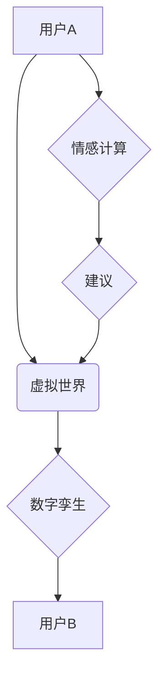

> 元宇宙、远程恋爱、虚拟现实、人工智能、情感计算、数字孪生、交互设计

## 1. 背景介绍

随着科技的飞速发展，元宇宙概念逐渐成为现实，它将虚拟世界与现实世界深度融合，创造出全新的交互体验。在这个虚拟世界中，人们可以自由地创建虚拟形象，参与各种虚拟活动，甚至建立虚拟关系。远程恋爱作为一种新型的恋爱模式，在元宇宙的背景下得到了新的发展机遇。

传统的远程恋爱面临着诸多挑战，例如时空距离、缺乏真实感、沟通障碍等。而元宇宙为远程恋爱提供了全新的解决方案，它可以打破时空限制，创造出更加沉浸式的虚拟约会体验，帮助情侣们克服现实世界的距离感，增强情感连接。

## 2. 核心概念与联系

**2.1 元宇宙**

元宇宙是一个由虚拟现实、增强现实、区块链、人工智能等技术融合而成的虚拟世界，它具有以下特点：

* **沉浸式体验:**  通过VR/AR技术，用户可以身临其境地体验虚拟世界。
* **持久性:** 元宇宙是一个持续运行的虚拟世界，用户可以随时随地进入和离开。
* **去中心化:** 元宇宙由多个平台和开发者共同构建，不存在单一控制者。
* **经济系统:** 元宇宙拥有自己的经济系统，用户可以通过虚拟货币进行交易。

**2.2 远程恋爱**

远程恋爱是指两个相爱的人由于地理距离或其他原因无法经常见面，只能通过网络等方式进行沟通和交流的恋爱模式。

**2.3 核心概念联系**

元宇宙为远程恋爱提供了全新的解决方案，它可以帮助情侣们克服现实世界的距离感，增强情感连接。

* **虚拟约会:** 元宇宙可以提供虚拟约会场所，情侣们可以在虚拟世界中一起散步、聊天、看电影等，体验如同现实世界般的约会场景。
* **数字孪生:** 元宇宙可以创建情侣的数字孪生，让彼此可以随时随地与对方的虚拟形象互动，即使身处不同地点也能感受到彼此的存在。
* **情感计算:** 元宇宙可以利用人工智能技术进行情感计算，分析情侣们的聊天内容和互动行为，提供情感支持和建议。

**2.4 元宇宙远程恋爱架构**



## 3. 核心算法原理 & 具体操作步骤

**3.1 算法原理概述**

元宇宙远程恋爱的核心算法主要包括：

* **虚拟环境构建算法:** 用于构建虚拟约会场所，模拟现实世界场景。
* **数字孪生生成算法:** 用于生成情侣的虚拟形象，使其能够真实地反映现实世界中的外貌和行为。
* **情感计算算法:** 用于分析情侣们的聊天内容和互动行为，识别他们的情感状态和需求。

**3.2 算法步骤详解**

**3.2.1 虚拟环境构建算法**

1. 收集现实世界场景数据，例如建筑物、街道、公园等。
2. 利用3D建模技术构建虚拟场景，并添加虚拟物品和互动元素。
3. 设置虚拟场景的物理引擎，模拟现实世界的物理规则。

**3.2.2 数字孪生生成算法**

1. 收集用户的外貌特征数据，例如身高、体重、肤色、发型等。
2. 利用3D建模技术生成用户的虚拟形象，并赋予其相应的动作和表情。
3. 训练机器学习模型，使数字孪生能够根据用户的行为和情感状态进行动态调整。

**3.2.3 情感计算算法**

1. 收集用户聊天内容和互动行为数据。
2. 利用自然语言处理技术分析聊天内容，识别用户的语气、情感和意图。
3. 利用机器学习模型分析用户的互动行为，识别他们的情感状态和需求。

**3.3 算法优缺点**

**优点:**

* 能够克服现实世界的距离限制，让情侣们即使身处不同地点也能保持情感联系。
* 可以提供更加沉浸式的虚拟约会体验，增强情侣们的互动和情感体验。
* 可以利用人工智能技术提供情感支持和建议，帮助情侣们更好地解决情感问题。

**缺点:**

* 虚拟体验无法完全替代现实体验，可能会导致情感疏离。
* 虚拟世界存在安全风险，例如网络欺诈和隐私泄露。
* 元宇宙技术还处于发展初期，存在技术瓶颈和成本问题。

**3.4 算法应用领域**

* 远程恋爱
* 虚拟社交
* 教育培训
* 医疗保健
* 娱乐休闲

## 4. 数学模型和公式 & 详细讲解 & 举例说明

**4.1 数学模型构建**

元宇宙远程恋爱的核心算法可以抽象为一个数学模型，其中包括以下变量和关系：

* **用户A:**  表示用户A的虚拟形象和情感状态。
* **用户B:** 表示用户B的虚拟形象和情感状态。
* **虚拟环境:** 表示虚拟约会场所的场景和互动元素。
* **情感计算模型:** 用于计算用户A和用户B的情感状态和互动强度。

**4.2 公式推导过程**

情感计算模型可以采用以下公式进行推导：

* **情感强度:**  $E_i = \sum_{j=1}^{n} w_j * s_j$

其中：

* $E_i$ 表示用户i的情感强度。
* $w_j$ 表示第j种情感特征的权重。
* $s_j$ 表示用户i在第j种情感特征上的得分。

* **互动强度:** $I = \frac{1}{T} * \sum_{t=1}^{T} d_t$

其中：

* $I$ 表示用户A和用户B的互动强度。
* $T$ 表示互动时间。
* $d_t$ 表示用户A和用户B在第t时刻的互动距离。

**4.3 案例分析与讲解**

假设用户A和用户B在虚拟公园进行约会，用户A表达了对风景的喜爱，用户B则表达了对用户A的欣赏。

* 用户A的情感强度：$E_A = w_{喜爱} * s_{喜爱} + w_{欣赏} * s_{欣赏}$
* 用户B的情感强度：$E_B = w_{欣赏} * s_{欣赏} + w_{喜爱} * s_{喜爱}$

用户A和用户B的互动强度：$I = \frac{1}{T} * \sum_{t=1}^{T} d_t$

通过分析用户A和用户B的情感强度和互动强度，情感计算模型可以判断他们之间的关系是否良好，并提供相应的建议。

## 5. 项目实践：代码实例和详细解释说明

**5.1 开发环境搭建**

* 操作系统：Windows/macOS/Linux
* 编程语言：Python
* 虚拟环境：使用虚拟环境管理项目依赖

**5.2 源代码详细实现**

```python
# 情感计算模型
def calculate_emotion(text):
    # 使用自然语言处理库分析文本情感
    # ...
    return emotion_score

# 互动强度计算
def calculate_interaction_strength(distance_data):
    # 计算用户互动距离的平均值
    # ...
    return interaction_score

# 主程序
if __name__ == "__main__":
    # 获取用户聊天内容和互动数据
    # ...

    # 计算用户情感强度和互动强度
    emotion_score = calculate_emotion(text)
    interaction_score = calculate_interaction_strength(distance_data)

    # 根据计算结果提供情感建议
    # ...
```

**5.3 代码解读与分析**

* `calculate_emotion()` 函数使用自然语言处理库分析用户聊天内容，识别用户的语气、情感和意图，并返回情感得分。
* `calculate_interaction_strength()` 函数计算用户互动距离的平均值，作为用户互动强度的指标。
* 主程序获取用户聊天内容和互动数据，调用上述函数计算情感强度和互动强度，并根据计算结果提供情感建议。

**5.4 运行结果展示**

运行代码后，可以得到用户情感强度和互动强度的数值，以及相应的建议。例如，如果用户情感强度较高，互动强度也较高，则系统会建议继续保持互动，加强情感连接。

## 6. 实际应用场景

**6.1 远程恋爱平台**

元宇宙远程恋爱平台可以为情侣们提供虚拟约会场所、数字孪生互动、情感计算支持等功能，帮助他们克服现实世界的距离感，增强情感连接。

**6.2 虚拟社交平台**

元宇宙虚拟社交平台可以为用户提供虚拟社交空间，让他们可以创建虚拟形象，与其他用户互动，建立新的社交关系。

**6.3 教育培训平台**

元宇宙教育培训平台可以为用户提供沉浸式的虚拟学习环境，让他们可以身临其境地体验学习内容，提高学习效率。

**6.4 医疗保健平台**

元宇宙医疗保健平台可以为患者提供虚拟医疗服务，例如远程咨询、虚拟手术模拟等，帮助他们获得更便捷、更优质的医疗服务。

**6.5 娱乐休闲平台**

元宇宙娱乐休闲平台可以为用户提供虚拟游戏、虚拟演唱会、虚拟旅游等娱乐体验，让他们可以享受更加丰富多彩的虚拟生活。

**6.6 未来应用展望**

随着元宇宙技术的不断发展，其应用场景将会更加广泛，例如：

* **虚拟婚礼:** 在元宇宙中举办虚拟婚礼，邀请亲朋好友共同参与。
* **虚拟葬礼:** 在元宇宙中举行虚拟葬礼，让逝者家人朋友可以虚拟地告别。
* **虚拟会议:** 在元宇宙中举办虚拟会议，提高会议效率和参与度。

## 7. 工具和资源推荐

**7.1 学习资源推荐**

* **书籍:**
    * 《元宇宙：未来世界的构建》
    * 《元宇宙：虚拟现实与增强现实的融合》
* **在线课程:**
    * Coursera: 元宇宙与虚拟现实
    * Udemy: 元宇宙开发入门

**7.2 开发工具推荐**

* **Unity:** 游戏引擎，用于构建元宇宙虚拟环境。
* **Unreal Engine:** 游戏引擎，用于构建高品质的元宇宙虚拟环境。
* **Blender:** 3D建模软件，用于创建元宇宙虚拟场景和虚拟物品。

**7.3 相关论文推荐**

* 《元宇宙：概念、技术和应用》
* 《元宇宙与远程恋爱的未来》

## 8. 总结：未来发展趋势与挑战

**8.1 研究成果总结**

元宇宙远程恋爱技术在情感计算、虚拟环境构建、数字孪生生成等方面取得了显著进展，为远程情侣提供了更加沉浸式的虚拟约会体验，增强了情感连接。

**8.2 未来发展趋势**

* **技术融合:** 元宇宙远程恋爱技术将与人工智能、区块链、5G等新兴技术更加融合，带来更加智能、安全、便捷的体验。
* **场景丰富:** 元宇宙远程恋爱场景将更加丰富多样，例如虚拟旅行、虚拟游戏、虚拟音乐会等，满足用户多样化的需求。
* **个性化定制:** 元宇宙远程恋爱平台将更加注重用户个性化定制，提供更加符合用户需求的虚拟体验。

**8.3 面临的挑战**

* **技术瓶颈:** 元宇宙技术还处于发展初期，存在技术瓶颈，例如虚拟现实设备的成本、网络带宽的限制等。
* **安全风险:** 元宇宙虚拟世界存在安全风险，例如网络欺诈、隐私泄露等，需要加强安全防护措施。
* **伦理问题:** 元宇宙远程恋爱技术可能引发一些伦理问题，例如虚拟身份的真实性、情感的真实性等，需要进行深入探讨和规范。

**8.4 研究展望**

未来，我们将继续深入研究元宇宙远程恋爱技术，探索其在情感关系、社会互动、文化传承等方面的应用潜力，为人类创造更加美好、更加丰富多彩的虚拟生活。

## 9. 附录：常见问题与解答

**9.1 如何创建虚拟形象？**

可以使用3D建模软件或元宇宙平台提供的虚拟形象创建工具来创建虚拟形象