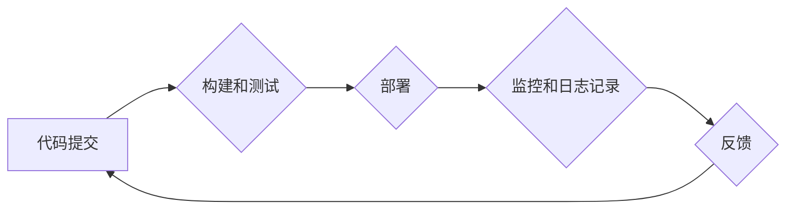

> DevOps, MLOps, 数据驱动, 工具链, 自动化, 持续交付, 模型部署, 模型监控

## 1. 背景介绍

在当今以数据为中心的时代，软件开发和机器学习模型的部署和维护日益复杂。传统的开发流程难以满足快速迭代、持续交付和模型生命周期管理的需求。DevOps 和 MLOps 应运而生，旨在通过自动化、持续集成和持续交付等实践，提高软件开发和机器学习模型部署的效率和可靠性。

DevOps 是一种文化和实践，旨在打破开发和运维之间的壁垒，实现快速、可靠和可持续的软件交付。MLOps 则将 DevOps 的理念应用于机器学习模型的开发、训练、部署和监控。

随着数据量的激增和机器学习模型的日益复杂，构建高效、可靠的 DevOps 和 MLOps 工具链变得尤为重要。数据驱动是构建现代 DevOps 和 MLOps 工具链的核心要素，它可以帮助我们更好地理解用户需求、优化模型性能和提高系统可靠性。

## 2. 核心概念与联系

DevOps 和 MLOps 的核心概念和联系如下：

* **持续集成 (CI):** 开发人员定期将代码提交到共享仓库，并自动构建和测试代码。
* **持续交付 (CD):** 将经过测试的代码自动部署到生产环境。
* **自动化:** 自动化构建、测试、部署和监控流程，提高效率和可靠性。
* **监控和日志记录:** 实时监控系统性能和模型行为，并记录日志信息，以便于故障诊断和问题解决。
* **数据驱动:** 利用数据分析和机器学习模型，优化流程、提高效率和可靠性。

**Mermaid 流程图:**



## 3. 核心算法原理 & 具体操作步骤

### 3.1  算法原理概述

数据驱动的 DevOps 和 MLOps 工具链的核心算法原理包括：

* **机器学习算法:** 用于分析数据、识别模式和预测未来行为。常见的机器学习算法包括线性回归、逻辑回归、决策树、支持向量机和神经网络。
* **数据挖掘算法:** 用于从海量数据中提取有价值的信息。常见的算法包括关联规则挖掘、聚类分析和异常检测。
* **优化算法:** 用于优化模型参数和系统配置，提高模型性能和系统效率。常见的算法包括梯度下降、随机梯度下降和遗传算法。

### 3.2  算法步骤详解

数据驱动的 DevOps 和 MLOps 工具链的具体操作步骤如下：

1. **数据收集和预处理:** 收集相关数据，并进行清洗、转换和特征工程，以确保数据质量和模型训练效果。
2. **模型训练和评估:** 选择合适的机器学习算法，并使用训练数据训练模型。评估模型性能，并进行调参优化。
3. **模型部署和监控:** 将训练好的模型部署到生产环境，并实时监控模型性能和系统行为。
4. **反馈和迭代:** 收集用户反馈和系统日志，并将其反馈到模型训练和优化过程中，不断迭代改进模型和系统。

### 3.3  算法优缺点

数据驱动的 DevOps 和 MLOps 工具链的算法具有以下优缺点：

**优点:**

* **提高效率和可靠性:** 自动化流程和数据驱动决策可以提高效率和可靠性。
* **优化模型性能:** 数据分析和机器学习模型可以帮助优化模型性能和系统配置。
* **提高用户体验:** 数据驱动决策可以帮助更好地理解用户需求，从而提高用户体验。

**缺点:**

* **数据依赖:** 数据质量和可用性直接影响模型性能和系统可靠性。
* **算法复杂性:** 训练和部署复杂的机器学习模型需要专业知识和技术支持。
* **安全和隐私问题:** 数据收集和使用需要考虑安全和隐私问题。

### 3.4  算法应用领域

数据驱动的 DevOps 和 MLOps 工具链的应用领域广泛，包括：

* **软件开发:** 自动化构建、测试、部署和监控流程，提高软件开发效率和可靠性。
* **机器学习模型部署:** 自动化模型训练、部署和监控流程，提高模型部署效率和可靠性。
* **系统优化:** 利用数据分析和机器学习模型，优化系统配置和资源分配，提高系统性能和效率。
* **安全和风险管理:** 利用机器学习模型识别安全威胁和风险，提高系统安全性和可靠性。

## 4. 数学模型和公式 & 详细讲解 & 举例说明

### 4.1  数学模型构建

数据驱动的 DevOps 和 MLOps 工具链通常使用以下数学模型：

* **线性回归:** 用于预测连续变量，例如软件缺陷率或模型预测准确率。
* **逻辑回归:** 用于预测分类变量，例如软件版本是否稳定或用户是否会点击广告。
* **决策树:** 用于分类和回归问题，可以处理非线性关系和交互项。
* **支持向量机:** 用于分类和回归问题，可以处理高维数据和非线性关系。
* **神经网络:** 用于处理复杂数据和非线性关系，可以实现图像识别、自然语言处理等任务。

### 4.2  公式推导过程

例如，线性回归模型的公式如下：

$$
y = \beta_0 + \beta_1 x_1 + \beta_2 x_2 + ... + \beta_n x_n + \epsilon
$$

其中：

* $y$ 是预测变量
* $x_1, x_2, ..., x_n$ 是自变量
* $\beta_0, \beta_1, ..., \beta_n$ 是模型参数
* $\epsilon$ 是误差项

模型参数可以通过最小二乘法估计，即最小化预测值与实际值的平方差。

### 4.3  案例分析与讲解

例如，可以使用线性回归模型预测软件缺陷率。

* 自变量可以包括代码行数、代码复杂度、开发人员经验等。
* 预测变量是软件缺陷率。

通过训练模型，可以得到缺陷率与自变量之间的关系，并预测新软件的缺陷率。

## 5. 项目实践：代码实例和详细解释说明

### 5.1  开发环境搭建

构建数据驱动的 DevOps 和 MLOps 工具链需要以下开发环境：

* **操作系统:** Linux 或 macOS
* **编程语言:** Python 或 Java
* **机器学习库:** scikit-learn, TensorFlow 或 PyTorch
* **容器化工具:** Docker 或 Kubernetes
* **持续集成和持续交付工具:** Jenkins, GitLab CI 或 CircleCI

### 5.2  源代码详细实现

以下是一个使用 Python 和 scikit-learn 库实现线性回归模型的代码示例：

```python
from sklearn.linear_model import LinearRegression
from sklearn.model_selection import train_test_split
from sklearn.metrics import mean_squared_error

# 加载数据
data = ...

# 分割数据
X_train, X_test, y_train, y_test = train_test_split(data.drop('target', axis=1), data['target'], test_size=0.2)

# 创建模型
model = LinearRegression()

# 训练模型
model.fit(X_train, y_train)

# 预测结果
y_pred = model.predict(X_test)

# 计算模型性能
mse = mean_squared_error(y_test, y_pred)
print(f'Mean Squared Error: {mse}')
```

### 5.3  代码解读与分析

* 代码首先加载数据，并使用 `train_test_split` 函数将数据分割成训练集和测试集。
* 然后，创建 `LinearRegression` 模型对象，并使用 `fit` 方法训练模型。
* 训练完成后，使用 `predict` 方法预测测试集的输出值。
* 最后，使用 `mean_squared_error` 函数计算模型性能。

### 5.4  运行结果展示

运行代码后，会输出模型的均方误差值，用于评估模型性能。

## 6. 实际应用场景

数据驱动的 DevOps 和 MLOps 工具链在实际应用场景中具有广泛的应用价值：

### 6.1  软件开发

* **缺陷预测:** 利用历史数据预测软件缺陷率，帮助开发团队提前发现和解决问题。
* **代码质量评估:** 利用机器学习模型评估代码质量，识别潜在的代码缺陷和安全漏洞。
* **自动化测试:** 利用机器学习模型自动生成测试用例，提高测试效率和覆盖率。

### 6.2  机器学习模型部署

* **模型性能监控:** 实时监控模型性能，及时发现模型漂移或性能下降问题。
* **模型版本管理:** 自动管理模型版本，方便回滚和比较不同版本的模型性能。
* **模型部署自动化:** 自动部署模型到生产环境，提高部署效率和可靠性。

### 6.3  系统优化

* **资源分配优化:** 利用数据分析和机器学习模型优化系统资源分配，提高系统性能和效率。
* **故障预测和预防:** 利用机器学习模型预测系统故障，并采取措施进行预防和处理。
* **性能调优:** 利用数据分析和机器学习模型识别系统性能瓶颈，并进行调优。

### 6.4  未来应用展望

数据驱动的 DevOps 和 MLOps 工具链在未来将更加智能化、自动化和一体化。

* **更智能的自动化:** 利用人工智能技术实现更智能的自动化，例如自动识别和解决问题、自动优化系统配置。
* **更强大的数据分析:** 利用更强大的数据分析技术，从更丰富的数据中提取更深入的洞察。
* **更紧密的集成:** DevOps 和 MLOps 工具链将更加紧密地集成，形成一个完整的软件开发和机器学习模型生命周期管理平台。

## 7. 工具和资源推荐

### 7.1  学习资源推荐

* **书籍:**
    * "The Phoenix Project" by Gene Kim, Kevin Behr, and George Spafford
    * "DevOps Handbook" by Gene Kim, Jez Humble, Patrick Debois, and John Willis
    * "Machine Learning for Absolute Beginners" by Oliver Theobald
* **在线课程:**
    * Coursera: DevOps Fundamentals
    * Udemy: Machine Learning A-Z™: Hands-On Python & R In Data Science
    * edX: Introduction to Machine Learning

### 7.2  开发工具推荐

* **持续集成和持续交付工具:**
    * Jenkins
    * GitLab CI
    * CircleCI
* **容器化工具:**
    * Docker
    * Kubernetes
* **机器学习库:**
    * scikit-learn
    * TensorFlow
    * PyTorch

### 7.3  相关论文推荐

* "Accelerating Machine Learning with DevOps" by Google Cloud
* "MLOps: A Survey" by Google AI
* "Building Machine Learning Powered Applications" by O'Reilly Media

## 8. 总结：未来发展趋势与挑战

### 8.1  研究成果总结

数据驱动的 DevOps 和 MLOps 工具链已经取得了显著的成果，提高了软件开发和机器学习模型部署的效率和可靠性。

### 8.2  未来发展趋势

未来，数据驱动的 DevOps 和 MLOps 工具链将朝着以下方向发展：

* **更智能的自动化:** 利用人工智能技术实现更智能的自动化，例如自动识别和解决问题、自动优化系统配置。
* **更强大的数据分析:** 利用更强大的数据分析技术，从更丰富的数据中提取更深入的洞察。
* **更紧密的集成:** DevOps 和 MLOps 工具链将更加紧密地集成，形成一个完整的软件开发和机器学习模型生命周期管理平台。

### 8.3  面临的挑战

数据驱动的 DevOps 和 MLOps 工具链也面临着一些挑战：

* **数据质量和可用性:** 数据质量和可用性直接影响模型性能和系统可靠性。
* **算法复杂性:** 训练和部署复杂的机器学习模型需要专业知识和技术支持。
* **安全和隐私问题:** 数据收集和使用需要考虑安全和隐私问题。

### 