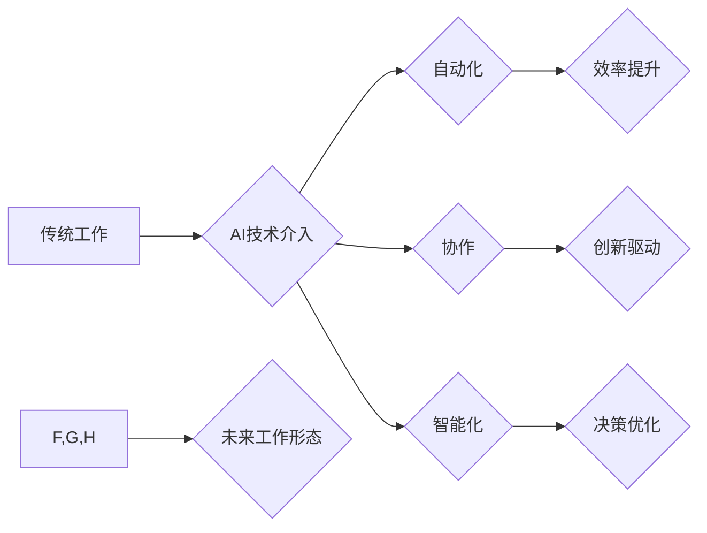

> 人工智能，未来工作，自动化，协作，职业转型，数字技能，伦理

## 1. 背景介绍

21世纪，人工智能（AI）技术飞速发展，正在深刻地改变着人类社会各个领域，其中包括工作形态。从自动驾驶到智能客服，从医疗诊断到金融分析，AI正在逐步取代一些传统工作，同时也创造出新的工作岗位。面对这一变革，我们需要认真思考未来工作形态如何与AI共存，如何让人类和AI共同创造更加美好的未来。

## 2. 核心概念与联系

**2.1  人工智能（AI）**

人工智能是指模拟人类智能行为的计算机系统。它涵盖了多个领域，包括机器学习、深度学习、自然语言处理、计算机视觉等。

**2.2  自动化**

自动化是指利用技术手段代替人工完成重复性、规则性工作，提高工作效率和准确性。AI技术可以实现高度的自动化，例如自动驾驶、机器人操作等。

**2.3  协作**

协作是指人类和AI共同完成任务，发挥各自优势，实现互补和协同。AI可以辅助人类完成复杂任务，提供数据分析和决策支持，而人类则负责制定策略、解决问题和进行创造性工作。

**2.4  未来工作形态**

未来工作形态将更加灵活、多元化和智能化。AI将改变工作内容、工作方式和工作环境，创造出更多新的职业机会。

**2.5  AI与未来工作形态的关系**

AI技术将深刻地影响未来工作形态，推动工作自动化、协作和智能化。

**Mermaid 流程图**



## 3. 核心算法原理 & 具体操作步骤

**3.1  算法原理概述**

深度学习是人工智能领域的重要分支，其核心算法是多层神经网络。深度学习算法通过大量数据训练，学习数据的特征和模式，从而实现对数据的理解和预测。

**3.2  算法步骤详解**

1. **数据预处理:** 将原始数据进行清洗、转换和格式化，使其适合深度学习算法的训练。
2. **网络结构设计:** 根据任务需求设计多层神经网络的结构，包括神经元数量、连接方式和激活函数等。
3. **参数初始化:** 为神经网络中的参数进行随机初始化。
4. **前向传播:** 将输入数据通过神经网络层层传递，最终得到输出结果。
5. **反向传播:** 计算输出结果与真实值的误差，并根据误差反向调整神经网络参数。
6. **梯度下降:** 使用梯度下降算法优化神经网络参数，不断降低误差。
7. **模型评估:** 使用测试数据评估模型的性能，并根据评估结果进行模型调优。

**3.3  算法优缺点**

**优点:**

* 能够学习复杂数据特征，实现高精度预测。
* 具有强大的泛化能力，能够应用于多种任务。

**缺点:**

* 需要大量数据进行训练，训练时间长。
* 模型解释性差，难以理解模型的决策过程。

**3.4  算法应用领域**

* 图像识别
* 自然语言处理
* 机器翻译
* 语音识别
* 医疗诊断
* 金融预测

## 4. 数学模型和公式 & 详细讲解 & 举例说明

**4.1  数学模型构建**

深度学习模型可以看作是一个复杂的数学函数，其输入是数据特征，输出是预测结果。

**4.2  公式推导过程**

深度学习算法的核心是利用梯度下降算法优化神经网络参数。梯度下降算法的目标是找到使损失函数最小的参数值。损失函数衡量模型预测结果与真实值的差异。

**损失函数:**

$$
L = \frac{1}{N} \sum_{i=1}^{N} (y_i - \hat{y}_i)^2
$$

其中：

* $L$ 是损失函数
* $N$ 是样本数量
* $y_i$ 是真实值
* $\hat{y}_i$ 是预测值

**梯度下降算法:**

$$
\theta = \theta - \alpha \nabla L(\theta)
$$

其中：

* $\theta$ 是神经网络参数
* $\alpha$ 是学习率
* $\nabla L(\theta)$ 是损失函数对参数的梯度

**4.3  案例分析与讲解**

例如，在图像识别任务中，深度学习模型可以学习图像特征，并预测图像类别。训练过程中，模型会不断调整参数，使预测结果与真实类别之间的差异最小化。

## 5. 项目实践：代码实例和详细解释说明

**5.1  开发环境搭建**

使用Python语言和深度学习框架TensorFlow或PyTorch进行开发。

**5.2  源代码详细实现**

```python
import tensorflow as tf

# 定义模型结构
model = tf.keras.models.Sequential([
    tf.keras.layers.Conv2D(32, (3, 3), activation='relu', input_shape=(28, 28, 1)),
    tf.keras.layers.MaxPooling2D((2, 2)),
    tf.keras.layers.Conv2D(64, (3, 3), activation='relu'),
    tf.keras.layers.MaxPooling2D((2, 2)),
    tf.keras.layers.Flatten(),
    tf.keras.layers.Dense(10, activation='softmax')
])

# 编译模型
model.compile(optimizer='adam',
              loss='sparse_categorical_crossentropy',
              metrics=['accuracy'])

# 训练模型
model.fit(x_train, y_train, epochs=5)

# 评估模型
loss, accuracy = model.evaluate(x_test, y_test)
print('Test loss:', loss)
print('Test accuracy:', accuracy)
```

**5.3  代码解读与分析**

这段代码定义了一个简单的卷积神经网络模型，用于手写数字识别任务。模型包含卷积层、池化层和全连接层。训练过程中，模型会使用Adam优化器和交叉熵损失函数，并使用准确率作为评估指标。

**5.4  运行结果展示**

训练完成后，模型可以用于预测新的手写数字。

## 6. 实际应用场景

**6.1  自动化办公**

AI可以自动化办公流程，例如自动回复邮件、整理文档、安排会议等，提高工作效率。

**6.2  个性化服务**

AI可以根据用户的需求和喜好提供个性化服务，例如推荐产品、提供定制化内容等。

**6.3  数据分析与决策支持**

AI可以分析海量数据，发现隐藏的模式和趋势，为决策提供支持。

**6.4  未来应用展望**

未来，AI将应用于更多领域，例如医疗保健、教育、交通运输等，创造出更多新的工作机会和社会价值。

## 7. 工具和资源推荐

**7.1  学习资源推荐**

* **在线课程:** Coursera、edX、Udacity等平台提供丰富的AI课程。
* **书籍:** 《深度学习》、《人工智能简史》等书籍可以帮助深入了解AI知识。
* **开源项目:** TensorFlow、PyTorch等开源项目可以帮助实践AI技术。

**7.2  开发工具推荐**

* **Python:** 作为AI开发的主要语言，Python拥有丰富的库和工具。
* **TensorFlow:** Google开发的开源深度学习框架。
* **PyTorch:** Facebook开发的开源深度学习框架。

**7.3  相关论文推荐**

* **《ImageNet Classification with Deep Convolutional Neural Networks》**
* **《Attention Is All You Need》**
* **《BERT: Pre-training of Deep Bidirectional Transformers for Language Understanding》**

## 8. 总结：未来发展趋势与挑战

**8.1  研究成果总结**

近年来，AI技术取得了显著进展，在图像识别、自然语言处理、机器翻译等领域取得了突破性成果。

**8.2  未来发展趋势**

* **模型规模和能力提升:** 未来AI模型将更加强大，能够处理更复杂的任务。
* **边缘计算和部署:** AI将更加广泛地部署在边缘设备上，实现更实时和高效的应用。
* **跨模态学习:** AI将能够理解和处理多种数据类型，例如文本、图像、音频等。

**8.3  面临的挑战**

* **数据安全和隐私保护:** AI模型训练需要大量数据，如何保证数据安全和隐私保护是一个重要挑战。
* **算法可解释性和公平性:** AI模型的决策过程往往难以理解，如何提高算法的可解释性和公平性是一个重要课题。
* **伦理和社会影响:** AI技术的发展可能带来一些伦理和社会问题，需要认真思考和应对。

**8.4  研究展望**

未来，AI研究将继续朝着更智能、更安全、更可解释的方向发展，为人类社会创造更多价值。

## 9. 附录：常见问题与解答

**9.1  什么是深度学习？**

深度学习是一种机器学习方法，它使用多层神经网络来学习数据特征和模式。

**9.2  如何学习AI技术？**

可以通过在线课程、书籍、开源项目等方式学习AI技术。

**9.3  AI技术会取代人类工作吗？**

AI技术会改变工作形态，但不会完全取代人类工作。AI可以帮助人类完成重复性、规则性工作，而人类则负责制定策略、解决问题和进行创造性工作。

**9.4  AI技术有哪些伦理问题？**

AI技术的发展可能带来一些伦理问题，例如算法偏见、数据隐私保护、工作岗位替代等。

**9.5  未来AI技术的发展趋势是什么？**

未来AI技术将朝着更智能、更安全、更可解释的方向发展。


作者：禅与计算机程序设计艺术 / Zen and the Art of Computer Programming 
<end_of_turn>