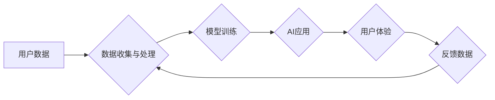

> 苹果, AI应用, 挑战, 数据隐私, 计算能力, 模型训练, 伦理问题, 监管政策

## 1. 背景介绍

近年来，人工智能（AI）技术飞速发展，已渗透到生活的方方面面。从智能手机的语音助手到自动驾驶汽车，AI应用正在改变着我们的生活方式。作为科技巨头，苹果也积极布局AI领域，并将其融入到其产品和服务中。然而，苹果发布AI应用也面临着诸多挑战，其中一些挑战是独有的，也与苹果的商业模式和用户群体密切相关。

## 2. 核心概念与联系

### 2.1 AI应用的本质

AI应用的核心是利用机器学习算法，从海量数据中学习模式和规律，从而实现智能化决策和行为。常见的AI应用包括：

* **自然语言处理（NLP）：** 理解和生成人类语言，例如语音识别、机器翻译、文本摘要等。
* **计算机视觉（CV）：** 理解和分析图像和视频，例如图像识别、物体检测、人脸识别等。
* **推荐系统：** 根据用户的历史行为和偏好，推荐相关商品、内容或服务。

### 2.2 苹果生态系统

苹果拥有庞大的用户群体和完善的生态系统，包括iOS、macOS、watchOS等操作系统，以及App Store、iCloud等服务。这些资源为苹果开发和推广AI应用提供了良好的基础。

### 2.3 数据隐私与安全

苹果一直以来都强调用户隐私和数据安全，其产品和服务都内置了严格的隐私保护机制。然而，AI应用的训练和运行都需要大量数据，这与苹果的隐私政策存在潜在的冲突。

**Mermaid 流程图**



## 3. 核心算法原理 & 具体操作步骤

### 3.1 算法原理概述

机器学习算法的核心是通过学习数据中的模式和规律，建立数学模型，从而实现对新数据的预测或分类。常见的机器学习算法包括：

* **监督学习：** 利用标记数据训练模型，例如分类和回归问题。
* **无监督学习：** 从未标记数据中发现模式和结构，例如聚类和降维。
* **强化学习：** 通过试错学习，在环境中获得最大奖励。

### 3.2 算法步骤详解

以监督学习为例，其基本步骤如下：

1. **数据收集和预处理：** 收集相关数据，并进行清洗、转换和特征工程等预处理操作。
2. **模型选择：** 根据具体问题选择合适的机器学习算法模型。
3. **模型训练：** 利用标记数据训练模型，调整模型参数，使其能够准确预测或分类新数据。
4. **模型评估：** 利用测试数据评估模型的性能，例如准确率、召回率、F1-score等。
5. **模型部署：** 将训练好的模型部署到实际应用场景中，用于预测或分类新数据。

### 3.3 算法优缺点

不同的机器学习算法具有不同的优缺点，需要根据具体问题选择合适的算法。例如，决策树算法易于理解和解释，但泛化能力较弱；支持向量机算法具有较好的泛化能力，但训练时间较长。

### 3.4 算法应用领域

机器学习算法已广泛应用于各个领域，例如：

* **医疗保健：** 疾病诊断、药物研发、患者风险评估等。
* **金融服务：** 欺诈检测、信用评分、投资决策等。
* **电商：** 商品推荐、价格预测、客户服务等。

## 4. 数学模型和公式 & 详细讲解 & 举例说明

### 4.1 数学模型构建

机器学习算法的核心是建立数学模型，用于描述数据之间的关系。常见的数学模型包括：

* **线性回归模型：** 用于预测连续变量，假设数据之间存在线性关系。
* **逻辑回归模型：** 用于分类问题，假设数据之间存在非线性关系。
* **神经网络模型：** 能够学习复杂非线性关系，具有强大的表达能力。

### 4.2 公式推导过程

以线性回归模型为例，其目标是找到最佳的权重参数，使得模型预测值与真实值之间的误差最小。

**损失函数：**

$$
L(w) = \frac{1}{n} \sum_{i=1}^{n} (y_i - \hat{y}_i)^2
$$

其中：

* $w$ 是模型的权重参数。
* $n$ 是样本数量。
* $y_i$ 是第 $i$ 个样本的真实值。
* $\hat{y}_i$ 是模型预测的第 $i$ 个样本的值。

**梯度下降算法：**

$$
w = w - \alpha \frac{\partial L(w)}{\partial w}
$$

其中：

* $\alpha$ 是学习率，控制着参数更新的步长。

### 4.3 案例分析与讲解

假设我们想要预测房价，可以使用线性回归模型。

**数据：**

* 房屋面积 (平方米)
* 房屋价格 (万元)

**模型训练：**

使用梯度下降算法训练线性回归模型，找到最佳的权重参数。

**模型预测：**

输入新的房屋面积，模型可以预测其价格。

## 5. 项目实践：代码实例和详细解释说明

### 5.1 开发环境搭建

* Python 3.x
* TensorFlow 或 PyTorch 等深度学习框架
* Jupyter Notebook 或 VS Code 等代码编辑器

### 5.2 源代码详细实现

```python
import tensorflow as tf

# 定义模型
model = tf.keras.models.Sequential([
    tf.keras.layers.Dense(64, activation='relu', input_shape=(1,)),
    tf.keras.layers.Dense(1)
])

# 编译模型
model.compile(optimizer='adam', loss='mse')

# 训练模型
model.fit(x_train, y_train, epochs=100)

# 预测
predictions = model.predict(x_test)
```

### 5.3 代码解读与分析

* `tf.keras.models.Sequential` 创建一个顺序模型，即层级结构。
* `tf.keras.layers.Dense` 创建全连接层，连接所有输入节点和输出节点。
* `activation='relu'` 使用ReLU激活函数，引入非线性。
* `optimizer='adam'` 使用Adam优化器，更新模型参数。
* `loss='mse'` 使用均方误差作为损失函数，衡量模型预测值与真实值之间的误差。
* `model.fit()` 训练模型，输入训练数据和训练轮数。
* `model.predict()` 使用训练好的模型预测新数据。

### 5.4 运行结果展示

训练完成后，可以评估模型的性能，例如使用测试数据计算模型的均方误差。

## 6. 实际应用场景

### 6.1 智能助手

苹果的Siri智能助手利用自然语言处理技术，可以理解用户的语音指令，并执行相应的操作，例如设置提醒、发送邮件、播放音乐等。

### 6.2 医疗诊断

苹果的HealthKit平台可以收集用户的健康数据，例如心率、睡眠、运动等。利用机器学习算法，可以对这些数据进行分析，辅助医生进行疾病诊断和风险评估。

### 6.3 个性化推荐

苹果的App Store和iTunes Store利用机器学习算法，根据用户的历史行为和偏好，推荐相关的应用程序和音乐。

### 6.4 未来应用展望

随着人工智能技术的不断发展，苹果未来将更多地将AI应用于其产品和服务中，例如：

* **增强现实（AR）和虚拟现实（VR）：** 利用AI技术，打造更沉浸式的AR和VR体验。
* **自动驾驶汽车：** 利用AI技术，开发更安全的自动驾驶汽车。
* **个性化教育：** 利用AI技术，提供个性化的教育方案。

## 7. 工具和资源推荐

### 7.1 学习资源推荐

* **斯坦福大学CS229课程：** 机器学习课程，由Andrew Ng教授授课。
* **Coursera上的机器学习课程：** 由Andrew Ng教授授课，涵盖机器学习的基础知识和应用。
* **TensorFlow官方文档：** 深度学习框架TensorFlow的官方文档。
* **PyTorch官方文档：** 深度学习框架PyTorch的官方文档。

### 7.2 开发工具推荐

* **Jupyter Notebook：** 用于编写和运行Python代码的交互式笔记本。
* **VS Code：** 代码编辑器，支持Python开发。
* **TensorFlow或PyTorch：** 深度学习框架。

### 7.3 相关论文推荐

* **《ImageNet Classification with Deep Convolutional Neural Networks》:** AlexNet论文，介绍了深度卷积神经网络在图像分类领域的应用。
* **《Attention Is All You Need》:** Transformer论文，介绍了注意力机制，在自然语言处理领域取得了突破性进展。

## 8. 总结：未来发展趋势与挑战

### 8.1 研究成果总结

近年来，人工智能技术取得了长足的进步，在各个领域都取得了广泛应用。

### 8.2 未来发展趋势

* **模型规模和能力的提升：** 未来，人工智能模型将更加庞大，拥有更强的学习能力和推理能力。
* **跨模态学习：** 人工智能将能够处理多种数据类型，例如文本、图像、音频等，实现跨模态的理解和交互。
* **边缘计算：** 人工智能将更加靠近数据源，在边缘设备上进行处理，降低延迟和提高效率。

### 8.3 面临的挑战

* **数据隐私和安全：** 人工智能的训练和运行需要大量数据，如何保护用户隐私和数据安全是一个重要的挑战。
* **算法偏见：** 人工智能算法可能存在偏见，导致不公平的结果，需要进行算法的公平性评估和改进。
* **伦理问题：** 人工智能的应用可能引发伦理问题，例如自动驾驶汽车的决策问题，需要进行深入的伦理探讨和规范。

### 8.4 研究展望

未来，人工智能研究将继续朝着更智能、更安全、更可解释的方向发展。


## 9. 附录：常见问题与解答

### 9.1 如何选择合适的机器学习算法？

选择合适的机器学习算法需要根据具体问题和数据特点进行考虑。例如，对于分类问题，可以考虑逻辑回归、支持向量机、决策树等算法；对于回归问题，可以考虑线性回归、支持向量回归、神经网络等算法。

### 9.2 如何评估机器学习模型的性能？

常用的机器学习模型性能评估指标包括准确率、召回率、F1-score、AUC等。

### 9.3 如何解决机器学习算法的过拟合问题？

过拟合是指模型对训练数据过拟合，导致在测试数据上的性能下降。常用的解决方法包括：

* **增加训练数据量。**
* **使用正则化技术，例如L1正则化和L2正则化。**
* **使用交叉验证技术，评估模型在不同数据集上的性能。**
* **使用Dropout技术，随机丢弃神经网络中的某些节点。**

### 9.4 如何解释机器学习模型的决策？

解释机器学习模型的决策是一个重要的研究方向。常用的解释方法包括：

* **特征重要性分析：** 找出对模型决策影响最大的特征。
* **局部解释：** 对单个样本进行解释，分析模型是如何做出决策的。
* **可视化：** 使用可视化技术，展示模型的决策过程。


作者：禅与计算机程序设计艺术 / Zen and the Art of Computer Programming 
<end_of_turn>