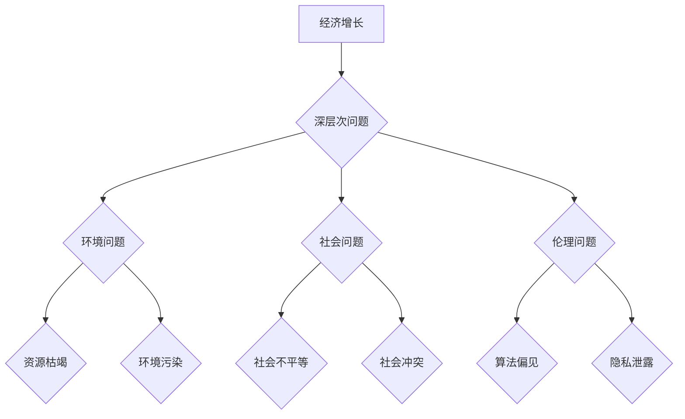

> 深层次问题，经济增长，人工智能，算法，数据驱动，可持续发展，伦理问题

## 1. 背景介绍

在当今数字时代，科技进步正在以前所未有的速度推动着经济发展。人工智能（AI）、大数据、云计算等新兴技术正在深刻地改变着生产方式、生活方式和社会结构。然而，在享受科技红利的同时，我们也面临着一些深层次的问题，这些问题与经济增长的关系密切相关。

传统经济学模型主要关注物质资源、劳动力和资本的投入与产出，而忽略了科技进步和知识创新的重要性。随着科技发展，知识和数据逐渐成为重要的生产要素，传统的经济增长模式面临着挑战。

## 2. 核心概念与联系

**2.1 深层次问题**

深层次问题是指那些超越经济增长指标，涉及社会、环境、伦理等多方面领域的问题。这些问题往往具有复杂性、系统性、长期性等特点，难以用传统的经济学方法进行分析和解决。

**2.2 经济增长与深层次问题之间的联系**

经济增长是社会进步的重要标志，但过度追求经济增长可能会带来一系列负面影响，例如环境污染、资源枯竭、社会不平等等。

**2.3 深层次问题对经济增长的影响**

深层次问题不仅会影响经济的可持续发展，还会阻碍科技创新和经济结构升级。例如，环境污染会增加企业生产成本，降低生产效率；社会不平等会削弱社会稳定，阻碍经济发展。

**2.4 核心概念原理和架构**



## 3. 核心算法原理 & 具体操作步骤

**3.1 算法原理概述**

为了解决深层次问题，需要开发出能够有效分析和处理复杂数据的算法。例如，环境问题可以通过机器学习算法分析环境数据，预测环境变化趋势；社会问题可以通过自然语言处理算法分析社会舆情，识别社会风险。

**3.2 算法步骤详解**

1. 数据收集：收集相关领域的原始数据，例如环境监测数据、社会舆情数据等。
2. 数据预处理：对收集到的数据进行清洗、转换、格式化等处理，使其能够被算法处理。
3. 模型训练：选择合适的算法模型，并利用训练数据对模型进行训练，使其能够学习数据中的规律。
4. 模型评估：评估模型的性能，例如准确率、召回率等指标，并根据评估结果进行模型优化。
5. 模型应用：将训练好的模型应用于实际场景，例如预测环境变化趋势、识别社会风险等。

**3.3 算法优缺点**

**优点：**

* 能够处理海量数据，发现隐藏的规律。
* 能够进行预测和预警，帮助决策者做出更明智的决策。
* 能够自动化处理重复性任务，提高效率。

**缺点：**

* 需要大量的训练数据，数据质量直接影响算法性能。
* 算法本身可能存在偏差，需要进行仔细的评估和校准。
* 算法的解释性较差，难以理解算法的决策过程。

**3.4 算法应用领域**

* 环境保护：预测环境变化趋势、监测污染物排放、评估生态系统健康状况。
* 社会治理：分析社会舆情、识别社会风险、预测社会事件发生概率。
* 医疗保健：辅助诊断疾病、预测患者病情发展、个性化医疗方案制定。

## 4. 数学模型和公式 & 详细讲解 & 举例说明

**4.1 数学模型构建**

为了量化深层次问题的影响，可以构建数学模型，将经济增长与深层次问题之间的关系进行建模。例如，可以构建一个包含经济增长率、环境污染程度、社会不平等指数等变量的模型，分析这些变量之间的相互影响关系。

**4.2 公式推导过程**

假设经济增长率为Y，环境污染程度为E，社会不平等指数为S，则可以构建一个简单的线性模型：

$$Y = f(E, S)$$

其中，f(E, S)是一个函数，表示经济增长率与环境污染程度和社会不平等指数之间的关系。

**4.3 案例分析与讲解**

例如，我们可以假设环境污染程度越高，经济增长率越低，社会不平等指数越高，经济增长率也越低。

因此，我们可以得到以下结论：

* 降低环境污染程度可以促进经济增长。
* 减少社会不平等可以促进经济增长。

**4.4 举例说明**

例如，我们可以通过分析某一地区的经济增长率、环境污染程度和社会不平等指数之间的关系，来判断该地区经济增长的可持续性。

## 5. 项目实践：代码实例和详细解释说明

**5.1 开发环境搭建**

* 操作系统：Linux
* 编程语言：Python
* 数据分析工具：Pandas、NumPy
* 机器学习库：Scikit-learn

**5.2 源代码详细实现**

```python
import pandas as pd
from sklearn.linear_model import LinearRegression

# 加载数据
data = pd.read_csv('economic_data.csv')

# 选择特征变量和目标变量
X = data[['E', 'S']]
y = data['Y']

# 创建线性回归模型
model = LinearRegression()

# 训练模型
model.fit(X, y)

# 预测经济增长率
new_data = pd.DataFrame({'E': [0.5], 'S': [0.2]})
predicted_y = model.predict(new_data)

# 打印预测结果
print(predicted_y)
```

**5.3 代码解读与分析**

* 代码首先加载数据，并选择特征变量和目标变量。
* 然后，创建线性回归模型，并使用训练数据对模型进行训练。
* 最后，使用训练好的模型预测新的数据，并打印预测结果。

**5.4 运行结果展示**

运行代码后，会输出预测的经济增长率。

## 6. 实际应用场景

**6.1 环境保护**

* 利用机器学习算法分析环境监测数据，预测环境变化趋势，例如空气污染、水污染、气候变化等。
* 利用遥感数据分析森林覆盖率变化，监测森林资源的利用情况，评估森林生态系统的健康状况。

**6.2 社会治理**

* 利用自然语言处理算法分析社会舆情，识别社会风险，例如社会冲突、政治动荡、网络谣言等。
* 利用大数据分析社会经济发展趋势，预测社会问题发生概率，制定相应的政策措施。

**6.3 医疗保健**

* 利用机器学习算法辅助诊断疾病，例如癌症、心血管疾病、神经系统疾病等。
* 利用人工智能技术开发个性化医疗方案，根据患者的基因信息、生活习惯等因素，制定个性化的治疗方案。

**6.4 未来应用展望**

随着人工智能技术的不断发展，深层次问题与经济增长的关系将更加密切。未来，人工智能技术将被广泛应用于解决深层次问题，例如：

* 利用人工智能技术开发可持续发展模式，实现经济增长与环境保护的协调发展。
* 利用人工智能技术促进社会公平正义，减少社会不平等，构建更加和谐的社会。
* 利用人工智能技术提升医疗保健水平，延长人类寿命，提高生活质量。

## 7. 工具和资源推荐

**7.1 学习资源推荐**

* **书籍:**
    * 《人工智能：一种现代方法》
    * 《深度学习》
    * 《机器学习》
* **在线课程:**
    * Coursera
    * edX
    * Udacity

**7.2 开发工具推荐**

* **编程语言:** Python
* **数据分析工具:** Pandas, NumPy
* **机器学习库:** Scikit-learn, TensorFlow, PyTorch

**7.3 相关论文推荐**

* **环境保护:**
    * "Machine Learning for Environmental Monitoring and Prediction"
    * "Deep Learning for Climate Change Modeling"
* **社会治理:**
    * "Social Media Analytics for Public Policy"
    * "Predicting Social Unrest with Machine Learning"
* **医疗保健:**
    * "Deep Learning for Medical Image Analysis"
    * "Machine Learning for Personalized Medicine"

## 8. 总结：未来发展趋势与挑战

**8.1 研究成果总结**

近年来，人工智能技术在解决深层次问题方面取得了显著进展。例如，机器学习算法能够有效分析环境数据，预测环境变化趋势；自然语言处理算法能够分析社会舆情，识别社会风险。

**8.2 未来发展趋势**

未来，人工智能技术将继续发展，并在解决深层次问题方面发挥更加重要的作用。例如，

* **更强大的计算能力:** 随着计算能力的提升，人工智能模型能够处理更加复杂的数据，进行更加精细的分析。
* **更丰富的算法:** 新的算法将不断涌现，能够解决更复杂的问题，例如解释性更强的算法、更鲁棒的算法等。
* **更广泛的应用场景:** 人工智能技术将被应用于更多领域，例如教育、文化、娱乐等。

**8.3 面临的挑战**

* **数据安全和隐私保护:** 人工智能技术依赖于大量数据，如何保证数据安全和隐私保护是一个重要的挑战。
* **算法偏见:** 算法本身可能存在偏见，需要进行仔细的评估和校准，避免算法导致的歧视和不公平。
* **伦理问题:** 人工智能技术的发展引发了一些伦理问题，例如人工智能的责任归属、人工智能的控制权等，需要进行深入的探讨和研究。

**8.4 研究展望**

未来，我们需要继续加强对人工智能技术的研发和应用，同时也要关注人工智能技术的伦理问题和社会影响，确保人工智能技术能够真正造福人类。

## 9. 附录：常见问题与解答

**9.1 如何评估人工智能算法的性能？**

人工智能算法的性能可以通过多种指标进行评估，例如准确率、召回率、F1-score等。

**9.2 如何解决人工智能算法的偏见问题？**

可以采用以下方法解决人工智能算法的偏见问题：

* 使用更加多样化的训练数据。
* 对算法进行公平性评估和校准。
* 开发更加公平的算法模型。

**9.3 人工智能技术对社会有哪些影响？**

人工智能技术对社会的影响是多方面的，既有积极的一面，也有消极的一面。

* 积极方面：提高生产效率、改善生活质量、解决社会问题等。
* 消极方面：导致失业、加剧社会不平等、引发伦理问题等。

作者：禅与计算机程序设计艺术 / Zen and the Art of Computer Programming


<end_of_turn>