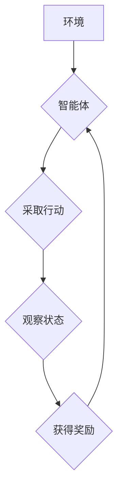

> 深度学习，Q-learning，强化学习，智慧农业，智能决策，资源优化

## 1. 背景介绍

农业作为人类文明的基石，一直面临着产量、效率和可持续性等方面的挑战。随着人口增长和环境变化，智慧农业的建设成为全球关注的焦点。智慧农业旨在通过信息技术、传感器网络、数据分析等手段，实现农业生产的智能化、精准化和可持续发展。

强化学习（Reinforcement Learning，RL）作为一种机器学习范式，在解决复杂决策问题方面展现出强大的潜力。它通过建立“智能体-环境”的交互系统，让智能体通过与环境的互动学习最优策略，从而实现目标。深度强化学习（Deep Reinforcement Learning，DRL）将深度神经网络与强化学习相结合，能够处理更复杂、更高维度的决策问题。

## 2. 核心概念与联系

**2.1 强化学习的基本概念**

强化学习的核心在于智能体与环境的交互过程。智能体在环境中采取行动，环境会根据智能体的行动产生相应的奖励或惩罚。智能体的目标是通过不断学习，找到能够最大化累积奖励的策略。

**2.2 深度强化学习的优势**

深度强化学习相较于传统强化学习，具有以下优势：

* **处理复杂环境的能力更强:** 深度神经网络能够学习复杂的特征表示，从而更好地处理高维、非线性环境。
* **学习能力更强:** 深度神经网络具有强大的学习能力，能够从大量数据中学习出更优的策略。
* **适应性更强:** 深度强化学习算法能够适应不断变化的环境。

**2.3 深度 Q-learning 的原理**

深度 Q-learning 是一种基于深度神经网络的强化学习算法，它通过学习一个 Q 函数来估计在给定状态下采取不同行动的期望回报。Q 函数是一个映射关系，将状态-动作对映射到期望回报值。

**2.4 深度 Q-learning 在智慧农业中的应用**

深度 Q-learning 可以应用于智慧农业中的多个场景，例如：

* **精准灌溉:** 根据土壤湿度、气象条件等信息，学习最优的灌溉策略，提高水资源利用效率。
* **智能施肥:** 根据作物生长需求和土壤肥力等信息，学习最优的施肥策略，提高肥料利用效率。
* **病虫害防治:** 根据作物生长状况和病虫害信息，学习最优的防治策略，减少农药使用量。

**2.5 Mermaid 流程图**



## 3. 核心算法原理 & 具体操作步骤

### 3.1 算法原理概述

深度 Q-learning 算法的核心思想是通过深度神经网络学习一个 Q 函数，该函数能够估计在给定状态下采取不同行动的期望回报。算法通过不断与环境交互，更新 Q 函数，最终学习出最优策略。

### 3.2 算法步骤详解

1. **初始化:** 初始化 Q 函数，通常使用随机值初始化。
2. **环境交互:** 智能体与环境交互，观察当前状态。
3. **选择行动:** 根据 Q 函数估计，选择一个动作。
4. **执行行动:** 智能体执行选择的行动，观察环境的变化。
5. **获得奖励:** 环境根据智能体的行动提供奖励。
6. **更新 Q 函数:** 使用 Bellman 方程更新 Q 函数，将奖励和下一个状态的 Q 值纳入考虑。
7. **重复步骤 2-6:** 重复上述步骤，直到智能体学习出最优策略。

### 3.3 算法优缺点

**优点:**

* 能够处理复杂环境。
* 学习能力强。
* 适应性强。

**缺点:**

* 训练时间长。
* 需要大量的训练数据。
* 容易陷入局部最优。

### 3.4 算法应用领域

深度 Q-learning 算法在许多领域都有应用，例如：

* 机器人控制
* 游戏人工智能
* 自动驾驶
* 医疗诊断
* 金融投资

## 4. 数学模型和公式 & 详细讲解 & 举例说明

### 4.1 数学模型构建

深度 Q-learning 的数学模型主要包括以下几个部分：

* **状态空间:** 表示环境可能存在的各种状态。
* **动作空间:** 表示智能体可以采取的各种动作。
* **奖励函数:** 将状态-动作对映射到奖励值。
* **Q 函数:** 将状态-动作对映射到期望回报值。

### 4.2 公式推导过程

**Bellman 方程:**

$$
Q(s, a) = R(s, a) + \gamma \max_{a'} Q(s', a')
$$

其中:

* $Q(s, a)$ 表示在状态 $s$ 下采取动作 $a$ 的期望回报。
* $R(s, a)$ 表示在状态 $s$ 下采取动作 $a$ 得到的即时奖励。
* $\gamma$ 表示折扣因子，控制未来奖励的权重。
* $s'$ 表示采取动作 $a$ 后进入的下一个状态。
* $a'$ 表示在下一个状态 $s'$ 中可以采取的动作。

**深度神经网络:**

深度神经网络用于逼近 Q 函数，其输出为每个动作的 Q 值。

### 4.3 案例分析与讲解

假设一个智能体在玩一个简单的游戏，游戏环境有两种状态： “开始” 和 “结束”。智能体可以采取两种动作： “前进” 和 “后退”。

* 当智能体在 “开始” 状态下采取 “前进” 动作时，会得到奖励 1，并进入 “结束” 状态。
* 当智能体在 “开始” 状态下采取 “后退” 动作时，会得到奖励 0，并保持在 “开始” 状态。
* 当智能体在 “结束” 状态下采取任何动作时，都会得到奖励 0。

使用深度 Q-learning 算法，智能体可以学习到最优策略，即在 “开始” 状态下采取 “前进” 动作，以获得最大的累积奖励。

## 5. 项目实践：代码实例和详细解释说明

### 5.1 开发环境搭建

* Python 3.x
* TensorFlow 或 PyTorch
* OpenAI Gym

### 5.2 源代码详细实现

```python
import tensorflow as tf

# 定义 Q 函数网络
class QNetwork(tf.keras.Model):
    def __init__(self):
        super(QNetwork, self).__init__()
        self.dense1 = tf.keras.layers.Dense(64, activation='relu')
        self.dense2 = tf.keras.layers.Dense(64, activation='relu')
        self.output = tf.keras.layers.Dense(2)

    def call(self, state):
        x = self.dense1(state)
        x = self.dense2(x)
        return self.output(x)

# 创建 Q 网络实例
q_network = QNetwork()

# 定义训练函数
def train_step(state, action, reward, next_state, done):
    with tf.GradientTape() as tape:
        q_values = q_network(state)
        target_q_value = reward + gamma * tf.reduce_max(q_network(next_state), axis=1)
        loss = tf.keras.losses.MeanSquaredError()(target_q_value, q_values[0, action])
    gradients = tape.gradient(loss, q_network.trainable_variables)
    optimizer.apply_gradients(zip(gradients, q_network.trainable_variables))

# ... 训练循环 ...
```

### 5.3 代码解读与分析

* **Q 函数网络:** 使用深度神经网络来逼近 Q 函数，其结构可以根据具体任务进行调整。
* **训练函数:** 使用 Bellman 方程更新 Q 函数，并使用梯度下降算法进行训练。
* **训练循环:** 循环地从环境中获取数据，训练 Q 网络，直到达到预设的性能指标。

### 5.4 运行结果展示

训练完成后，可以将训练好的 Q 网络应用于实际环境中，例如在农业场景中，可以根据传感器数据和环境信息，预测最优的灌溉、施肥或防治策略。

## 6. 实际应用场景

### 6.1 精准灌溉

深度 Q-learning 可以学习最优的灌溉策略，根据土壤湿度、气象条件等信息，动态调整灌溉时间和水量，提高水资源利用效率，减少水浪费。

### 6.2 智能施肥

深度 Q-learning 可以学习最优的施肥策略，根据作物生长需求、土壤肥力等信息，动态调整施肥时间和施肥量，提高肥料利用效率，减少环境污染。

### 6.3 病虫害防治

深度 Q-learning 可以学习最优的病虫害防治策略，根据作物生长状况、病虫害信息等信息，动态调整防治措施，减少农药使用量，提高农产品质量。

### 6.4 未来应用展望

随着人工智能技术的不断发展，深度 Q-learning 在智慧农业中的应用前景广阔。未来，深度 Q-learning 可以应用于更多农业场景，例如：

* **精准播种:** 根据土壤条件和作物需求，学习最优的播种时间和播种密度。
* **智能收获:** 根据作物成熟度和环境条件，学习最优的收获时间和收获方式。
* **农业机器人:** 利用深度 Q-learning 训练农业机器人的控制策略，实现自动化作业。

## 7. 工具和资源推荐

### 7.1 学习资源推荐

* **书籍:**
    * Reinforcement Learning: An Introduction by Richard S. Sutton and Andrew G. Barto
    * Deep Reinforcement Learning Hands-On by Maxim Lapan
* **在线课程:**
    * Deep Reinforcement Learning Specialization by DeepLearning.AI
    * Reinforcement Learning by David Silver (University of DeepMind)

### 7.2 开发工具推荐

* **TensorFlow:** 开源深度学习框架，支持深度 Q-learning 的实现。
* **PyTorch:** 开源深度学习框架，支持深度 Q-learning 的实现。
* **OpenAI Gym:** 提供了多种环境，用于训练和评估强化学习算法。

### 7.3 相关论文推荐

* Deep Q-Network (DQN) by Volodymyr Mnih et al. (2015)
* Dueling Network Architectures for Deep Reinforcement Learning by Hado van Hasselt et al. (2016)
* Double Q-Learning by  Richard S. Sutton and Andrew G. Barto (1996)

## 8. 总结：未来发展趋势与挑战

### 8.1 研究成果总结

深度 Q-learning 在智慧农业领域取得了显著的成果，例如在精准灌溉、智能施肥、病虫害防治等方面展现出强大的应用潜力。

### 8.2 未来发展趋势

* **模型复杂度提升:** 探索更复杂、更强大的深度神经网络结构，提高算法的学习能力和泛化能力。
* **数据驱动:** 利用大规模农业数据，训练更精准、更有效的深度 Q-learning 模型。
* **多智能体协作:** 研究多智能体协作的深度 Q-learning 算法，实现更复杂的农业场景的智能化管理。

### 8.3 面临的挑战

* **数据获取和标注:** 农业数据往往分散、不完整，需要开发新的数据获取和标注方法。
* **模型解释性:** 深度学习模型的决策过程往往难以解释，需要开发新的方法提高模型的透明度和可解释性。
* **安全性和可靠性:** 深度 Q-learning 系统需要保证安全性和可靠性，避免因算法错误导致的农业损失。

### 8.4 研究展望

未来，深度 Q-learning 将继续在智慧农业领域发挥重要作用，推动农业生产的智能化、精准化和可持续发展。


## 9. 附录：常见问题与解答

**Q1: