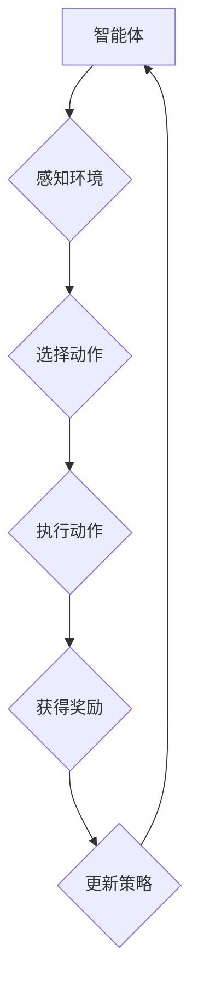

> 深度 Q-learning，网格计算，强化学习，深度神经网络，价值函数，策略优化

## 1. 背景介绍

在现代计算领域，网格计算作为一种分布式计算模式，凭借其资源共享、弹性伸缩和高并行处理能力，在科学计算、大数据分析、人工智能训练等领域展现出巨大的潜力。然而，网格计算环境的复杂性和动态性也带来了新的挑战，例如资源分配、任务调度和性能优化等。

强化学习 (Reinforcement Learning, RL) 作为一种机器学习范式，通过智能体与环境的交互学习最优策略，在解决复杂决策问题方面展现出强大的能力。深度强化学习 (Deep Reinforcement Learning, DRL) 将深度神经网络与强化学习相结合，能够学习更复杂的策略，并应用于更复杂的场景。

深度 Q-learning 是一种经典的 DRL 算法，通过学习状态-动作价值函数 (Q-value) 来指导智能体的决策。它在网格计算环境中具有广泛的应用前景，例如：

* **资源分配优化:** 深度 Q-learning 可以学习最优的资源分配策略，将计算任务分配到最合适的节点，提高资源利用率和系统性能。
* **任务调度优化:** 深度 Q-learning 可以学习最优的任务调度策略，根据任务的优先级、资源需求和节点状态，动态调度任务，提高任务执行效率。
* **网络流量控制:** 深度 Q-learning 可以学习最优的网络流量控制策略，根据网络状态和用户需求，动态调整流量分配，提高网络吞吐量和用户体验。

## 2. 核心概念与联系

**2.1 强化学习基本概念**

强化学习的核心是智能体与环境的交互过程。智能体通过与环境的交互，获得奖励或惩罚，并根据这些反馈调整自己的行为策略，最终学习到最优的策略。

* **智能体 (Agent):**  学习和决策的实体。
* **环境 (Environment):** 智能体所处的外部世界。
* **状态 (State):** 环境的当前状态。
* **动作 (Action):** 智能体可以采取的行动。
* **奖励 (Reward):** 环境对智能体动作的反馈，可以是正向奖励或负向惩罚。
* **策略 (Policy):** 智能体根据当前状态选择动作的规则。

**2.2 深度 Q-learning**

深度 Q-learning 是一种基于 Q-value 的强化学习算法，它利用深度神经网络来估计状态-动作价值函数 (Q-value)。Q-value 表示在当前状态执行某个动作，并遵循某个策略，未来获得的总奖励期望值。

**2.3 网格计算环境**

网格计算环境由多个节点组成，每个节点都具有计算资源和存储资源。节点之间通过网络进行通信，可以共享资源和协同工作。

**2.4 核心概念联系**

深度 Q-learning 可以应用于网格计算环境，帮助智能体学习最优的资源分配、任务调度和网络流量控制策略。

**2.5 Mermaid 流程图**



## 3. 核心算法原理 & 具体操作步骤

### 3.1 算法原理概述

深度 Q-learning 的核心思想是通过迭代更新 Q-value 函数，学习最优的策略。

* **Q-value 函数:**  Q(s, a) 表示在状态 s 下执行动作 a 的价值。
* **Bellman 方程:**  Q(s, a) = R(s, a) + γ * max_a' Q(s', a')，其中 R(s, a) 是执行动作 a 在状态 s 下获得的奖励，γ 是折扣因子，s' 是执行动作 a 后进入的下一个状态。
* **深度神经网络:**  深度神经网络用于估计 Q-value 函数。

### 3.2 算法步骤详解

1. **初始化:** 初始化 Q-value 函数，可以随机初始化或使用预训练模型。
2. **环境交互:** 智能体与环境交互，感知环境状态，选择动作并执行。
3. **奖励获得:** 环境根据智能体的动作提供奖励。
4. **Q-value 更新:** 使用 Bellman 方程更新 Q-value 函数。
5. **策略更新:** 根据更新后的 Q-value 函数，更新策略，选择最优动作。
6. **重复步骤 2-5:** 重复上述步骤，直到智能体学习到最优策略。

### 3.3 算法优缺点

**优点:**

* 可以学习复杂策略。
* 可以应用于离散和连续动作空间。
* 可以并行训练。

**缺点:**

* 训练时间长。
* 需要大量的训练数据。
* 容易陷入局部最优。

### 3.4 算法应用领域

* **机器人控制:** 学习机器人最优的运动策略。
* **游戏 AI:** 学习游戏 AI 最优的游戏策略。
* **推荐系统:** 学习用户最喜欢的商品推荐策略。
* **金融交易:** 学习股票交易最优的策略。

## 4. 数学模型和公式 & 详细讲解 & 举例说明

### 4.1 数学模型构建

深度 Q-learning 的数学模型可以表示为一个马尔可夫决策过程 (MDP)。

* **状态空间:** S = {s1, s2, ..., sn}
* **动作空间:** A = {a1, a2, ..., am}
* **状态转移概率:** P(s', r | s, a) 表示从状态 s 执行动作 a 后进入状态 s' 并获得奖励 r 的概率。
* **奖励函数:** R(s, a) 表示在状态 s 执行动作 a 后获得的奖励。
* **折扣因子:** γ ∈ [0, 1] 表示未来奖励的折扣率。

### 4.2 公式推导过程

深度 Q-learning 的目标是学习最优的策略 π*, 使得期望总奖励最大化。

$$
\pi* = \arg\max_{\pi} \mathbb{E}_{\pi} \sum_{t=0}^{\infty} \gamma^t R(s_t, a_t)
$$

其中，π 是策略，s_t 是时间 t 的状态，a_t 是时间 t 的动作。

Bellman 方程可以用来更新 Q-value 函数:

$$
Q(s, a) = R(s, a) + \gamma \max_{a'} Q(s', a')
$$

### 4.3 案例分析与讲解

假设一个智能体在网格环境中移动，目标是到达终点。

* 状态空间: 网格中的每个位置。
* 动作空间: 上、下、左、右四个方向。
* 奖励函数: 抵达终点获得最大奖励，其他状态获得较小奖励。

深度 Q-learning 可以学习智能体在每个位置采取哪个方向移动，以达到最快的目标。

## 5. 项目实践：代码实例和详细解释说明

### 5.1 开发环境搭建

* Python 3.x
* TensorFlow 或 PyTorch
* NumPy
* Matplotlib

### 5.2 源代码详细实现

```python
import tensorflow as tf

# 定义 Q-网络
class QNetwork(tf.keras.Model):
    def __init__(self):
        super(QNetwork, self).__init__()
        self.dense1 = tf.keras.layers.Dense(64, activation='relu')
        self.dense2 = tf.keras.layers.Dense(64, activation='relu')
        self.output = tf.keras.layers.Dense(4)

    def call(self, state):
        x = self.dense1(state)
        x = self.dense2(x)
        return self.output(x)

# 定义深度 Q-learning 算法
class DeepQLearning:
    def __init__(self, state_size, action_size, learning_rate=0.001, gamma=0.99, epsilon=1.0, epsilon_decay=0.995, epsilon_min=0.01):
        self.state_size = state_size
        self.action_size = action_size
        self.learning_rate = learning_rate
        self.gamma = gamma
        self.epsilon = epsilon
        self.epsilon_decay = epsilon_decay
        self.epsilon_min = epsilon_min
        self.q_network = QNetwork()
        self.optimizer = tf.keras.optimizers.Adam(learning_rate=self.learning_rate)

    def choose_action(self, state):
        if tf.random.uniform(()) < self.epsilon:
            return tf.random.uniform(shape=(1,), minval=0, maxval=self.action_size, dtype=tf.int32)
        else:
            q_values = self.q_network(state)
            return tf.argmax(q_values, axis=1)

    def train(self, state, action, reward, next_state, done):
        with tf.GradientTape() as tape:
            q_values = self.q_network(state)
            target_q = reward + self.gamma * tf.reduce_max(self.q_network(next_state), axis=1) * (1 - done)
            loss = tf.keras.losses.MeanSquaredError()(target_q, q_values[0, action])
        gradients = tape.gradient(loss, self.q_network.trainable_variables)
        self.optimizer.apply_gradients(zip(gradients, self.q_network.trainable_variables))

        self.epsilon = max(self.epsilon * self.epsilon_decay, self.epsilon_min)

# ... (其他代码)
```

### 5.3 代码解读与分析

* **QNetwork:** 定义了深度神经网络结构，用于估计 Q-value 函数。
* **DeepQLearning:** 定义了深度 Q-learning 算法，包括初始化、选择动作、训练等方法。
* **choose_action:** 根据 epsilon-greedy 策略选择动作。
* **train:** 使用 Bellman 方程更新 Q-value 函数。

### 5.4 运行结果展示

运行代码后，智能体将在网格环境中学习最优的移动策略，最终到达终点。

## 6. 实际应用场景

### 6.1 资源分配优化

在云计算环境中，深度 Q-learning 可以学习最优的资源分配策略，将计算任务分配到最合适的节点，提高资源利用率和系统性能。

### 6.2 任务调度优化

在大数据处理平台中，深度 Q-learning 可以学习最优的任务调度策略，根据任务的优先级、资源需求和节点状态，动态调度任务，提高任务执行效率。

### 6.3 网络流量控制

在网络拥塞场景中，深度 Q-learning 可以学习最优的网络流量控制策略，根据网络状态和用户需求，动态调整流量分配，提高网络吞吐量和用户体验。

### 6.4 未来应用展望

深度 Q-learning 在网格计算领域的应用前景广阔，未来可以应用于更多场景，例如：

* **边缘计算:** 学习最优的资源分配和任务调度策略，提高边缘计算的效率和可靠性。
* **物联网:** 学习最优的传感器数据处理和网络流量控制策略，提高物联网的性能和安全性。
* **工业自动化:** 学习最优的机器控制和生产调度策略，提高工业生产的效率和质量。

## 7. 工具和资源推荐

### 7.1 学习资源推荐

* **书籍:**
    * Reinforcement Learning: An Introduction by Richard S. Sutton and Andrew G. Barto
    * Deep Reinforcement Learning Hands-On by Maxim Lapan
* **在线课程:**
    * Deep Reinforcement Learning Specialization by DeepLearning.AI
    * Reinforcement Learning by David Silver (University of DeepMind)

### 7.2 开发工具推荐

* **TensorFlow:** 开源深度学习框架，支持深度 Q-learning 的实现。
* **