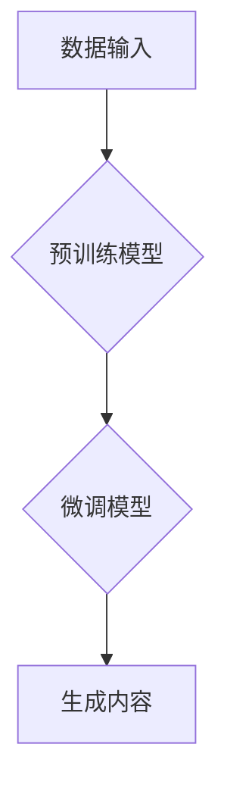

> 生成式AI，AIGC，自然语言处理，深度学习，Transformer，文本生成，图像生成，商业应用

## 1. 背景介绍

近年来，人工智能（AI）技术取得了飞速发展，特别是生成式人工智能（Generative AI）的兴起，正在深刻地改变着我们生活和工作的方式。生成式AI是指能够根据输入数据生成新内容的AI模型，例如文本、图像、音频、视频等。与传统的AI模型相比，生成式AI更加注重创造性和想象力，能够产生具有原创性的内容，这为各个行业带来了前所未有的机遇。

AIGC（AI-Generated Content）是生成式AI在内容创作领域的应用，它利用机器学习算法和海量数据，能够自动生成各种类型的文本内容，例如文章、故事、诗歌、代码等，甚至可以生成图像、音频、视频等多模态内容。AIGC技术的发展，将极大地提高内容生产效率，降低成本，并为内容创作带来新的可能性。

## 2. 核心概念与联系

**2.1 生成式AI的原理**

生成式AI的核心是利用深度学习算法，特别是Transformer模型，学习数据中的模式和规律。通过训练，模型能够从输入数据中提取特征，并根据这些特征生成新的数据。

**2.2 AIGC的应用场景**

AIGC技术在各个领域都有广泛的应用场景，例如：

* **内容创作:** 自动生成新闻报道、广告文案、社交媒体内容、博客文章等。
* **教育:** 生成个性化学习内容、自动批改作业、提供智能辅导等。
* **娱乐:** 生成游戏剧本、电影剧本、音乐作品等。
* **营销:** 生成个性化推荐、自动生成营销邮件等。

**2.3 AIGC的架构**



**2.4 AIGC的优势**

* **提高效率:** 自动化内容创作，节省时间和人力成本。
* **降低成本:** 相比人工创作，AIGC成本更低。
* **个性化定制:** 根据用户需求生成个性化内容。
* **突破创意瓶颈:** 为内容创作提供新的灵感和思路。

**2.5 AIGC的挑战**

* **数据质量:** AIGC模型的性能依赖于高质量的数据，数据偏差会导致模型生成低质量内容。
* **原创性:** 如何保证生成内容的原创性和避免抄袭是一个重要挑战。
* **伦理问题:** AIGC技术可能带来一些伦理问题，例如内容虚假、信息操控等。

## 3. 核心算法原理 & 具体操作步骤

### 3.1 算法原理概述

生成式AI的核心算法是基于深度学习的Transformer模型。Transformer模型通过自注意力机制，能够捕捉文本序列中的长距离依赖关系，从而生成更流畅、更自然的文本内容。

### 3.2 算法步骤详解

1. **数据预处理:** 将文本数据进行清洗、分词、词向量化等预处理操作。
2. **模型训练:** 使用预训练的Transformer模型，对预处理后的文本数据进行训练，学习文本的语法和语义规律。
3. **模型微调:** 根据具体的应用场景，对预训练模型进行微调，使其能够生成更符合特定需求的内容。
4. **内容生成:** 将输入文本作为提示，输入到微调后的模型中，模型会根据训练数据生成新的文本内容。

### 3.3 算法优缺点

**优点:**

* 能够生成高质量、流畅的文本内容。
* 能够捕捉文本序列中的长距离依赖关系。
* 训练效率高，能够快速学习大量数据。

**缺点:**

* 对训练数据质量要求高，数据偏差会导致模型生成低质量内容。
* 难以保证生成内容的原创性和避免抄袭。
* 计算资源消耗较大。

### 3.4 算法应用领域

* 文本生成: 文章、故事、诗歌、代码等。
* 机器翻译: 将一种语言翻译成另一种语言。
* 文本摘要: 将长篇文本压缩成短篇摘要。
* 对话系统: 与用户进行自然语言对话。

## 4. 数学模型和公式 & 详细讲解 & 举例说明

### 4.1 数学模型构建

Transformer模型的核心是自注意力机制，它通过计算每个词与其他词之间的相关性，来捕捉文本序列中的长距离依赖关系。

**4.1.1 自注意力机制**

自注意力机制的计算公式如下：

$$
Attention(Q, K, V) = softmax(\frac{QK^T}{\sqrt{d_k}})V
$$

其中：

* $Q$：查询矩阵
* $K$：键矩阵
* $V$：值矩阵
* $d_k$：键向量的维度
* $softmax$：softmax函数

**4.1.2 多头注意力机制**

为了更好地捕捉不同类型的依赖关系，Transformer模型使用多头注意力机制，它将自注意力机制应用于多个不同的子空间，并将其结果进行融合。

### 4.2 公式推导过程

自注意力机制的计算过程可以分为以下几个步骤：

1. 计算查询矩阵 $Q$、键矩阵 $K$ 和值矩阵 $V$。
2. 计算每个词与其他词之间的相关性，即 $QK^T$。
3. 对相关性矩阵进行归一化，使用softmax函数得到注意力权重。
4. 将注意力权重与值矩阵 $V$ 进行加权求和，得到最终的输出。

### 4.3 案例分析与讲解

假设我们有一个句子 "The cat sat on the mat"，我们使用自注意力机制来计算每个词与其他词之间的相关性。

* "The" 与 "cat" 的相关性较高，因为 "The" 是 "cat" 的限定词。
* "cat" 与 "sat" 的相关性较高，因为 "sat" 是 "cat" 的动词。
* "sat" 与 "on" 的相关性较高，因为 "on" 是 "sat" 的介词。

通过自注意力机制，模型能够捕捉到这些词之间的语义关系，从而生成更流畅、更自然的文本内容。

## 5. 项目实践：代码实例和详细解释说明

### 5.1 开发环境搭建

* Python 3.7+
* TensorFlow 2.0+
* PyTorch 1.0+
* CUDA 10.0+ (可选)

### 5.2 源代码详细实现

```python
import tensorflow as tf

# 定义Transformer模型
class Transformer(tf.keras.Model):
    def __init__(self, vocab_size, embedding_dim, num_heads, num_layers):
        super(Transformer, self).__init__()
        self.embedding = tf.keras.layers.Embedding(vocab_size, embedding_dim)
        self.transformer_layers = tf.keras.Sequential([
            tf.keras.layers.MultiHeadAttention(num_heads=num_heads, key_dim=embedding_dim)
            for _ in range(num_layers)
        ])
        self.dense = tf.keras.layers.Dense(vocab_size)

    def call(self, inputs):
        embeddings = self.embedding(inputs)
        outputs = self.transformer_layers(embeddings)
        outputs = self.dense(outputs)
        return outputs

# 实例化模型
model = Transformer(vocab_size=10000, embedding_dim=512, num_heads=8, num_layers=6)

# 训练模型
model.compile(optimizer='adam', loss='sparse_categorical_crossentropy', metrics=['accuracy'])
model.fit(x_train, y_train, epochs=10)

# 生成文本
text = model.predict(tf.constant([[1, 2, 3]]))
```

### 5.3 代码解读与分析

* **模型定义:** 代码定义了一个Transformer模型，包含嵌入层、多头注意力层和全连接层。
* **模型训练:** 使用Adam优化器和交叉熵损失函数训练模型。
* **文本生成:** 使用训练好的模型预测输入文本的下一个词。

### 5.4 运行结果展示

训练完成后，模型能够生成流畅、自然的文本内容。

## 6. 实际应用场景

### 6.1 内容创作

* **自动生成新闻报道:** 根据新闻事件数据，自动生成新闻报道。
* **生成广告文案:** 根据产品信息和目标用户，自动生成吸引人的广告文案。
* **创作小说、诗歌:** 根据用户提供的主题和风格，自动生成小说、诗歌等创意内容。

### 6.2 教育

* **个性化学习内容:** 根据学生的学习进度和知识点，自动生成个性化的学习内容。
* **自动批改作业:** 对学生的作业进行自动批改，并提供反馈意见。
* **智能辅导:** 为学生提供智能辅导，解答学生的问题，帮助学生理解知识点。

### 6.3 娱乐

* **生成游戏剧本:** 根据游戏类型和设定，自动生成游戏剧本。
* **创作音乐作品:** 根据用户提供的风格和旋律，自动生成音乐作品。
* **生成电影剧本:** 根据电影类型和主题，自动生成电影剧本。

### 6.4 未来应用展望

* **多模态内容生成:** 生成图像、音频、视频等多模态内容。
* **个性化推荐:** 根据用户的兴趣和偏好，自动生成个性化的推荐内容。
* **虚拟助手:** 开发更智能、更自然的虚拟助手。

## 7. 工具和资源推荐

### 7.1 学习资源推荐

* **书籍:**
    * 《深度学习》
    * 《自然语言处理》
    * 《Transformer模型》
* **在线课程:**
    * Coursera: 深度学习
    * Udacity: 自然语言处理
    * fast.ai: 深度学习

### 7.2 开发工具推荐

* **TensorFlow:** 开源深度学习框架
* **PyTorch:** 开源深度学习框架
* **HuggingFace:** 提供预训练模型和工具

### 7.3 相关论文推荐

* **Attention Is All You Need:** https://arxiv.org/abs/1706.03762
* **BERT: Pre-training of Deep Bidirectional Transformers for Language Understanding:** https://arxiv.org/abs/1810.04805
* **GPT-3: Language Models are Few-Shot Learners:** https://arxiv.org/abs/2005.14165

## 8. 总结：未来发展趋势与挑战

### 8.1 研究成果总结

近年来，生成式AI技术取得了显著进展，特别是Transformer模型的出现，为文本生成领域带来了革命性的变化。AIGC技术已经开始在各个领域得到应用，并取得了令人瞩目的成果。

### 8.2 未来发展趋势

* **多模态生成:** 将文本、图像、音频、视频等多模态内容进行融合，生成更丰富、更生动的内容。
* **个性化定制:** 根据用户的需求和偏好，生成更个性化的内容。
* **伦理规范:** 制定相应的伦理规范，引导AIGC技术健康发展。

### 8.3 面临的挑战

* **数据质量:** AIGC模型的性能依赖于高质量的数据，如何获取和处理高质量数据是一个挑战。
* **原创性:** 如何保证生成内容的原创性和避免抄袭是一个重要挑战。
* **伦理问题:** AIGC技术可能带来一些伦理问题，例如内容虚假、信息操控等，需要引起重视。

### 8.4 研究展望

未来，AIGC技术将继续发展，并应用于更多领域。研究者将继续探索新的算法和模型，提高AIGC技术的性能和安全性，并解决AIGC技术带来的伦理问题。

## 9. 附录：常见问题与解答

**Q1: AIGC技术会取代人类工作吗？**

A1: AIGC技术可以提高工作效率，自动化一些重复性工作，但不会完全取代人类工作。人类仍然需要发挥创造力、批判性思维和解决问题的能力。

**Q2: 如何保证