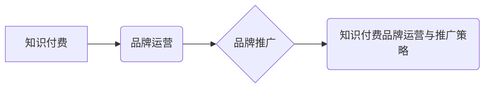

> 知识付费, 品牌运营, 品牌推广, 策略, 市场营销, 内容营销, 社交媒体

## 1. 背景介绍

知识经济时代，知识成为最宝贵的资源。知识付费作为一种新型的商业模式，迅速崛起，成为众多创作者和企业寻求变现的重要途径。然而，知识付费市场竞争激烈，想要在激烈的市场竞争中脱颖而出，需要构建一个强大的品牌，并制定有效的品牌运营和推广策略。

## 2. 核心概念与联系

**2.1 品牌运营**

品牌运营是指企业围绕品牌价值，通过一系列的策略和行动，提升品牌知名度、美誉度和忠诚度，最终实现品牌价值最大化的过程。

**2.2 品牌推广**

品牌推广是指企业通过各种渠道和方式，向目标受众传播品牌信息，提升品牌认知度和影响力的过程。

**2.3 知识付费品牌运营与推广策略**

知识付费品牌运营与推广策略是指针对知识付费平台和用户特点，制定的一系列品牌建设、运营和推广策略，旨在提升品牌知名度、吸引用户、促进知识付费产品的销售。

**2.4 核心概念关系图**



## 3. 核心算法原理 & 具体操作步骤

**3.1 算法原理概述**

知识付费品牌运营与推广策略的核心算法原理是基于用户行为分析、数据挖掘和机器学习，通过分析用户数据，预测用户需求，精准推送内容，提升用户粘性和转化率。

**3.2 算法步骤详解**

1. **数据收集:** 收集用户行为数据，包括用户注册信息、学习记录、评价反馈、支付行为等。
2. **数据清洗:** 对收集到的数据进行清洗和处理，去除无效数据和重复数据。
3. **特征提取:** 从用户行为数据中提取特征，例如用户学习偏好、学习时长、学习频率等。
4. **模型训练:** 利用机器学习算法，对用户特征进行建模，预测用户需求和学习意愿。
5. **内容推荐:** 根据用户模型预测结果，精准推荐相关知识付费产品。
6. **效果评估:** 对推荐效果进行评估，不断优化模型参数和推荐策略。

**3.3 算法优缺点**

**优点:**

* 精准推荐，提升用户体验。
* 数据驱动，决策科学化。
* 持续优化，提升转化率。

**缺点:**

* 数据依赖，需要大量用户数据支持。
* 模型复杂，需要专业技术人员维护。
* 算法偏差，可能存在推荐偏差。

**3.4 算法应用领域**

* 知识付费平台
* 在线教育平台
* 内容电商平台
* 社交媒体平台

## 4. 数学模型和公式 & 详细讲解 & 举例说明

**4.1 数学模型构建**

知识付费品牌运营与推广策略的数学模型可以基于用户行为分析和推荐算法构建。

**4.2 公式推导过程**

* 用户价值模型:  $UV = \alpha * L + \beta * F + \gamma * P$

其中:

* $UV$：用户价值
* $L$：用户学习时长
* $F$：用户学习频率
* $P$：用户支付行为
* $\alpha$, $\beta$, $\gamma$：权重系数

* 推荐算法:  $R(u, i) = \sigma(W^T * H(u) + b)$

其中:

* $R(u, i)$：用户 $u$ 对产品 $i$ 的推荐分数
* $W$：模型参数
* $H(u)$：用户特征向量
* $b$：偏置项
* $\sigma$：激活函数

**4.3 案例分析与讲解**

假设一个知识付费平台，用户 $A$ 学习时长为 10 小时，学习频率为 3 次/周，支付行为为 2 次，用户 $B$ 学习时长为 5 小时，学习频率为 1 次/周，支付行为为 1 次。

根据用户价值模型，我们可以计算出用户 $A$ 和用户 $B$ 的用户价值:

* $UV_A = \alpha * 10 + \beta * 3 + \gamma * 2$
* $UV_B = \alpha * 5 + \beta * 1 + \gamma * 1$

根据推荐算法，我们可以计算出用户 $A$ 和用户 $B$ 对不同产品的推荐分数。

## 5. 项目实践：代码实例和详细解释说明

**5.1 开发环境搭建**

* Python 3.x
* Jupyter Notebook
* TensorFlow 或 PyTorch

**5.2 源代码详细实现**

```python
# 用户价值模型
def calculate_user_value(user_data):
  # ...

# 推荐算法
def recommend_products(user_data):
  # ...

# 数据加载和预处理
# ...

# 模型训练
# ...

# 推荐结果展示
# ...
```

**5.3 代码解读与分析**

* `calculate_user_value()` 函数计算用户价值，根据用户行为数据和权重系数进行计算。
* `recommend_products()` 函数根据用户特征向量和模型参数进行推荐。
* 数据加载和预处理部分负责加载用户数据并进行清洗和转换。
* 模型训练部分利用机器学习算法训练推荐模型。
* 推荐结果展示部分展示推荐结果给用户。

**5.4 运行结果展示**

运行代码后，可以得到用户对不同产品的推荐分数，并根据分数进行排序，展示给用户。

## 6. 实际应用场景

**6.1 知识付费平台**

知识付费平台可以利用品牌运营和推广策略，提升品牌知名度和用户粘性，促进知识付费产品的销售。

**6.2 在线教育平台**

在线教育平台可以利用品牌运营和推广策略，吸引更多学生，提升课程质量和用户体验。

**6.3 内容电商平台**

内容电商平台可以利用品牌运营和推广策略，打造优质内容，提升用户粘性和转化率。

**6.4 未来应用展望**

随着人工智能技术的不断发展，知识付费品牌运营和推广策略将更加智能化和个性化。

## 7. 工具和资源推荐

**7.1 学习资源推荐**

* 《数据科学》
* 《机器学习》
* 《深度学习》

**7.2 开发工具推荐**

* Python
* TensorFlow
* PyTorch

**7.3 相关论文推荐**

* 《Collaborative Filtering for Recommender Systems》
* 《Deep Learning for Recommender Systems》

## 8. 总结：未来发展趋势与挑战

**8.1 研究成果总结**

知识付费品牌运营和推广策略的研究成果表明，数据驱动和算法推荐是提升用户体验和促进知识付费销售的关键。

**8.2 未来发展趋势**

未来，知识付费品牌运营和推广策略将更加智能化、个性化和场景化。

**8.3 面临的挑战**

* 数据隐私保护
* 算法偏差
* 用户信任

**8.4 研究展望**

未来研究将重点关注数据隐私保护、算法公平性和用户信任等问题。

## 9. 附录：常见问题与解答

**9.1 如何提升用户粘性？**

* 提供高质量的知识付费产品
* 建立用户社区，促进用户互动
* 定期举办线上线下活动

**9.2 如何提高转化率？**

* 精准推荐，根据用户需求推荐相关产品
* 提供优惠活动，吸引用户购买
* 优化用户体验，提升用户满意度

**9.3 如何应对算法偏差？**

* 采用多算法融合，降低单一算法的偏差
* 定期评估算法效果，及时调整参数
* 关注用户反馈，改进算法模型


作者：禅与计算机程序设计艺术 / Zen and the Art of Computer Programming 
<end_of_turn>