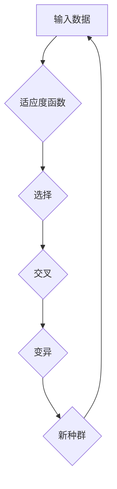

> 神经进化算法, Neuroevolution, 进化算法, 深度学习, 机器学习, 遗传算法, 神经网络, 代码实例

## 1. 背景介绍

在机器学习领域，神经网络凭借其强大的学习能力和泛化能力，在图像识别、自然语言处理、语音识别等领域取得了显著的成就。然而，传统的神经网络训练方法通常依赖于人工设计的网络结构和参数初始化，这往往需要大量的经验和试错，并且难以找到最优的网络结构和参数。

神经进化算法(Neuroevolution) 作为一种新的机器学习方法，通过模拟自然进化过程，自动搜索和优化神经网络的结构和参数，从而克服了传统方法的局限性。它将进化算法的思想应用于神经网络的训练，通过遗传操作（如交叉、变异）和自然选择，逐步进化出更优的网络结构和参数，最终实现对复杂任务的有效学习。

## 2. 核心概念与联系

神经进化算法的核心概念是将神经网络的结构和参数视为个体，并将其应用于进化算法的框架中。

**核心概念:**

* **种群:**  包含多个神经网络个体的集合。
* **适应度函数:** 用于评估每个神经网络个体在特定任务上的表现。
* **遗传操作:** 包括交叉和变异，用于产生新的神经网络个体。
* **自然选择:** 根据适应度函数的值，选择更优的个体进行下一代的繁殖。

**架构流程图:**



## 3. 核心算法原理 & 具体操作步骤

### 3.1  算法原理概述

神经进化算法的基本原理是通过迭代地更新神经网络的结构和参数，最终找到最优的网络结构和参数，从而实现对目标任务的有效学习。

具体来说，神经进化算法的步骤如下：

1. **初始化种群:** 创建一个包含多个随机生成的初始神经网络个体的种群。
2. **评估适应度:** 对每个神经网络个体进行评估，计算其在目标任务上的表现，即适应度值。
3. **选择个体:** 根据适应度值，选择更优的个体进行下一代的繁殖。
4. **交叉操作:** 将选中的个体进行交叉操作，产生新的神经网络个体。
5. **变异操作:** 对新的个体进行变异操作，引入新的基因，增加种群的多样性。
6. **重复步骤2-5:** 重复以上步骤，直到达到预设的迭代次数或适应度值达到目标水平。

### 3.2  算法步骤详解

1. **初始化种群:** 

   * 随机生成多个神经网络个体，每个个体包含神经网络的结构（层数、节点数）和参数（权重、偏置）。
   * 可以使用一些预设的网络结构作为模板，并对模板进行随机变异，以生成初始种群。

2. **评估适应度:**

   * 将每个神经网络个体应用于目标任务，并计算其在该任务上的表现，即适应度值。
   * 适应度函数的设计需要根据具体的任务目标进行调整。

3. **选择个体:**

   * 使用一些选择策略，例如轮盘赌选择、锦标赛选择等，从当前种群中选择更优的个体进行下一代的繁殖。
   * 选择策略的目的是提高种群中优秀个体的比例，加速进化过程。

4. **交叉操作:**

   * 将两个选中的个体进行交叉操作，将它们的基因进行交换，产生新的个体。
   * 交叉操作可以模拟自然界中的基因重组，增加种群的多样性。

5. **变异操作:**

   * 对新的个体进行变异操作，随机改变其基因，例如改变权重或偏置的值。
   * 变异操作可以引入新的基因，避免种群陷入局部最优解。

6. **重复步骤2-5:**

   * 重复以上步骤，直到达到预设的迭代次数或适应度值达到目标水平。

### 3.3  算法优缺点

**优点:**

* 自动搜索和优化神经网络的结构和参数，无需人工设计。
* 可以处理复杂的任务，并找到更优的解决方案。
* 能够适应不断变化的环境，并进行在线学习。

**缺点:**

* 计算复杂度较高，训练时间较长。
* 需要大量的计算资源和数据。
* 算法参数的设置对结果影响较大，需要进行仔细的调优。

### 3.4  算法应用领域

神经进化算法在以下领域具有广泛的应用前景：

* **机器人控制:** 自动搜索和优化机器人控制策略，提高机器人运动的效率和鲁棒性。
* **游戏人工智能:** 自动生成游戏中的AI对手，提高游戏的难度和趣味性。
* **药物设计:** 自动搜索和优化药物分子结构，提高药物的疗效和安全性。
* **图像识别:** 自动搜索和优化图像识别网络的结构和参数，提高图像识别的准确率。

## 4. 数学模型和公式 & 详细讲解 & 举例说明

### 4.1  数学模型构建

神经进化算法的数学模型主要包括以下几个方面：

* **神经网络模型:** 使用多层感知机 (MLP) 或卷积神经网络 (CNN) 等神经网络模型作为个体。
* **适应度函数:** 使用目标任务的性能指标作为适应度函数，例如分类准确率、回归误差等。
* **遗传操作模型:** 使用交叉和变异操作来生成新的个体，这些操作可以基于神经网络结构和参数进行。

### 4.2  公式推导过程

神经进化算法的具体公式推导过程取决于具体的算法实现和应用场景。

例如，在选择操作中，可以使用轮盘赌选择策略，其公式如下：

$$
p_i = \frac{f_i}{\sum_{j=1}^{N} f_j}
$$

其中：

* $p_i$ 是个体 $i$ 被选择的概率。
* $f_i$ 是个体 $i$ 的适应度值。
* $N$ 是种群的大小。

### 4.3  案例分析与讲解

假设我们使用神经进化算法训练一个图像分类网络，目标任务是识别手写数字。

* **神经网络模型:** 使用多层感知机 (MLP) 作为个体，包含输入层、隐藏层和输出层。
* **适应度函数:** 使用分类准确率作为适应度函数，即正确分类的图像数量占总图像数量的比例。
* **遗传操作模型:** 使用交叉和变异操作来生成新的个体，例如交换隐藏层节点的权重或随机改变输出层的偏置值。

通过迭代地更新神经网络的结构和参数，最终可以进化出能够准确识别手写数字的神经网络。

## 5. 项目实践：代码实例和详细解释说明

### 5.1  开发环境搭建

* Python 3.x
* TensorFlow 或 PyTorch 等深度学习框架
* NumPy、Pandas 等数据处理库

### 5.2  源代码详细实现

```python
import numpy as np
from tensorflow.keras.models import Sequential
from tensorflow.keras.layers import Dense
from tensorflow.keras.datasets import mnist

# 定义适应度函数
def fitness_function(model, X_test, y_test):
    predictions = model.predict(X_test)
    accuracy = np.mean(np.argmax(predictions, axis=1) == np.argmax(y_test, axis=1))
    return accuracy

# 定义种群大小
population_size = 100

# 定义神经网络结构
model = Sequential()
model.add(Dense(128, activation='relu', input_shape=(784,)))
model.add(Dense(10, activation='softmax'))

# 初始化种群
population = []
for _ in range(population_size):
    # 随机初始化神经网络参数
    model.set_weights(np.random.randn(model.count_params()))
    population.append(model)

# 进化循环
for generation in range(100):
    # 评估适应度
    fitness_scores = [fitness_function(model, X_test, y_test) for model in population]

    # 选择个体
    selected_models = select_individuals(population, fitness_scores)

    # 交叉操作
    offspring = crossover(selected_models)

    # 变异操作
    offspring = mutate(offspring)

    # 更新种群
    population = offspring

# 选择最佳个体
best_model = max(population, key=lambda model: fitness_function(model, X_test, y_test))

# 打印最佳适应度
print(f"Best fitness: {fitness_function(best_model, X_test, y_test)}")
```

### 5.3  代码解读与分析

* **适应度函数:** 评估神经网络在目标任务上的表现，例如分类准确率。
* **种群:** 包含多个神经网络个体的集合。
* **选择操作:** 根据适应度值选择更优的个体进行下一代的繁殖。
* **交叉操作:** 将两个选中的个体进行基因交换，产生新的个体。
* **变异操作:** 对新的个体进行随机变异，增加种群的多样性。

### 5.4  运行结果展示

运行上述代码后，可以得到最佳神经网络的适应度值，以及对应的模型结构和参数。

## 6. 实际应用场景

神经进化算法在以下实际应用场景中展现出其强大的潜力：

* **机器人控制:** 进化机器人控制策略，使机器人能够自主地完成复杂的任务，例如导航、抓取、避障等。
* **游戏人工智能:** 生成游戏中的AI对手，使游戏更加智能和具有挑战性。
* **药物设计:** 进化药物分子结构，提高药物的疗效和安全性。
* **金融预测:** 进化金融模型，提高对市场趋势的预测准确性。

### 6.4  未来应用展望

随着人工智能技术的不断发展，神经进化算法的应用场景将会更加广泛。

* **自动机器学习:** 自动搜索和优化机器学习模型的结构和参数，降低机器学习的门槛。
* **生物仿生设计:** 借鉴自然进化机制，设计更加高效和鲁棒的工程系统。
* **个性化学习:** 根据个体的学习风格和需求，进化个性化的学习方案。

## 7. 工具和资源推荐

### 7.1  学习资源推荐

* **书籍:**
    *《Neuroevolution of Augmenting Topologies》 by Kenneth O. Stanley and Risto Miikkulainen
    *《Evolutionary Computation》 by David E. Goldberg
* **在线课程:**
    * Coursera: Evolutionary Algorithms
    * edX: Introduction to Evolutionary Computation

### 7.2  开发工具推荐

* **TensorFlow:** 开源深度学习框架，支持神经进化算法的实现。
* **PyTorch:** 开源深度学习框架，支持神经进化算法的实现。
* **DEAP:** Python库，用于进化算法的开发和研究。

### 7.3  相关论文推荐

* **Neuroevolution of Augmenting Topologies (NEAT)**
* **Evolutionary Strategies for Deep Learning**
* **Genetic Algorithms for Neural Network Optimization**

## 8. 总结：未来发展趋势与挑战

### 8.1  研究成果总结

神经进化算法在机器学习领域取得了显著的成果，成功应用于图像识别、机器人控制、游戏人工智能等多个领域。

### 8.2  未来发展趋势

* **结合强化学习:** 将神经进化算法与强化学习相结合，提高算法的学习效率和泛化能力。
* **探索新的遗传操作:** 设计更加有效的遗传操作，例如基于深度学习的交叉和变异操作。
