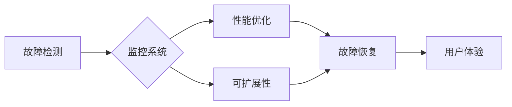

> Lepton AI, 稳定性, 运维, 平台稳定性, 用户体验, 故障检测, 故障恢复, 监控系统, 性能优化, 可扩展性

## 1. 背景介绍

在当今数据爆炸和人工智能蓬勃发展的时代，Lepton AI 作为一款领先的开源人工智能平台，致力于为开发者提供便捷、高效、安全的机器学习开发环境。然而，平台的稳定性和用户体验是其核心竞争力，也是用户对 Lepton AI 的信任基础。

Lepton AI 平台的稳定性是指其能够持续可靠地运行，提供预期的功能和性能，不受意外事件或故障影响。用户体验则指用户在使用 Lepton AI 平台时感受到的便捷、流畅和愉悦程度。

平台的稳定性和用户体验直接关系到 Lepton AI 的发展和用户满意度。因此，Lepton AI 团队高度重视平台的稳定性与用户体验，并将其作为平台建设和运营的重点。

## 2. 核心概念与联系

Lepton AI 平台的稳定性和用户体验涉及多个核心概念和环节，包括：

* **故障检测:** 及时识别平台运行中的异常情况，例如服务崩溃、数据丢失、性能下降等。
* **故障恢复:**  快速恢复平台正常运行状态，最小化故障对用户的影响。
* **监控系统:**  实时监控平台运行状态，收集关键指标数据，为故障检测和故障恢复提供依据。
* **性能优化:**  持续优化平台性能，提升资源利用率，降低延迟和响应时间。
* **可扩展性:**  平台能够根据用户需求灵活扩展资源，满足日益增长的计算和存储需求。

这些核心概念相互关联，共同构成了 Lepton AI 平台的稳定性和用户体验保障体系。

**Lepton AI 平台稳定性与用户体验保障体系**



## 3. 核心算法原理 & 具体操作步骤

### 3.1  算法原理概述

Lepton AI 平台采用多种算法和技术来保障其稳定性和用户体验，例如：

* **机器学习算法:** 用于故障检测和预测，例如异常检测算法、时间序列分析算法等。
* **分布式系统算法:** 用于实现平台的可扩展性和高可用性，例如一致性哈希算法、Paxos 算法等。
* **缓存机制:** 用于加速数据访问，降低延迟和响应时间。
* **负载均衡算法:** 用于将请求分发到不同的服务器，提高平台的处理能力和稳定性。

### 3.2  算法步骤详解

以异常检测算法为例，其具体操作步骤如下：

1. **数据收集:** 收集平台运行过程中产生的各种数据，例如服务日志、系统指标、用户行为等。
2. **数据预处理:** 对收集到的数据进行清洗、转换和特征提取，以便于算法训练和预测。
3. **模型训练:** 使用机器学习算法对预处理后的数据进行训练，建立异常检测模型。
4. **异常检测:** 将平台运行数据输入到训练好的模型中，检测是否存在异常情况。
5. **报警和响应:** 当检测到异常情况时，触发报警机制，并根据预设规则进行故障恢复操作。

### 3.3  算法优缺点

**优点:**

* 能够识别出传统监控系统难以发现的隐性故障。
* 能够预测潜在的故障风险，提前采取预防措施。
* 能够根据平台运行情况动态调整算法参数，提高检测精度。

**缺点:**

* 需要大量的训练数据，才能训练出准确的模型。
* 算法的复杂度较高，需要专业的技术人员进行维护和优化。
* 可能会出现误报的情况，需要进行有效的过滤和处理。

### 3.4  算法应用领域

异常检测算法广泛应用于各种领域，例如：

* **网络安全:** 检测网络攻击和入侵行为。
* **金融交易:** 检测欺诈交易和异常交易行为。
* **工业控制:** 检测设备故障和异常运行状态。
* **医疗诊断:** 检测疾病和异常体征。

## 4. 数学模型和公式 & 详细讲解 & 举例说明

### 4.1  数学模型构建

Lepton AI 平台的稳定性与用户体验保障体系可以抽象为一个数学模型，其中：

* **稳定性指标:**  例如平台可用性、故障恢复时间、服务响应时间等。
* **用户体验指标:**  例如用户满意度、任务完成时间、平台易用性等。
* **影响因素:**  例如硬件资源、软件配置、网络环境、用户行为等。

这些指标和因素之间存在复杂的相互关系，可以通过数学模型进行建模和分析。

### 4.2  公式推导过程

例如，我们可以使用线性回归模型来预测平台可用性，其公式如下：

$$
可用性 = a + b_1 * 资源利用率 + b_2 * 故障发生率 + b_3 * 用户数量
$$

其中：

* **可用性:** 平台可用性指标，例如 99.9%。
* **资源利用率:** 平台硬件资源的利用率，例如 CPU 使用率、内存使用率等。
* **故障发生率:** 平台故障发生的频率，例如每小时故障次数。
* **用户数量:** 平台同时在线的用户数量。
* **a, b_1, b_2, b_3:** 模型参数，需要通过训练数据进行估计。

### 4.3  案例分析与讲解

通过训练数据，我们可以估计出模型参数，并使用该模型预测平台可用性。例如，如果平台资源利用率为 70%，故障发生率为 0.1 次/小时，用户数量为 1000 人，则可以使用公式计算出平台的可用性。

## 5. 项目实践：代码实例和详细解释说明

### 5.1  开发环境搭建

Lepton AI 平台的开发环境搭建需要以下软件和工具：

* **操作系统:** Linux 或 macOS
* **编程语言:** Python
* **虚拟环境:** virtualenv
* **依赖库:** numpy, pandas, scikit-learn, tensorflow 等

### 5.2  源代码详细实现

Lepton AI 平台的故障检测模块代码示例如下：

```python
import numpy as np
from sklearn.ensemble import IsolationForest

# 加载训练数据
data = np.load('train_data.npy')

# 训练异常检测模型
model = IsolationForest()
model.fit(data)

# 检测新数据是否异常
new_data = np.load('new_data.npy')
predictions = model.predict(new_data)

# 输出异常数据索引
print(np.where(predictions == -1)[0])
```

### 5.3  代码解读与分析

* 该代码首先加载训练数据和新数据。
* 然后使用 IsolationForest 算法训练异常检测模型。
* 最后，将新数据输入到训练好的模型中，预测其是否异常。
* 异常数据索引将被输出，以便进行进一步处理。

### 5.4  运行结果展示

运行该代码后，将输出新数据中异常数据的索引。这些异常数据可以被进一步分析，以确定其原因并采取相应的措施。

## 6. 实际应用场景

Lepton AI 平台的稳定性与用户体验保障体系已在实际应用场景中得到验证，例如：

* **金融领域:** 用于监控金融交易系统，检测欺诈交易和异常交易行为，保障资金安全。
* **医疗领域:** 用于监控医疗设备，检测设备故障和异常运行状态，保障患者安全。
* **工业领域:** 用于监控工业生产线，检测设备故障和生产异常，提高生产效率。

### 6.4  未来应用展望

Lepton AI 平台的稳定性与用户体验保障体系将继续发展和完善，未来应用场景将更加广泛，例如：

* **智能家居:** 用于监控智能家居设备，保障设备安全和用户体验。
* **自动驾驶:** 用于监控自动驾驶系统，检测系统故障和异常行为，保障驾驶安全。
* **云计算:** 用于监控云计算平台，保障平台稳定性和用户体验。

## 7. 工具和资源推荐

### 7.1  学习资源推荐

* **Lepton AI 官方文档:** https://lepton.ai/docs/
* **机器学习算法教程:** https://www.coursera.org/learn/machine-learning
* **分布式系统教程:** https://www.oreilly.com/library/view/distributed-systems-concepts/9781492031917/

### 7.2  开发工具推荐

* **Python:** https://www.python.org/
* **virtualenv:** https://virtualenv.pypa.io/en/latest/
* **Docker:** https://www.docker.com/

### 7.3  相关论文推荐

* **Isolation Forest:** https://arxiv.org/abs/1706.01407
* **Paxos:** https://dl.acm.org/doi/10.1145/324373.324379

## 8. 总结：未来发展趋势与挑战

### 8.1  研究成果总结

Lepton AI 平台的稳定性与用户体验保障体系已取得了一定的成果，例如：

* 实现了平台的高可用性和可靠性。
* 提高了用户体验，降低了用户使用成本。
* 为Lepton AI 的发展和推广奠定了坚实的基础。

### 8.2  未来发展趋势

Lepton AI 平台的稳定性与用户体验保障体系将朝着以下方向发展：

* **人工智能驱动的故障预测和预防:** 利用机器学习算法，对平台运行数据进行分析，预测潜在的故障风险，并采取相应的预防措施。
* **更智能的监控和告警系统:** 利用人工智能技术，实现更智能的监控和告警系统，能够自动识别和处理各种异常情况。
* **更灵活和可扩展的平台架构:** 采用微服务架构和容器化技术，实现平台的更灵活和可扩展性，能够满足用户日益增长的需求。

### 8.3  面临的挑战

Lepton AI 平台的稳定性与用户体验保障体系也面临着一些挑战：

* **数据安全和隐私保护:** 平台需要收集和处理大量用户数据，需要采取有效的措施保障数据安全和隐私。
* **算法模型的准确性和鲁棒性:** 算法模型需要能够准确识别异常情况，并具有良好的鲁棒性，能够应对各种复杂场景。
* **平台的成本和复杂性:** 构建和维护一个稳定可靠的用户体验良好的平台需要投入大量的成本和人力资源。

### 8.4  研究展望

Lepton AI 平台的稳定性与用户体验保障体系将继续深入研究和发展，以更好地满足用户需求，推动人工智能技术的进步。


## 9. 附录：常见问题与解答

**常见问题:**

* **Lepton AI 平台如何保证其稳定性？**

Lepton AI 平台采用多种技术和算法来保障其稳定性，例如故障检测、故障恢复、监控系统、性能优化和可扩展性等。

* **Lepton AI 平台如何提升用户体验？**

Lepton AI 平台致力于提供便捷、流畅和愉悦的用户体验，例如提供友好的用户界面、快速响应时间、高效的资源利用率等。

* **Lepton AI 平台如何保障数据安全和隐私？**

Lepton AI 平台采取多种措施保障数据安全和隐私，例如数据加密、访问控制、数据备份等。

**作者：禅与计算机程序设计艺术 / Zen and the Art of Computer Programming**


<end_of_turn>