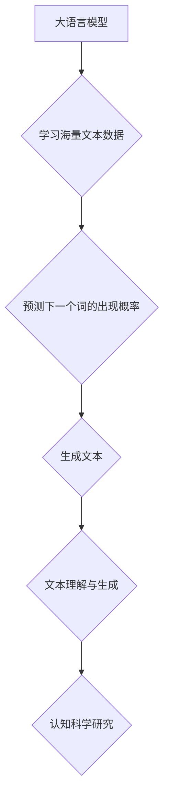

> 大语言模型、认知科学、人工智能、自然语言处理、深度学习、神经网络、语言理解、语言生成

## 1. 背景介绍

近年来，大语言模型（Large Language Models，LLMs）在自然语言处理（Natural Language Processing，NLP）领域取得了令人瞩目的成就。从文本生成、翻译到问答和代码编写，LLMs展现出强大的能力，甚至在某些方面超越了人类的表现。然而，尽管LLMs取得了如此巨大的进步，它们仍然无法真正理解语言的含义，也无法像人类一样进行复杂的推理和决策。

LLMs本质上是复杂的统计模型，它们通过学习海量文本数据来预测下一个词的出现概率。尽管它们能够生成流畅、语法正确的文本，但它们缺乏真正的“理解”和“思考”的能力。

## 2. 核心概念与联系

**2.1  大语言模型 (LLMs)**

大语言模型是指训练数据量巨大、参数数量庞大的深度学习模型，能够处理和生成人类语言。它们通常基于Transformer架构，并通过大量的文本数据进行预训练，学习语言的语法、语义和上下文关系。

**2.2  认知科学**

认知科学研究人类思维、学习、记忆、语言和感知等方面的机制。它试图理解人类如何处理信息、做出决策和与世界互动。

**2.3  连接：语言与思维**

语言是人类思维的重要载体，它不仅用于表达思想，也塑造了我们的思维方式。认知科学研究表明，语言对我们的认知能力有深远的影响，它影响着我们的记忆、推理、决策和创造力。

**2.4  Mermaid 流程图**



## 3. 核心算法原理 & 具体操作步骤

**3.1  算法原理概述**

LLMs的核心算法是Transformer架构，它是一种基于注意力机制的深度神经网络。注意力机制允许模型关注输入序列中与当前任务最相关的部分，从而提高了模型的理解和生成能力。

**3.2  算法步骤详解**

1. **词嵌入:** 将每个单词映射到一个低维向量空间中，以便模型能够理解单词的语义关系。
2. **编码器:** 使用多层Transformer模块对输入序列进行编码，提取文本的语义信息。
3. **解码器:** 使用多层Transformer模块对编码后的信息进行解码，生成目标序列。
4. **损失函数:** 使用交叉熵损失函数衡量模型生成的文本与真实文本之间的差异。
5. **反向传播:** 使用梯度下降算法更新模型参数，降低损失函数的值。

**3.3  算法优缺点**

**优点:**

* 能够处理长序列文本
* 具有强大的文本理解和生成能力
* 可以进行多任务学习

**缺点:**

* 训练成本高
* 容易受到训练数据偏差的影响
* 缺乏真正的“理解”和“思考”能力

**3.4  算法应用领域**

* 文本生成
* 机器翻译
* 问答系统
* 代码生成
* 文本摘要

## 4. 数学模型和公式 & 详细讲解 & 举例说明

**4.1  数学模型构建**

LLMs通常使用概率模型来表示语言的分布。一个常见的模型是n-gram模型，它假设一个词的出现概率取决于其前n-1个词的上下文。

**4.2  公式推导过程**

对于一个n-gram模型，我们可以用以下公式来计算一个词的出现概率：

$$P(w_i | w_{i-1}, w_{i-2}, ..., w_{i-n+1})$$

其中：

* $w_i$ 是当前词
* $w_{i-1}, w_{i-2}, ..., w_{i-n+1}$ 是前n-1个词

**4.3  案例分析与讲解**

例如，如果我们有一个三元组模型（n=3），并且训练数据中出现了以下序列：

"the cat sat on the mat"

那么，我们可以计算"on"的出现概率：

$$P(on | the, cat) = \frac{次数(the, cat, on)}{次数(the, cat)}$$

其中：

* 次数(the, cat, on) 是"the cat on"出现的次数
* 次数(the, cat) 是"the cat"出现的次数

**4.4  举例说明**

LLMs使用更复杂的数学模型，例如Transformer架构，来学习语言的更深层次的结构和关系。

## 5. 项目实践：代码实例和详细解释说明

**5.1  开发环境搭建**

* Python 3.7+
* PyTorch 或 TensorFlow
* CUDA 和 cuDNN

**5.2  源代码详细实现**

```python
# 使用PyTorch实现一个简单的Transformer模型
import torch
import torch.nn as nn

class Transformer(nn.Module):
    def __init__(self, vocab_size, embedding_dim, num_heads, num_layers):
        super(Transformer, self).__init__()
        self.embedding = nn.Embedding(vocab_size, embedding_dim)
        self.transformer_layers = nn.ModuleList([
            nn.TransformerEncoderLayer(embedding_dim, num_heads)
            for _ in range(num_layers)
        ])
        self.linear = nn.Linear(embedding_dim, vocab_size)

    def forward(self, x):
        x = self.embedding(x)
        for layer in self.transformer_layers:
            x = layer(x)
        x = self.linear(x)
        return x
```

**5.3  代码解读与分析**

* `embedding`: 将单词映射到低维向量空间。
* `transformer_layers`: 多层Transformer编码器，用于提取文本的语义信息。
* `linear`: 将编码后的信息映射到输出词汇表。

**5.4  运行结果展示**

训练好的LLM模型可以用于各种自然语言处理任务，例如文本生成、机器翻译和问答系统。

## 6. 实际应用场景

**6.1  文本生成**

LLMs可以用于生成各种类型的文本，例如小说、诗歌、新闻报道和代码。

**6.2  机器翻译**

LLMs可以用于将文本从一种语言翻译成另一种语言。

**6.3  问答系统**

LLMs可以用于构建问答系统，能够回答用户提出的问题。

**6.4  未来应用展望**

LLMs有潜力在更多领域发挥作用，例如教育、医疗保健和法律。

## 7. 工具和资源推荐

**7.1  学习资源推荐**

* **书籍:**
    * 《深度学习》
    * 《自然语言处理》
* **在线课程:**
    * Coursera: 自然语言处理
    * edX: 深度学习

**7.2  开发工具推荐**

* **PyTorch:** 深度学习框架
* **TensorFlow:** 深度学习框架
* **Hugging Face Transformers:** 预训练LLM模型库

**7.3  相关论文推荐**

* 《Attention Is All You Need》
* 《BERT: Pre-training of Deep Bidirectional Transformers for Language Understanding》

## 8. 总结：未来发展趋势与挑战

**8.1  研究成果总结**

LLMs取得了令人瞩目的成就，但它们仍然存在一些局限性。

**8.2  未来发展趋势**

* 更大的模型规模
* 更强大的计算能力
* 更有效的训练方法
* 更注重伦理和可解释性

**8.3  面临的挑战**

* 数据偏差
* 计算成本
* 伦理问题

**8.4  研究展望**

未来研究将继续探索LLMs的潜力，使其能够更好地理解和生成人类语言，并应用于更多领域。

## 9. 附录：常见问题与解答

**9.1  LLMs是否真的理解语言？**

LLMs能够生成流畅、语法正确的文本，但它们仍然缺乏真正的“理解”和“思考”能力。

**9.2  LLMs的训练数据如何保证质量？**

训练数据质量是LLMs性能的关键因素。需要使用高质量、多样化的文本数据进行训练。

**9.3  LLMs存在哪些伦理问题？**

LLMs可能被用于生成虚假信息、传播偏见和侵犯隐私。需要制定相应的伦理规范和监管机制。


作者：禅与计算机程序设计艺术 / Zen and the Art of Computer Programming 
<end_of_turn>