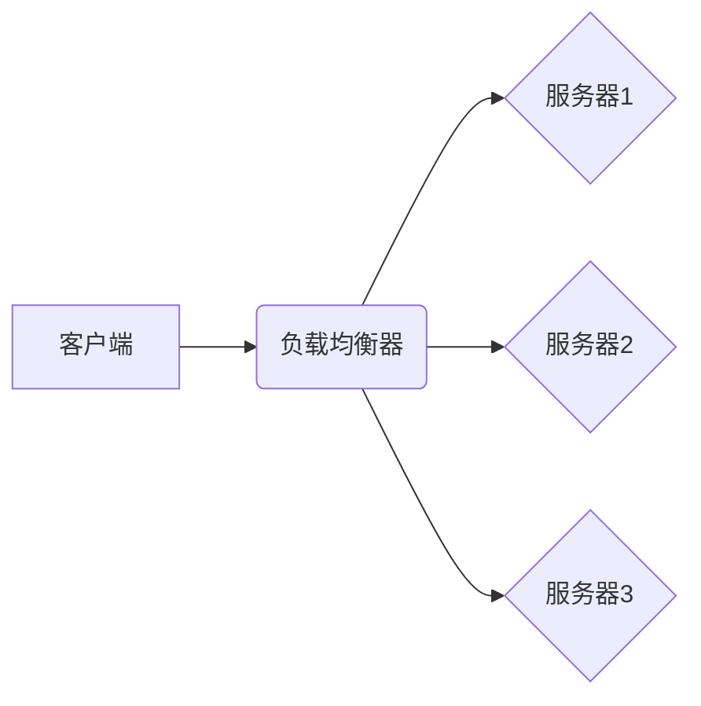

> 负载均衡、算法、性能优化、高可用性、分布式系统

## 1. 背景介绍

随着互联网技术的飞速发展，网站和应用程序的规模不断扩大，用户访问量也呈指数级增长。为了应对日益增长的流量压力，保证应用程序的稳定性和高可用性，负载均衡器应运而生。

负载均衡器是一种将网络流量分配到多个服务器上的设备，它可以有效地提高应用程序的性能、可靠性和可扩展性。负载均衡器通过将请求分发到不同的服务器，可以避免单个服务器被过载，从而提高系统的整体吞吐量和响应速度。

## 2. 核心概念与联系

负载均衡的核心概念是将请求分发到多个服务器，以提高系统的整体性能和可靠性。

**负载均衡器架构**



**负载均衡器工作原理**

1. 客户端发送请求到负载均衡器。
2. 负载均衡器根据预设的策略，将请求分发到合适的服务器。
3. 服务器处理请求并返回响应给客户端。
4. 负载均衡器将响应转发给客户端。

## 3. 核心算法原理 & 具体操作步骤

### 3.1  算法原理概述

负载均衡算法是负载均衡器核心功能，它决定了请求如何被分配到不同的服务器。常见的负载均衡算法包括：

* **轮询算法:** 按照一定的顺序依次将请求分配到不同的服务器。
* **加权轮询算法:** 每个服务器分配的权重不同，权重高的服务器会获得更多的请求。
* **最小连接数算法:** 将请求分配到连接数最少的服务器。
* **最短响应时间算法:** 将请求分配到响应时间最短的服务器。
* **IP哈希算法:** 根据客户端IP地址将请求分配到特定的服务器。

### 3.2  算法步骤详解

以轮询算法为例，其具体操作步骤如下：

1. 负载均衡器维护一个服务器列表。
2. 当客户端发送请求时，负载均衡器从服务器列表中选择第一个服务器，并将请求转发到该服务器。
3. 服务器处理请求并返回响应。
4. 负载均衡器将响应转发给客户端。
5. 负载均衡器将服务器列表中的第一个服务器移到列表末尾，并将下一个服务器移到列表开头。

### 3.3  算法优缺点

**轮询算法**

* **优点:** 简单易实现，性能稳定。
* **缺点:** 无法根据服务器负载情况动态调整请求分配，可能导致某些服务器过载。

**加权轮询算法**

* **优点:** 可以根据服务器负载情况动态调整请求分配，提高系统整体性能。
* **缺点:** 算法复杂度较高，需要实时监控服务器负载情况。

### 3.4  算法应用领域

不同的负载均衡算法适用于不同的应用场景。例如，对于高并发网站，可以使用轮询算法或加权轮询算法；对于需要高可用性的系统，可以使用最小连接数算法或最短响应时间算法。

## 4. 数学模型和公式 & 详细讲解 & 举例说明

### 4.1  数学模型构建

假设有N个服务器，每个服务器的处理能力为$C_i$，请求的到达率为$R$，则系统的吞吐量可以表示为：

$$
T = \frac{R}{N \cdot \frac{1}{C_i}}
$$

其中，$T$表示系统的吞吐量，$R$表示请求的到达率，$N$表示服务器的数量，$C_i$表示第$i$个服务器的处理能力。

### 4.2  公式推导过程

吞吐量公式的推导过程如下：

1. 每个服务器的处理能力为$C_i$，则每个服务器每秒可以处理$C_i$个请求。
2. 服务器的数量为$N$，则所有服务器每秒可以处理$N \cdot C_i$个请求。
3. 请求的到达率为$R$，则系统的吞吐量为请求到达率除以服务器处理能力的总和，即$T = \frac{R}{N \cdot \frac{1}{C_i}}$。

### 4.3  案例分析与讲解

假设有3个服务器，每个服务器的处理能力为1000个请求/秒，请求的到达率为5000个请求/秒，则系统的吞吐量为：

$$
T = \frac{5000}{3 \cdot \frac{1}{1000}} = 1666.67 \text{ requests/second}
$$

## 5. 项目实践：代码实例和详细解释说明

### 5.1  开发环境搭建

本项目使用Python语言开发，需要安装以下软件：

* Python 3.x
* Flask框架
* Nginx负载均衡器

### 5.2  源代码详细实现

```python
from flask import Flask, request

app = Flask(__name__)

@app.route('/')
def index():
    return 'Hello, World!'

if __name__ == '__main__':
    app.run(host='0.0.0.0', port=5000)
```

### 5.3  代码解读与分析

* 代码使用Flask框架构建了一个简单的Web应用程序。
* 应用程序只有一个路由 `/`，访问该路由会返回“Hello, World!”字符串。
* `app.run(host='0.0.0.0', port=5000)`启动应用程序，监听所有网络接口，端口为5000。

### 5.4  运行结果展示

启动应用程序后，访问`http://localhost:5000/`，会看到“Hello, World!”字符串。

## 6. 实际应用场景

负载均衡器广泛应用于各种场景，例如：

* **网站和应用程序:** 提高网站和应用程序的性能和可用性。
* **云计算:** 分配云资源，提高资源利用率。
* **游戏服务器:** 分配游戏玩家到不同的服务器，保证游戏体验。
* **视频流媒体:** 分配视频流到不同的服务器，保证视频流畅播放。

### 6.4  未来应用展望

随着互联网技术的不断发展，负载均衡器的应用场景将更加广泛。例如：

* **边缘计算:** 将负载均衡器部署在边缘节点，提高边缘计算的性能和可靠性。
* **人工智能:** 将负载均衡器与人工智能算法结合，实现智能负载均衡。
* **5G网络:** 5G网络的低延迟和高带宽特性，将对负载均衡器的设计和应用带来新的挑战和机遇。

## 7. 工具和资源推荐

### 7.1  学习资源推荐

* **书籍:**
    * 《负载均衡器设计与优化》
    * 《网络编程艺术》
* **网站:**
    * Nginx官方网站: https://nginx.org/
    * HAProxy官方网站: https://www.haproxy.org/

### 7.2  开发工具推荐

* **Nginx:** 开源的Web服务器和反向代理软件。
* **HAProxy:** 开源的负载均衡器软件。
* **Keepalived:** 开源的虚拟IP地址和心跳检测软件。

### 7.3  相关论文推荐

* **论文:**
    * 《负载均衡算法研究》
    * 《基于机器学习的负载均衡算法》

## 8. 总结：未来发展趋势与挑战

### 8.1  研究成果总结

负载均衡器技术已经取得了长足的进步，各种负载均衡算法和技术方案不断涌现。

### 8.2  未来发展趋势

未来负载均衡器技术的发展趋势包括：

* **智能化:** 利用人工智能算法，实现智能负载均衡。
* **自动化:** 自动化部署和管理负载均衡器。
* **云原生:** 与云计算平台深度集成，实现弹性伸缩和自动故障恢复。

### 8.3  面临的挑战

负载均衡器技术也面临着一些挑战，例如：

* **复杂性:** 随着系统规模的扩大，负载均衡器的设计和管理越来越复杂。
* **安全:** 负载均衡器需要保障网络安全，防止攻击和数据泄露。
* **成本:** 高性能的负载均衡器设备成本较高。

### 8.4  研究展望

未来，负载均衡器技术将继续朝着智能化、自动化、云原生方向发展，并不断解决现有挑战，为构建更加高效、可靠、安全的互联网基础设施做出贡献。

## 9. 附录：常见问题与解答

### 9.1  常见问题

* 什么是负载均衡器？
* 负载均衡器有哪些类型？
* 负载均衡器如何工作？
* 负载均衡器有哪些应用场景？

### 9.2  解答

* 负载均衡器是一种将网络流量分配到多个服务器上的设备，它可以有效地提高应用程序的性能、可靠性和可扩展性。
* 常见的负载均衡器类型包括硬件负载均衡器和软件负载均衡器。
* 负载均衡器的工作原理是将请求分发到不同的服务器，以避免单个服务器被过载。
* 负载均衡器广泛应用于网站、应用程序、云计算、游戏服务器等场景。


作者：禅与计算机程序设计艺术 / Zen and the Art of Computer Programming 
<end_of_turn>