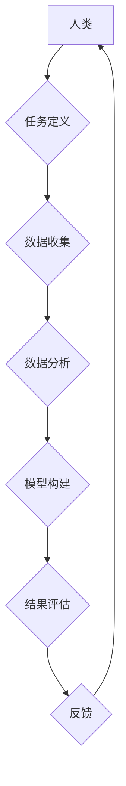

> 人类计算、跨学科边界、多元化应用、人工智能、机器学习、自然语言处理、计算机视觉、数据科学、深度学习

## 1. 背景介绍

人类计算，作为一种将人类智能与计算机技术相结合的新兴领域，近年来备受关注。它旨在利用人类的创造力、洞察力和决策能力，与计算机的计算能力和数据处理能力相结合，从而实现更智能、更高效的计算模式。

传统的计算模式主要依赖于计算机算法和数据处理，而人类计算则强调人类参与和决策的不可替代性。随着人工智能、机器学习等技术的快速发展，人类计算获得了新的发展机遇。

## 2. 核心概念与联系

**2.1 人类计算的核心概念**

人类计算的核心概念包括：

* **人类智能:** 指人类的认知能力、创造力、洞察力和决策能力等。
* **计算机技术:** 指计算机硬件、软件、算法等技术手段。
* **协同计算:** 指人类和计算机共同完成计算任务的过程。

**2.2 人类计算与其他领域的联系**

人类计算与多个领域密切相关，例如：

* **人工智能:** 人工智能技术为人类计算提供了强大的工具和支持，例如自然语言处理、计算机视觉等。
* **数据科学:** 数据科学为人类计算提供了海量数据和分析工具，帮助人类更好地理解和利用数据。
* **社会科学:** 社会科学研究人类行为和社会现象，为人类计算提供了理论基础和应用场景。

**2.3 人类计算的架构**



## 3. 核心算法原理 & 具体操作步骤

**3.1 算法原理概述**

人类计算的核心算法原理是基于人类智能和计算机技术的协同作用。

**3.2 算法步骤详解**

1. **任务定义:** 明确人类计算的目标和任务。
2. **数据收集:** 收集与任务相关的原始数据。
3. **数据分析:** 对数据进行清洗、预处理、分析和挖掘。
4. **模型构建:** 基于数据分析结果，构建相应的计算模型。
5. **结果评估:** 对模型的预测结果进行评估和验证。
6. **反馈:** 根据评估结果，对模型进行调整和优化。

**3.3 算法优缺点**

**优点:**

* 能够解决传统计算模式难以解决的问题，例如需要人类判断和决策的任务。
* 能够利用人类的创造力和洞察力，提高计算效率和准确性。

**缺点:**

* 人类参与可能会带来主观性和偏差。
* 需要协调人类和计算机之间的交互，提高复杂性。

**3.4 算法应用领域**

* **医疗诊断:** 利用人类专家知识和机器学习算法，辅助医生进行疾病诊断。
* **金融风险管理:** 利用人类分析能力和机器学习算法，识别和评估金融风险。
* **科学研究:** 利用人类的创新思维和计算机的计算能力，加速科学研究进程。

## 4. 数学模型和公式 & 详细讲解 & 举例说明

**4.1 数学模型构建**

人类计算可以采用多种数学模型，例如：

* **贝叶斯网络:** 用于表示概率关系和进行推理。
* **决策树:** 用于分类和预测。
* **支持向量机:** 用于分类和回归。

**4.2 公式推导过程**

例如，贝叶斯网络的概率计算公式如下：

$$P(A|B) = \frac{P(B|A)P(A)}{P(B)}$$

其中：

* $P(A|B)$ 是在已知事件 B 发生的情况下，事件 A 发生的概率。
* $P(B|A)$ 是在已知事件 A 发生的情况下，事件 B 发生的概率。
* $P(A)$ 是事件 A 发生的概率。
* $P(B)$ 是事件 B 发生的概率。

**4.3 案例分析与讲解**

例如，在医疗诊断领域，可以使用贝叶斯网络模型来预测患者患某种疾病的概率。

## 5. 项目实践：代码实例和详细解释说明

**5.1 开发环境搭建**

* 操作系统: Ubuntu 20.04
* 编程语言: Python 3.8
* 软件包: TensorFlow, PyTorch, scikit-learn

**5.2 源代码详细实现**

```python
# 导入必要的库
import tensorflow as tf

# 定义模型结构
model = tf.keras.models.Sequential([
    tf.keras.layers.Dense(128, activation='relu', input_shape=(784,)),
    tf.keras.layers.Dense(10, activation='softmax')
])

# 编译模型
model.compile(optimizer='adam',
              loss='sparse_categorical_crossentropy',
              metrics=['accuracy'])

# 训练模型
model.fit(x_train, y_train, epochs=10)

# 评估模型
loss, accuracy = model.evaluate(x_test, y_test)
print('Test loss:', loss)
print('Test accuracy:', accuracy)
```

**5.3 代码解读与分析**

这段代码实现了使用 TensorFlow 库构建一个简单的深度学习模型，用于手写数字识别任务。

**5.4 运行结果展示**

训练完成后，模型可以用于预测新的手写数字。

## 6. 实际应用场景

**6.1 医疗诊断**

* 辅助医生诊断疾病，例如癌症、心血管疾病等。
* 预测患者的治疗效果和风险。

**6.2 金融风险管理**

* 识别和评估金融风险，例如欺诈、洗钱等。
* 预测市场趋势和投资风险。

**6.3 科学研究**

* 加速药物研发和材料设计。
* 分析大规模数据，发现新的科学规律。

**6.4 未来应用展望**

* 人类计算将与其他新兴技术，例如区块链、物联网等，相结合，产生更广泛的应用。
* 人类计算将更加智能化、个性化和协同化。

## 7. 工具和资源推荐

**7.1 学习资源推荐**

* **书籍:**
    * 人工智能：一种现代方法
    * 深度学习
* **在线课程:**
    * Coursera 人工智能课程
    * edX 深度学习课程

**7.2 开发工具推荐**

* **TensorFlow:** 开源深度学习框架
* **PyTorch:** 开源深度学习框架
* **scikit-learn:** 机器学习库

**7.3 相关论文推荐**

* 人类计算的未来
* 人类计算的挑战和机遇

## 8. 总结：未来发展趋势与挑战

**8.1 研究成果总结**

人类计算是一个新兴的领域，取得了显著的进展。

**8.2 未来发展趋势**

* 人类计算将更加智能化、个性化和协同化。
* 人类计算将与其他新兴技术相结合，产生更广泛的应用。

**8.3 面临的挑战**

* 如何更好地协调人类和计算机之间的交互。
* 如何解决人类计算中的伦理和安全问题。

**8.4 研究展望**

未来，人类计算的研究将继续深入，探索更智能、更安全、更可持续的计算模式。

## 9. 附录：常见问题与解答

**9.1 什么是人类计算？**

人类计算是一种将人类智能与计算机技术相结合的新兴计算模式。

**9.2 人类计算有哪些应用场景？**

人类计算的应用场景非常广泛，例如医疗诊断、金融风险管理、科学研究等。

**9.3 人类计算有哪些挑战？**

人类计算面临着协调人类和计算机交互、解决伦理和安全问题等挑战。


作者：禅与计算机程序设计艺术 / Zen and the Art of Computer Programming 
<end_of_turn>