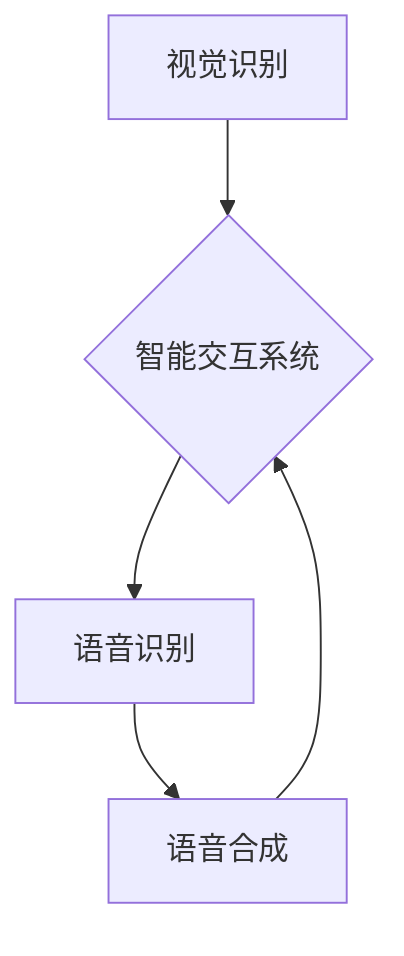

> 软件 2.0, 视觉识别, 语音识别, 语音合成, 深度学习, 人工智能, 自然语言处理, 图像处理

## 1. 背景介绍

软件 2.0 时代正在到来，它标志着人工智能（AI）技术的飞速发展和广泛应用。与传统的软件开发模式相比，软件 2.0 更注重智能化、自动化和用户体验。其中，视觉识别、语音识别和语音合成作为软件 2.0 的核心应用之一，正在深刻地改变着我们的生活方式和工作模式。

视觉识别技术能够让计算机“看”世界，理解图像和视频中的内容。语音识别技术能够让计算机“听”人类的语言，并将其转换为文本。语音合成技术能够让计算机“说”出人类的语言，将文本转换为语音。这三大技术相互协作，构成了一个强大的智能交互系统，为我们提供了更加便捷、高效、人性化的体验。

## 2. 核心概念与联系

**2.1 核心概念**

* **视觉识别:** 利用计算机视觉技术，从图像或视频中提取特征，识别物体、场景、人脸等信息。
* **语音识别:** 利用语音信号处理和自然语言处理技术，将语音信号转换为文本。
* **语音合成:** 利用语音信号处理技术，将文本转换为自然流畅的语音。

**2.2 联系**

这三大技术相互关联，共同构成了一个完整的智能交互系统。例如，在智能家居场景中，视觉识别可以识别用户的身份和意图，语音识别可以理解用户的指令，语音合成可以反馈给用户指令执行的结果。



## 3. 核心算法原理 & 具体操作步骤

**3.1 算法原理概述**

视觉识别、语音识别和语音合成都依赖于深度学习算法。深度学习是一种机器学习的子领域，它利用多层神经网络来模拟人类大脑的学习过程。通过大量的训练数据，深度学习模型可以学习到复杂的特征和模式，从而实现对图像、语音和文本的理解和生成。

**3.2 算法步骤详解**

**视觉识别:**

1. **图像预处理:** 对图像进行尺寸调整、灰度化、去噪等处理，以提高识别精度。
2. **特征提取:** 利用卷积神经网络（CNN）提取图像中的特征，例如边缘、纹理、形状等。
3. **分类识别:** 将提取的特征输入到全连接神经网络（FCN）中，进行分类识别，例如识别物体类别、场景类型等。

**语音识别:**

1. **语音信号预处理:** 对语音信号进行降噪、增益调整等处理，以提高识别精度。
2. **语音特征提取:** 利用梅尔频率倒谱系数（MFCC）等方法提取语音信号的特征。
3. **语音识别模型训练:** 利用深度学习模型，例如循环神经网络（RNN）或长短期记忆网络（LSTM），训练语音识别模型。
4. **语音转文本:** 将语音信号转换为文本。

**语音合成:**

1. **文本预处理:** 对文本进行分词、标点符号处理等预处理，以提高合成质量。
2. **语音合成模型训练:** 利用深度学习模型，例如声码器（Tacotron）或WaveNet，训练语音合成模型。
3. **语音生成:** 将文本转换为自然流畅的语音。

**3.3 算法优缺点**

**优点:**

* 高精度: 深度学习算法能够学习到复杂的特征和模式，从而实现高精度的识别和合成。
* 自动化: 深度学习模型可以自动学习和优化，无需人工干预。
* 适应性强: 深度学习模型可以适应不同的数据和场景。

**缺点:**

* 数据依赖: 深度学习模型需要大量的训练数据才能达到高精度。
* 计算资源消耗: 训练深度学习模型需要大量的计算资源。
* 可解释性差: 深度学习模型的决策过程难以解释。

**3.4 算法应用领域**

视觉识别、语音识别和语音合成技术在各个领域都有广泛的应用，例如：

* **智能家居:** 智能助手、语音控制、人脸识别门禁
* **医疗保健:** 病人诊断、影像分析、远程医疗
* **交通运输:** 自动驾驶、交通监控、语音导航
* **金融服务:** 欺诈检测、客户服务、语音支付
* **教育:** 智能辅导、语音翻译、在线学习

## 4. 数学模型和公式 & 详细讲解 & 举例说明

**4.1 数学模型构建**

视觉识别、语音识别和语音合成都依赖于数学模型来描述和实现算法。这些模型通常基于线性代数、概率论和统计学等数学基础。

**4.2 公式推导过程**

例如，在卷积神经网络中，卷积操作的数学公式如下：

$$
y(i,j) = \sum_{m=0}^{M-1} \sum_{n=0}^{N-1} x(i+m,j+n) * w(m,n) + b
$$

其中：

* $y(i,j)$ 是输出特征图的像素值
* $x(i+m,j+n)$ 是输入特征图的像素值
* $w(m,n)$ 是卷积核的权重
* $b$ 是偏置项

**4.3 案例分析与讲解**

通过调整卷积核的权重和偏置项，可以学习到不同的特征，从而实现对图像的识别和分类。

## 5. 项目实践：代码实例和详细解释说明

**5.1 开发环境搭建**

* 操作系统: Ubuntu 20.04
* Python 版本: 3.8
* 深度学习框架: TensorFlow 2.0

**5.2 源代码详细实现**

以下是一个简单的语音识别代码示例，使用 TensorFlow 和 Keras 框架实现：

```python
import tensorflow as tf
from tensorflow.keras.models import Sequential
from tensorflow.keras.layers import Dense, LSTM

# 定义模型
model = Sequential()
model.add(LSTM(128, input_shape=(timesteps, features)))
model.add(Dense(vocab_size, activation='softmax'))

# 编译模型
model.compile(loss='categorical_crossentropy', optimizer='adam', metrics=['accuracy'])

# 训练模型
model.fit(X_train, y_train, epochs=10, batch_size=32)

# 预测
predictions = model.predict(X_test)
```

**5.3 代码解读与分析**

* 使用 LSTM 层构建语音识别模型，LSTM 层能够处理序列数据，例如语音信号。
* 使用 softmax 激活函数，将输出转换为概率分布，表示每个单词的可能性。
* 使用交叉熵损失函数和 Adam 优化器训练模型。

**5.4 运行结果展示**

训练完成后，可以评估模型的性能，例如准确率、召回率、F1 值等。

## 6. 实际应用场景

**6.1 智能家居**

* 语音控制家电: 使用语音识别技术，可以控制家电，例如开灯、关窗、调节温度等。
* 人脸识别门禁: 使用人脸识别技术，可以识别用户的身份，控制门禁系统。
* 智能家居助手: 使用语音识别和合成技术，可以创建智能家居助手，帮助用户完成各种任务。

**6.2 医疗保健**

* 病人诊断: 使用图像识别技术，可以辅助医生诊断疾病，例如识别肿瘤、骨折等。
* 影像分析: 使用图像识别技术，可以分析医学影像，例如 X 光片、CT 扫描等，提取病灶信息。
* 远程医疗: 使用语音识别和合成技术，可以实现远程医疗咨询，例如医生与患者进行语音对话。

**6.3 交通运输**

* 自动驾驶: 使用视觉识别和语音识别技术，可以帮助自动驾驶汽车感知周围环境，做出决策。
* 交通监控: 使用视觉识别技术，可以监控交通状况，识别违规行为。
* 语音导航: 使用语音合成技术，可以提供语音导航，指导驾驶员到达目的地。

**6.4 未来应用展望**

随着人工智能技术的不断发展，视觉识别、语音识别和语音合成技术将有更广泛的应用场景，例如：

* 更智能的虚拟助手: 可以理解更复杂的指令，提供更个性化的服务。
* 更逼真的虚拟现实和增强现实体验: 可以更真实地模拟现实世界，提供更沉浸式的体验。
* 更便捷的跨语言交流: 可以实现实时语音翻译，打破语言障碍。

## 7. 工具和资源推荐

**7.1 学习资源推荐**

* **书籍:**
    * 深度学习
    * 人工智能：一种现代方法
* **在线课程:**
    * Coursera: 深度学习
    * Udacity: 计算机视觉
    * edX: 人工智能

**7.2 开发工具推荐**

* **深度学习框架:** TensorFlow, PyTorch, Keras
* **图像处理库:** OpenCV, Pillow
* **语音处理库:** Librosa, PyAudio

**7.3 相关论文推荐**

* AlexNet: ImageNet Classification with Deep Convolutional Neural Networks
* ResNet: Deep Residual Learning for Image Recognition
* BERT: Pre-training of Deep Bidirectional Transformers for Language Understanding

## 8. 总结：未来发展趋势与挑战

**8.1 研究成果总结**

视觉识别、语音识别和语音合成技术取得了显著的进展，在各个领域都有广泛的应用。深度学习算法是推动这些技术发展的关键因素，它能够学习到复杂的特征和模式，实现高精度的识别和合成。

**8.2 未来发展趋势**

* **更强大的模型:** 研究人员将继续开发更强大的深度学习模型，例如 Transformer、GPT 等，以提高识别和合成精度。
* **更广泛的应用场景:** 随着技术的成熟，这些技术将应用于更多领域，例如教育、医疗、金融等。
* **更智能的交互:** 人机交互将更加智能化，例如自然语言交互、多模态交互等。

**8.3 面临的挑战**

* **数据依赖:** 深度学习模型需要大量的训练数据，而获取高质量的训练数据仍然是一个挑战。
* **计算资源消耗:** 训练深度学习模型需要大量的计算资源，这对于资源有限的机构来说是一个负担。
* **可解释性差:** 深度学习模型的决策过程难以解释，这对于一些安全敏感的应用来说是一个问题。

**8.4 研究展望**

未来，研究人员将继续探索新的算法和技术，以解决这些挑战，推动视觉识别、语音识别和语音合成技术的发展。


## 9. 附录：常见问题与解答

**9.1 如何选择合适的深度学习框架？**

选择深度学习框架需要根据具体项目需求和个人经验进行选择。 TensorFlow 和 PyTorch 是目前最流行的深度学习框架，它们都具有强大的功能和活跃的社区支持。

**9.2 如何获取高质量的训练数据？**

获取高质量的训练数据可以通过以下方式：

* 使用公开数据集: 许多开源数据集可以用于训练视觉识别、语音识别和语音合成模型。
* 构建自己的数据集: 可以根据具体项目需求，收集和标注自己的数据。
* 使用数据增强技术: 可以通过数据增强技术，例如图像旋转、裁剪、翻转等，增加训练数据的多样性。

**9.3 如何提高模型的识别精度？**

提高模型识别精度的方法包括：

* 使用更强大的模型架构
* 增加训练数据量
* 调整模型超参数
* 使用数据增强技术
* 使用迁移学习技术


作者：禅与计算机程序设计艺术 / Zen and the Art of Computer Programming 
<end_of_turn>