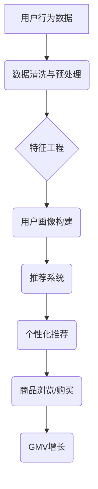

> GMV目标、电商平台、数据分析、机器学习、推荐系统、用户画像、个性化推荐、A/B测试、优化策略

## 1. 背景介绍

淘宝天猫作为中国最大的电商平台之一，其GMV（Gross Merchandise Volume，商品总交易额）目标一直是公司发展的重要指标。为了实现持续的GMV增长，淘宝天猫需要不断优化平台的运营策略，提升用户体验，并挖掘潜在的商业价值。

近年来，随着大数据、人工智能等技术的快速发展，电商平台的运营模式也发生了深刻变化。数据分析、机器学习、推荐系统等技术成为提升GMV的重要驱动力。本文将从技术角度探讨如何通过数据分析、机器学习等技术手段，帮助淘宝天猫达成GMV目标。

## 2. 核心概念与联系

**2.1 核心概念**

* **GMV目标:** 指的是淘宝天猫平台在特定时间段内完成的商品总交易额。
* **数据分析:** 通过收集、清洗、分析和挖掘数据，以发现隐藏的模式和趋势，为决策提供支持。
* **机器学习:** 一种人工智能技术，通过算法训练，使计算机能够从数据中学习，并做出预测或决策。
* **推荐系统:** 基于用户行为、商品特征等数据，为用户推荐感兴趣的商品，提高用户转化率。
* **用户画像:** 通过收集用户行为、偏好、属性等数据，构建用户画像，以便更好地理解用户需求。
* **个性化推荐:** 根据用户的个性化需求，提供定制化的商品推荐。
* **A/B测试:** 将用户随机分配到不同的实验组，比较不同策略的效果，以确定最佳方案。

**2.2 架构关系**



## 3. 核心算法原理 & 具体操作步骤

**3.1 算法原理概述**

为了达成GMV目标，淘宝天猫可以采用多种机器学习算法，例如：

* **协同过滤:** 基于用户的历史行为和商品的相似度，推荐用户可能感兴趣的商品。
* **内容过滤:** 基于商品的特征和用户的偏好，推荐用户可能感兴趣的商品。
* **深度学习:** 利用深度神经网络，从海量数据中学习更复杂的模式，进行更精准的推荐。

**3.2 算法步骤详解**

以协同过滤算法为例，其具体步骤如下：

1. **数据收集:** 收集用户行为数据，例如用户浏览历史、购买记录、评分等。
2. **数据预处理:** 清洗数据，处理缺失值，并对数据进行标准化处理。
3. **用户-商品矩阵构建:** 将用户和商品映射到矩阵中，其中每个元素表示用户对商品的评分或交互行为。
4. **相似度计算:** 计算用户之间的相似度或商品之间的相似度，可以使用余弦相似度、皮尔逊相关系数等方法。
5. **推荐生成:** 根据用户的相似用户或商品的相似商品，推荐用户可能感兴趣的商品。

**3.3 算法优缺点**

* **优点:** 能够推荐用户可能感兴趣的商品，提高用户转化率。
* **缺点:** 容易陷入冷启动问题，对于新用户或新商品难以进行推荐。

**3.4 算法应用领域**

协同过滤算法广泛应用于电商平台、音乐平台、电影平台等领域，用于推荐商品、音乐、电影等内容。

## 4. 数学模型和公式 & 详细讲解 & 举例说明

**4.1 数学模型构建**

协同过滤算法的核心是用户-商品矩阵，可以使用以下数学模型表示：

* **用户-商品矩阵:** R ∈ R^(m×n)，其中m表示用户数量，n表示商品数量。R(i,j)表示用户i对商品j的评分或交互行为。

**4.2 公式推导过程**

* **余弦相似度:** 计算用户i和用户j之间的相似度，可以使用余弦相似度公式：

$$
sim(i,j) = \frac{R(i,:) \cdot R(j,:)} {||R(i,:)|| ||R(j,:)||}
$$

其中，R(i,:)表示用户i的评分向量，||R(i,:)||表示用户i评分向量的模长。

**4.3 案例分析与讲解**

假设有两个用户A和B，他们的评分向量分别为：

* R(A,:) = [5, 4, 3, 2]
* R(B,:) = [4, 3, 2, 5]

使用余弦相似度公式计算用户A和用户B之间的相似度：

$$
sim(A,B) = \frac{(5*4 + 4*3 + 3*2 + 2*5)}{(\sqrt{5^2 + 4^2 + 3^2 + 2^2})(\sqrt{4^2 + 3^2 + 2^2 + 5^2})}
$$

计算结果为0.8，表示用户A和用户B之间的相似度较高。

## 5. 项目实践：代码实例和详细解释说明

**5.1 开发环境搭建**

* 操作系统: Ubuntu 20.04
* Python 版本: 3.8
* 依赖库: pandas, numpy, scikit-learn

**5.2 源代码详细实现**

```python
import pandas as pd
from sklearn.metrics.pairwise import cosine_similarity

# 加载用户-商品评分数据
data = pd.read_csv('ratings.csv')

# 构建用户-商品矩阵
user_item_matrix = data.pivot_table(index='user_id', columns='item_id', values='rating')

# 计算用户之间的余弦相似度
user_similarity = cosine_similarity(user_item_matrix)

# 获取用户A的相似用户
user_A_id = 1
similar_users = user_similarity[user_A_id].argsort()[:-6:-1]  # 排序获取相似用户

# 推荐商品给用户A
recommended_items = []
for user_B_id in similar_users:
    # 获取用户B喜欢的商品
    user_B_ratings = user_item_matrix.loc[user_B_id].dropna()
    # 获取用户A未评分的商品
    user_A_unrated_items = user_item_matrix.loc[user_A_id].index[user_item_matrix.loc[user_A_id].isnull()]
    # 推荐用户B喜欢的，用户A未评分的商品
    recommended_items.extend(user_B_ratings.index.intersection(user_A_unrated_items))

# 去重并输出推荐商品
recommended_items = list(set(recommended_items))
print(f'推荐给用户{user_A_id}的商品: {recommended_items}')
```

**5.3 代码解读与分析**

* 代码首先加载用户-商品评分数据，并构建用户-商品矩阵。
* 然后使用余弦相似度计算用户之间的相似度。
* 获取用户A的相似用户，并根据相似用户的评分推荐商品给用户A。

**5.4 运行结果展示**

运行代码后，将输出用户A的推荐商品列表。

## 6. 实际应用场景

淘宝天猫可以将上述算法应用于以下场景：

* **商品推荐:** 为用户推荐个性化的商品，提高用户转化率。
* **用户画像:** 构建用户画像，了解用户的兴趣爱好和消费习惯，为用户提供更精准的服务。
* **营销活动:** 根据用户画像和行为数据，精准推送营销活动，提高活动效果。

**6.4 未来应用展望**

随着人工智能技术的不断发展，淘宝天猫可以进一步探索以下应用场景：

* **智能客服:** 利用自然语言处理技术，开发智能客服，为用户提供更便捷的服务。
* **个性化内容推荐:** 基于用户的兴趣爱好和行为数据，推荐个性化的内容，例如文章、视频、直播等。
* **预测分析:** 利用机器学习算法，预测用户的购买行为，为平台运营提供决策支持。

## 7. 工具和资源推荐

**7.1 学习资源推荐**

* **书籍:**
    * 《机器学习》 - 周志华
    * 《深度学习》 - Ian Goodfellow
* **在线课程:**
    * Coursera: Machine Learning
    * edX: Artificial Intelligence

**7.2 开发工具推荐**

* **Python:** 
    * pandas: 数据分析和处理
    * numpy: 数值计算
    * scikit-learn: 机器学习库
* **Spark:** 大数据处理框架

**7.3 相关论文推荐**

* **协同过滤算法:**
    * "Collaborative Filtering: A User-Based Approach" - Goldberg et al. (1992)
    * "Item-Based Collaborative Filtering Recommendation Algorithms" - Sarwar et al. (2001)
* **深度学习推荐系统:**
    * "Deep Learning for Recommender Systems" - Wang-Cheng Kang et al. (2019)

## 8. 总结：未来发展趋势与挑战

**8.1 研究成果总结**

本文探讨了如何通过数据分析、机器学习等技术手段，帮助淘宝天猫达成GMV目标。

**8.2 未来发展趋势**

* **个性化推荐:** 更加精准的个性化推荐，满足用户多样化的需求。
* **多模态推荐:** 融合文本、图像、视频等多模态数据，提供更丰富的推荐体验。
* **联邦学习:** 保护用户隐私，实现数据安全共享。

**8.3 面临的挑战**

* **数据质量:** 数据的准确性和完整性对推荐效果至关重要。
* **冷启动问题:** 如何为新用户和新商品进行推荐。
* **算法解释性:** 提升推荐算法的解释性，增强用户信任。

**8.4 研究展望**

未来，将继续探索更先进的推荐算法，并结合大数据、人工智能等技术，为淘宝天猫提供更智能、更精准的推荐服务，助力其实现持续的GMV增长。

## 9. 附录：常见问题与解答

* **Q1: 协同过滤算法容易陷入冷启动问题，如何解决？**

* **A1:** 可以结合内容过滤算法，利用商品的特征信息进行推荐。

* **Q2: 如何评估推荐算法的效果？**

* **A2:** 可以使用指标如点击率、转化率、用户满意度等进行评估。

* **Q3: 如何处理用户数据隐私问题？**

* **A3:** 可以采用联邦学习等技术，保护用户数据隐私。


作者：禅与计算机程序设计艺术 / Zen and the Art of Computer Programming 
<end_of_turn>