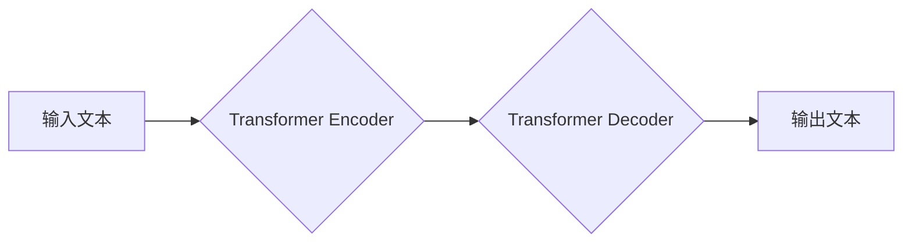

>  * 大语言模型 (LLM)
>  * 通用人工智能 (AGI)
>  * 自然语言处理 (NLP)
>  * 深度学习
>  * Transformer
>  * 知识图谱
>  * 伦理与安全

## 1. 背景介绍

人工智能 (AI) 领域近年来取得了飞速发展，特别是深度学习技术的突破，为通用人工智能 (AGI) 的实现指明了方向。其中，大语言模型 (LLM) 作为一种强大的 AI 技术，在自然语言处理 (NLP) 领域展现出令人瞩目的潜力。LLM 能够理解和生成人类语言，并完成各种复杂的任务，例如文本生成、翻译、问答、代码生成等。随着 LLM 技术的不断发展，我们正逐渐接近 AGI 的时代。

## 2. 核心概念与联系

**2.1  LLM 的核心概念**

LLM 是指拥有大量参数的深度神经网络模型，通过学习海量文本数据，能够理解和生成人类语言。其核心概念包括：

* **Transformer 架构:** Transformer 架构是 LLM 的基础，它利用注意力机制，能够有效地捕捉文本中的长距离依赖关系。
* **预训练与微调:** LLM 通常采用预训练与微调的策略。预训练阶段，模型在大量文本数据上进行训练，学习语言的通用知识和模式。微调阶段，模型在特定任务数据上进行训练，使其能够完成特定任务。
* **参数量:** LLM 的参数量通常非常大，例如 GPT-3 有 1750 亿个参数，PaLM 有 5400 亿个参数。大量的参数使得 LLM 能够学习更复杂的语言模式。

**2.2  LLM 与 AGI 的联系**

LLM 被认为是实现 AGI 的重要一步。其强大的语言理解和生成能力可以用于解决许多复杂问题，例如：

* **知识表示和推理:** LLM 可以学习文本中的知识，并进行推理和问答。
* **代码生成和理解:** LLM 可以生成和理解代码，从而辅助软件开发。
* **创意写作和艺术创作:** LLM 可以生成诗歌、小说、音乐等创意作品。

**2.3  LLM 的架构图**



## 3. 核心算法原理 & 具体操作步骤

**3.1  算法原理概述**

LLM 的核心算法是 Transformer 架构，它利用注意力机制来捕捉文本中的长距离依赖关系。注意力机制可以赋予不同词语不同的权重，从而更好地理解文本的语义。

**3.2  算法步骤详解**

1. **词嵌入:** 将输入文本中的每个词语转换为向量表示。
2. **编码器:** 利用 Transformer Encoder 将词向量序列编码成上下文表示。
3. **解码器:** 利用 Transformer Decoder 将上下文表示解码成输出文本序列。
4. **损失函数:** 使用交叉熵损失函数来衡量模型的预测结果与真实文本之间的差异。
5. **反向传播:** 利用梯度下降算法更新模型参数。

**3.3  算法优缺点**

**优点:**

* 能够有效地捕捉文本中的长距离依赖关系。
* 训练效率高，能够处理海量文本数据。
* 在各种 NLP 任务中表现出色。

**缺点:**

* 参数量大，需要大量的计算资源进行训练。
* 训练数据对模型性能有很大影响。
* 容易受到恶意输入的影响。

**3.4  算法应用领域**

LLM 的应用领域非常广泛，包括：

* **自然语言理解:** 文本分类、情感分析、问答系统等。
* **自然语言生成:** 文本摘要、机器翻译、对话系统等。
* **代码生成:** 代码补全、代码翻译、代码生成等。
* **创意写作:** 诗歌生成、小说生成、剧本生成等。

## 4. 数学模型和公式 & 详细讲解 & 举例说明

**4.1  数学模型构建**

LLM 的数学模型主要基于 Transformer 架构，其核心是注意力机制。注意力机制可以计算每个词语与其他词语之间的相关性，并根据相关性赋予每个词语不同的权重。

**4.2  公式推导过程**

注意力机制的计算公式如下：

$$
Attention(Q, K, V) = softmax(\frac{QK^T}{\sqrt{d_k}})V
$$

其中：

* $Q$ 是查询矩阵，表示当前词语的向量表示。
* $K$ 是键矩阵，表示所有词语的向量表示。
* $V$ 是值矩阵，表示所有词语的向量表示。
* $d_k$ 是键向量的维度。
* $softmax$ 函数将计算结果归一化。

**4.3  案例分析与讲解**

例如，在翻译句子 "The cat sat on the mat" 时，注意力机制会计算每个词语与其他词语之间的相关性。例如，"cat" 与 "sat" 之间相关性较高，因为它们描述了同一个动作。因此，注意力机制会赋予 "cat" 和 "sat" 更高的权重，从而更好地理解句子含义。

## 5. 项目实践：代码实例和详细解释说明

**5.1  开发环境搭建**

LLM 的开发环境通常需要安装 Python、PyTorch 或 TensorFlow 等深度学习框架，以及一些 NLP 工具库，例如 HuggingFace Transformers。

**5.2  源代码详细实现**

```python
from transformers import AutoModelForSeq2SeqLM, AutoTokenizer

# 加载预训练模型和词典
model_name = "t5-base"
tokenizer = AutoTokenizer.from_pretrained(model_name)
model = AutoModelForSeq2SeqLM.from_pretrained(model_name)

# 输入文本
input_text = "The cat sat on the mat."

# Token化输入文本
input_ids = tokenizer.encode(input_text, return_tensors="pt")

# 生成输出文本
output_ids = model.generate(input_ids)

# 解码输出文本
output_text = tokenizer.decode(output_ids[0], skip_special_tokens=True)

# 打印输出文本
print(output_text)
```

**5.3  代码解读与分析**

这段代码演示了如何使用 HuggingFace Transformers 库加载预训练的 T5 模型，并进行文本生成任务。

* `AutoTokenizer.from_pretrained(model_name)`: 加载预训练的词典。
* `AutoModelForSeq2SeqLM.from_pretrained(model_name)`: 加载预训练的文本生成模型。
* `tokenizer.encode(input_text, return_tensors="pt")`: 将输入文本转换为模型可以理解的格式。
* `model.generate(input_ids)`: 使用模型生成输出文本。
* `tokenizer.decode(output_ids[0], skip_special_tokens=True)`: 将输出文本解码回原始文本格式。

**5.4  运行结果展示**

运行这段代码后，会输出类似于以下的文本：

```
The cat sat on the mat.
```

## 6. 实际应用场景

**6.1  文本生成**

LLM 可以用于生成各种类型的文本，例如：

* **小说、诗歌、剧本:** LLM 可以根据给定的主题或关键词生成创意文本。
* **新闻报道、文章:** LLM 可以根据事件信息生成新闻报道或文章。
* **广告文案、营销文案:** LLM 可以根据目标受众生成吸引人的广告文案。

**6.2  机器翻译**

LLM 可以用于将文本从一种语言翻译成另一种语言。

**6.3  问答系统**

LLM 可以用于构建问答系统，能够回答用户提出的问题。

**6.4  未来应用展望**

LLM 的应用场景还在不断扩展，未来可能会应用于：

* **个性化教育:** 根据学生的学习情况生成个性化的学习内容。
* **医疗诊断:** 辅助医生进行疾病诊断。
* **法律服务:** 帮助律师进行法律分析和撰写法律文件。

## 7. 工具和资源推荐

**7.1  学习资源推荐**

* **书籍:**
    * 《深度学习》
    * 《自然语言处理》
    * 《Transformer 详解》
* **在线课程:**
    * Coursera: 深度学习
    * Udacity: 自然语言处理
    * fast.ai: 深度学习

**7.2  开发工具推荐**

* **HuggingFace Transformers:** 一个开源的 NLP 工具库，提供预训练的 LLM 模型和工具。
* **TensorFlow:** 一个开源的深度学习框架。
* **PyTorch:** 另一个开源的深度学习框架。

**7.3  相关论文推荐**

* 《Attention Is All You Need》
* 《BERT: Pre-training of Deep Bidirectional Transformers for Language Understanding》
* 《GPT-3: Language Models are Few-Shot Learners》

## 8. 总结：未来发展趋势与挑战

**8.1  研究成果总结**

近年来，LLM 技术取得了显著进展，模型规模不断扩大，性能不断提升。LLM 已经能够完成许多复杂的任务，并展现出强大的潜力。

**8.2  未来发展趋势**

* **模型规模进一步扩大:** 随着计算资源的不断发展，LLM 的模型规模将会进一步扩大，从而提升模型的性能。
* **多模态学习:** LLM 将会融合视觉、音频等多模态数据，实现更全面的理解和生成能力。
* **可解释性增强:** 研究人员将致力于提高 LLM 的可解释性，使其决策过程更加透明。

**8.3  面临的挑战**

* **数据安全和隐私:** LLM 的训练需要大量数据，如何保证数据安全和隐私是一个重要挑战。
* **模型偏见和歧视:** LLM 可能存在模型偏见和歧视，需要采取措施进行缓解。
* **伦理和社会影响:** LLM 的应用可能会带来伦理和社会影响，需要进行深入的探讨和监管。

**8.4  研究展望**

未来，LLM 研究将继续朝着更强大、更安全、更可解释的方向发展。


## 9. 附录：常见问题与解答

**9.1  LLM 与 RNN 的区别是什么？**

RNN (循环神经网络) 是一种能够处理序列数据的网络结构，但其难以捕捉长距离依赖关系。Transformer 架构的出现解决了这个问题，并成为了 LLM 的基础。

**9.2  如何训练一个 LLM 模型？**

训练一个 LLM 模型需要大量的计算资源和海量文本数据。通常需要使用预训练与微调的策略，先在大量文本数据上进行预训练，然后在特定任务数据上进行微调。

**9.3  LLM 的应用有哪些？**

LLM 的应用非常广泛，包括文本生成、机器翻译、问答系统、代码生成等。

**9.4  LLM 的伦理问题有哪些？**

LLM 的应用可能会带来一些伦理问题，例如模型偏见、数据隐私、虚假信息生成等。需要进行深入的探讨和监管。


作者：禅与计算机程序设计艺术 / Zen and the Art of Computer Programming 
<end_of_turn>