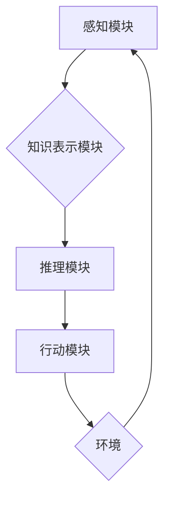

> AI Agent, 智能体, 强化学习, 决策推理, 知识表示, 自然语言理解, 机器学习, 

## 1. 背景介绍

人工智能（AI）近年来取得了令人瞩目的进展，从语音识别到图像生成，AI已经渗透到我们生活的方方面面。然而，我们离真正意义上的通用人工智能（AGI）还有很长的路要走。 

传统的AI系统通常是针对特定任务设计的，例如玩围棋、翻译语言或识别图像。这些系统在各自领域表现出色，但缺乏灵活性和适应性。 

智能体（AI Agent）的概念应运而生，它旨在构建更接近人类智能的AI系统。智能体是一个能够感知环境、做出决策并与环境交互的实体。它具备学习、推理、计划和自主行动的能力，能够应对复杂、动态的环境变化。

## 2. 核心概念与联系

**2.1 智能体定义**

智能体是一个能够感知环境、做出决策并与环境交互的实体。它具备以下核心特征：

* **感知能力:** 智能体能够通过传感器获取环境信息，例如视觉、听觉、触觉等。
* **决策能力:** 智能体能够根据感知到的信息和自身的知识库，做出最优决策。
* **行动能力:** 智能体能够执行决策，与环境进行交互，例如移动、操作物体、发出指令等。
* **学习能力:** 智能体能够从经验中学习，不断改进决策策略。

**2.2 智能体与其他AI概念的关系**

* **机器学习:** 机器学习是智能体学习的核心技术之一。通过训练数据，智能体可以学习识别模式、预测结果和改进决策。
* **深度学习:** 深度学习是一种更高级的机器学习方法，利用多层神经网络模拟人类大脑的学习机制，能够处理更复杂的数据和任务。
* **强化学习:** 强化学习是一种训练智能体的方法，通过奖励和惩罚机制，引导智能体学习最优行为策略。

**2.3 智能体架构**

智能体的架构通常包括以下几个模块：

* **感知模块:** 负责获取环境信息，例如传感器数据、文本数据、图像数据等。
* **知识表示模块:** 负责将感知到的信息转化为可理解的知识表示，例如知识图谱、符号逻辑等。
* **推理模块:** 负责根据知识库和当前环境信息，进行推理和决策。
* **行动模块:** 负责执行决策，与环境进行交互。

**2.4 Mermaid 流程图**



## 3. 核心算法原理 & 具体操作步骤

### 3.1 算法原理概述

智能体算法的核心是学习和决策。常见的智能体算法包括：

* **基于规则的系统:** 采用预先定义的规则来指导智能体的行为。
* **基于模型的系统:** 建立环境模型，通过模拟和预测来做出决策。
* **基于学习的系统:** 通过训练数据学习决策策略，例如强化学习、监督学习、无监督学习等。

### 3.2 算法步骤详解

以强化学习为例，其核心步骤如下：

1. **环境建模:** 建立环境模型，定义状态空间、动作空间和奖励函数。
2. **策略初始化:** 初始化智能体的策略，例如随机策略或贪婪策略。
3. **交互学习:** 智能体与环境交互，根据策略选择动作，获得奖励和新的状态。
4. **策略更新:** 根据获得的奖励和状态信息，更新智能体的策略，使其朝着获得更高奖励的方向发展。
5. **重复步骤3-4:** 重复交互学习和策略更新的过程，直到智能体达到预设的目标或性能指标。

### 3.3 算法优缺点

**优点:**

* 能够学习复杂环境下的决策策略。
* 适应性强，能够应对环境变化。
* 不需要预先定义所有规则，能够自动发现规律。

**缺点:**

* 训练过程可能需要大量数据和计算资源。
* 难以解释智能体的决策过程。
* 可能会陷入局部最优解。

### 3.4 算法应用领域

强化学习在许多领域都有广泛的应用，例如：

* **游戏:** 训练AI游戏玩家，例如AlphaGo、AlphaStar等。
* **机器人:** 训练机器人进行自主导航、抓取、操作等任务。
* **推荐系统:** 训练推荐系统，根据用户的行为和偏好推荐物品。
* **金融:** 训练交易策略，进行股票投资和风险管理。

## 4. 数学模型和公式 & 详细讲解 & 举例说明

### 4.1 数学模型构建

智能体的行为可以建模为马尔可夫决策过程（MDP）。MDP由以下几个要素组成：

* **状态空间 (S):** 环境可能存在的各种状态。
* **动作空间 (A):** 智能体可以执行的动作。
* **转移概率 (P):** 从一个状态执行一个动作后转移到另一个状态的概率。
* **奖励函数 (R):** 智能体在某个状态执行某个动作后获得的奖励。

### 4.2 公式推导过程

智能体的目标是找到一个最优策略，使得在长期的交互过程中获得最大的总奖励。最优策略可以用价值函数来表示，价值函数表示从某个状态执行某个策略的期望总奖励。

价值函数的更新公式为：

$$
V(s) = \max_a \sum_{s'} P(s'|s,a) [R(s,a,s') + \gamma V(s')]
$$

其中：

* $V(s)$ 是状态 $s$ 的价值函数。
* $a$ 是智能体可以执行的动作。
* $P(s'|s,a)$ 是从状态 $s$ 执行动作 $a$ 后转移到状态 $s'$ 的概率。
* $R(s,a,s')$ 是在状态 $s$ 执行动作 $a$ 后转移到状态 $s'$ 获得的奖励。
* $\gamma$ 是折扣因子，控制未来奖励的权重。

### 4.3 案例分析与讲解

例如，训练一个智能体玩游戏，我们可以将游戏状态表示为游戏棋盘的布局，动作表示为玩家可以执行的操作，奖励表示为获得分数或完成任务。通过强化学习算法，智能体可以学习到最优策略，从而获得更高的分数或完成任务。

## 5. 项目实践：代码实例和详细解释说明

### 5.1 开发环境搭建

* Python 3.x
* TensorFlow 或 PyTorch 等深度学习框架
* OpenAI Gym 或其他强化学习环境

### 5.2 源代码详细实现

```python
import gym
import tensorflow as tf

# 定义神经网络模型
model = tf.keras.Sequential([
    tf.keras.layers.Dense(64, activation='relu'),
    tf.keras.layers.Dense(64, activation='relu'),
    tf.keras.layers.Dense(env.action_space.n)
])

# 定义损失函数和优化器
optimizer = tf.keras.optimizers.Adam()
loss_fn = tf.keras.losses.CategoricalCrossentropy()

# 训练循环
for episode in range(num_episodes):
    state = env.reset()
    done = False
    total_reward = 0

    while not done:
        # 选择动作
        action_probs = model(state)
        action = tf.random.categorical(tf.math.log(action_probs), 1)[0, 0]

        # 执行动作并获取奖励和下一个状态
        next_state, reward, done, _ = env.step(action)

        # 更新状态
        state = next_state

        # 计算损失并更新模型参数
        with tf.GradientTape() as tape:
            target_probs = tf.one_hot(action, depth=env.action_space.n)
            loss = loss_fn(target_probs, action_probs)
        gradients = tape.gradient(loss, model.trainable_variables)
        optimizer.apply_gradients(zip(gradients, model.trainable_variables))

        # 更新总奖励
        total_reward += reward

    print(f"Episode {episode+1}, Total Reward: {total_reward}")

```

### 5.3 代码解读与分析

这段代码实现了基于深度学习的强化学习算法，用于训练智能体玩游戏。

* 首先定义了神经网络模型，用于预测动作概率。
* 然后定义了损失函数和优化器，用于训练模型。
* 训练循环中，智能体与环境交互，根据模型预测的动作执行操作，并根据奖励更新模型参数。

### 5.4 运行结果展示

训练完成后，智能体能够在游戏中获得更高的分数或完成任务。

## 6. 实际应用场景

### 6.1 自动驾驶

智能体可以用于训练自动驾驶系统，学习识别道路场景、预测其他车辆和行人的行为，并做出最优驾驶决策。

### 6.2 机器人控制

智能体可以用于训练机器人进行自主导航、抓取、操作等任务，例如在工厂进行自动化生产、在仓库进行货物搬运等。

### 6.3 个性化推荐

智能体可以用于训练个性化推荐系统，根据用户的行为和偏好推荐商品、服务或内容。

### 6.4 医疗诊断

智能体可以用于辅助医生进行医疗诊断，例如分析医学图像、预测疾病风险、制定个性化治疗方案等。

### 6.4 未来应用展望

随着人工智能技术的不断发展，智能体将在更多领域得到应用，例如：

* **教育:** 个性化学习、智能辅导
* **金融:** 风险管理、欺诈检测
* **能源:** 智能电网、能源管理
* **安全:** 人脸识别、入侵检测

## 7. 工具和资源推荐

### 7.1 学习资源推荐

* **书籍:**
    * Reinforcement Learning: An Introduction by Richard S. Sutton and Andrew G. Barto
    * Deep Reinforcement Learning Hands-On by Maxim Lapan
* **在线课程:**
    * Coursera: Reinforcement Learning Specialization
    * Udacity: Deep Reinforcement Learning Nanodegree

### 7.2 开发工具推荐

* **OpenAI Gym:** 强化学习环境
* **TensorFlow:** 深度学习框架
* **PyTorch:** 深度学习框架

### 7.3 相关论文推荐

* Deep Q-Network (DQN)
* Proximal Policy Optimization (PPO)
* Trust Region Policy Optimization (TRPO)

## 8. 总结：未来发展趋势与挑战

### 8.1 研究成果总结

近年来，智能体领域取得了显著进展，例如AlphaGo、AlphaStar等智能体在游戏领域取得了突破性的成就。

### 8.2 未来发展趋势

* **更强大的计算能力:** 更强大的计算能力将推动智能体算法的复杂度和规模的提升。
* **更丰富的传感器数据:** 更丰富的传感器数据将使智能体能够更好地感知环境。
* **更有效的学习算法:** 更有效的学习算法将使智能体能够更快、更有效地学习。
* **更安全的智能体:** 安全性和可解释性是未来智能体发展的重要方向。

### 8.3 面临的挑战

* **数据获取和标注:** 训练智能体需要大量高质量的数据，数据获取和标注成本高昂。
* **模型复杂度和可解释性:** 智能体模型越来越复杂，难以解释其决策过程。
* **安全性和伦理问题:** 智能体可能存在安全漏洞和伦理风险，需要谨慎对待。

### 8.4 研究展望

未来，智能体研究将继续朝着更强大、更安全、更可解释的方向发展，并将在更多领域发挥重要作用。

## 9. 附录：常见问题与解答

**Q1: 智能体和机器学习有什么区别？**

**A1:** 机器学习是智能体学习的核心技术之一，但智能体不仅仅是机器学习，它还包括感知、决策、行动等模块。

**Q2: 强化学习和监督学习有什么区别？**

**A