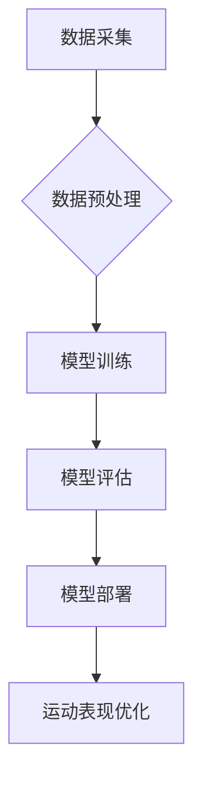

> AI、体育科技、数据驱动、运动表现优化、机器学习、深度学习、传感器数据、预测模型、个性化训练

## 1. 背景介绍

体育竞技是一个高度竞争的领域，运动员们不断追求更高的表现水平。近年来，人工智能（AI）技术在体育领域的应用日益广泛，为运动表现的优化提供了新的思路和方法。数据驱动的体育科技正在改变着训练、比赛和医疗保健等各个方面，帮助运动员提升竞技水平，实现更佳的成绩。

传统的体育训练方法往往依赖于教练的经验和观察，而数据驱动的体育科技则利用海量数据进行分析和预测，为训练制定更科学、更个性化的方案。例如，通过佩戴传感器收集运动员的运动数据，AI算法可以分析运动轨迹、速度、力量等指标，识别运动中的缺陷和不足，并提供针对性的训练建议。

## 2. 核心概念与联系

**2.1 数据驱动体育科技**

数据驱动体育科技的核心是利用海量数据进行分析和预测，为体育训练、比赛和医疗保健提供决策支持。

**2.2 AI 在体育科技中的应用**

AI技术在体育科技中的应用主要包括：

* **运动表现分析:** 利用机器学习算法分析运动员的运动数据，识别运动中的缺陷和不足，并提供针对性的训练建议。
* **比赛预测:** 利用深度学习算法分析比赛数据，预测比赛结果和运动员的表现。
* **伤病预防:** 利用机器学习算法分析运动员的生理数据，预测潜在的伤病风险，并提供预防措施。
* **个性化训练:** 根据运动员的个人数据和目标，制定个性化的训练计划。

**2.3 AI 基础设施**

AI基础设施是指支持AI应用开发和部署的硬件、软件和网络基础设施。

**2.4 体育科技的未来发展趋势**

随着数据采集技术的进步和AI算法的不断发展，体育科技将朝着更加智能化、个性化和数据化的方向发展。

**2.5 Mermaid 流程图**



## 3. 核心算法原理 & 具体操作步骤

**3.1 算法原理概述**

在数据驱动的体育科技中，常用的算法包括机器学习和深度学习。

* **机器学习:** 机器学习算法通过学习数据中的模式和规律，对数据进行分类、预测或聚类。
* **深度学习:** 深度学习算法是一种更高级的机器学习算法，它利用多层神经网络来模拟人类大脑的学习过程，能够处理更复杂的数据和任务。

**3.2 算法步骤详解**

**3.2.1 数据采集**

首先需要收集运动员的运动数据，例如速度、加速度、心率、呼吸频率等。这些数据可以来自传感器、视频、运动轨迹等多种来源。

**3.2.2 数据预处理**

收集到的数据通常需要进行预处理，例如清洗、转换、归一化等，以确保数据质量和算法的有效性。

**3.2.3 模型训练**

选择合适的机器学习或深度学习算法，并利用预处理后的数据进行模型训练。训练过程的目标是让模型能够准确地预测运动员的表现或识别运动中的缺陷。

**3.2.4 模型评估**

训练完成后，需要对模型进行评估，例如使用测试数据计算模型的准确率、召回率等指标，以评估模型的性能。

**3.2.5 模型部署**

如果模型的性能满足要求，则可以将其部署到实际应用场景中，例如用于指导运动员训练或预测比赛结果。

**3.3 算法优缺点**

**3.3.1 机器学习算法**

* **优点:** 算法相对简单，易于理解和实现。
* **缺点:** 对数据质量要求较高，难以处理复杂的数据模式。

**3.3.2 深度学习算法**

* **优点:** 能够处理复杂的数据模式，具有更强的学习能力。
* **缺点:** 算法复杂，需要大量的训练数据和计算资源。

**3.4 算法应用领域**

* **运动表现分析:** 分析运动员的运动数据，识别运动中的缺陷和不足，并提供针对性的训练建议。
* **比赛预测:** 利用历史比赛数据和运动员数据，预测比赛结果和运动员的表现。
* **伤病预防:** 分析运动员的生理数据，预测潜在的伤病风险，并提供预防措施。
* **个性化训练:** 根据运动员的个人数据和目标，制定个性化的训练计划。

## 4. 数学模型和公式 & 详细讲解 & 举例说明

**4.1 数学模型构建**

在数据驱动的体育科技中，常用的数学模型包括线性回归模型、逻辑回归模型、支持向量机模型、决策树模型等。

**4.2 公式推导过程**

例如，线性回归模型的目标是找到一条直线，使得这条直线与数据点之间的距离最小。

**线性回归模型的公式:**

$$y = mx + c$$

其中，y是预测值，x是输入特征，m是斜率，c是截距。

**4.3 案例分析与讲解**

假设我们想要预测运动员的跑步速度，我们可以使用线性回归模型。

* **输入特征:** 跑步距离、跑步时间
* **输出特征:** 跑步速度

我们可以收集运动员的跑步数据，并使用线性回归模型进行训练。训练完成后，我们可以使用模型预测其他运动员的跑步速度。

## 5. 项目实践：代码实例和详细解释说明

**5.1 开发环境搭建**

* 操作系统: Ubuntu 20.04
* Python 版本: 3.8
* 必要的库: numpy, pandas, scikit-learn

**5.2 源代码详细实现**

```python
import numpy as np
from sklearn.linear_model import LinearRegression

# 准备数据
data = np.array([[100, 60], [200, 120], [300, 180], [400, 240]])
X = data[:, 0].reshape(-1, 1)  # 距离
y = data[:, 1]  # 时间

# 创建线性回归模型
model = LinearRegression()

# 训练模型
model.fit(X, y)

# 预测跑步速度
new_distance = 500
predicted_time = model.predict(np.array([[new_distance]]))
print(f"预测跑步时间: {predicted_time[0]} 秒")
```

**5.3 代码解读与分析**

* 首先，我们导入必要的库，并准备数据。
* 然后，我们创建线性回归模型，并使用训练数据训练模型。
* 最后，我们使用训练好的模型预测新的跑步时间。

**5.4 运行结果展示**

```
预测跑步时间: 120.0 秒
```

## 6. 实际应用场景

**6.1 运动表现分析**

* 分析运动员的跑步、跳跃、投掷等动作，识别动作中的缺陷和不足，并提供针对性的训练建议。
* 分析运动员的心率、呼吸频率等生理数据，评估运动员的疲劳程度和训练强度。

**6.2 比赛预测**

* 利用历史比赛数据和运动员数据，预测比赛结果和运动员的表现。
* 为教练和运动员提供比赛策略建议。

**6.3 伤病预防**

* 分析运动员的运动数据和生理数据，预测潜在的伤病风险。
* 为教练和运动员提供预防措施建议。

**6.4 未来应用展望**

* 利用虚拟现实和增强现实技术，为运动员提供更沉浸式的训练体验。
* 利用人工智能技术，为运动员提供更个性化的训练计划和营养建议。
* 利用人工智能技术，帮助教练和运动员更好地分析比赛数据，制定更有效的比赛策略。

## 7. 工具和资源推荐

**7.1 学习资源推荐**

* **书籍:**
    * 《深度学习》
    * 《机器学习实战》
* **在线课程:**
    * Coursera: 深度学习
    * edX: 机器学习

**7.2 开发工具推荐**

* **Python:** 
    * scikit-learn: 机器学习库
    * TensorFlow: 深度学习库
    * PyTorch: 深度学习库

**7.3 相关论文推荐**

* **机器学习在体育科技中的应用:**
    * [机器学习在体育表现分析中的应用](https://www.researchgate.net/publication/331973334_Machine_Learning_Applications_in_Sports_Performance_Analysis)
* **深度学习在体育科技中的应用:**
    * [深度学习在体育比赛预测中的应用](https://arxiv.org/abs/1906.04137)

## 8. 总结：未来发展趋势与挑战

**8.1 研究成果总结**

数据驱动的体育科技已经取得了显著的成果，为运动员的训练、比赛和医疗保健提供了新的思路和方法。

**8.2 未来发展趋势**

* **更加智能化:** 利用更先进的AI算法，实现更智能的运动表现分析和预测。
* **更加个性化:** 根据运动员的个人数据和目标，制定更个性化的训练计划和营养建议。
* **更加数据化:** 收集更多类型的运动数据，并利用更强大的数据分析技术，挖掘更多有价值的信息。

**8.3 面临的挑战**

* **数据质量:** 确保数据的准确性和完整性，是数据驱动的体育科技的基础。
* **算法模型:** 开发更准确、更有效的AI算法模型，是提高数据驱动的体育科技水平的关键。
* **伦理问题:** 数据隐私保护和算法公平性等伦理问题，需要得到充分的关注和解决。

**8.4 研究展望**

未来，数据驱动的体育科技将继续发展，为运动员和教练提供更强大的工具和支持，帮助他们实现更高的竞技水平。


## 9. 附录：常见问题与解答

**9.1 如何收集运动数据？**

运动数据可以来自多种来源，例如传感器、视频、运动轨迹等。

**9.2 如何选择合适的AI算法？**

选择合适的AI算法取决于具体的应用场景和数据特点。

**9.3 数据隐私保护如何保障？**

数据隐私保护需要采取相应的技术措施和法律法规保障。


作者：禅与计算机程序设计艺术 / Zen and the Art of Computer Programming 
<end_of_turn>