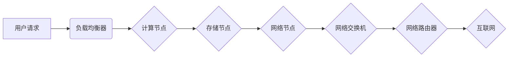

> AI大模型、数据中心、训练、推理、算力、存储、网络、架构、优化

## 1. 背景介绍

近年来，人工智能（AI）技术取得了飞速发展，特别是大模型的涌现，为各行各业带来了革命性的变革。大模型，是指参数规模庞大、训练数据海量的人工智能模型，其强大的学习能力和泛化能力使其能够在自然语言处理、计算机视觉、语音识别等领域取得突破性进展。然而，大模型的训练和部署也面临着巨大的挑战，其中最为关键的是数据中心建设。

传统的IT基础设施难以满足大模型的训练和推理需求。大模型的训练需要海量的数据和强大的算力，而推理则需要高效的硬件和软件架构。因此，构建专门针对大模型的应用数据中心成为当务之急。

## 2. 核心概念与联系

### 2.1  大模型训练与推理

大模型训练是指利用海量数据和强大的算力，训练模型参数，使其能够完成特定任务。训练过程通常需要数周甚至数月的时间，并消耗大量的计算资源。

大模型推理是指利用已经训练好的模型，对新的输入数据进行预测或分析。推理过程相对训练过程更加高效，但仍然需要一定的计算资源。

### 2.2  应用数据中心

应用数据中心是指专门为特定应用场景构建的IT基础设施，其架构和配置能够满足该应用场景的特定需求。

对于大模型应用，数据中心需要具备以下特点：

* **高算力:** 支持大规模模型训练和推理。
* **高存储容量:** 存储海量训练数据和模型参数。
* **高带宽网络:** 确保数据传输的快速和高效。
* **灵活可扩展:** 能够根据需求动态调整资源配置。

### 2.3  数据中心架构

应用数据中心通常采用分布式架构，将计算、存储和网络资源进行分层部署，以提高系统的可靠性和可扩展性。

**数据中心架构示意图:**



## 3. 核心算法原理 & 具体操作步骤

### 3.1  算法原理概述

大模型训练通常采用深度学习算法，例如Transformer、BERT等。这些算法通过多层神经网络结构，学习数据中的复杂模式和关系。

### 3.2  算法步骤详解

大模型训练的具体步骤包括：

1. **数据预处理:** 将原始数据进行清洗、格式化和编码，使其能够被模型理解。
2. **模型构建:** 根据任务需求，选择合适的深度学习模型架构，并初始化模型参数。
3. **模型训练:** 利用训练数据，通过反向传播算法，更新模型参数，使其能够更好地拟合数据。
4. **模型评估:** 使用验证数据评估模型的性能，并根据评估结果调整训练参数。
5. **模型部署:** 将训练好的模型部署到生产环境，用于进行推理。

### 3.3  算法优缺点

**优点:**

* 强大的学习能力，能够学习复杂的数据模式。
* 泛化能力强，能够应用于不同的任务和领域。

**缺点:**

* 训练成本高，需要大量的计算资源和时间。
* 模型参数量大，部署和推理需要较高的硬件要求。

### 3.4  算法应用领域

大模型在自然语言处理、计算机视觉、语音识别、机器翻译等领域都有广泛的应用。

## 4. 数学模型和公式 & 详细讲解 & 举例说明

### 4.1  数学模型构建

大模型的训练过程可以看作是一个优化问题，目标是找到最优的模型参数，使得模型在训练数据上的损失函数最小。

损失函数通常采用交叉熵损失函数或均方误差损失函数。

### 4.2  公式推导过程

**交叉熵损失函数:**

$$
L = -\sum_{i=1}^{N} y_i \log(\hat{y}_i)
$$

其中：

* $N$ 是样本数量。
* $y_i$ 是真实标签。
* $\hat{y}_i$ 是模型预测的概率。

**均方误差损失函数:**

$$
L = \frac{1}{N} \sum_{i=1}^{N} (y_i - \hat{y}_i)^2
$$

其中：

* $N$ 是样本数量。
* $y_i$ 是真实标签。
* $\hat{y}_i$ 是模型预测的值。

### 4.3  案例分析与讲解

假设我们训练一个图像分类模型，目标是识别图像中的物体类别。

训练数据包含了大量图像和对应的类别标签。模型通过学习图像特征，将图像映射到不同的类别概率。

训练过程中，模型会不断更新参数，以降低损失函数的值。最终，模型能够准确地识别图像中的物体类别。

## 5. 项目实践：代码实例和详细解释说明

### 5.1  开发环境搭建

* 操作系统：Ubuntu 20.04
* 编程语言：Python 3.8
* 深度学习框架：TensorFlow 2.x

### 5.2  源代码详细实现

```python
import tensorflow as tf

# 定义模型架构
model = tf.keras.models.Sequential([
    tf.keras.layers.Conv2D(32, (3, 3), activation='relu', input_shape=(28, 28, 1)),
    tf.keras.layers.MaxPooling2D((2, 2)),
    tf.keras.layers.Conv2D(64, (3, 3), activation='relu'),
    tf.keras.layers.MaxPooling2D((2, 2)),
    tf.keras.layers.Flatten(),
    tf.keras.layers.Dense(10, activation='softmax')
])

# 定义损失函数和优化器
model.compile(loss='sparse_categorical_crossentropy',
              optimizer='adam',
              metrics=['accuracy'])

# 加载训练数据
(x_train, y_train), (x_test, y_test) = tf.keras.datasets.mnist.load_data()

# 训练模型
model.fit(x_train, y_train, epochs=5)

# 评估模型
loss, accuracy = model.evaluate(x_test, y_test)
print('Test loss:', loss)
print('Test accuracy:', accuracy)
```

### 5.3  代码解读与分析

这段代码实现了图像分类模型的训练过程。

* 首先定义了模型架构，包括卷积层、池化层和全连接层。
* 然后定义了损失函数和优化器，用于训练模型。
* 接着加载训练数据，并使用`model.fit()`方法训练模型。
* 最后使用`model.evaluate()`方法评估模型的性能。

### 5.4  运行结果展示

训练完成后，模型能够准确地识别图像中的数字类别。

## 6. 实际应用场景

### 6.1  自然语言处理

大模型在自然语言处理领域有广泛的应用，例如：

* **机器翻译:** 将一种语言翻译成另一种语言。
* **文本摘要:** 自动生成文本的摘要。
* **问答系统:** 回答用户提出的问题。

### 6.2  计算机视觉

大模型在计算机视觉领域也有广泛的应用，例如：

* **图像分类:** 将图像分类到不同的类别。
* **目标检测:** 在图像中检测到特定目标。
* **图像生成:** 生成新的图像。

### 6.3  语音识别

大模型在语音识别领域也有广泛的应用，例如：

* **语音转文本:** 将语音转换为文本。
* **语音助手:** 理解用户的语音指令，并执行相应的操作。

### 6.4  未来应用展望

随着大模型技术的不断发展，其应用场景将更加广泛，例如：

* **个性化推荐:** 根据用户的兴趣和偏好，推荐个性化的商品或服务。
* **自动驾驶:** 帮助车辆自动驾驶。
* **医疗诊断:** 辅助医生进行疾病诊断。

## 7. 工具和资源推荐

### 7.1  学习资源推荐

* **深度学习框架:** TensorFlow, PyTorch, Keras
* **在线课程:** Coursera, edX, Udacity
* **书籍:** 深度学习，深度学习实践

### 7.2  开发工具推荐

* **IDE:** VS Code, PyCharm
* **云平台:** AWS, Azure, GCP

### 7.3  相关论文推荐

* Attention Is All You Need
* BERT: Pre-training of Deep Bidirectional Transformers for Language Understanding
* GPT-3: Language Models are Few-Shot Learners

## 8. 总结：未来发展趋势与挑战

### 8.1  研究成果总结

近年来，大模型技术取得了显著进展，模型规模不断扩大，性能不断提升。大模型在多个领域取得了突破性进展，为人工智能的未来发展奠定了坚实的基础。

### 8.2  未来发展趋势

* **模型规模进一步扩大:** 模型参数规模将继续增长，以提高模型的性能和泛化能力。
* **模型训练效率提升:** 研究人员将探索新的训练方法和算法，以提高模型训练的效率。
* **模型解释性增强:** 研究人员将致力于提高大模型的解释性，使其能够更好地被理解和应用。

### 8.3  面临的挑战

* **计算资源需求:** 大模型的训练和部署需要大量的计算资源，这给硬件设施和能源消耗带来了挑战。
* **数据安全和隐私:** 大模型的训练需要海量数据，如何保证数据的安全和隐私是一个重要的挑战。
* **模型偏见和公平性:** 大模型可能存在偏见和不公平性，需要研究如何 mitigate 这些问题。

### 8.4  研究展望

未来，大模型技术将继续发展，并在更多领域发挥重要作用。研究人员将继续探索大模型的潜力，并解决其面临的挑战，推动人工智能技术的进步。

## 9. 附录：常见问题与解答

### 9.1  Q1: 大模型训练需要多少算力？

**A1:** 大模型的训练需要大量的算力，具体需求取决于模型规模、训练数据量和训练时间等因素。一般来说，训练大型语言模型需要数百甚至数千个GPU。

### 9.2  Q2: 如何评估大模型的性能？

**A2:** 大模型的性能可以通过多种指标进行评估，例如准确率、召回率、F1-score等。具体指标的选择取决于任务类型和评估目标。

### 9.3  Q3: 如何部署大模型？

**A3:** 大模型的部署方式多种多样，可以部署到云端、边缘设备或本地服务器。部署方式的选择取决于应用场景和资源限制。


作者：禅与计算机程序设计艺术 / Zen and the Art of Computer Programming 
<end_of_turn>