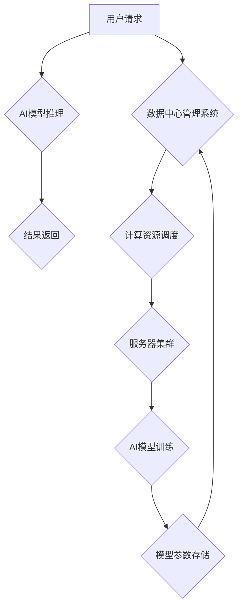

> AI大模型、数据中心、绿色节能、可持续发展、能源效率、人工智能、云计算、机器学习

## 1. 背景介绍

近年来，人工智能（AI）技术蓬勃发展，特别是大规模语言模型（LLM）的出现，为各行各业带来了革命性的变革。从自然语言处理到图像识别，从药物研发到金融预测，AI大模型正在深刻地改变着我们的生活和工作方式。然而，训练和部署这些庞大的模型需要大量的计算资源和能源消耗，这给数据中心建设带来了新的挑战。

数据中心作为AI大模型应用的基础设施，其能源消耗和碳排放问题日益突出。传统数据中心往往采用高能耗的硬件设备和不合理的冷却系统，导致能源浪费和环境污染。因此，如何建设绿色节能、可持续发展的AI大模型应用数据中心，成为当前亟待解决的关键问题。

## 2. 核心概念与联系

**2.1 AI大模型应用数据中心**

AI大模型应用数据中心是指专门为训练、部署和管理AI大模型而构建的数据中心。其特点包括：

* **高性能计算能力:** 具备强大的计算能力，能够高效地训练和运行大型AI模型。
* **海量存储空间:** 存储海量训练数据和模型参数。
* **高效的网络架构:** 支持高带宽、低延迟的数据传输，满足AI模型训练和推理的需求。
* **智能管理系统:** 实现对数据中心资源的智能调度和管理，提高资源利用率。

**2.2 绿色节能与可持续发展**

绿色节能是指通过提高能源利用效率、减少能源消耗和降低碳排放，实现经济发展与环境保护的协调发展。可持续发展是指满足当前需求，同时不损害后代满足其自身需求的能力。

**2.3 核心概念联系**

AI大模型应用数据中心建设与绿色节能、可持续发展密切相关。一方面，AI大模型的训练和部署需要大量的计算资源和能源消耗，因此，建设绿色节能的数据中心可以有效降低能源消耗和碳排放。另一方面，绿色节能的数据中心建设可以为AI大模型的应用提供更加可持续的支撑，促进AI技术的健康发展。

**2.4 数据中心架构流程图**



## 3. 核心算法原理 & 具体操作步骤

**3.1 算法原理概述**

在AI大模型应用数据中心建设中，许多算法被用于优化能源效率和资源利用率。例如：

* **深度学习算法:** 用于训练AI模型，提高模型性能。
* **预测分析算法:** 用于预测数据中心负载，优化资源调度。
* **优化算法:** 用于优化数据中心硬件配置和冷却系统，降低能耗。

**3.2 算法步骤详解**

以预测分析算法为例，其具体步骤如下：

1. **数据收集:** 收集数据中心的历史负载数据、环境数据等。
2. **数据预处理:** 对收集到的数据进行清洗、转换和特征工程。
3. **模型训练:** 使用深度学习算法训练预测模型，例如LSTM网络。
4. **模型评估:** 使用测试数据评估模型性能，调整模型参数。
5. **预测部署:** 将训练好的模型部署到数据中心管理系统中，用于预测未来负载。

**3.3 算法优缺点**

* **优点:** 可以准确预测数据中心负载，优化资源调度，降低能耗。
* **缺点:** 需要大量的历史数据进行训练，模型精度受数据质量影响。

**3.4 算法应用领域**

预测分析算法广泛应用于数据中心负载预测、资源调度、能耗管理等领域。

## 4. 数学模型和公式 & 详细讲解 & 举例说明

**4.1 数学模型构建**

假设数据中心负载为一个时间序列数据，可以使用ARIMA模型进行预测。ARIMA模型的数学表达式如下：

$$
\phi(B) (1-B)^d y_t = \theta(B) \epsilon_t
$$

其中：

* $y_t$ 表示时间t的负载值。
* $B$ 是后向差分算子。
* $\phi(B)$ 和 $\theta(B)$ 分别是自回归和移动平均的系数多项式。
* $d$ 是差分阶数。
* $\epsilon_t$ 是白噪声误差项。

**4.2 公式推导过程**

ARIMA模型的推导过程较为复杂，涉及时间序列分析、统计学等多个领域。

**4.3 案例分析与讲解**

假设数据中心负载数据如下：

```
100, 120, 110, 130, 140, 150, 160
```

可以使用ARIMA模型对该数据进行预测，预测未来一周的负载值。

## 5. 项目实践：代码实例和详细解释说明

**5.1 开发环境搭建**

* 操作系统: Ubuntu 20.04
* Python 版本: 3.8
* 必要的库: pandas, numpy, scikit-learn, statsmodels

**5.2 源代码详细实现**

```python
import pandas as pd
from statsmodels.tsa.arima.model import ARIMA

# 加载数据
data = pd.read_csv('data.csv', index_col='Date')

# 训练ARIMA模型
model = ARIMA(data['Load'], order=(5,1,0))
model_fit = model.fit()

# 预测未来一周的负载值
forecast = model_fit.predict(start=len(data), end=len(data)+6)

# 打印预测结果
print(forecast)
```

**5.3 代码解读与分析**

* 使用pandas库加载数据。
* 使用statsmodels库的ARIMA模型进行预测。
* 训练模型并预测未来一周的负载值。
* 打印预测结果。

**5.4 运行结果展示**

运行代码后，将输出未来一周的负载值预测结果。

## 6. 实际应用场景

AI大模型应用数据中心建设的绿色节能技术在各个行业都有广泛的应用场景：

* **云计算:** 云服务提供商可以利用绿色节能技术降低数据中心运营成本，提高服务效率。
* **金融:** 金融机构可以利用AI大模型进行风险评估、欺诈检测等，提高运营效率和安全性。
* **医疗:** 医疗机构可以利用AI大模型进行疾病诊断、药物研发等，提高医疗服务质量。

**6.4 未来应用展望**

未来，AI大模型应用数据中心建设将更加注重绿色节能和可持续发展。例如：

* **利用可再生能源:** 将太阳能、风能等可再生能源用于数据中心供电。
* **提高硬件能源效率:** 开发更加节能的硬件设备，例如GPU、CPU等。
* **优化冷却系统:** 利用自然通风、液冷等技术降低数据中心冷却能耗。

## 7. 工具和资源推荐

**7.1 学习资源推荐**

* **书籍:**
    * 《深度学习》
    * 《机器学习》
    * 《数据中心设计与运营》
* **在线课程:**
    * Coursera: 深度学习
    * edX: 机器学习
    * Udacity: 数据中心工程师

**7.2 开发工具推荐**

* **Python:** 广泛用于AI开发，拥有丰富的库和工具。
* **TensorFlow:** 开源深度学习框架。
* **PyTorch:** 开源深度学习框架。
* **Kubernetes:** 用于容器编排和管理。

**7.3 相关论文推荐**

* **绿色数据中心设计与实现**
* **AI大模型训练的能源效率优化**
* **可持续发展数据中心架构**

## 8. 总结：未来发展趋势与挑战

**8.1 研究成果总结**

近年来，AI大模型应用数据中心建设取得了显著进展，绿色节能技术也得到了广泛应用。

**8.2 未来发展趋势**

未来，AI大模型应用数据中心建设将更加注重绿色节能、可持续发展，并朝着以下方向发展：

* **更先进的算法:** 开发更加高效的预测分析算法、优化算法等。
* **更节能的硬件:** 开发更加节能的硬件设备，例如GPU、CPU等。
* **更智能的管理系统:** 开发更加智能的数据中心管理系统，实现资源的动态调度和优化。

**8.3 面临的挑战**

* **技术挑战:** 开发更加高效、节能的算法和硬件技术仍然面临挑战。
* **成本挑战:** 绿色节能技术往往需要更高的初始投资成本。
* **标准化挑战:** 目前缺乏统一的绿色节能数据中心标准，需要行业共同努力制定标准。

**8.4 研究展望**

未来，需要继续加强对AI大模型应用数据中心建设的理论研究和实践探索，推动绿色节能技术的发展和应用，为可持续发展贡献力量。

## 9. 附录：常见问题与解答

**9.1 Q: 如何评估数据中心的绿色节能水平？**

**A:** 可以使用PUE（Power Usage Effectiveness）指标来评估数据中心的绿色节能水平。PUE值越低，表示数据中心能源效率越高。

**9.2 Q: 如何降低数据中心的能耗？**

**A:** 可以通过以下方式降低数据中心的能耗：

* 优化硬件配置
* 使用高效的冷却系统
* 采用虚拟化技术
* 优化数据中心管理

**9.3 Q: 如何选择合适的绿色节能技术？**

**A:** 选择合适的绿色节能技术需要根据数据中心的具体情况进行评估，例如数据中心规模、负载特点、地理位置等。

作者：禅与计算机程序设计艺术 / Zen and the Art of Computer Programming


<end_of_turn>