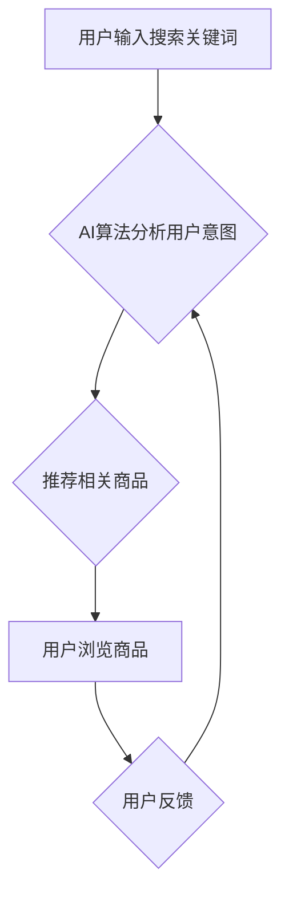

> AI,电商搜索,导购,伦理问题,算法偏见,数据隐私,透明度,可解释性

## 1. 背景介绍

电子商务的蓬勃发展催生了对高效、精准的搜索和导购系统的巨大需求。人工智能（AI）技术凭借其强大的数据处理和学习能力，在电商搜索导购领域展现出巨大的潜力。从个性化推荐到智能客服，AI技术正在深刻改变着用户购物体验。然而，随着AI技术的日益普及，其在电商搜索导购中的应用也引发了诸多伦理问题，这些问题需要我们认真思考和探讨。

## 2. 核心概念与联系

**2.1 电商搜索导购系统**

电商搜索导购系统是电商平台的核心功能之一，其目的是帮助用户快速找到所需商品，并提供个性化的购物建议。传统的电商搜索系统主要依赖于关键词匹配和商品属性检索，而AI技术则可以赋予搜索系统更智能的理解和决策能力。

**2.2 AI技术在电商搜索导购中的应用**

AI技术在电商搜索导购中的应用主要包括以下几个方面：

* **个性化推荐:** 通过分析用户的浏览历史、购买记录、兴趣偏好等数据，AI算法可以推荐更符合用户需求的商品。
* **智能搜索:** AI技术可以理解用户的自然语言查询，并提供更精准的搜索结果。
* **商品描述生成:** AI可以自动生成商品的描述文字，提高商品的展示效果。
* **智能客服:** AI驱动的聊天机器人可以解答用户的疑问，提供购物指导。

**2.3 伦理问题**

AI技术的应用虽然带来了诸多便利，但也引发了一些伦理问题，例如：

* **算法偏见:** AI算法的训练数据可能存在偏见，导致算法输出结果也存在偏见，从而影响用户的购物体验。
* **数据隐私:** 电商平台收集用户的个人数据用于训练AI算法，这可能会侵犯用户的隐私权。
* **透明度和可解释性:** AI算法的决策过程往往是复杂的，难以理解，这可能会导致用户对算法结果产生 distrust。

**2.4 伦理框架**

为了解决AI技术在电商搜索导购中的伦理问题，我们需要建立一个完善的伦理框架，该框架应包含以下几个方面：

* **公平性:** AI算法应避免产生偏见，确保所有用户都能获得公平的购物体验。
* **透明度:** AI算法的决策过程应尽可能透明，用户应了解算法是如何生成结果的。
* **可解释性:** AI算法的决策结果应可解释，用户应能够理解算法的 reasoning。
* **隐私保护:** 电商平台应采取措施保护用户的个人数据隐私。

**2.5 Mermaid 流程图**



## 3. 核心算法原理 & 具体操作步骤

### 3.1  算法原理概述

电商搜索导购系统中常用的AI算法包括：

* **协同过滤:** 基于用户的历史行为和商品的相似性，推荐用户可能感兴趣的商品。
* **内容过滤:** 基于商品的属性和描述，推荐与用户兴趣相符的商品。
* **深度学习:** 利用深度神经网络，学习用户行为和商品特征之间的复杂关系，进行更精准的推荐。

### 3.2  算法步骤详解

以协同过滤算法为例，其具体操作步骤如下：

1. **数据收集:** 收集用户的历史购买记录、浏览记录、评分等数据，以及商品的属性信息。
2. **用户-商品矩阵构建:** 将用户和商品映射到一个矩阵中，每个元素表示用户对商品的评分或行为。
3. **相似性计算:** 计算用户之间的相似度和商品之间的相似度。
4. **推荐生成:** 根据用户的相似用户和商品的相似商品，推荐用户可能感兴趣的商品。

### 3.3  算法优缺点

**优点:**

* 推荐结果更精准，更符合用户的兴趣。
* 可以发现用户隐性的需求。

**缺点:**

* 数据稀疏性问题: 当用户行为数据较少时，算法效果会下降。
* 冷启动问题: 新用户和新商品难以获得推荐。

### 3.4  算法应用领域

协同过滤算法广泛应用于电商推荐、音乐推荐、电影推荐等领域。

## 4. 数学模型和公式 & 详细讲解 & 举例说明

### 4.1  数学模型构建

协同过滤算法的核心是计算用户之间的相似度和商品之间的相似度。常用的相似度度量方法包括余弦相似度和皮尔逊相关系数。

**4.1.1 余弦相似度**

余弦相似度度量两个向量的夹角，其值介于-1和1之间，其中1表示完全相似，-1表示完全相反，0表示不相关。

**公式:**

$$
\text{余弦相似度}(u,v) = \frac{u \cdot v}{||u|| ||v||}
$$

其中：

* $u$ 和 $v$ 是两个向量，分别表示用户或商品的特征向量。
* $u \cdot v$ 是两个向量的点积。
* $||u||$ 和 $||v||$ 分别是两个向量的模长。

**4.1.2 皮尔逊相关系数**

皮尔逊相关系数度量两个变量之间的线性相关性，其值介于-1和1之间，其中1表示完全正相关，-1表示完全负相关，0表示不相关。

**公式:**

$$
\text{皮尔逊相关系数}(u,v) = \frac{\sum_{i=1}^{n}(u_i - \bar{u})(v_i - \bar{v})}{\sqrt{\sum_{i=1}^{n}(u_i - \bar{u})^2} \sqrt{\sum_{i=1}^{n}(v_i - \bar{v})^2}}
$$

其中：

* $u$ 和 $v$ 是两个变量。
* $u_i$ 和 $v_i$ 分别是两个变量的第 $i$ 个观测值。
* $\bar{u}$ 和 $\bar{v}$ 分别是两个变量的平均值。

### 4.2  公式推导过程

余弦相似度和皮尔逊相关系数的推导过程较为复杂，涉及到线性代数和概率统计的知识。

### 4.3  案例分析与讲解

假设有两个用户 $u$ 和 $v$，他们的历史购买记录如下：

| 商品 | $u$ | $v$ |
|---|---|---|
| A | 5 | 4 |
| B | 3 | 2 |
| C | 4 | 5 |
| D | 2 | 3 |

我们可以使用余弦相似度计算 $u$ 和 $v$ 的相似度：

1. 将用户 $u$ 和 $v$ 的购买记录转换为向量：

$$
u = (5, 3, 4, 2)
$$

$$
v = (4, 2, 5, 3)
$$

2. 计算向量 $u$ 和 $v$ 的点积：

$$
u \cdot v = (5 \times 4) + (3 \times 2) + (4 \times 5) + (2 \times 3) = 20 + 6 + 20 + 6 = 52
$$

3. 计算向量 $u$ 和 $v$ 的模长：

$$
||u|| = \sqrt{5^2 + 3^2 + 4^2 + 2^2} = \sqrt{54}
$$

$$
||v|| = \sqrt{4^2 + 2^2 + 5^2 + 3^2} = \sqrt{54}
$$

4. 计算余弦相似度：

$$
\text{余弦相似度}(u,v) = \frac{52}{\sqrt{54} \times \sqrt{54}} = \frac{52}{54} \approx 0.96
$$

因此，用户 $u$ 和 $v$ 的余弦相似度约为 0.96，说明他们之间的相似度较高。

## 5. 项目实践：代码实例和详细解释说明

### 5.1  开发环境搭建

* Python 3.x
* scikit-learn 库
* pandas 库
* numpy 库

### 5.2  源代码详细实现

```python
import pandas as pd
from sklearn.metrics.pairwise import cosine_similarity

# 加载用户-商品交互数据
data = pd.read_csv('user_item_interactions.csv')

# 构建用户-商品矩阵
user_item_matrix = data.pivot_table(index='user_id', columns='item_id', values='rating')

# 计算余弦相似度
user_similarity = cosine_similarity(user_item_matrix)

# 获取用户相似度矩阵
print(user_similarity)
```

### 5.3  代码解读与分析

* 首先，我们使用 pandas 库加载用户-商品交互数据。
* 然后，我们使用 pivot_table 方法构建用户-商品矩阵，其中行表示用户，列表示商品，每个元素表示用户对商品的评分。
* 接着，我们使用 scikit-learn 库中的 cosine_similarity 函数计算用户之间的余弦相似度。
* 最后，我们打印出用户相似度矩阵。

### 5.4  运行结果展示

运行代码后，会输出一个用户相似度矩阵，其中每个元素表示两个用户之间的相似度。

## 6. 实际应用场景

### 6.1  个性化推荐

电商平台可以利用用户之间的相似度，推荐用户可能感兴趣的商品。例如，如果用户 $A$ 和用户 $B$ 的相似度较高，并且用户 $B$ 购买了商品 $X$，那么电商平台可以推荐商品 $X$ 给用户 $A$。

### 6.2  商品分类

电商平台可以利用商品之间的相似度，对商品进行分类。例如，如果商品 $A$ 和商品 $B$ 的相似度较高，那么它们可以被归类到同一个类别。

### 6.3  用户画像

电商平台可以利用用户的购买记录和浏览记录，构建用户的画像。例如，可以根据用户的购买记录，判断用户的兴趣爱好、消费水平等信息。

### 6.4  未来应用展望

随着AI技术的不断发展，协同过滤算法在电商搜索导购领域的应用将更加广泛。例如，可以利用深度学习技术，学习用户行为和商品特征之间的更复杂的关系，进行更精准的推荐。

## 7. 工具和资源推荐

### 7.1  学习资源推荐

* **书籍:**
    * 《推荐系统实践》
    * 《机器学习》
* **在线课程:**
    * Coursera 上的《机器学习》课程
    * edX 上的《推荐系统》课程

### 7.2  开发工具推荐

* **Python:** 
    * scikit-learn 库
    * pandas 库
    * numpy 库
* **Spark:** 
    * 用于大规模数据处理

### 7.3  相关论文推荐

* **协同过滤算法:**
    * "Collaborative Filtering for Implicit Feedback Datasets"
    * "Matrix Factorization Techniques for Recommender Systems"
* **深度学习推荐系统:**
    * "Deep Learning for Recommender Systems"
    * "Neural Collaborative Filtering"

## 8. 总结：未来发展趋势与挑战

### 8.1  研究成果总结

AI技术在电商搜索导购领域的应用取得了显著成果，例如个性化推荐、商品分类、用户画像等。协同过滤算法是电商推荐系统中常用的算法，其原理简单易懂，效果显著。

### 8.2  未来发展趋势

* **深度学习:** 深度学习技术将进一步提升推荐系统的精准度和个性化程度。
* **多模态推荐:** 将文本、图像、视频等