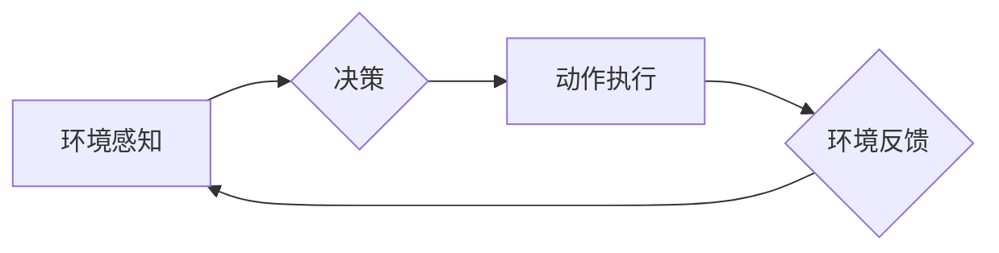

> AI人工智能, 机器人, 智能代理, 决策算法, 机器学习, 深度学习, 自然语言处理, 计算机视觉

## 1. 背景介绍

随着人工智能技术的飞速发展，机器人领域也迎来了前所未有的机遇和挑战。智能机器人能够感知环境、理解指令、自主决策并执行任务，在工业生产、服务业、医疗保健等领域展现出巨大的应用潜力。

传统的机器人通常依赖于预先编程的规则和指令，缺乏灵活性与适应性。而人工智能技术的引入，使得机器人能够学习和进化，从而实现更智能、更自主的行动。

智能代理作为人工智能的核心概念，在机器人领域扮演着至关重要的角色。智能代理是指能够感知环境、做出决策并执行行动的软件实体。它可以独立运行，并根据环境变化和目标调整行为策略。

## 2. 核心概念与联系

### 2.1 智能代理

智能代理是人工智能的核心概念，它是一个能够感知环境、做出决策并执行行动的软件实体。智能代理可以独立运行，并根据环境变化和目标调整行为策略。

### 2.2 机器人

机器人是一种能够执行特定任务的机械装置，通常由传感器、执行器、控制系统和动力系统组成。

### 2.3 关系

智能代理可以被嵌入到机器人系统中，充当机器人的“大脑”。智能代理负责感知环境信息、分析数据、制定决策并控制机器人的行动。

**Mermaid 流程图**



## 3. 核心算法原理 & 具体操作步骤

### 3.1 算法原理概述

智能代理的决策算法是其核心，它决定了代理如何根据环境信息和目标做出最佳行动。常见的决策算法包括：

* **基于规则的算法:** 这种算法基于预先定义的规则和条件，根据环境信息匹配规则并执行相应的行动。
* **基于模型的算法:** 这种算法建立环境模型，通过模拟和预测不同行动的后果，选择最优行动。
* **强化学习算法:** 这种算法通过与环境交互，学习奖励和惩罚机制，不断调整行为策略以最大化奖励。

### 3.2 算法步骤详解

以强化学习算法为例，其基本步骤如下：

1. **环境建模:** 建立环境模型，描述环境状态、动作空间和奖励函数。
2. **策略初始化:** 初始化代理的行为策略，例如随机策略或贪婪策略。
3. **环境交互:** 代理与环境交互，根据策略选择动作并观察环境反馈。
4. **奖励更新:** 根据环境反馈更新代理的奖励信号。
5. **策略更新:** 利用奖励信号更新代理的行为策略，使其朝着最大化奖励的方向进化。

### 3.3 算法优缺点

* **基于规则的算法:** 优点是易于理解和实现，缺点是缺乏灵活性，难以应对复杂环境。
* **基于模型的算法:** 优点是能够处理复杂环境，缺点是模型构建和训练成本高。
* **强化学习算法:** 优点是能够学习复杂行为，缺点是训练时间长，需要大量数据和计算资源。

### 3.4 算法应用领域

* **机器人导航:** 智能代理可以学习导航路径，避开障碍物，到达目标位置。
* **机器人抓取:** 智能代理可以学习抓取不同形状和大小的物体。
* **机器人协作:** 多个智能代理可以协作完成复杂任务，例如组装产品或清理环境。

## 4. 数学模型和公式 & 详细讲解 & 举例说明

### 4.1 数学模型构建

强化学习算法的核心是马尔可夫决策过程 (MDP)，它描述了代理与环境交互的过程。

MDP 由以下要素组成：

* **状态空间 S:** 环境可能存在的各种状态。
* **动作空间 A:** 代理可以执行的各种动作。
* **转移概率 P(s', r | s, a):** 从状态 s 执行动作 a 后，转移到状态 s' 的概率，以及获得奖励 r 的概率。
* **奖励函数 R(s, a):** 代理在状态 s 执行动作 a 后获得的奖励。

### 4.2 公式推导过程

目标是找到一个最优策略 π(s)，使得代理在任何状态下执行的动作都能最大化累积奖励。

最优策略可以通过 Bellman 方程求解：

$$
V^*(s) = \max_a \sum_{s', r} P(s', r | s, a) [R(s, a) + \gamma V^*(s')]
$$

其中：

* $V^*(s)$ 是状态 s 的最优价值函数。
* $\gamma$ 是折扣因子，控制未来奖励的权重。

### 4.3 案例分析与讲解

例如，一个机器人需要学习在迷宫中找到出口。

* 状态空间 S 包含迷宫中的所有位置。
* 动作空间 A 包含向上、向下、向左、向右四个方向。
* 转移概率 P(s', r | s, a) 描述了机器人执行动作 a 后到达不同位置的概率，以及获得奖励的概率。
* 奖励函数 R(s, a) 可以设计为，到达出口时获得最大奖励，迷宫内其他位置获得较小奖励，撞墙时获得惩罚。

通过强化学习算法，机器人可以学习最优策略，找到最短路径到达出口。

## 5. 项目实践：代码实例和详细解释说明

### 5.1 开发环境搭建

* Python 3.x
* TensorFlow 或 PyTorch 深度学习框架
* OpenAI Gym 机器人仿真环境

### 5.2 源代码详细实现

```python
import gym
import tensorflow as tf

# 定义强化学习模型
class Agent(tf.keras.Model):
    def __init__(self):
        super(Agent, self).__init__()
        # 定义模型结构
        # ...

    def call(self, state):
        # 前向传播
        # ...
        return action_probs

# 创建环境
env = gym.make('CartPole-v1')

# 创建代理
agent = Agent()

# 训练循环
for episode in range(num_episodes):
    state = env.reset()
    done = False
    while not done:
        # 选择动作
        action_probs = agent(state)
        action = tf.random.categorical(action_probs, num_samples=1)[0, 0]

        # 执行动作
        next_state, reward, done, _ = env.step(action)

        # 更新代理
        # ...

        state = next_state

# 保存模型
agent.save_weights('cartpole_agent.h5')
```

### 5.3 代码解读与分析

* 代码首先定义了强化学习模型 Agent，并使用 TensorFlow 框架构建模型结构。
* 然后创建 OpenAI Gym 环境 CartPole-v1，这是一个经典的机器人控制任务。
* 创建代理实例，并进行训练循环。
* 在训练循环中，代理根据当前状态选择动作，执行动作并观察环境反馈。
* 根据环境反馈更新代理的模型参数，使其学习最优策略。

### 5.4 运行结果展示

训练完成后，代理能够在 CartPole-v1 环境中稳定地控制杆子，使其保持平衡。

## 6. 实际应用场景

### 6.1 工业自动化

智能机器人可以用于自动化生产线，提高生产效率和降低成本。例如，在汽车制造业中，机器人可以用于焊接、喷漆、组装等任务。

### 6.2 服务业

智能机器人可以用于提供服务，例如导游、客服、清洁等。例如，在酒店中，机器人可以用于引导客人、提供信息和清洁房间。

### 6.3 医疗保健

智能机器人可以用于辅助医疗工作，例如手术、康复、护理等。例如，在手术室中，机器人可以帮助医生进行微创手术，提高手术精度和安全性。

### 6.4 未来应用展望

随着人工智能技术的不断发展，智能机器人将在更多领域得到应用，例如：

* **教育:** 智能机器人可以作为教育助手，帮助学生学习和理解知识。
* **娱乐:** 智能机器人可以作为游戏伙伴，提供更丰富和有趣的娱乐体验。
* **探索:** 智能机器人可以用于探索未知环境，例如深海、太空等。

## 7. 工具和资源推荐

### 7.1 学习资源推荐

* **书籍:**
    * 《Reinforcement Learning: An Introduction》 by Richard S. Sutton and Andrew G. Barto
    * 《Deep Learning》 by Ian Goodfellow, Yoshua Bengio, and Aaron Courville
* **在线课程:**
    * Coursera: Reinforcement Learning Specialization
    * Udacity: Deep Learning Nanodegree

### 7.2 开发工具推荐

* **Python:** 
    * TensorFlow
    * PyTorch
* **机器人仿真环境:**
    * OpenAI Gym
    * Gazebo

### 7.3 相关论文推荐

* **Deep Reinforcement Learning with Double Q-learning**
* **Proximal Policy Optimization Algorithms**
* **Asynchronous Methods for Deep Reinforcement Learning**

## 8. 总结：未来发展趋势与挑战

### 8.1 研究成果总结

近年来，人工智能技术取得了长足进步，智能机器人领域也取得了显著成果。强化学习算法在机器人控制、导航、抓取等任务中取得了成功。

### 8.2 未来发展趋势

* **更强大的计算能力:** 随着计算能力的提升，机器人能够处理更复杂的任务，学习更复杂的策略。
* **更丰富的传感器和执行器:** 更先进的传感器和执行器能够使机器人更好地感知环境，执行更精细的动作。
* **更安全的机器人:** 安全性和可靠性是机器人应用的关键问题，未来将会有更多研究致力于提高机器人的安全性。

### 8.3 面临的挑战

* **数据获取和标注:** 强化学习算法需要大量数据进行训练，数据获取和标注成本高昂。
* **模型解释性和可解释性:** 深度学习模型的决策过程难以解释，这限制了机器人的应用场景。
* **伦理和社会影响:** 机器人技术的快速发展引发了伦理和社会问题，需要进行深入的探讨和研究。

### 8.4 研究展望

未来，人工智能和机器人技术将继续融合发展，智能机器人将更加智能、更加安全、更加可靠，在更多领域发挥重要作用。


## 9. 附录：常见问题与解答

**Q1: 强化学习算法的训练时间很长，如何加速训练过程？**

**A1:** 可以采用一些加速训练的方法，例如：

* 使用分布式训练，将训练任务分发到多个机器上并行执行。
* 使用经验回放，将训练数据存储到一个缓冲池中，并随机采样数据进行训练。
* 使用目标网络，将目标网络的参数更新频率降低，从而减少计算量。

**Q2: 如何评估智能机器人的性能？**

**A2:** 智能机器人的性能可以根据具体任务进行评估，例如：

* **导航任务:** 可以评估机器人到达目标位置的成功率和路径长度。
* **抓取任务:** 可以评估机器人抓取物体的成功率和抓取精度。
* **协作任务:** 可以评估机器人团队协作完成任务的效率和准确性。

**Q3: 智能机器人会取代人类工作吗？**

**A3:** 智能机器人可以自动化一些重复性、危险性工作，但它们无法完全取代人类工作。人类仍然需要发挥创造力、解决问题的能力和情感智能等优势。


作者：禅与计算机程序设计艺术 / Zen and the Art of Computer Programming 
<end_of_turn>