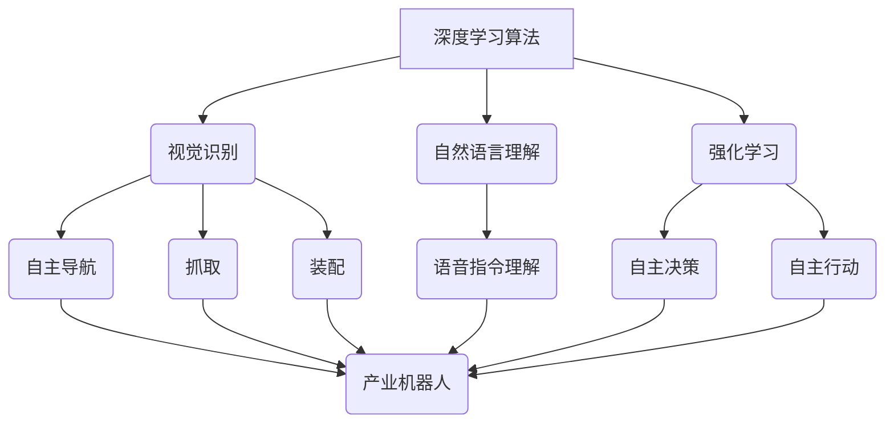

> 深度学习、产业机器人、计算机视觉、自然语言处理、强化学习、算法原理、应用场景、未来趋势

## 1. 背景介绍

随着人工智能技术的飞速发展，深度学习算法在各个领域取得了突破性的进展，为产业机器人带来了革命性的变革。产业机器人，作为工业生产的重要组成部分，在制造、物流、农业等领域发挥着越来越重要的作用。传统的工业机器人主要依靠预先编程和规则控制，缺乏灵活性、适应性和自主性。而深度学习算法能够从海量数据中学习，识别模式，并做出决策，赋予机器人更强的智能化能力。

深度学习算法的应用，使得产业机器人能够实现更精准、更灵活、更智能的操作，例如：

* **视觉识别:** 深度学习算法可以训练识别不同物体、场景和状态，使机器人能够自主导航、抓取、装配等操作。
* **自然语言理解:** 深度学习算法可以理解和响应人类的语音指令，使机器人能够与人类进行自然交互，提高操作效率和安全性。
* **强化学习:** 深度学习算法可以训练机器人学习复杂的控制策略，使机器人能够在动态环境中自主决策和行动，提高工作效率和适应性。

## 2. 核心概念与联系

**2.1 深度学习算法**

深度学习算法是一种基于人工神经网络的机器学习算法，它能够从大量数据中学习复杂的特征和模式。深度学习算法的核心是多层神经网络，每一层神经元都连接着上一层的输出，通过层层传递和学习，最终输出最终结果。

**2.2 产业机器人**

产业机器人是指在工业生产中应用的自动化机器，主要用于替代人工完成重复性、危险性或高精度操作。常见的产业机器人类型包括：

* **工业机械臂:** 用于搬运、焊接、喷涂等操作。
* **协作机器人:** 与人类协同工作，辅助完成复杂任务。
* **移动机器人:** 用于在工厂内进行巡逻、搬运、清洁等操作。

**2.3 核心概念联系**

深度学习算法为产业机器人赋予了智能化能力，使机器人能够从被动执行指令转变为主动学习和决策。



## 3. 核心算法原理 & 具体操作步骤

### 3.1 算法原理概述

深度学习算法的核心是多层神经网络，它通过层层传递和学习，最终输出最终结果。

* **输入层:** 将原始数据输入到神经网络中。
* **隐藏层:** 多层神经元进行特征提取和学习。
* **输出层:** 输出最终结果。

深度学习算法通过调整神经网络参数，使网络输出与实际结果尽可能接近，从而实现学习和预测。

### 3.2 算法步骤详解

1. **数据预处理:** 将原始数据进行清洗、转换和格式化，使其适合深度学习算法的训练。
2. **模型构建:** 根据具体任务选择合适的深度学习模型架构，例如卷积神经网络（CNN）、循环神经网络（RNN）等。
3. **模型训练:** 使用训练数据训练深度学习模型，调整模型参数，使模型能够准确预测或分类数据。
4. **模型评估:** 使用测试数据评估模型的性能，例如准确率、召回率、F1-score等。
5. **模型部署:** 将训练好的模型部署到实际应用场景中，用于预测或分类新的数据。

### 3.3 算法优缺点

**优点:**

* **高精度:** 深度学习算法能够从海量数据中学习复杂的特征，实现高精度预测和分类。
* **自动化学习:** 深度学习算法能够自动学习特征，无需人工特征工程。
* **适应性强:** 深度学习算法能够适应各种类型的数据和任务。

**缺点:**

* **数据依赖:** 深度学习算法需要大量数据进行训练，否则性能会下降。
* **计算资源消耗:** 深度学习算法训练需要大量的计算资源，例如GPU。
* **可解释性差:** 深度学习模型的决策过程难以解释，难以理解模型的内部机制。

### 3.4 算法应用领域

深度学习算法在各个领域都有广泛的应用，例如：

* **计算机视觉:** 图像识别、物体检测、图像分割、人脸识别等。
* **自然语言处理:** 文本分类、情感分析、机器翻译、语音识别等。
* **语音合成:** 文本转语音、语音克隆等。
* **推荐系统:** 商品推荐、内容推荐等。
* **医疗诊断:** 病理图像分析、疾病预测等。

## 4. 数学模型和公式 & 详细讲解 & 举例说明

### 4.1 数学模型构建

深度学习算法的核心是多层神经网络，每个神经元接收多个输入信号，并通过激活函数进行处理，输出一个信号。

**神经元模型:**

$$
y = f(w^T x + b)
$$

其中：

* $y$ 是神经元的输出
* $x$ 是输入信号向量
* $w$ 是权重向量
* $b$ 是偏置项
* $f$ 是激活函数

**神经网络模型:**

深度学习模型由多个神经层组成，每一层神经元之间连接，形成一个多层网络结构。

### 4.2 公式推导过程

深度学习模型的训练过程是通过反向传播算法来进行的。反向传播算法的核心是计算模型输出与实际结果之间的误差，并根据误差反向传播，调整神经网络参数，使模型输出更接近实际结果。

**损失函数:**

$$
L = \frac{1}{N} \sum_{i=1}^{N} (y_i - \hat{y}_i)^2
$$

其中：

* $L$ 是损失函数
* $N$ 是样本数量
* $y_i$ 是实际输出
* $\hat{y}_i$ 是模型输出

**梯度下降算法:**

$$
\theta = \theta - \alpha \nabla L(\theta)
$$

其中：

* $\theta$ 是模型参数
* $\alpha$ 是学习率
* $\nabla L(\theta)$ 是损失函数对参数的梯度

### 4.3 案例分析与讲解

**图像识别案例:**

使用卷积神经网络（CNN）进行图像识别，例如识别猫和狗的图片。

1. **数据预处理:** 将猫狗图片进行裁剪、缩放、归一化等处理。
2. **模型构建:** 使用CNN模型架构，例如LeNet-5、AlexNet等。
3. **模型训练:** 使用训练数据训练CNN模型，调整模型参数，使模型能够准确识别猫和狗的图片。
4. **模型评估:** 使用测试数据评估模型的性能，例如准确率、召回率等。
5. **模型部署:** 将训练好的模型部署到实际应用场景中，例如手机APP、网站等。

## 5. 项目实践：代码实例和详细解释说明

### 5.1 开发环境搭建

* **操作系统:** Ubuntu 18.04
* **编程语言:** Python 3.6
* **深度学习框架:** TensorFlow 2.0
* **GPU:** NVIDIA GeForce GTX 1080

### 5.2 源代码详细实现

```python
import tensorflow as tf

# 定义模型架构
model = tf.keras.models.Sequential([
    tf.keras.layers.Conv2D(32, (3, 3), activation='relu', input_shape=(28, 28, 1)),
    tf.keras.layers.MaxPooling2D((2, 2)),
    tf.keras.layers.Conv2D(64, (3, 3), activation='relu'),
    tf.keras.layers.MaxPooling2D((2, 2)),
    tf.keras.layers.Flatten(),
    tf.keras.layers.Dense(10, activation='softmax')
])

# 编译模型
model.compile(optimizer='adam',
              loss='sparse_categorical_crossentropy',
              metrics=['accuracy'])

# 加载数据集
(x_train, y_train), (x_test, y_test) = tf.keras.datasets.mnist.load_data()

# 数据预处理
x_train = x_train.astype('float32') / 255.0
x_test = x_test.astype('float32') / 255.0
x_train = x_train.reshape((x_train.shape[0], 28, 28, 1))
x_test = x_test.reshape((x_test.shape[0], 28, 28, 1))

# 训练模型
model.fit(x_train, y_train, epochs=5)

# 评估模型
loss, accuracy = model.evaluate(x_test, y_test)
print('Test loss:', loss)
print('Test accuracy:', accuracy)
```

### 5.3 代码解读与分析

* **模型架构:** 使用了卷积神经网络（CNN）模型架构，包括卷积层、池化层、全连接层。
* **数据预处理:** 将图像数据进行归一化处理，使其值在0到1之间。
* **模型训练:** 使用Adam优化器、交叉熵损失函数和准确率指标进行模型训练。
* **模型评估:** 使用测试数据评估模型的性能，包括损失值和准确率。

### 5.4 运行结果展示

训练完成后，模型能够准确识别手写数字。

## 6. 实际应用场景

### 6.1 视觉识别应用

* **工业缺陷检测:** 深度学习算法可以训练识别工业产品中的缺陷，例如裂纹、划痕、变形等，提高产品质量。
* **自动驾驶:** 深度学习算法可以训练识别道路、车辆、行人等物体，帮助自动驾驶汽车安全行驶。
* **医疗影像分析:** 深度学习算法可以训练识别医学影像中的病灶，例如肿瘤、骨折等，辅助医生诊断。

### 6.2 自然语言理解应用

* **机器人对话:** 深度学习算法可以训练机器人理解人类的语音指令和文本对话，使机器人能够与人类进行自然交互。
* **文本分类:** 深度学习算法可以训练分类文本内容，例如新闻、邮件、评论等，用于信息筛选和分类。
* **机器翻译:** 深度学习算法可以训练翻译文本内容，例如从英语翻译成中文，提高跨语言沟通效率。

### 6.3 强化学习应用

* **机器人控制:** 深度学习算法可以训练机器人学习复杂的控制策略，使机器人能够在动态环境中自主决策和行动。
* **游戏AI:** 深度学习算法可以训练游戏AI，使游戏AI能够学习游戏规则和策略，提高游戏难度和体验。
* **资源管理:** 深度学习算法可以训练优化资源分配策略，例如能源管理、交通管理等，提高资源利用效率。

### 6.4 未来应用展望

随着深度学习算法的不断发展，其在产业机器人领域的应用将更加广泛和深入。未来，深度学习算法将赋予机器人更强的智能化能力，例如：

* **自主学习:** 机器人能够从经验中学习，不断提升自己的能力。
* **协同工作:** 多个机器人能够协同工作，完成更复杂的任务。
* **个性化服务:** 机器人能够根据用户的需求提供个性化服务。

## 7. 工具和资源推荐

### 7.1 学习资源推荐

* **书籍:**
    * 深度学习
    * 深度学习实战
    * 深度学习与自然语言处理
* **在线课程:**
    * Coursera 深度学习课程
    * Udacity 深度学习工程师 Nan