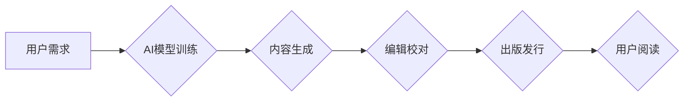

>  人工智能，出版业，通用AI，垂直领域，自然语言处理，机器学习，内容生成，知识图谱

## 1. 背景介绍

出版业作为文化传播的重要载体，近年来面临着前所未有的挑战。数字阅读的兴起、内容碎片化、读者阅读习惯的改变等因素，都对传统出版模式造成了冲击。与此同时，人工智能技术的飞速发展为出版业带来了新的机遇。

人工智能，特别是自然语言处理（NLP）和机器学习（ML）技术，正在深刻地改变出版业的各个环节，从内容创作、编辑出版到营销推广，都展现出巨大的潜力。

## 2. 核心概念与联系

**2.1 通用AI vs 垂直领域AI**

通用人工智能（AGI）是指能够像人类一样学习、理解和解决各种复杂问题的人工智能。而垂直领域AI则专注于特定领域，例如医疗、金融、教育等，通过深度学习和数据分析，在该领域内提供更精准、高效的服务。

在出版业的应用中，通用AI和垂直领域AI各有优劣。

* **通用AI**：

    * **优势**: 能够处理更广泛的文本类型，例如小说、诗歌、新闻报道等，并具备一定的创造性，可以生成新的内容。
    * **劣势**: 训练数据量巨大，需要大量的文本数据进行训练，且在特定领域内的专业知识掌握有限。

* **垂直领域AI**:

    * **优势**: 在特定领域内拥有更深厚的专业知识，能够更好地理解和处理相关文本，例如学术论文、专业书籍等。
    * **劣势**: 应用范围局限于特定领域，难以处理其他类型的文本。

**2.2  AI在出版业的应用场景**

* **内容创作**: 利用AI生成新闻稿、广告文案、小说情节等。
* **编辑出版**: 自动校对语法错误、识别重复内容、生成书籍目录等。
* **营销推广**: 分析读者阅读习惯，推荐个性化书籍，进行精准营销。
* **知识管理**: 建立知识图谱，帮助读者快速查找相关信息。

**2.3  Mermaid 流程图**



## 3. 核心算法原理 & 具体操作步骤

**3.1 算法原理概述**

在AI出版业应用中，常用的算法包括：

* **自然语言处理（NLP）**: 包括文本分类、情感分析、文本摘要等，用于理解和处理文本信息。
* **机器学习（ML）**: 包括监督学习、无监督学习、强化学习等，用于训练AI模型，使其能够自动学习和预测。
* **深度学习（DL）**: 是一种更高级的机器学习方法，利用多层神经网络，能够处理更复杂的数据，例如图像、语音、文本等。

**3.2 算法步骤详解**

以内容生成为例，其具体操作步骤如下：

1. **数据收集**: 收集大量相关领域的文本数据，例如小说、诗歌、新闻报道等。
2. **数据预处理**: 对文本数据进行清洗、格式化、标注等处理，使其能够被AI模型理解。
3. **模型训练**: 利用机器学习算法，训练AI模型，使其能够生成符合特定风格和主题的文本。
4. **文本生成**: 将训练好的AI模型应用于新的文本生成任务，例如生成小说情节、广告文案等。
5. **文本评估**: 对生成的文本进行评估，例如语法正确性、逻辑性、流畅度等，并根据评估结果进行模型优化。

**3.3 算法优缺点**

* **优点**: 能够自动生成大量文本内容，提高效率，降低成本。
* **缺点**: 生成的文本可能缺乏创意和个性，难以完全替代人类的创作能力。

**3.4 算法应用领域**

* **新闻报道**: 自动生成新闻稿，例如天气预报、股市走势等。
* **广告文案**: 生成吸引人的广告文案，例如产品描述、促销语等。
* **小说创作**: 生成小说情节、人物对话等。

## 4. 数学模型和公式 & 详细讲解 & 举例说明

**4.1 数学模型构建**

在AI出版业中，常用的数学模型包括：

* **词嵌入模型**: 将单词映射到向量空间，捕捉单词之间的语义关系。例如Word2Vec、GloVe等。
* **循环神经网络（RNN）**: 用于处理序列数据，例如文本，能够捕捉文本中的上下文信息。例如LSTM、GRU等。
* **Transformer**: 一种新型的深度学习模型，能够处理更长的文本序列，并具有更强的表达能力。例如BERT、GPT等。

**4.2 公式推导过程**

以词嵌入模型为例，其目标是学习一个词向量空间，使得相似的单词在向量空间中距离较近。

假设我们有一个词典V，包含N个单词。每个单词都对应一个词向量，维度为D。

词嵌入模型的目标函数是：

$$
J = \sum_{i=1}^{N} \sum_{j=1}^{N} \text{sim}(w_i, w_j) \cdot \text{label}(i, j)
$$

其中：

* $w_i$ 表示词典中第i个单词的词向量。
* $\text{sim}(w_i, w_j)$ 表示单词$w_i$和$w_j$之间的相似度。
* $\text{label}(i, j)$ 表示单词$w_i$和$w_j$是否为同义词，为1表示同义词，为0表示非同义词。

**4.3 案例分析与讲解**

Word2Vec模型是一种常用的词嵌入模型，它通过训练一个神经网络，学习单词之间的语义关系。

例如，Word2Vec模型可以学习到“国王”和“女王”是同义词，因此它们的词向量会比较接近。

## 5. 项目实践：代码实例和详细解释说明

**5.1 开发环境搭建**

* Python 3.x
* TensorFlow 或 PyTorch
* NLTK 或 spaCy

**5.2 源代码详细实现**

```python
# 使用Word2Vec模型训练词嵌入
from gensim.models import Word2Vec

# 准备训练数据
sentences = [
    ["the", "quick", "brown", "fox"],
    ["jumps", "over", "the", "lazy", "dog"],
]

# 训练Word2Vec模型
model = Word2Vec(sentences, vector_size=100, window=5, min_count=5)

# 保存模型
model.save("word2vec.model")

# 加载模型
model = Word2Vec.load("word2vec.model")

# 获取词向量
king_vector = model.wv["king"]
queen_vector = model.wv["queen"]

# 计算词向量之间的余弦相似度
similarity = np.dot(king_vector, queen_vector) / (np.linalg.norm(king_vector) * np.linalg.norm(queen_vector))

print(f"King and Queen similarity: {similarity}")
```

**5.3 代码解读与分析**

* 使用Gensim库训练Word2Vec模型。
* 准备训练数据，每个句子是一个单词列表。
* 设置模型参数，例如词向量维度、窗口大小、最小词频等。
* 训练模型并保存模型文件。
* 加载模型并获取词向量。
* 计算词向量之间的余弦相似度，衡量单词之间的语义关系。

**5.4 运行结果展示**

运行代码后，会输出King和Queen之间的相似度，例如0.85。

## 6. 实际应用场景

**6.1 内容创作辅助工具**

AI可以帮助作家克服写作瓶颈，例如生成故事梗概、人物性格描述、场景描写等。

**6.2 智能编辑系统**

AI可以自动校对语法错误、识别重复内容、建议修改语句等，提高编辑效率。

**6.3 个性化阅读推荐**

AI可以分析读者的阅读习惯，推荐个性化的书籍，提高阅读体验。

**6.4 数字图书馆管理**

AI可以帮助管理数字图书馆的书籍信息，例如自动分类、检索、推荐等。

**6.5 未来应用展望**

* **AI写作助手**: 更智能的写作助手，能够理解用户的写作意图，并提供更精准的建议和帮助。
* **AI内容审核系统**: 自动识别和过滤违规内容，提高内容质量和安全。
* **AI知识图谱**: 建立更完善的知识图谱，帮助读者更深入地理解和学习知识。

## 7. 工具和资源推荐

**7.1 学习资源推荐**

* **书籍**:
    * 《深度学习》
    * 《自然语言处理》
    * 《机器学习实战》
* **在线课程**:
    * Coursera
    * edX
    * Udacity

**7.2 开发工具推荐**

* **Python**: 
* **TensorFlow**: 
* **PyTorch**: 
* **Gensim**: 
* **NLTK**: 
* **spaCy**:

**7.3 相关论文推荐**

* **BERT**: Devlin et al. (2018)
* **GPT**: Radford et al. (2019)
* **Transformer**: Vaswani et al. (2017)

## 8. 总结：未来发展趋势与挑战

**8.1 研究成果总结**

近年来，AI在出版业的应用取得了显著进展，例如内容生成、编辑出版、营销推广等方面都取得了突破。

**8.2 未来发展趋势**

* **更智能的AI模型**: 能够更好地理解和生成人类语言，并具备更强的创造力和个性化能力。
* **更广泛的应用场景**: AI将应用于出版业的各个环节，例如内容创作、编辑出版、营销推广、知识管理等。
* **更个性化的阅读体验**: AI将帮助读者找到更符合自己兴趣和需求的书籍，并提供更个性化的阅读体验。

**8.3 面临的挑战**

* **数据质量**: AI模型的训练需要大量高质量的数据，而出版业的数据往往存在不完整、不准确等问题。
* **伦理问题**: AI生成的文本可能存在抄袭、偏见等问题，需要解决伦理问题。
* **技术壁垒**: AI技术门槛较高，需要专业人才进行开发和维护。

**8.4 研究展望**

未来，需要进一步研究更智能、更安全、更可靠的AI模型，并探索AI在出版业的更多应用场景。


## 9. 附录：常见问题与解答

**9.1 AI生成的文本是否原创？**

AI生成的文本虽然能够模仿人类的写作风格，但本质上是基于训练数据进行的模式匹配，并非真正的原创。

**9.2 AI是否会取代人类作家？**

AI可以辅助人类作家完成一些重复性的工作，例如语法校对、情节生成等，但目前还无法完全替代人类的创造力和想象力。

**9.3 如何保证AI生成的文本的准确性和可靠性？**

需要使用高质量的数据进行训练，并对生成的文本进行严格的审核和评估。

**9.4 AI在出版业的应用会带来哪些社会影响？**

AI的应用可能会改变出版业的生态系统，例如降低出版成本、提高内容质量、个性化阅读体验等。但也可能带来一些挑战，例如就业问题、信息安全等。

作者：禅与计算机程序设计艺术 / Zen and the Art of Computer Programming


<end_of_turn>