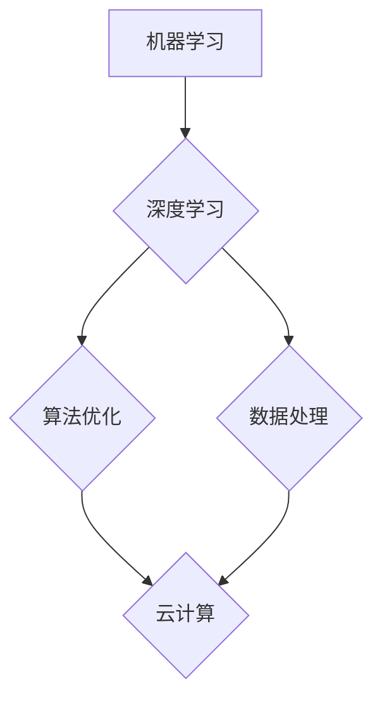

> AI创业公司,技术瓶颈,机器学习,深度学习,算法优化,数据处理,云计算,人才招聘

## 1. 背景介绍

在当今科技飞速发展的时代，人工智能（AI）已成为引领未来发展的核心技术之一。AI创业公司涌现，致力于利用AI技术解决各种现实问题，创造新的价值。然而，在快速发展的过程中，AI创业公司也面临着诸多技术瓶颈，这些瓶颈可能会阻碍公司的发展和创新。

**1.1 AI创业公司面临的技术瓶颈**

* **算法优化:** 许多AI算法在效率和准确性方面仍有提升空间，尤其是在处理海量数据和复杂任务时。
* **数据处理:** AI算法的训练和应用都需要大量高质量的数据，而获取和处理这些数据往往是一项巨大的挑战。
* **算力需求:** 训练深度学习模型需要大量的计算资源，这对于资金有限的创业公司来说是一个沉重的负担。
* **人才短缺:** AI领域人才紧缺，高素质的AI工程师和研究人员很难招募和留住。
* **模型部署:** 将训练好的AI模型部署到实际应用场景中，并保证其稳定性和可靠性，也是一个重要的技术挑战。

**1.2 技术瓶颈带来的影响**

技术瓶颈会对AI创业公司的发展产生一系列负面影响，例如：

* **产品开发周期延长:** 算法优化和数据处理等问题会导致产品开发周期延长，从而失去市场竞争力。
* **产品性能下降:** 算法效率低下或数据质量问题会导致产品性能下降，影响用户体验。
* **成本增加:** 为了解决技术瓶颈，公司可能需要投入更多的资金和人力，增加运营成本。
* **项目失败:** 如果无法有效解决技术瓶颈，最终可能会导致项目失败。

## 2. 核心概念与联系

**2.1 核心概念**

* **机器学习 (Machine Learning):**  机器学习是人工智能的一个分支，它通过算法使计算机能够从数据中学习，并根据学习到的知识进行预测或决策。
* **深度学习 (Deep Learning):** 深度学习是机器学习的一个子集，它使用多层神经网络来模拟人类大脑的学习过程，能够处理更复杂的数据和任务。
* **算法优化 (Algorithm Optimization):** 算法优化是指通过改进算法的结构或参数，提高其效率、准确性和鲁棒性。
* **数据处理 (Data Processing):** 数据处理是指对原始数据进行清洗、转换、分析和存储等操作，使其能够被AI算法有效利用。
* **云计算 (Cloud Computing):** 云计算是一种基于互联网的计算服务模式，它提供计算资源、存储空间和软件服务，可以帮助AI创业公司降低硬件成本和维护成本。

**2.2 核心概念联系**

AI创业公司需要将这些核心概念有机结合起来，才能有效应对技术瓶颈。例如，可以使用深度学习算法处理海量数据，并通过云计算平台获得强大的算力支持。同时，还需要不断进行算法优化和数据处理，以提高模型的性能和效率。



## 3. 核心算法原理 & 具体操作步骤

**3.1 算法原理概述**

深度学习算法的核心是多层神经网络，它模仿了人类大脑的神经元结构和连接方式。神经网络由多个层组成，每层包含多个神经元。每个神经元接收来自上一层的输入信号，并对其进行处理，然后将处理后的信号传递到下一层。通过训练神经网络，可以调整每个神经元的权重和偏差，使网络能够学习数据中的模式和关系。

**3.2 算法步骤详解**

1. **数据预处理:** 将原始数据进行清洗、转换和特征提取，使其能够被神经网络有效利用。
2. **网络结构设计:** 根据任务需求设计神经网络的结构，包括层数、神经元数量和激活函数等。
3. **参数初始化:** 为神经网络中的权重和偏差赋予初始值。
4. **前向传播:** 将输入数据通过神经网络进行前向传播，得到输出结果。
5. **损失函数计算:** 计算输出结果与真实值的差异，即损失函数的值。
6. **反向传播:** 根据损失函数的梯度，反向传播误差信号，更新神经网络的权重和偏差。
7. **迭代训练:** 重复步骤4-6，直到损失函数达到预设的阈值。
8. **模型评估:** 使用测试数据评估模型的性能，例如准确率、召回率和F1-score等。

**3.3 算法优缺点**

**优点:**

* 能够处理复杂的数据和任务。
* 学习能力强，能够自动提取数据中的特征。
* 性能优异，在许多领域取得了突破性进展。

**缺点:**

* 训练时间长，需要大量的计算资源。
* 数据依赖性强，需要大量高质量的数据进行训练。
* 可解释性差，难以理解模型的决策过程。

**3.4 算法应用领域**

深度学习算法已广泛应用于各个领域，例如：

* **图像识别:** 人脸识别、物体检测、图像分类等。
* **自然语言处理:** 机器翻译、文本摘要、情感分析等。
* **语音识别:** 语音转文本、语音助手等。
* **推荐系统:** 商品推荐、内容推荐等。
* **医疗诊断:** 疾病诊断、影像分析等。

## 4. 数学模型和公式 & 详细讲解 & 举例说明

**4.1 数学模型构建**

深度学习模型的核心是神经网络，其数学模型可以表示为一系列的矩阵运算。

* **激活函数:** 激活函数用于引入非线性，使神经网络能够学习复杂的数据模式。常见的激活函数包括ReLU、Sigmoid和Tanh等。
* **损失函数:** 损失函数用于衡量模型预测结果与真实值的差异。常见的损失函数包括均方误差（MSE）、交叉熵损失（Cross-Entropy Loss）等。
* **优化算法:** 优化算法用于更新神经网络的权重和偏差，使其能够最小化损失函数。常见的优化算法包括梯度下降（Gradient Descent）、Adam和RMSprop等。

**4.2 公式推导过程**

* **前向传播:**

$$
y = f(W^L x^L + b^L)
$$

其中：

* $y$ 是输出结果。
* $f$ 是激活函数。
* $W^L$ 是第L层的权重矩阵。
* $x^L$ 是第L层的输入向量。
* $b^L$ 是第L层的偏置向量。

* **反向传播:**

$$
\frac{\partial L}{\partial W^L} = \frac{\partial L}{\partial y} \cdot \frac{\partial y}{\partial W^L}
$$

其中：

* $L$ 是损失函数。
* $\frac{\partial L}{\partial y}$ 是损失函数对输出结果的梯度。
* $\frac{\partial y}{\partial W^L}$ 是输出结果对权重矩阵的梯度。

**4.3 案例分析与讲解**

以图像分类为例，假设我们使用一个包含三层的卷积神经网络来识别猫和狗的图片。

* **输入层:** 接收图像的像素数据。
* **隐藏层:** 使用卷积和池化操作提取图像特征。
* **输出层:** 使用softmax函数将特征映射到两个类别（猫和狗）。

训练过程中，将大量猫狗图片作为训练数据，通过前向传播和反向传播算法，不断调整神经网络的权重和偏差，使其能够准确地识别猫和狗。

## 5. 项目实践：代码实例和详细解释说明

**5.1 开发环境搭建**

* **操作系统:** Ubuntu 20.04 LTS
* **编程语言:** Python 3.8
* **深度学习框架:** TensorFlow 2.0
* **其他工具:** Jupyter Notebook、Git

**5.2 源代码详细实现**

```python
import tensorflow as tf

# 定义模型结构
model = tf.keras.models.Sequential([
    tf.keras.layers.Conv2D(32, (3, 3), activation='relu', input_shape=(28, 28, 1)),
    tf.keras.layers.MaxPooling2D((2, 2)),
    tf.keras.layers.Conv2D(64, (3, 3), activation='relu'),
    tf.keras.layers.MaxPooling2D((2, 2)),
    tf.keras.layers.Flatten(),
    tf.keras.layers.Dense(10, activation='softmax')
])

# 编译模型
model.compile(optimizer='adam',
              loss='sparse_categorical_crossentropy',
              metrics=['accuracy'])

# 训练模型
model.fit(x_train, y_train, epochs=10)

# 评估模型
loss, accuracy = model.evaluate(x_test, y_test)
print('Test loss:', loss)
print('Test accuracy:', accuracy)
```

**5.3 代码解读与分析**

* **模型结构:** 代码定义了一个包含卷积层、池化层和全连接层的卷积神经网络。
* **激活函数:** 使用ReLU激活函数，可以提高模型的学习能力。
* **损失函数:** 使用交叉熵损失函数，适合多分类问题。
* **优化算法:** 使用Adam优化算法，可以加速模型训练。
* **训练过程:** 使用训练数据训练模型，并使用测试数据评估模型的性能。

**5.4 运行结果展示**

训练完成后，可以将模型应用于新的图像数据，进行分类预测。

## 6. 实际应用场景

**6.1 医疗诊断**

深度学习算法可以用于分析医学影像，辅助医生诊断疾病。例如，可以用于识别肿瘤、骨折和心血管疾病等。

**6.2 金融风险控制**

深度学习算法可以用于分析金融数据，识别欺诈交易和预测市场风险。

**6.3 自动驾驶**

深度学习算法可以用于训练自动驾驶汽车，识别道路场景、预测车辆运动和做出决策。

**6.4 个性化推荐**

深度学习算法可以用于分析用户行为数据，提供个性化的商品、内容和服务推荐。

**6.5 语音助手**

深度学习算法可以用于训练语音助手，理解用户的语音指令并提供相应的回复。

**6.4 未来应用展望**

随着人工智能技术的不断发展，深度学习算法将在更多领域得到应用，例如：

* **药物研发:** 预测药物的有效性和安全性。
* **材料科学:** 设计新型材料。
* **教育:** 个性化教学和智能辅导。
* **艺术创作:** 生成音乐、绘画和文字等艺术作品。

## 7. 工具和资源推荐

**7.1 学习资源推荐**

* **书籍:**
    * 深度学习 (Deep Learning) - Ian Goodfellow, Yoshua Bengio, Aaron Courville
    * 构建深度学习模型 (Hands-On Machine Learning with Scikit-Learn, Keras & TensorFlow) - Aurélien Géron
* **在线课程:**
    * 深度学习 Specialization - Andrew Ng (Coursera)
    * fast.ai - Practical Deep Learning for Coders
* **博客和网站:**
    * TensorFlow Blog
    * PyTorch Blog
    * Towards Data Science

**7.2 开发工具推荐**

* **深度学习框架:** TensorFlow, PyTorch, Keras
* **编程语言:** Python
* **数据处理工具:** Pandas, NumPy
* **可视化工具:** Matplotlib, Seaborn

**7.3 相关论文推荐**

* **AlexNet:** ImageNet Classification with Deep Convolutional Neural Networks
* **VGGNet:** Very Deep Convolutional Networks for Large-Scale Image Recognition
* **ResNet:** Deep Residual Learning for Image Recognition
* **InceptionNet:** Inception-v3, Inception-ResNet v2

## 8. 总结：未来发展趋势与挑战

**8.1 研究成果总结**

近年来，深度学习算法取得了显著的进展，在图像识别、自然语言处理、语音识别等领域取得了突破性成果。