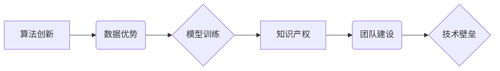

> AI创业, 技术壁垒, 算法创新, 数据优势, 模型训练, 知识产权, 团队建设, 产业生态

## 1. 背景介绍

在人工智能（AI）蓬勃发展的时代，AI创业公司如雨后春笋般涌现。然而，竞争日益激烈，如何打造技术壁垒，成为众多创业公司面临的共同挑战。技术壁垒是指企业在产品、服务或运营方面所拥有的独特优势，能够有效阻挡竞争对手的模仿和超越。对于AI创业公司而言，技术壁垒的建立至关重要，它能够帮助企业获得市场竞争力，实现可持续发展。

## 2. 核心概念与联系

**2.1 AI技术壁垒的核心概念**

AI技术壁垒是指AI创业公司在算法、数据、模型训练、知识产权等方面所拥有的独特优势，能够有效阻挡竞争对手的模仿和超越。

**2.2 AI技术壁垒的联系**

AI技术壁垒的建立是一个系统工程，各个环节相互关联，共同构筑企业的竞争优势。

* **算法创新:** 拥有独创的算法模型，能够实现更精准、高效的AI应用，是构建技术壁垒的关键。
* **数据优势:** 海量高质量的数据是训练AI模型的基石，数据积累和处理能力是企业核心竞争力的体现。
* **模型训练:** 拥有先进的模型训练技术和平台，能够快速迭代模型，提升模型性能，是技术壁垒的重要支撑。
* **知识产权:** 通过专利、著作权等形式保护核心技术，能够有效防止技术被盗用和模仿。
* **团队建设:** 拥有经验丰富的AI专家团队，能够持续创新，推动技术发展，是企业核心竞争力的保障。

**2.3 AI技术壁垒的架构**



## 3. 核心算法原理 & 具体操作步骤

**3.1 算法原理概述**

深度学习算法是目前AI领域最热门的算法之一，其核心原理是通过多层神经网络模拟人类大脑的学习过程，从海量数据中自动提取特征，实现对复杂问题的学习和解决。

**3.2 算法步骤详解**

1. **数据预处理:** 对原始数据进行清洗、转换、特征提取等操作，使其能够被深度学习算法所接受。
2. **网络结构设计:** 根据具体任务需求，设计合适的深度神经网络结构，包括层数、节点数量、激活函数等参数。
3. **模型训练:** 使用训练数据，通过反向传播算法，调整网络参数，使模型能够准确预测目标输出。
4. **模型评估:** 使用测试数据，评估模型的性能，例如准确率、召回率、F1-score等指标。
5. **模型调优:** 根据评估结果，调整网络结构、参数等，进一步提升模型性能。

**3.3 算法优缺点**

**优点:**

* 能够自动提取特征，无需人工特征工程。
* 能够处理海量数据，学习复杂模式。
* 在图像识别、自然语言处理等领域取得了突破性进展。

**缺点:**

* 训练数据量大，计算资源消耗高。
* 模型解释性差，难以理解模型的决策过程。
* 对数据质量要求高，容易受到噪声数据的影响。

**3.4 算法应用领域**

* **图像识别:** 人脸识别、物体检测、图像分类等。
* **自然语言处理:** 文本分类、情感分析、机器翻译等。
* **语音识别:** 语音转文本、语音助手等。
* **推荐系统:** 商品推荐、内容推荐等。
* **医疗诊断:** 病情预测、疾病诊断等。

## 4. 数学模型和公式 & 详细讲解 & 举例说明

**4.1 数学模型构建**

深度学习模型通常采用多层神经网络结构，每个神经元接收多个输入信号，并通过激活函数进行处理，输出一个信号。神经网络的学习过程就是通过调整神经元之间的权重，使得网络输出能够与真实值尽可能接近的过程。

**4.2 公式推导过程**

深度学习模型的训练过程通常使用反向传播算法，其核心思想是通过计算误差，反向传播到各层神经元，调整权重参数，使得模型输出更接近真实值。

**损失函数:** 用于衡量模型预测值与真实值的差距，常见的损失函数包括均方误差（MSE）、交叉熵损失（Cross-Entropy Loss）等。

**梯度下降:** 用于更新权重参数，其核心思想是沿着梯度方向调整权重，使得损失函数值不断减小。

**4.3 案例分析与讲解**

假设我们训练一个简单的线性回归模型，用于预测房价。

* **输入特征:** 房屋面积
* **输出目标:** 房价

模型的数学表达式为：

```latex
y = w * x + b
```

其中：

* $y$ 是预测的房价
* $x$ 是房屋面积
* $w$ 是权重参数
* $b$ 是偏置参数

损失函数为均方误差：

```latex
Loss = \frac{1}{n} \sum_{i=1}^{n} (y_i - \hat{y}_i)^2
```

其中：

* $n$ 是样本数量
* $y_i$ 是真实房价
* $\hat{y}_i$ 是模型预测的房价

通过梯度下降算法，更新权重参数 $w$ 和 $b$，使得损失函数值最小化。

## 5. 项目实践：代码实例和详细解释说明

**5.1 开发环境搭建**

* 操作系统：Ubuntu 20.04
* Python 版本：3.8
* 深度学习框架：TensorFlow 2.0

**5.2 源代码详细实现**

```python
import tensorflow as tf

# 定义模型
model = tf.keras.models.Sequential([
    tf.keras.layers.Dense(units=64, activation='relu', input_shape=(1,)),
    tf.keras.layers.Dense(units=1)
])

# 编译模型
model.compile(optimizer='adam', loss='mse')

# 训练模型
model.fit(x_train, y_train, epochs=100)

# 评估模型
loss = model.evaluate(x_test, y_test)
print('Loss:', loss)
```

**5.3 代码解读与分析**

* 代码首先定义了一个简单的线性回归模型，包含两层神经元。
* 然后使用Adam优化器和均方误差损失函数编译模型。
* 接着使用训练数据训练模型，训练epochs设置为100。
* 最后使用测试数据评估模型性能，打印损失值。

**5.4 运行结果展示**

训练完成后，模型能够预测房屋价格，并输出损失值。

## 6. 实际应用场景

**6.1 AI创业公司应用场景**

* **智能客服:** 利用自然语言处理技术，构建智能客服系统，自动回复用户咨询，提高客户服务效率。
* **个性化推荐:** 利用机器学习算法，分析用户行为数据，提供个性化商品或内容推荐，提升用户体验。
* **精准营销:** 利用数据分析和机器学习，精准识别目标客户，进行个性化营销，提高营销效果。

**6.2 其他行业应用场景**

* **医疗保健:** 利用AI技术辅助诊断疾病、预测患者风险、个性化治疗方案。
* **金融服务:** 利用AI技术进行风险评估、欺诈检测、智能投资等。
* **制造业:** 利用AI技术进行设备故障预测、生产过程优化、质量控制等。

**6.4 未来应用展望**

随着AI技术的不断发展，其应用场景将更加广泛，例如：

* **自动驾驶:** 利用深度学习算法，实现车辆自动驾驶。
* **机器人技术:** 利用AI技术，开发更加智能的机器人，用于工业生产、服务业等领域。
* **虚拟现实:** 利用AI技术，构建更加沉浸式的虚拟现实体验。

## 7. 工具和资源推荐

**7.1 学习资源推荐**

* **在线课程:** Coursera、edX、Udacity等平台提供丰富的AI课程。
* **书籍:** 《深度学习》、《机器学习实战》等书籍是学习AI的基础教材。
* **开源项目:** TensorFlow、PyTorch等开源项目提供了丰富的代码示例和学习资源。

**7.2 开发工具推荐**

* **深度学习框架:** TensorFlow、PyTorch、Keras等框架提供了高效的深度学习开发工具。
* **数据处理工具:** Pandas、NumPy等工具提供了强大的数据处理能力。
* **可视化工具:** Matplotlib、Seaborn等工具提供了丰富的可视化功能。

**7.3 相关论文推荐**

* **《ImageNet Classification with Deep Convolutional Neural Networks》**
* **《Attention Is All You Need》**
* **《BERT: Pre-training of Deep Bidirectional Transformers for Language Understanding》**

## 8. 总结：未来发展趋势与挑战

**8.1 研究成果总结**

近年来，AI技术取得了长足进步，在图像识别、自然语言处理、语音识别等领域取得了突破性进展。

**8.2 未来发展趋势**

* **模型规模化:** 模型规模将继续扩大，训练更加复杂的数据集，提升模型性能。
* **模型解释性:** 研究更加可解释的AI模型，提高模型的透明度和可信度。
* **边缘计算:** 将AI模型部署到边缘设备，实现更加实时、高效的AI应用。

**8.3 面临的挑战**

* **数据安全:** AI模型训练需要大量数据，如何保证数据安全和隐私保护是一个重要挑战。
* **算法偏见:** AI模型可能存在算法偏见，导致不公平的结果，需要研究如何消除算法偏见。
* **伦理问题:** AI技术的应用引发了伦理问题，例如自动驾驶的责任归属、AI决策的透明度等，需要进行深入探讨和规范。

**8.4 研究展望**

未来，AI技术将继续发展，应用场景将更加广泛，对人类社会产生更加深远的影响。我们需要加强AI技术研究，解决技术挑战，并积极应对AI带来的伦理和社会问题，推动AI技术向更加安全、可信、可控的方向发展。

## 9. 附录：常见问题与解答

**9.1 如何选择合适的AI算法？**

选择合适的AI算法需要根据具体任务需求、数据特点、计算资源等因素进行综合考虑。

**9.2 如何解决AI模型的过拟合问题？**

过拟合是指模型在训练数据上表现良好，但在测试数据上表现较差。解决过拟合问题的方法包括：

* 增加训练数据量
* 使用正则化技术
* 使用交叉验证

**9.3 如何评估AI模型的性能？**

常用的AI模型性能评估指标包括：

* 准确率
* 召回率
* F1-score
* AUC

作者：禅与计算机程序设计艺术 / Zen and the Art of Computer Programming


<end_of_turn>