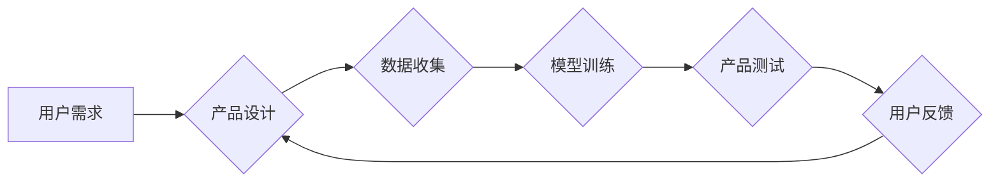

> AI创业公司,产品迭代,产品升级,机器学习,深度学习,数据驱动,敏捷开发,用户反馈

## 1. 背景介绍

在当今科技飞速发展的时代，人工智能（AI）已成为引领未来发展的核心技术之一。AI创业公司应运而生，涌现出众多创新产品和解决方案。然而，在激烈的市场竞争中，产品迭代与升级显得尤为重要。只有不断完善产品，才能满足用户需求，保持市场竞争力。

AI创业公司的产品迭代与升级策略与传统软件公司有所不同，需要考虑AI模型的训练、数据更新、算法优化等因素。本文将深入探讨AI创业公司产品迭代与升级的策略，为创业者提供参考和指导。

## 2. 核心概念与联系

**2.1 产品迭代**

产品迭代是指在产品开发过程中，根据用户反馈、市场需求和技术进步，对产品进行持续改进和更新的过程。

**2.2 产品升级**

产品升级是指对现有产品进行重大改进，使其功能更加强大、性能更加优越，并满足新的市场需求。

**2.3 AI模型训练与更新**

AI模型的训练和更新是AI产品迭代与升级的关键环节。通过不断收集和分析数据，对AI模型进行训练和更新，可以提高模型的准确性、效率和鲁棒性。

**2.4 数据驱动**

数据是AI产品的核心驱动力。AI创业公司需要建立完善的数据收集、存储和分析体系，利用数据驱动产品迭代与升级决策。

**2.5 敏捷开发**

敏捷开发是一种快速迭代、注重用户反馈的软件开发方法。AI创业公司可以采用敏捷开发方法，快速响应市场需求，并不断改进产品。

**2.6 用户反馈**

用户反馈是产品迭代与升级的重要来源。AI创业公司需要建立有效的用户反馈机制，收集用户意见和建议，并将其纳入产品改进计划。

**2.7 技术进步**

人工智能技术不断发展，新的算法、模型和工具不断涌现。AI创业公司需要关注技术进步，并将其应用于产品迭代与升级。

**Mermaid 流程图**



## 3. 核心算法原理 & 具体操作步骤

**3.1 算法原理概述**

在AI产品迭代与升级中，常用的算法包括机器学习、深度学习、强化学习等。

* **机器学习**：通过训练模型，使模型能够从数据中学习规律，并对新数据进行预测或分类。
* **深度学习**：一种更高级的机器学习方法，利用多层神经网络，能够学习更复杂的特征和模式。
* **强化学习**：通过奖励和惩罚机制，训练模型在特定环境中做出最优决策。

**3.2 算法步骤详解**

**机器学习算法步骤：**

1. 数据收集和预处理
2. 特征工程
3. 模型选择
4. 模型训练
5. 模型评估
6. 模型部署

**深度学习算法步骤：**

1. 数据收集和预处理
2. 数据增强
3. 网络结构设计
4. 模型训练
5. 模型评估
6. 模型调优
7. 模型部署

**强化学习算法步骤：**

1. 环境建模
2. 策略设计
3. 奖励函数设计
4. 训练过程
5. 策略评估
6. 策略部署

**3.3 算法优缺点**

**机器学习算法：**

* **优点：**易于理解和实现，对数据要求不高。
* **缺点：**学习能力有限，难以处理复杂数据。

**深度学习算法：**

* **优点：**学习能力强，能够处理复杂数据。
* **缺点：**训练时间长，对数据要求高。

**强化学习算法：**

* **优点：**能够学习最优策略，适用于决策问题。
* **缺点：**训练复杂，需要设计合适的奖励函数。

**3.4 算法应用领域**

* **机器学习：**图像识别、文本分类、推荐系统等。
* **深度学习：**语音识别、自然语言处理、自动驾驶等。
* **强化学习：**游戏AI、机器人控制、金融交易等。

## 4. 数学模型和公式 & 详细讲解 & 举例说明

**4.1 数学模型构建**

在AI产品迭代与升级中，数学模型是描述算法行为和预测结果的关键。常见的数学模型包括线性回归、逻辑回归、支持向量机、决策树等。

**4.2 公式推导过程**

每个算法都有其对应的数学公式，例如线性回归的损失函数为：

$$
L(w,b) = \frac{1}{2n} \sum_{i=1}^{n} (y_i - (wx_i + b))^2
$$

其中：

* $w$：权重向量
* $b$：偏置项
* $n$：样本数量
* $x_i$：第 $i$ 个样本的特征向量
* $y_i$：第 $i$ 个样本的真实值

**4.3 案例分析与讲解**

假设我们想要构建一个预测房价的模型，可以使用线性回归算法。我们可以收集房价和相关特征的数据，例如房屋面积、房间数量、地理位置等。然后，使用线性回归算法训练模型，并得到房价预测模型。

**举例说明：**

假设我们收集了以下房价数据：

| 房屋面积 (平方米) | 房间数量 | 房价 (万元) |
|---|---|---|
| 100 | 2 | 500 |
| 150 | 3 | 700 |
| 200 | 4 | 1000 |

我们可以使用线性回归算法训练模型，得到以下预测模型：

$$
房价 = 3000 * 房屋面积 + 500 * 房间数量 - 10000
$$

## 5. 项目实践：代码实例和详细解释说明

**5.1 开发环境搭建**

AI产品开发通常需要使用Python语言和相关的库，例如TensorFlow、PyTorch、Scikit-learn等。

**5.2 源代码详细实现**

以下是一个使用Scikit-learn库实现线性回归模型的代码示例：

```python
from sklearn.linear_model import LinearRegression
from sklearn.model_selection import train_test_split
from sklearn.metrics import mean_squared_error

# 数据准备
X = [[100, 2], [150, 3], [200, 4]]
y = [500, 700, 1000]

# 数据分割
X_train, X_test, y_train, y_test = train_test_split(X, y, test_size=0.2)

# 模型训练
model = LinearRegression()
model.fit(X_train, y_train)

# 模型预测
y_pred = model.predict(X_test)

# 模型评估
mse = mean_squared_error(y_test, y_pred)
print(f"均方误差: {mse}")
```

**5.3 代码解读与分析**

这段代码首先导入必要的库，然后准备数据，将特征数据和目标值分别存储在X和y变量中。接着，使用train_test_split函数将数据分割成训练集和测试集。

然后，创建LinearRegression模型对象，并使用fit函数对模型进行训练。训练完成后，使用predict函数对测试集数据进行预测。最后，使用mean_squared_error函数计算模型的均方误差，作为模型性能的评估指标。

**5.4 运行结果展示**

运行这段代码后，会输出模型的均方误差值。均方误差值越小，模型的预测精度越高。

## 6. 实际应用场景

AI产品迭代与升级的应用场景非常广泛，例如：

* **电商平台：**根据用户购买历史和浏览记录，推荐个性化商品。
* **社交媒体：**识别用户情绪，提供更精准的广告投放。
* **医疗保健：**辅助医生诊断疾病，预测患者风险。
* **金融服务：**识别欺诈交易，评估贷款风险。

**6.4 未来应用展望**

随着人工智能技术的不断发展，AI产品迭代与升级将更加智能化、自动化和个性化。未来，AI产品将能够更加深入地理解用户需求，并提供更加精准、高效的服务。

## 7. 工具和资源推荐

**7.1 学习资源推荐**

* **在线课程：**Coursera、edX、Udacity等平台提供丰富的AI课程。
* **书籍：**《深度学习》、《机器学习实战》等书籍是学习AI的基础教材。
* **博客和论坛：**机器之心、AI科技大本营等网站提供最新的AI资讯和技术讨论。

**7.2 开发工具推荐**

* **Python：**AI开发的常用语言。
* **TensorFlow：**开源深度学习框架。
* **PyTorch：**开源深度学习框架。
* **Scikit-learn：**机器学习库。

**7.3 相关论文推荐**

* **《ImageNet Classification with Deep Convolutional Neural Networks》**
* **《Attention Is All You Need》**
* **《Deep Reinforcement Learning》**

## 8. 总结：未来发展趋势与挑战

**8.1 研究成果总结**

近年来，人工智能领域取得了显著的进展，例如图像识别、语音识别、自然语言处理等领域取得了突破性进展。

**8.2 未来发展趋势**

* **模型规模化：**模型规模将继续扩大，训练数据量将进一步增加。
* **算法创新：**新的算法和模型将不断涌现，例如Transformer模型、生成对抗网络等。
* **边缘计算：**AI模型将部署到边缘设备，实现更低延迟和更高效率的计算。

**8.3 面临的挑战**

* **数据安全和隐私保护：**AI模型训练需要大量数据，如何保证数据安全和隐私保护是一个重要挑战。
* **算法可解释性：**许多AI模型是黑盒模型，难以解释其决策过程，这限制了AI技术的应用。
* **伦理问题：**AI技术的发展引发了伦理问题，例如算法偏见、工作岗位替代等。

**8.4 研究展望**

未来，AI研究将更加注重模型的可解释性、安全性、鲁棒性和伦理问题。


## 9. 附录：常见问题与解答

**9.1 如何选择合适的AI算法？**

选择合适的AI算法取决于具体应用场景和数据特点。例如，对于分类问题，可以使用逻辑回归、支持向量机等算法；对于回归问题，可以使用线性回归、决策树等算法。

**9.2 如何评估AI模型的性能？**

常用的AI模型性能评估指标包括准确率、召回率、F1-score、均方误差等。

**9.3 如何解决AI模型的过拟合问题？**

过拟合是指AI模型对训练数据过拟合，导致在测试数据上的性能下降。解决过拟合问题的方法包括：

* 增加训练数据量
* 使用正则化技术
* 使用交叉验证

**9.4 如何保证AI模型的安全性？**

保证AI模型的安全性需要从多个方面考虑，例如：

* 数据安全和隐私保护
* 模型攻击防御
* 算法可解释性

作者：禅与计算机程序设计艺术 / Zen and the Art of Computer Programming


<end_of_turn>