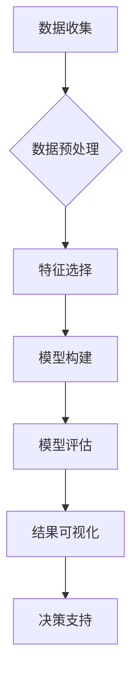

> 数据挖掘, AI创业, 策略, 算法, 模型, 应用, 案例, 工具

## 1. 背景介绍

在当今数据爆炸的时代，数据已成为企业最重要的资产。AI创业公司尤其依赖数据来驱动产品创新、优化运营和提升用户体验。数据挖掘作为一种从海量数据中提取有价值信息的科学方法，为AI创业公司提供了强大的工具，帮助他们洞察市场趋势、识别潜在客户、预测未来需求等。

然而，数据挖掘并非一蹴而就，需要制定合理的策略和方法。本文将深入探讨AI创业公司的数据挖掘策略，从核心概念、算法原理、数学模型、代码实现到实际应用场景，全面分析数据挖掘在AI创业中的应用价值和实践方法。

## 2. 核心概念与联系

数据挖掘的核心目标是通过对数据进行分析和挖掘，发现隐藏其中的模式、趋势和规律，从而为决策提供支持。

**数据挖掘流程:**



**数据挖掘与AI的关系:**

数据挖掘是AI的重要组成部分，两者相互促进、共同发展。AI算法可以帮助数据挖掘过程更加智能化和自动化，而数据挖掘的结果可以为AI算法的训练和优化提供数据支持。

## 3. 核心算法原理 & 具体操作步骤

### 3.1  算法原理概述

数据挖掘算法种类繁多，常见的有分类算法、聚类算法、关联规则挖掘算法等。

* **分类算法:** 用于将数据划分为不同的类别，例如预测客户是否会购买产品。
* **聚类算法:** 用于将数据按照相似性进行分组，例如将客户按照消费习惯进行分类。
* **关联规则挖掘算法:** 用于发现数据之间的关联关系，例如发现哪些商品经常一起购买。

### 3.2  算法步骤详解

以分类算法为例，其基本步骤包括：

1. **数据收集和预处理:** 收集相关数据，并进行清洗、转换、归一化等预处理操作。
2. **特征选择:** 选择对分类任务最具影响力的特征。
3. **模型训练:** 使用训练数据训练分类模型，例如决策树、支持向量机等。
4. **模型评估:** 使用测试数据评估模型的性能，例如准确率、召回率等。
5. **模型部署:** 将训练好的模型部署到实际应用场景中。

### 3.3  算法优缺点

每个算法都有其自身的优缺点，需要根据实际应用场景选择合适的算法。

* **决策树:** 易于理解和解释，但容易过拟合。
* **支持向量机:** 性能优异，但训练时间较长。
* **神经网络:** 能够处理复杂数据，但需要大量数据进行训练。

### 3.4  算法应用领域

数据挖掘算法广泛应用于各个领域，例如：

* **电商:** 商品推荐、用户画像、欺诈检测
* **金融:** 风险评估、信用评分、欺诈检测
* **医疗:** 疾病诊断、药物研发、患者管理
* **制造:** 故障预测、质量控制、生产优化

## 4. 数学模型和公式 & 详细讲解 & 举例说明

### 4.1  数学模型构建

数据挖掘算法通常基于数学模型进行构建。例如，决策树算法基于信息增益的概念，选择信息增益最大的特征作为决策节点。

### 4.2  公式推导过程

信息增益公式如下：

$$
Gain(S,A) = Entropy(S) - \sum_{v \in Values(A)} \frac{|S_v|}{|S|} Entropy(S_v)
$$

其中：

* $S$：数据集
* $A$：特征
* $Values(A)$：特征 $A$ 的所有取值
* $S_v$：特征 $A$ 取值为 $v$ 的子集
* $Entropy(S)$：数据集 $S$ 的熵
* $Entropy(S_v)$：子集 $S_v$ 的熵

### 4.3  案例分析与讲解

假设我们有一个数据集，包含关于水果的属性，例如颜色、形状、大小等。我们想使用决策树算法将水果分类为苹果、香蕉、橙子等。

我们可以使用信息增益公式来选择最优的特征作为决策节点。例如，如果颜色特征的信息增益最大，那么我们就可以将决策树的第一个节点设置为颜色特征。

## 5. 项目实践：代码实例和详细解释说明

### 5.1  开发环境搭建

可以使用Python语言和相关库进行数据挖掘开发。常用的库包括：

* **pandas:** 数据处理和分析
* **scikit-learn:** 机器学习算法
* **matplotlib:** 数据可视化

### 5.2  源代码详细实现

以下是一个简单的分类算法代码示例：

```python
from sklearn.datasets import load_iris
from sklearn.model_selection import train_test_split
from sklearn.tree import DecisionTreeClassifier
from sklearn.metrics import accuracy_score

# 加载iris数据集
iris = load_iris()
X = iris.data
y = iris.target

# 将数据划分为训练集和测试集
X_train, X_test, y_train, y_test = train_test_split(X, y, test_size=0.2, random_state=42)

# 创建决策树分类器
clf = DecisionTreeClassifier()

# 训练模型
clf.fit(X_train, y_train)

# 预测测试集结果
y_pred = clf.predict(X_test)

# 计算模型准确率
accuracy = accuracy_score(y_test, y_pred)
print(f"模型准确率: {accuracy}")
```

### 5.3  代码解读与分析

这段代码首先加载了iris数据集，然后将数据划分为训练集和测试集。接着创建了一个决策树分类器，并使用训练集训练模型。最后，使用测试集预测结果，并计算模型的准确率。

### 5.4  运行结果展示

运行这段代码后，会输出模型的准确率。

## 6. 实际应用场景

### 6.1  电商推荐系统

数据挖掘可以用于构建个性化的商品推荐系统，根据用户的浏览历史、购买记录等数据，推荐用户可能感兴趣的商品。

### 6.2  客户画像分析

数据挖掘可以用于分析客户的消费习惯、偏好等信息，构建客户画像，帮助企业更好地了解客户需求，进行精准营销。

### 6.3  欺诈检测

数据挖掘可以用于分析交易数据，识别异常交易行为，帮助企业预防和打击欺诈行为。

### 6.4  未来应用展望

随着数据量的不断增长和AI技术的不断发展，数据挖掘在AI创业中的应用场景将更加广泛。例如，在医疗领域，数据挖掘可以用于辅助诊断、预测疾病风险等；在金融领域，数据挖掘可以用于风险管理、投资决策等。

## 7. 工具和资源推荐

### 7.1  学习资源推荐

* **书籍:**
    * 《数据挖掘：概念与技术》
    * 《机器学习》
* **在线课程:**
    * Coursera: 数据挖掘
    * edX: 机器学习

### 7.2  开发工具推荐

* **Python:** 数据挖掘开发的常用语言
* **pandas:** 数据处理和分析库
* **scikit-learn:** 机器学习算法库
* **TensorFlow:** 深度学习框架

### 7.3  相关论文推荐

* 《数据挖掘：概念与技术》
* 《机器学习》

## 8. 总结：未来发展趋势与挑战

### 8.1  研究成果总结

数据挖掘在AI创业中发挥着越来越重要的作用，帮助企业洞察数据、发现价值、做出更明智的决策。

### 8.2  未来发展趋势

未来，数据挖掘将更加智能化、自动化，并与其他AI技术深度融合，例如自然语言处理、计算机视觉等。

### 8.3  面临的挑战

数据挖掘也面临着一些挑战，例如数据质量问题、算法复杂度问题、隐私安全问题等。

### 8.4  研究展望

未来，需要进一步研究更有效的算法、更强大的工具和更完善的理论框架，以更好地解决数据挖掘面临的挑战，推动数据挖掘技术在AI创业中的应用。

## 9. 附录：常见问题与解答

### 9.1  常见问题

* 数据挖掘的步骤是什么？
* 数据挖掘算法有哪些？
* 如何选择合适的算法？
* 数据挖掘的应用场景有哪些？

### 9.2  解答

...

作者：禅与计算机程序设计艺术 / Zen and the Art of Computer Programming


<end_of_turn>